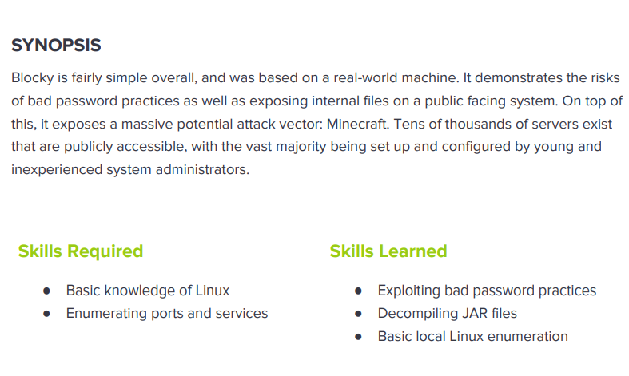

---
metaLinks:
  alternates:
    - >-
      https://app.gitbook.com/s/qDX4NWkPelZggTpGCfyF/course-review/cyber-security-courses-journey/oscp-journey/ctf/hack-the-box/linux-boxes/blocky-easy
---

# ✅ Blocky (Easy)

Lesson Learn



## Report-Penetration

**Vulnerable Exploit:**&#x20;

**System Vulnerable:** 10.10.10.37

**Vulnerability Explanation:**&#x20;

**Privilege Escalation Vulnerability:**&#x20;

**Vulnerability Fix:**

**Severity:**

**Step to Compromise the Host:**&#x20;

## Reconnaissance

```
└─$ nmap -p- -sC -sV -T4 10.10.10.37 -Pn
Host discovery disabled (-Pn). All addresses will be marked 'up' and scan times will be slower.
Starting Nmap 7.91 ( https://nmap.org ) at 2021-12-02 23:16 EST
Stats: 0:00:04 elapsed; 0 hosts completed (1 up), 1 undergoing Connect Scan
Connect Scan Timing: About 1.11% done; ETC: 23:23 (0:07:24 remaining)
Nmap scan report for 10.10.10.37
Host is up (0.043s latency).
Not shown: 65530 filtered ports
PORT      STATE  SERVICE   VERSION
21/tcp    open   ftp       ProFTPD 1.3.5a
22/tcp    open   ssh       OpenSSH 7.2p2 Ubuntu 4ubuntu2.2 (Ubuntu Linux; protocol 2.0)
| ssh-hostkey: 
|   2048 d6:2b:99:b4:d5:e7:53:ce:2b:fc:b5:d7:9d:79:fb:a2 (RSA)
|   256 5d:7f:38:95:70:c9:be:ac:67:a0:1e:86:e7:97:84:03 (ECDSA)
|_  256 09:d5:c2:04:95:1a:90:ef:87:56:25:97:df:83:70:67 (ED25519)
80/tcp    open   http      Apache httpd 2.4.18 ((Ubuntu))
|_http-generator: WordPress 4.8
|_http-server-header: Apache/2.4.18 (Ubuntu)
|_http-title: BlockyCraft &#8211; Under Construction!
8192/tcp  closed sophos
25565/tcp open   minecraft Minecraft 1.11.2 (Protocol: 127, Message: A Minecraft Server, Users: 0/20)
Service Info: OSs: Unix, Linux; CPE: cpe:/o:linux:linux_kernel
```

## Enumeration

### Port 80 WordPress 4.8

.png>)

Run gobuster to find hidden directory

```
└─$ gobuster dir -u http://10.10.10.37 -w /usr/share/wordlists/dirbuster/directory-list-2.3-medium.txt -t 50 -x.php
===============================================================
Gobuster v3.1.0
by OJ Reeves (@TheColonial) & Christian Mehlmauer (@firefart)
===============================================================
[+] Url:                     http://10.10.10.37
[+] Method:                  GET
[+] Threads:                 50
[+] Wordlist:                /usr/share/wordlists/dirbuster/directory-list-2.3-medium.txt
[+] Negative Status codes:   404
[+] User Agent:              gobuster/3.1.0
[+] Extensions:              php
[+] Timeout:                 10s
===============================================================
2021/12/02 23:30:10 Starting gobuster in directory enumeration mode
===============================================================
/index.php            (Status: 301) [Size: 0] [--> http://10.10.10.37/]
/wiki                 (Status: 301) [Size: 309] [--> http://10.10.10.37/wiki/]
/wp-content           (Status: 301) [Size: 315] [--> http://10.10.10.37/wp-content/]
/wp-login.php         (Status: 200) [Size: 2402]                                    
/plugins              (Status: 301) [Size: 312] [--> http://10.10.10.37/plugins/]   
/wp-includes          (Status: 301) [Size: 316] [--> http://10.10.10.37/wp-includes/]
/javascript           (Status: 301) [Size: 315] [--> http://10.10.10.37/javascript/] 
/wp-trackback.php     (Status: 200) [Size: 135]                                      
/wp-admin             (Status: 301) [Size: 313] [--> http://10.10.10.37/wp-admin/]   
/phpmyadmin           (Status: 301) [Size: 315] [--> http://10.10.10.37/phpmyadmin/] 
/xmlrpc.php           (Status: 405) [Size: 42]                                       
/wp-signup.php        (Status: 302) [Size: 0] [--> http://10.10.10.37/wp-login.php?action=register]
/server-status        (Status: 403) [Size: 299]
```

There are 2 web login page. **/wp-admin** and **/phpmyadmin.** On /plugins we have 2 files.

.png>)

Let download both the files and decompile it on our local machine.

```
└─$ unzip BlockyCore.jar               
Archive:  BlockyCore.jar
  inflating: META-INF/MANIFEST.MF    
  inflating: com/myfirstplugin/BlockyCore.class  

└─$ unzip griefprevention-1.11.2-3.1.1.298.jar 
Archive:  griefprevention-1.11.2-3.1.1.298.jar
   creating: META-INF/
  inflating: META-INF/MANIFEST.MF    
   creating: me/
   creating: me/ryanhamshire/
   creating: me/ryanhamshire/griefprevention/
  inflating: me/ryanhamshire/griefprevention/FlatFileDataStore.class  
```

Install jd-gui for java decompiler.

```
└─$ sudo apt install jd-gui 
```

```
└─$ jd-gui                                                   
Picked up _JAVA_OPTIONS: -Dawt.useSystemAAFontSettings=on -Dswing.aatext=true
```

We can have gui of java decompiler and we can open the BlockyCore file

.png>)

Login with the root user, it doesn't work all of the service.

## Exploitation

By visiting the webpage, we see the author name&#x20;

<figure><figcaption></figcaption></figure>

By ssh with user notch and password we found, it's worked.

```
user: notch / 8YsqfCTnvxAUeduzjNSXe22
```

.png>)

## Privilege Escalation

Checking on sudo -l, we can run any command as root without password.

.png>)
