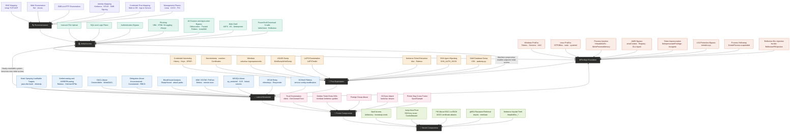

# Methodology

<figure><figcaption></figcaption></figure>

```mermaid
flowchart TD

A["🔍 Reconnaissance"]
B["💻 Initial Access"]
C["⬆️ Privilege Escalation"]
D["🎯 Post Exploitation"]
E["↔️ Lateral Movement"]
F["🌲 Forest Compromise"]
G["🔑 Secret Compromise"]

A --> B --> C --> D --> E
E --> C
E --> F --> G

D -->|Machine compromise enables adjacent initial access| B
E -->|Newly reachable system becomes new initial access| B

%% Reconnaissance
A1["DMZ Mapping\nnmap TCP/UDP"] --> A
A2["Web Enumeration\nffuf · vhosts"] --> A
A3["SMB and FTP Enumeration"] --> A
A4["Identity Mapping\nKerberos · NTLM · SMB Signing"] --> A
A5["Credential Flow Mapping\nWeb to DB · App to Service"] --> A
A6["Management Planes\nJump · CI/CD · PKI"] --> A

%% Initial Access
B1["Insecure File Upload"] --> B
B2["SQLi and Logic Flaws"] --> B
B3["Authentication Bypass"] --> B
B4["Phishing\nVBA · HTML Smuggling · JScript"] --> B
B5["AV Evasion and AppLocker Bypass\nObfuscation · Trusted Folders · InstallUtil"] --> B
B6["Web Shell\nASPX · IIS · Meterpreter"] --> B
B7["PowerShell Download Cradle\nWebClient · Reflection"] --> B

%% Privilege Escalation
C1["Windows PrivEsc\nTokens · Services · UAC"] --> C
C2["Linux PrivEsc\nGTFOBins · sudo · systemd"] --> C
C3["Process Injection\nVirtualAllocEx · WriteProcessMemory"] --> C
C4["AMSI Bypass\namsiContext · Registry · DLL hijack"] --> C
C5["Token Impersonation\nSeImpersonatePrivilege · Incognito"] --> C
C6["LSA Protection Bypass\nmimidrv.sys"] --> C
C7["Process Hollowing\nCreateProcess suspended"] --> C
C8["Reflective DLL Injection\nInvoke-ReflectivePEInjection"] --> C

%% Post Exploitation
D1["Credential Harvesting\nHistory · Keys · DPAPI"] --> D
D2["Secretsdump · ccaches · Certificates"] --> D
D3["Mimikatz\nsekurlsa::logonpasswords"] --> D
D4["LSASS Dump\nMiniDumpWriteDump"] --> D
D5["LAPS Enumeration\nLAPSToolkit"] --> D
D6["Kerberos Ticket Extraction\nklist · Rubeus"] --> D
D7["SSH Agent Hijacking\nSSH_AUTH_SOCK"] --> D
D8["SAM Database Dump\nVSS · pwdump.py"] --> D

%% Lateral Movement
E1["Hash Spraying Justifiable Targets\npass-the-hash · xfreerdp"] --> E
E2["Kerberoasting and ASREPRoasting\nRubeus · GetUserSPNs"] --> E
E3["DACL Abuse\nGenericWrite · WriteDACL"] --> E
E4["Delegation Abuse\nUnconstrained · Constrained · RBCD"] --> E
E5["BloodHound Analysis\nSharpHound · attack paths"] --> E
E6["WMI / DCOM / PsExec\nfileless · remote exec"] --> E
E7["MSSQL Abuse\nxp_cmdshell · CLR · linked servers"] --> E
E8["NTLM Relay\nntlmrelayx · Responder"] --> E
E9["SCShell Fileless\nservice config modification"] --> E

%% Forest Compromise
F1["Trust Enumeration\nnltest · Get-DomainTrust"] --> F
F2["Golden Ticket Extra SIDs\nmimikatz kerberos::golden"] --> F
F3["Foreign Group Abuse"] --> F
F4["DCSync Attack\nlsadump::dcsync"] --> F
F5["Printer Bug Cross-Forest\nSpoolSample"] --> F

%% Secret Compromise
G1["Vault Access\nArtifactory · bootstrap.creds"] --> G
G2["Jump Host Pivot\nSSH key reuse · ControlMaster"] --> G
G3["PKI Abuse ESC1 to ESC8\nADCS certificate attacks"] --> G
G4["gMSA Password Retrieval\ndsacls · mimikatz"] --> G
G5["Kerberos Keytab Theft\n/tmp/krb5cc_*"] --> G

classDef recon    fill:#EEEDFE,stroke:#7F77DD,color:#3C3489
classDef init     fill:#E1F5EE,stroke:#1D9E75,color:#085041
classDef privesc  fill:#FAECE7,stroke:#D85A30,color:#4A1B0C
classDef postex   fill:#FAEEDA,stroke:#BA7517,color:#412402
classDef lateral  fill:#E6F1FB,stroke:#378ADD,color:#042C53
classDef forest   fill:#FBEAF0,stroke:#D4537E,color:#4B1528
classDef secret   fill:#EAF3DE,stroke:#639922,color:#173404
classDef hub      fill:#2C2C2A,stroke:#444441,color:#F1EFE8

class A1,A2,A3,A4,A5,A6 recon
class B1,B2,B3,B4,B5,B6,B7 init
class C1,C2,C3,C4,C5,C6,C7,C8 privesc
class D1,D2,D3,D4,D5,D6,D7,D8 postex
class E1,E2,E3,E4,E5,E6,E7,E8,E9 lateral
class F1,F2,F3,F4,F5 forest
class G1,G2,G3,G4,G5 secret
class A,B,C,D,E,F,G hub
```
